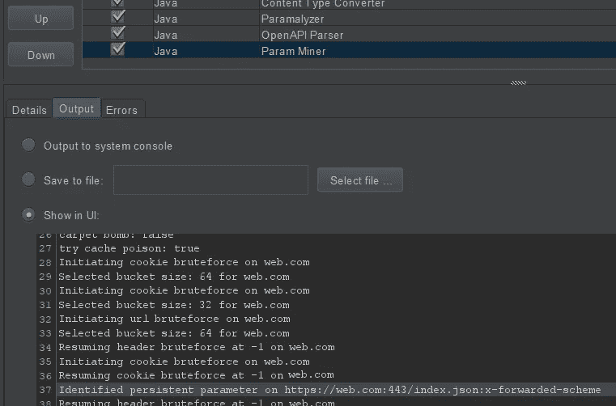
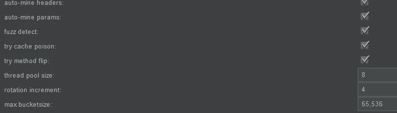

# wget 的缓存中毒

> 原文：<https://infosecwriteups.com/cache-poisoning-of-wget-94a4d70104b1?source=collection_archive---------1----------------------->

(编辑以隐藏受影响的公司)缓存病毒检测的真实示例

另一个有趣的缓存中毒案例(你可以在这里阅读第一个)。然而，这一个没有前一个“性感”。你已经被警告了。

有时候，burp 和 web 浏览器(无论是 firefox 还是 chrome)在如何呈现对发出的请求的响应上不太一致(特别是当请求有 xss 有效负载时)。这是其中的一个故事。

我搜索 bug 的默认方法是用 burp 作为代理浏览目标网站。而且，如果 waf 是如此的友好，我可以在不被阻止的情况下启用 Param Miner，并且选中“尝试缓存中毒”复选框。

而且，如果 web 服务器配置不正确，或者老实说，如果星星是对齐的，结果是一个有用的缓存毒药，就像前面的链接一样。但是，这不是故事。不是说这个故事里的案例没用，只是更难卖而已。

**闲聊/阐述到此为止，让我们深入探讨:**

在浏览了目标网站并做了各种测试后，一无所获，我想是时候复习了。我检查了 burp pro 仪表板，作为一个很好的激励，我注意到 Param Miner 发现了一些东西。但是，根据过去的经验，我已经知道现在兴奋还为时过早。

在回顾了这一发现，并做了一些额外的测试以确保它不是可怕的假阳性，我发现自己与缓存毒药是一个开放的重定向，但更好。访问 website.com 会将访问者/受害者重定向到我在隐藏标题中指定的内容。最初的影响:DoS 的一个版本，但它不是通过使服务器崩溃来拒绝服务，而是通过将用户重定向到另一个网站来拒绝服务。其他影响可能是网络钓鱼，具体取决于各种因素。但是，唉，我很快就知道了一个丑陋的事实。

**打嗝复读机 v 网络浏览器:**

我喜欢在任何网络浏览器上使用 burp repeater 来搜索 bug。我可以立即看到页面的源代码、响应时间(在测试基于时间的 sqli/rce 时很有用)、标题(在测试 cors、csrf 时很有用)，并且响应上有一个很好的搜索框功能(当文本改变时自动滚动以匹配，在其他事情中对 xss 测试很有用)。

但是，虽然响应甚至可以在 html 代码中显示您的 xss 有效负载没有编码，甚至在浏览器中显示响应也可能导致 xss 触发，但它可能是误报。唯一确定的方法是直接在 firefox、chrome 等中尝试带有 xss 有效负载的 url。如果它仍然能在一个或多个浏览器中运行，那就很好。该写报告了。否则，事情就复杂了。

**有限制的概念验证:**

问题中的隐藏标头— x-forwarded-scheme

使用 curl 作为毒害缓存的方法的攻击(必须重复多次，或者可以包装在一个循环中):

curl-header " x-forwarded-scheme:https://burp collab . net "[https://website.com/](https://website.com/)

结果:

https://website.com 卷曲[显示 https://burpcollab.net](https://website.com/)[内容](https://burpcollab.net/)

wget[https://website.com](https://website.com/)保存一个文件，内容为[https://burpcollab.net](https://burpcollab.net/)

PoC 结果中缺少什么？你发现了吗？同样的事情，但有一个浏览器。显然，这不仅仅是因为它需要用 gif 或 youtube 剪辑进行一些熟练的编辑，还因为它不能在浏览器上工作。我尝试了所有的浏览器，总是得到同样无聊的回应。

**还有一些更多的限制:**

除了它只能与 curl 和 wget 一起工作，没有尝试 telnet 和类似的，还有另一个限制。X-forwarded-scheme 其实就是 http 或者 https。类似于 x-forwarded-proto。也就是说，不是拥有[https://website.com](https://website.com/)，值为[https://burpcollab.net](https://burpcollab.net/)，结果是重定向到[https://burpcollab . net://website . com](https://burpcollab.net://website.com)(而不是[https://website.com](https://website.com/)或[http://website.com](http://website.com/))，并且 burpcollaborator 被配置为忽略所有类型的畸形请求。因此://website.com 部分被忽略。解决方案是以#或%23 结尾的有效负载，这取决于另一端如何解释它。

额外收获:还有一个限制是，攻击者的网站必须是 ssl/https，无论出于什么原因，它都不能与 http 一起工作。

**如何利用？**

不容易。攻击者必须以某种方式欺骗受害者使用 wget 访问相关网站，然后在不验证其内容的情况下打开下载的 html 文件，而事实上，该 html 文件将包含 xss 有效负载，如 [BeEF](https://beefproject.com/) 或类似内容，这样攻击者就可以控制受害者的浏览器。但这太牵强了。然而，我已经试着这样卖了。我记得，当我写下痛苦的复制步骤和直接来自好莱坞电影的场景时(jk，但你明白这一点)，我非常确定我只是在做一些写作/打字练习。不过，我确实得到了一些不错的荣誉点数:)

不是所有的虫子都值得悬赏，但是别忘了，猎虫子是为了乐趣和利益，而不仅仅是利益，除非利益也是知识。

参考资料:【https://portswigger.net/web-security/web-cache-poisoning 