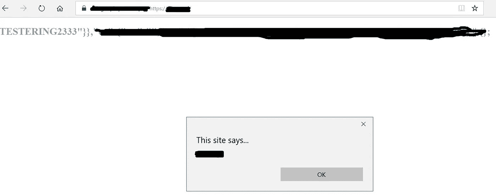
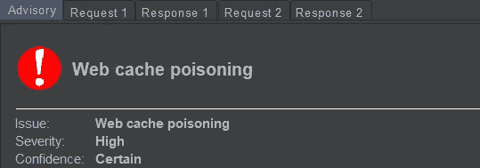
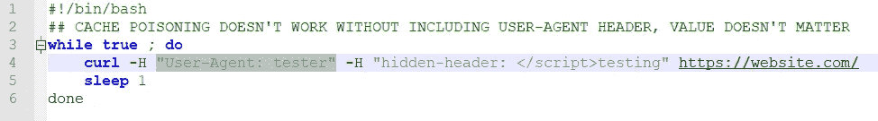

# 用 Param Miner 搜索 bug:XSS 缓存中毒，一个特例

> 原文：<https://infosecwriteups.com/cache-poisoning-with-xss-a-peculiar-case-eb5973850814?source=collection_archive---------1----------------------->



你听说过缓存中毒，在我看来，这种 bug 存在的时间比大多数人意识到的要长得多，就像这种性质的许多其他情况一样。但是，这篇文章不是关于一堂历史课；然而，有几个教训，也许更多，你可能会发现有用。

**带边的参数挖掘器:**

看到我做了什么吗？没关系，它很快就会被发现的。

这是真实世界的例子。当然，我不能透露问题中的 bbp，但攻击的细节不会使它有必要这样做。

我使用的是 Param Miner，它是 burp pro 的扩展(从技术上来说，它在 burp community edition 中也可以工作，但有很多限制)。此外，除了测试隐藏参数，它还测试缓存中毒，然后有 burp pro 和它的扫描仪测试 xss。把它们加在一起，你可以得到一些不错的奖金。但是，它仍然需要一些跑腿的工作。



当你看到这个的时候，你的心脏会不会因为肾上腺素分泌的增加而膨胀起来，或者它会颤动，或者它会开始跳得更强。无论哪种方式，都意味着一个好消息。对我来说是的。在最初的(握手)审查，原来这不是一个假阳性。Param miner 发现了一个隐藏的 header 参数，它反映了网站主页正文(情节扭曲)中的值。额外的好处:xss 的值没有被正确地净化。耶。

但是，对于最初的审查，我一直使用打嗝中继器进行验证，这是一个需要时间来解决的错误。我确实花了一些时间。当使用 firefox 完成时，尝试复制结果(即使用 xss 呈现网站主页)失败。我检查了源代码，没有那个参数的踪迹，因此没有 xss。发生了什么事？

**验证，实际上是一个概念验证:**

当有疑问时，喝一些咖啡，然后再喝一些咖啡，也许检查一下在讨论的那个星期有什么视频游戏打折，然后回到 1 和 0 的泥淖中(不是真正的 1 和 0，除非如果你正在做一些严重的事情，可能会让你远离这篇文章)。然后——卷曲。

更准确地说，

使用 curl 命令攻击网站的 bash 脚本:



curl 和 grep 检查响应(手动完成):

卷发【https://website.com】T4| grep "</脚本>测试"

第一个回答没什么好 grep 的。但是，然后…突出显示的红色字体是什么？会不会是？但是接下来的几个回答什么都没有，然后又有几个回答什么都没有。事实证明，缓存被清除得相当快，但还不够快:)

**让 PoC 真正影响网站访问者:**

回到手头的问题。让 burp 入侵者无限运行，curl 响应包含隐藏参数，而 firefox 和 chrome 仍然在渲染没有隐藏参数的网站，这怎么能用来攻击任何人呢？它不能。仅仅这两件事是不够的。

**MS Edge 来营救(？):**

现在你明白前面的内容了:)没关系。

在花了一些时间咒骂和被手边的问题弄得不知所措之后，当然也试图找出如何在一份报告中呈现它而不被标记为不适用或信息丰富，我记得我没有试过所有的浏览器。而且，虽然我不是 windows 的粉丝，但我确实有 windows，我总是可以指望它会失败，因此不会有令人不愉快的意外:)

这就是我最终选择 Edge 女士的原因。我打开了 MS Edge，我打开了受影响的网站。没什么。当然，缓存清理得太快或者我的 curl 脚本太慢。关键是，bash 脚本的最终 curl 有效负载是:

```
curl -H “User-Agent: tester” -H “hidden-header: </script><h2>TESTERING2333” [https://website.com/](https://website.com/)
```

刷新几次后，瞧:


我报告了这件事，但是……他们无法复制。我制作了一些视频，当然，在测试缓存中毒和响应时，我还结合了 vps 和本地环境，以确保它不是本地缓存中毒。但是，最后，不管是什么原因(也许是服务器的位置)，为什么他们不能复制它的答案，最初，与他们在美国以外的国家尝试它有关。他们联系了位于美国的同事，他们没有问题复制它。电脑，去想想。

希望，这给了你一些新的想法和/或重新点燃旧的。此外，如果你还没有这样做(或者你忘记了，这发生在我身上)，那么这里有一个提醒:当其他浏览器失败时，一定要尝试 edge(只要问题中的 bbp 不排除它，不，Edge 不是 IE)，它可能就是你需要的 Edge。

很抱歉这些双关语，但它们有时会让我微笑:)