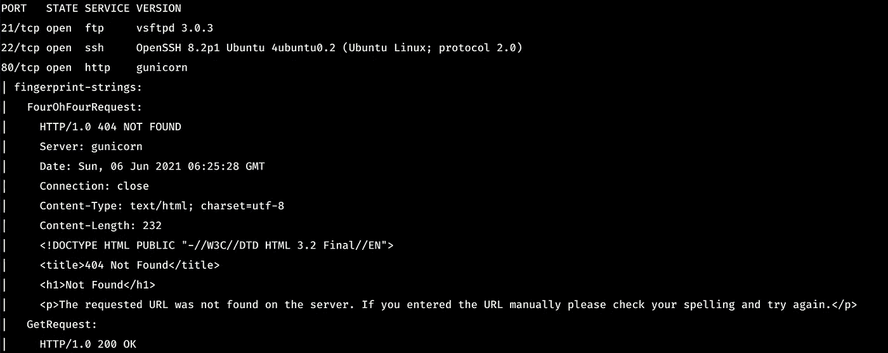
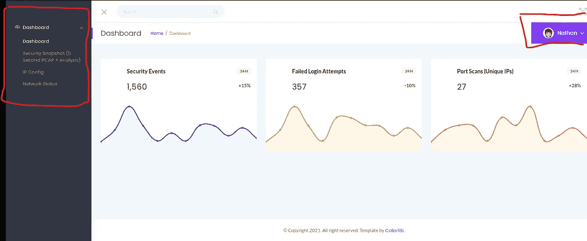
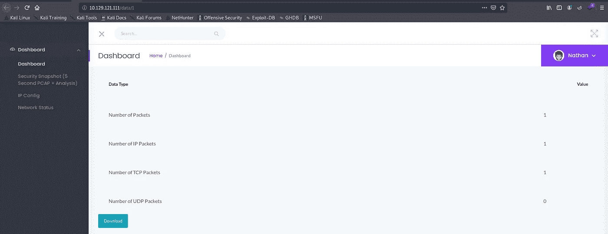
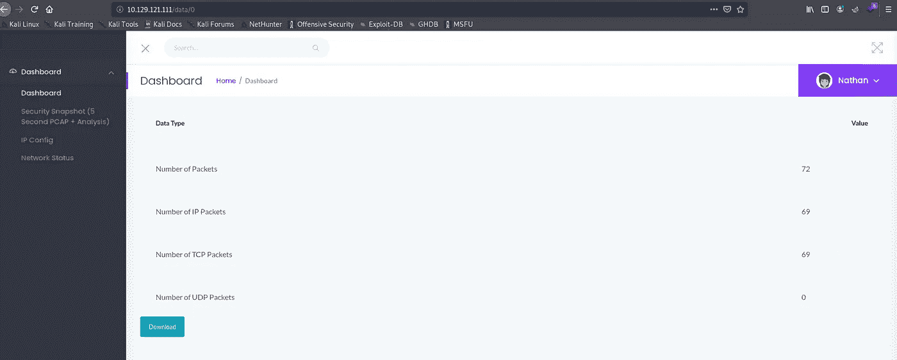
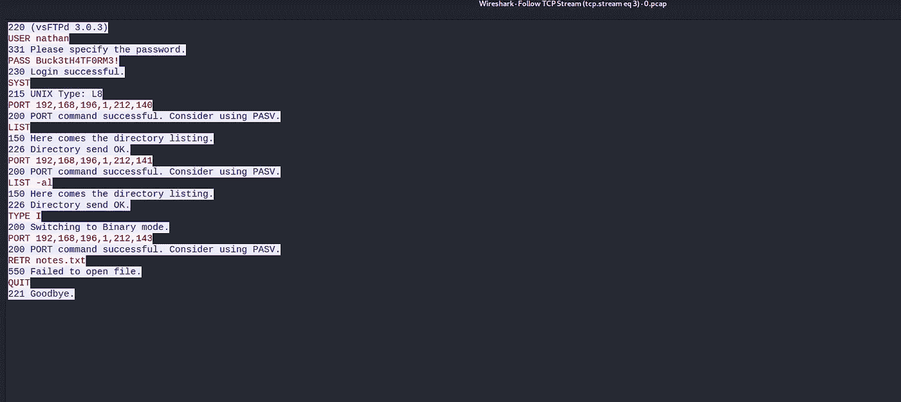
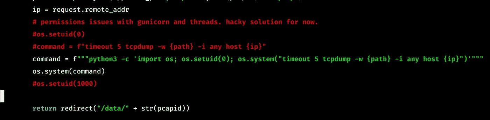
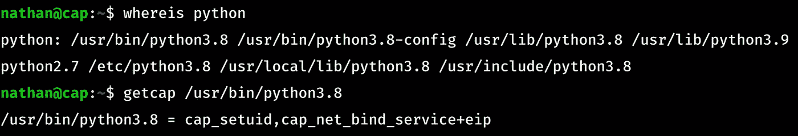

# 上限增加

> 原文：<https://infosecwriteups.com/cap-fd9434b52241?source=collection_archive---------2----------------------->

CAP 是一个简单的 Linux 机器，它以自己的名字提供了大部分需要解决的信息。

让我们直接攻击这台机器。

1.  **扫描和枚举:**

> nmap -A -T4 -p 21，22，80 10.129.119.234 -o 扫描

**FTP:**
vsftpd 3.03 没有已知漏洞，也不支持匿名登录。

**宋承宪:**

这个版本的 SSH 没有已知的漏洞。

因此，我们需要通过托管在端口 80 的网站找到 FTP/SSH 服务的一些凭证。

我第一次尝试运行 gobuster，但没有发现任何有用的东西。因此，只要列举网站，我们就能找到它提供的不同东西。

**首页**

我们可以观察到两件事:
1)它提供的不同服务
2)有权访问该站点的某个人的姓名。

在不同的服务中，第一个产生一些 pcap 文件，机器名被 cap 可能不是某种巧合

所以访问这个页面，我们可以看到 webiste 一直在路径/data/pcapid
中给我们 pcap 文件，其中 pcapid =连续的数字，如(1，2，3，…..)
每次我们尝试访问页面/每 5 秒，如站点中所述，pcapid 就会增加。

开始/第一个 pcapid 为 1，包含我们对机器进行的所有扫描的信息。

**/数据/1**

**2)用户:**

如果有/data/1，我尝试了/data/0。我们得到了一个包含一些条目的 pcap 文件…

**/data/0**

通过分析 pcap，我们获得了用户 nathan 的凭证。

使用它登录 ftp，我们可以在主目录中获得 user.txt。

这是 SSH 登录的凭证，因此我们可以以用户 Nathan 的身份获得一个 shell。

**3)词根:**

现在我们需要特权来访问根标志..

在机器上寻找一些有趣的文件时，我找到了运行服务器应用程序的 app.py 文件。因为我注意到了类似这样的事情。

一开始看到这个，我想我们一定是滥用了这个命令来获得命令注入，但是在本地尝试没有成功。

接下来，我看到了字符串 os.setuid(0 ),这是根权限，并提出了一个问题，python 如何将其设置为根权限？？

然后在谷歌上搜索了一下，我读到了 Linux 的功能。

在通读这段代码时，我立即明白了这行代码的作用，以及我们如何使用它来找到根标志..

getcap 命令告诉我们分配给特定程序的不同功能。

Python 被赋予了 setuid 和 net_bind_service，这意味着 python 可以将 setuid 设置为它想要的任何值..

**漏洞利用:**

特权提升利用