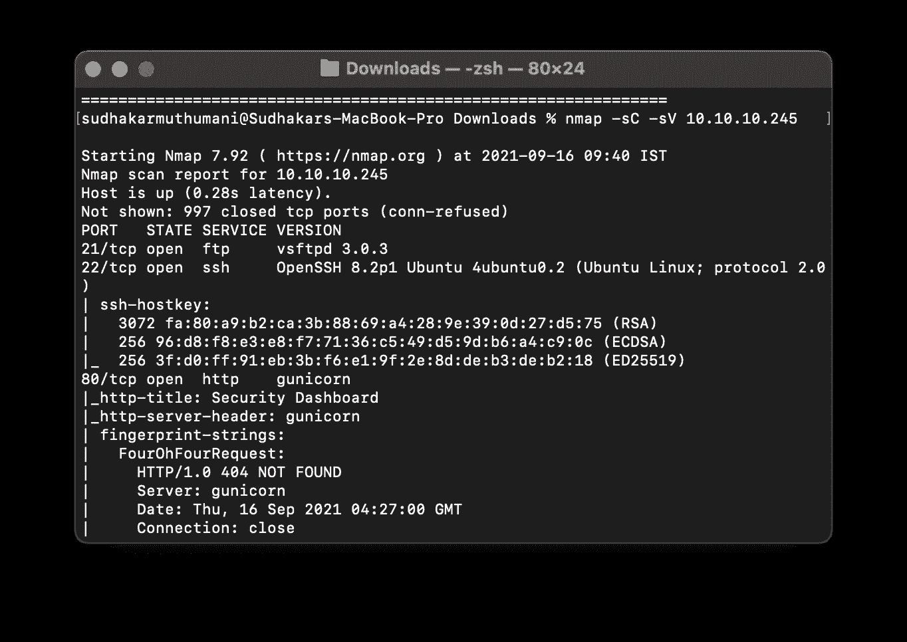
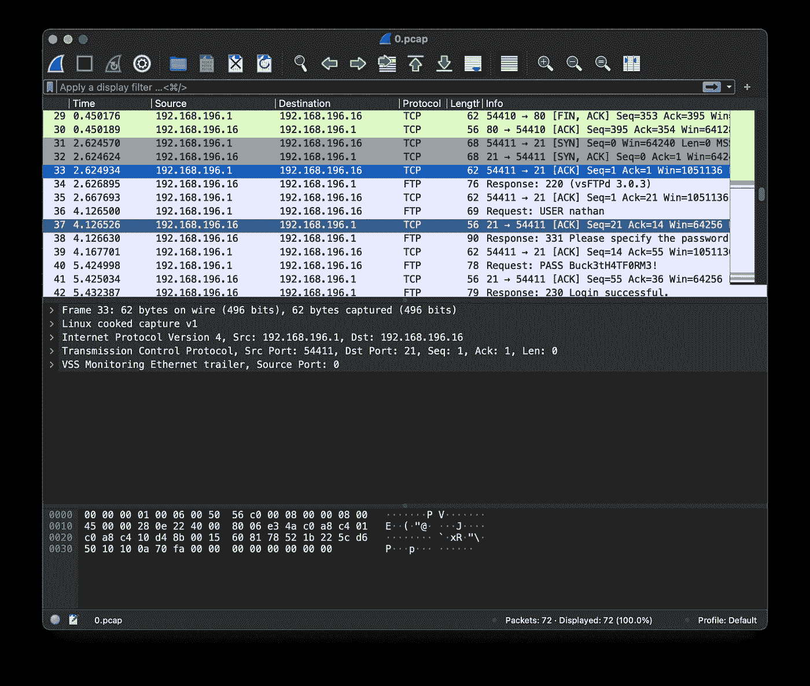
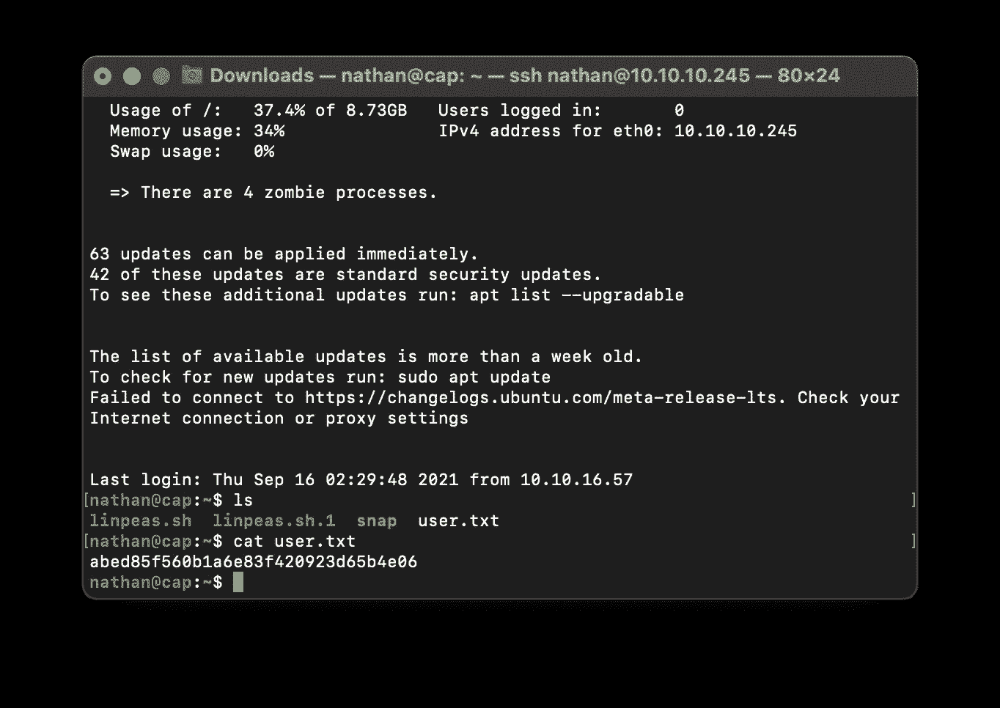
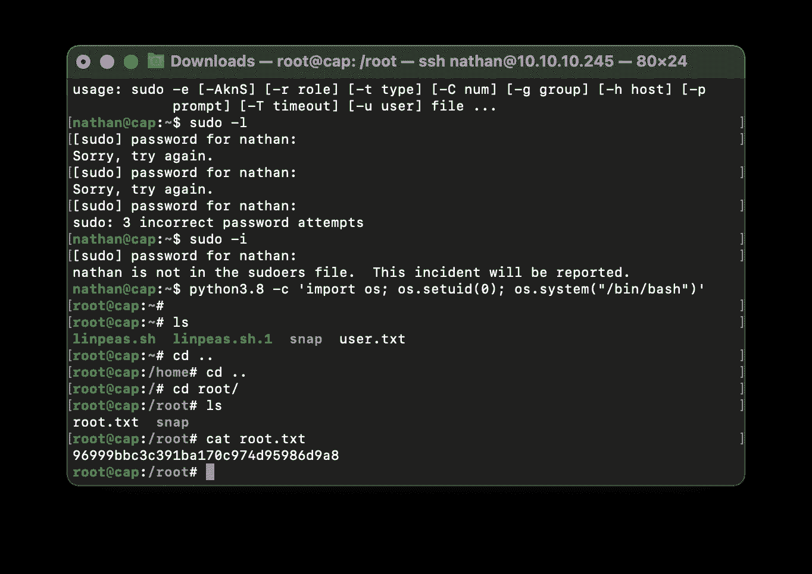

# 制帽机演练

> 原文：<https://infosecwriteups.com/cap-machine-walkthrough-7d2a27e8fa6c?source=collection_archive---------1----------------------->

嗨，这是 HTB 制帽机的简单介绍。

首先我开始用 Nmap 扫描:

`nmap -sC -sV 10.10.10.104`

这没有给我任何结果。然后我浏览了 web 应用程序，发现该应用程序有 Pcap 分析，所有数据都显示为 0。我尝试更改值，如 1、2、3，并在 URL 中尝试 0，并更改了值，然后我下载了 Pcap 文件并通过 Wireshark 对其进行了分析。

它有一个开放的 ssh 用户名和密码。我用它通过 ssh 连接。

`ssh nathan@10.10.10.245`

我登录到这里，使用 ls 命令列出了目录和文件，了解到该标志在 cat user.txt 中，并提交了用户标志。

然后使用这个 python 命令获得 root 访问权限。

`python3.8 -c ‘import os; os.setuid(0); os.system(“/bin/bash”)’`

然后我去根目录，得到根标志。

感谢阅读。