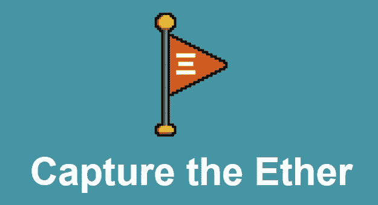
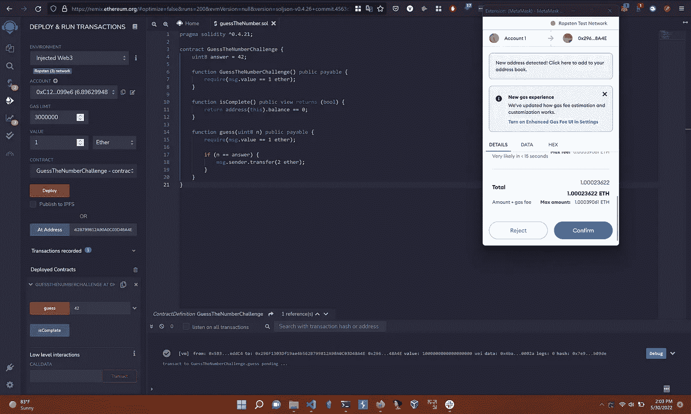
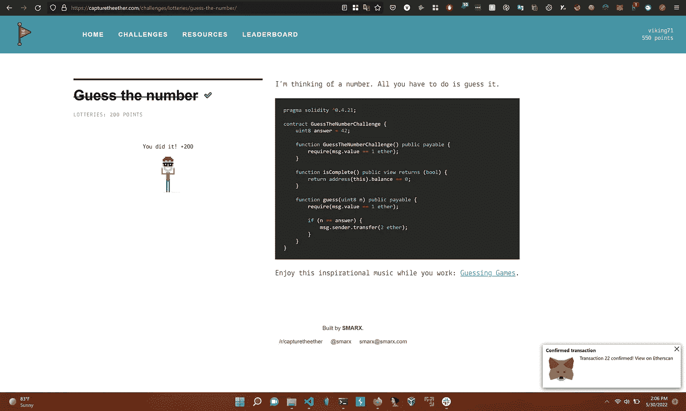
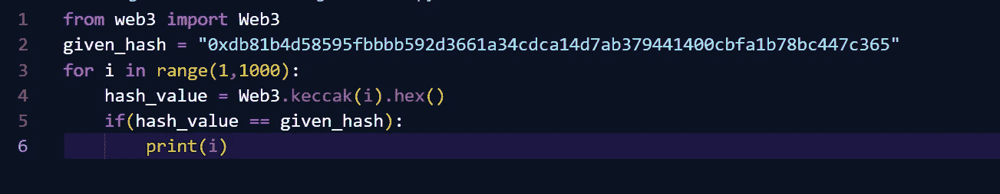
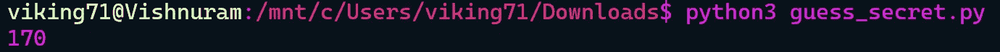
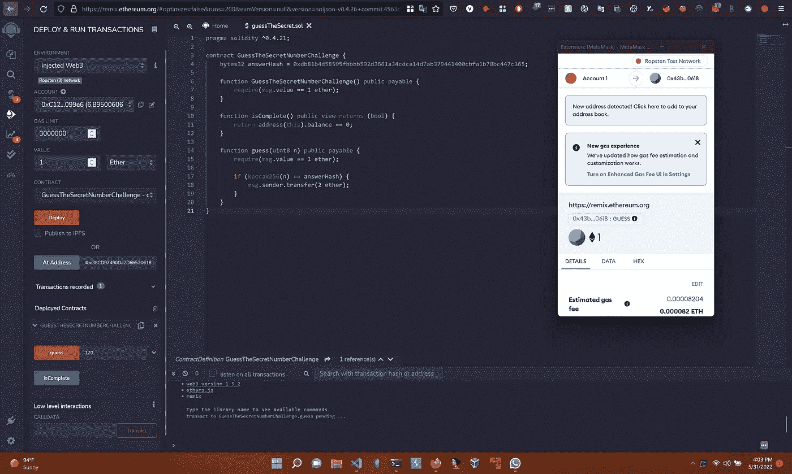
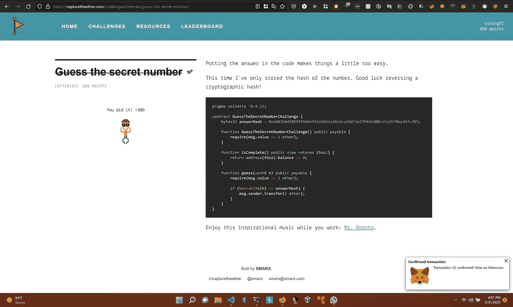
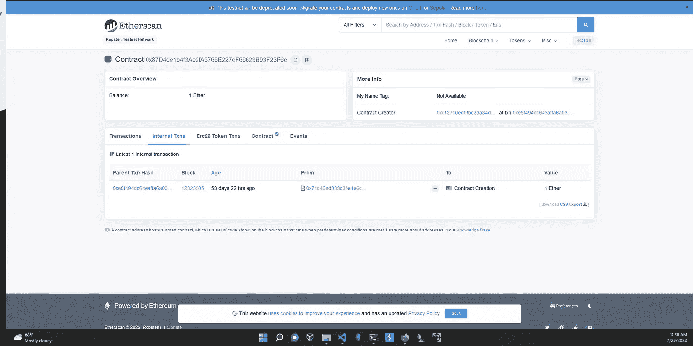
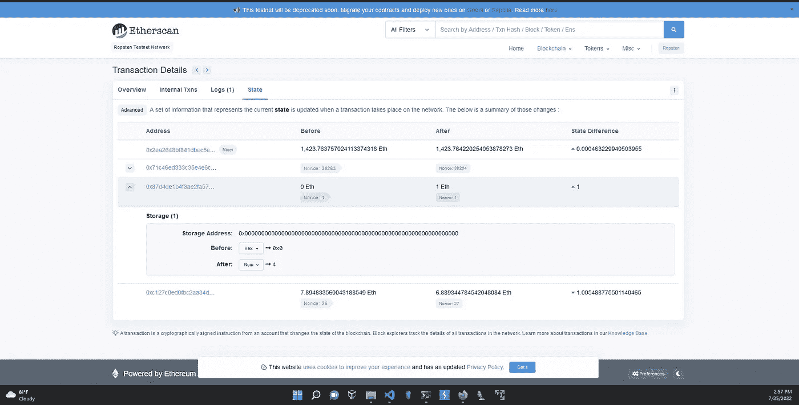

# 捕捉以太——挑战记录

> 原文：<https://infosecwriteups.com/capture-the-ether-challenge-writeup-b10853807690?source=collection_archive---------1----------------------->



我开始专注于智能合同安全，这真的很有趣。

[capturethether](https://capturetheether.com/)是以太坊智能合约安全的游戏。它有有趣的挑战。我解决了一些问题并做了记录。当我解决更多的挑战时，我会更新这篇文章。

我从热身挑战开始，这些挑战简单明了。我将解释彩票部分的挑战。

1.  猜猜这个数字:

他们给了我们一份智能合同和合同地址。我们必须猜这个数字。

通过智能合同，我知道数字是 42，我们必须猜测通过挑战。

```
pragma solidity ^0.4.21;

contract GuessTheNumberChallenge {
    uint8 answer = 42;

    function GuessTheNumberChallenge() public payable {
        require(msg.value == 1 ether);
    }

    function isComplete() public view returns (bool) {
        return address(this).balance == 0;
    }

    function guess(uint8 n) public payable {
        require(msg.value == 1 ether);

        if (n == answer) {
            msg.sender.transfer(2 ether);
        }
    }
}
```

Guess 函数将一个数字作为输入，它需要 1 个以太网来进行交易。

为了与合同进行交互，我们可以使用 Remix IDE。将智能合约复制到混音中，然后编译它。

转到 deploy 部分，选择注入 Web3 的环境，这样它将与我们的 Metamask 帐户连接(留在 Ropsten 测试网络中)。你可以从 Ropsten 水龙头里拿到测试乙醚。

由于此合同已经部署，我们有合同地址，我们可以通过将地址添加到 Remix 的“At Address”部分来与之交互。然后契约被设置为交互。现在我们来看看合同的功能。我们将调用 guess 函数，将数字 42 作为输入。此外，在“值”部分提到 1 个以太调用函数，这是一个要求。最后调用函数 guess。

您将从 Metamask 获得一个接受交易的弹出窗口，一旦交易完成，单击 isComplete 函数检查智能合约的余额是否为 0。如果是真的，你做到了。



进入挑战页面，点击“检查解决方案”。



很好完成了第一次挑战。

2.猜测秘密号码:

这一次他们已经散列了我们必须猜测的数字。

```
pragma solidity ^0.4.21;

contract GuessTheSecretNumberChallenge {
    bytes32 answerHash = 0xdb81b4d58595fbbbb592d3661a34cdca14d7ab379441400cbfa1b78bc447c365;

    function GuessTheSecretNumberChallenge() public payable {
        require(msg.value == 1 ether);
    }

    function isComplete() public view returns (bool) {
        return address(this).balance == 0;
    }

    function guess(uint8 n) public payable {
        require(msg.value == 1 ether);

        if (keccak256(n) == answerHash) {
            msg.sender.transfer(2 ether);
        }
    }
}
```

哈希值在智能协定中给出

```
0xdb81b4d58595fbbbb592d3661a34cdca14d7ab379441400cbfa1b78bc447c365
```

我们能做的一件事就是用蛮力找到有这个散列的数字。正如我们所知，散列是不可逆的任务，我们必须强力多个输入匹配散列。

使用的散列技术是 keccak256。我写了一个 python 代码来查找包含这个散列的数字。



我们基本上使用了 web3py python 包中的 keccak 函数。然后我们检查与 1 到 1000 范围内的数字相匹配的散列。



数字是 170，它具有给定的散列。

现在我们可以像第一次挑战一样。部署契约，用 170 号调用函数 guess。最终完成挑战。



isComplete 函数返回“true”。因此，答案是正确的，挑战完成。



第二个挑战完成了。

3.猜测随机数:

现在部署时通过块号生成一个随机数。

```
pragma solidity ^0.4.21;

contract GuessTheRandomNumberChallenge {
    uint8 answer;

    function GuessTheRandomNumberChallenge() public payable {
        require(msg.value == 1 ether);
        answer = uint8(keccak256(block.blockhash(block.number - 1), now));
    }

    function isComplete() public view returns (bool) {
        return address(this).balance == 0;
    }

    function guess(uint8 n) public payable {
        require(msg.value == 1 ether);

        if (n == answer) {
            msg.sender.transfer(2 ether);
        }
    }
}
```

这个数字是我们的答案，它是在通过协定的构造函数部署协定时创建的。

```
block.number-1
```

上面一行指定了父块，我们正在获取父事务散列。

所以我们知道我们可以在 Etherscan 中看到构造函数的值。



转到内部事务并单击父事务哈希。然后在状态。这将包含存储的变量。



在我的例子中，4 是生成的随机数。粘贴这个数字并运行猜测功能。

挑战结束了。由于安全问题，这通常不是生成随机数的方式。