# 夺旗(CTF)系列-记起 01-机器人先生

> 原文：<https://infosecwriteups.com/capture-the-flag-ctf-series-write-up-01-mr-robot-78b2006471c2?source=collection_archive---------2----------------------->

## 了解如何通过利用不同类型的漏洞来捕获目标机器上的隐藏标志

嘿，伙计们，欢迎来到我的新 CTF 系列，在这里我将介绍关于不同 CTF 挑战的报道。所以，事不宜迟，让我们进入 CTF 吧

这个 CTF 是以电视季《机器人先生》为主题的，如果你是《机器人先生》的粉丝，那么你一定知道这个故事的背景和其中的角色。这座 CTF 的建造方式非常有趣。目标机器上总共隐藏了 3 个标志，必须使用不同的技术和工具才能找到它们。如果您一直在关注我以前的文章，那么您可能对大多数工具都很熟悉，即使您不是，也不要担心，我会尽可能详细地介绍这些工具，并包含一些链接，这样您就可以对这些工具有一个大致的了解

## 目标

捕捉隐藏的旗帜

## 先决条件

虽然我的文章会很详细，但我建议你对以下内容有基本的了解

1.  [捉鬼敢死队](https://tools.kali.org/web-applications/gobuster)
2.  [尼克托](https://cirt.net/nikto2)
3.  [打嗝](https://portswigger.net/burp)
4.  [Wpscan](https://wpscan.org/)
5.  基本的脚本和 Linux 知识
6.  [九头蛇](https://hackercombat.com/password-cracking-tool-hydra/)
7.  Nmap
8.  网络发现

# 初始设置

你需要先下载[机器人先生 VM](https://download.vulnhub.com/mrrobot/mrRobot.ova) 。设置您的 VM 与目标机器交互，您可以使用 Kali Linux、Parrot OS 或您选择的任何其他发行版

## 侦察和扫描

因此，我们有我们的两个虚拟机运行，即机器人先生的目标虚拟机和我们的 Kali Linux 盒与它进行交互。让我们首先发现目标机器的 IP 地址。在确认我的主机 IP 地址后，我将使用 Kali Box 中已经预建的 **Netdiscover** 工具，让我们开始如图所示的发现。 **-r** 开关用于指定我们希望扫描发现的子网范围。

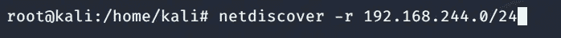

几秒钟后，结果将如下所示

所以我们现在有了目标 IP。让我们对它进行 Nmap 扫描。

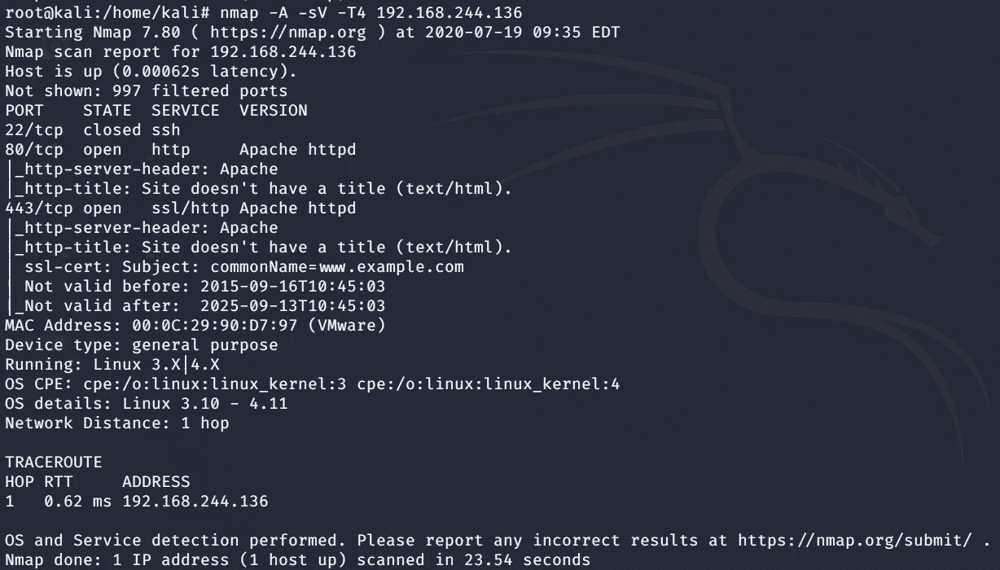

分析上面的扫描，我们知道有一个 web 服务在端口 80 上运行。让我们导航到端口 80 上的网页

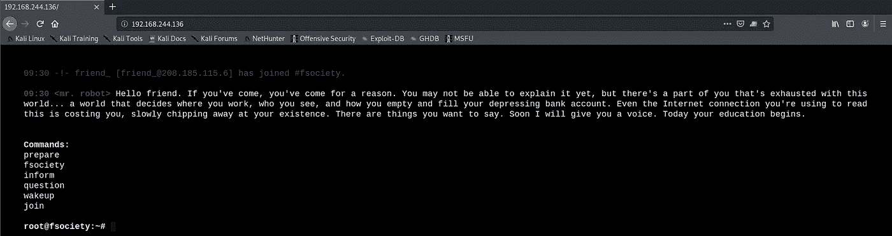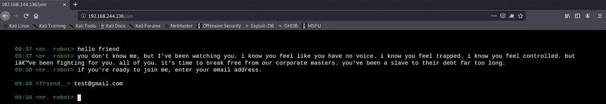

如上所述，当我们在网络浏览器上输入目标 IP 时，我们会看到一个交互式屏幕，上面显示了电视季《机器人先生》中的一些事件。这没有给我们任何有趣的东西。我们需要挖掘更多的信息来进入机器。所以让我们使用 **Gobuster** 或 **Nikto** 来找出隐藏的目录。在大多数情况下，当我们处理 web 应用程序的 web 服务器时，总会有一个重要的隐藏目录，称为 robots.txt。Gobuster 正在使用一个包含常用目录名的世界列表执行暴力攻击。查找 web 应用程序上的目录和漏洞的另一种方法是使用 Nikto，它是一个 web 应用程序扫描器。我两个都用了，这样你就可以看到这些工具是如何工作的

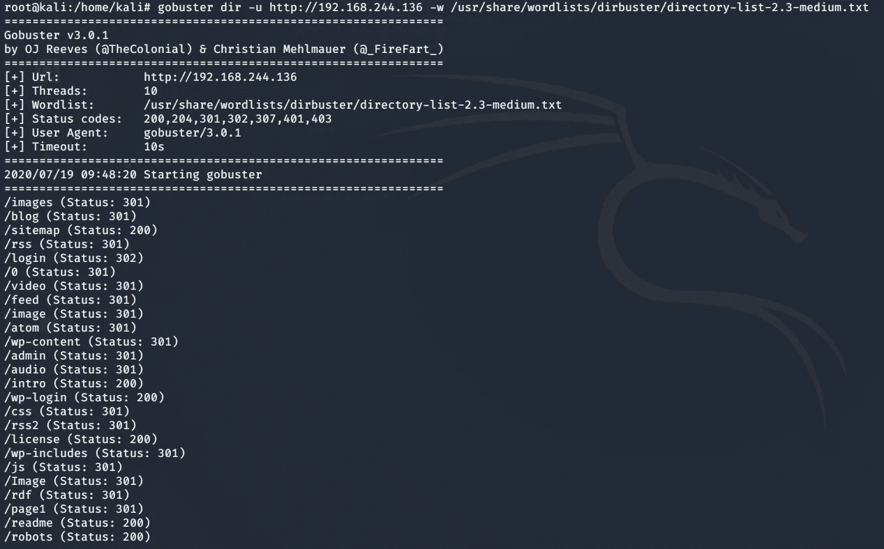

使用 Gobuster 查找隐藏目录

如上所示，我们看到一个名为**机器人的目录。**我们可以类似地使用 Nikto 来达到相同的目的，如下所示

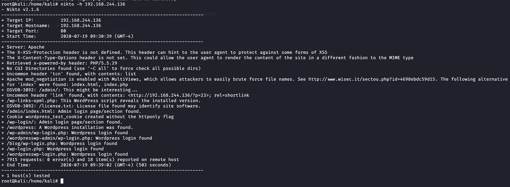

## 列举

让我们导航到机器人的目录。如下图所示，我们必须将文件保存在 robots.txt 目录中。这个目录包含我们的第一个标志和一个字典，在我们即将到来的与目标机器的交互中可能会派上用场

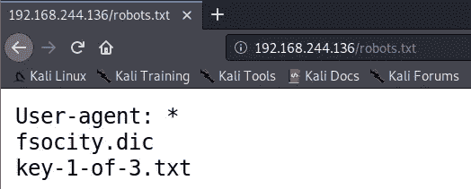

现在我们可以使用 **wget** 获取本地机器上的文件

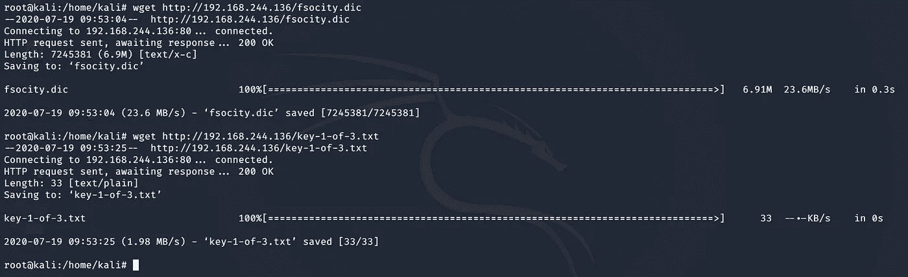

现在导航到桌面，找出我们的第一个标志的输出

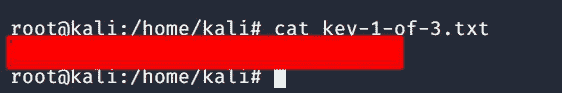

标志 1 内容

查看 fsocity.dict 的大小和内容，该文件是一个字典，可用于字典攻击。字典文件有很多单词，我们可以在下面看到文件的大小，在检查文件的内容后，发现有重复的单词可以排序，这样我们的蛮力就可以花更少的时间

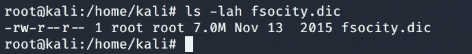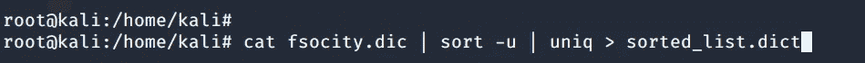

上面的命令按照升序排序 **fsocity.dict** 文件，并以一种独特的方式消除重复。

回过头来看一下 **Nikto** 扫描，我们找到了一条通向/wp-login.php 的路径

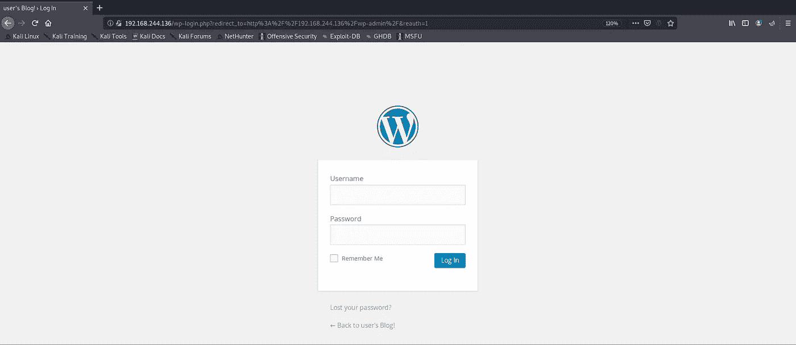

wp-login.php

现在，这部分是事情变得更有趣的地方。我们需要用户名和密码才能登录到 word press 登录面板。因此，我们可以使用 **Burpsuit** 拦截 POST Form 方法的流量，如下所示。为 Mozilla 打开代理，我使用了 [**foxy proxy**](https://addons.mozilla.org/en-US/firefox/addon/foxyproxy-standard/) 来配置 burp 拦截的本地代理。如果你愿意，你也可以在浏览器设置中设置代理。我使用随机的用户名和密码，这样我就可以拦截 Burp 上的流量

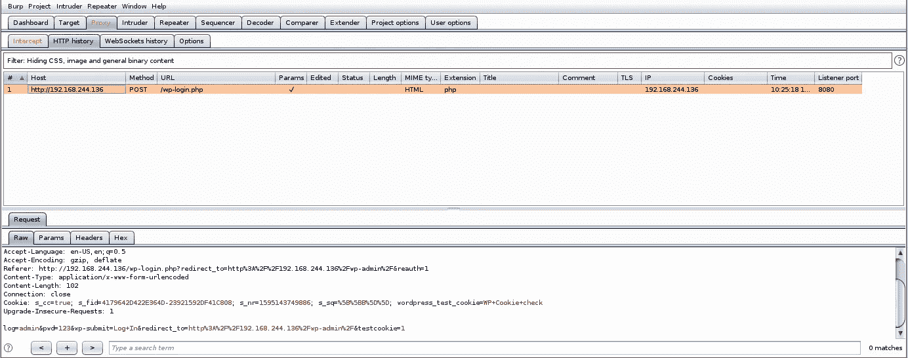

现在我们知道了表单的参数，让我们用 H **ydra** 来蛮力。记住 fsocity 字典文件，这将在使用 **Hydra** 时派上用场，如下图所示。 **-V** 标志是为了详细起见，因为这将向我们显示每一次暴力尝试的细节。 **-p** 标志用于提供用户名。正如我们从 Burpsuite 截取中所知，该请求是一个 **HTTP 后置格式**，所以我们在 Hydra 的参数中提到了这一点。剩下的语法是对我们前面看到的表单参数的引用。

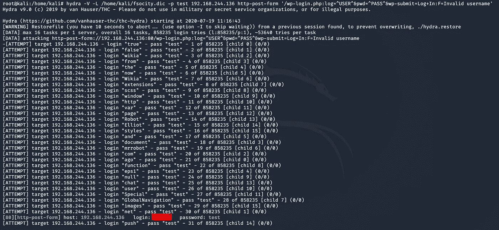

咩！！！我们得到了使用。现在让我们使用这个用户来获取密码。我用的是 WPscan，这是一个针对 word press 网站的漏洞扫描器。我们将在这里使用我们的分类词典

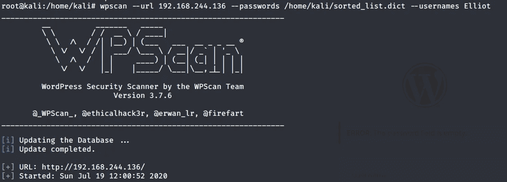

Wpscan 语法

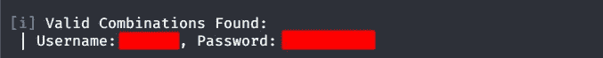

找到凭据

## 获得访问权限

如上所述，我们获得了 word press 登录页面的凭据。现在我们可以使用这些凭证登录。我们现在作为 WordPress Cpanel 的管理员用户登录

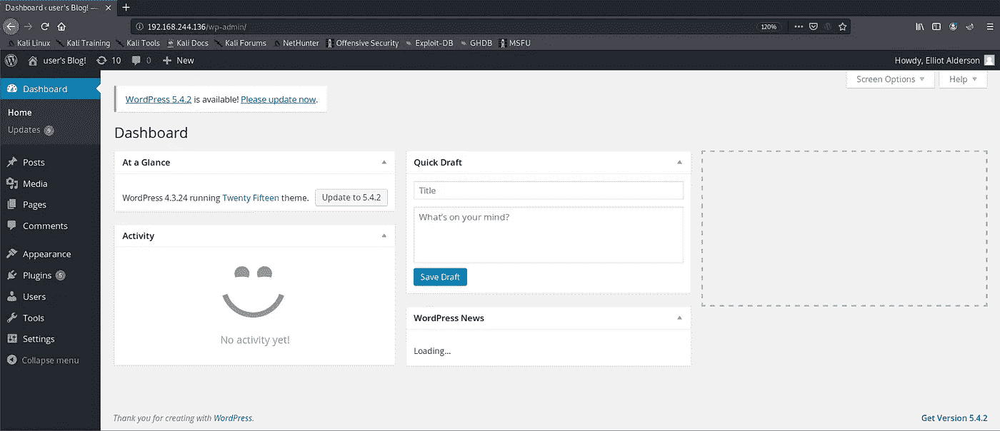

正如你所看到的，我们已经可以访问 WordPress 站点的管理页面了。我们还没有完成，因为我们需要访问服务器本身。为此，我们有两种方法，要么我们利用 WordPress 的漏洞，要么我们通过上传一个反向 shell 脚本来获得一个反向 shell。我使用后一种方法，因为我没有使用 Metasploit 框架获得 shell

我在 PHP 中找到了一个反向 shell 脚本，并用我的主机 IP 地址和端口编辑了它，这些地址和端口将用于任何传入的反向连接。

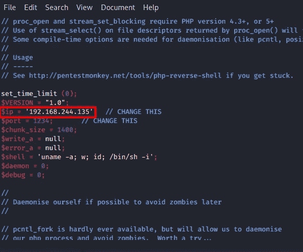

我们需要找到一个可以上传 shell 脚本的地方。通过导航到不同的选项卡，我找到了一个可以粘贴反向 shell 脚本的地方。404.php 似乎是一个完美的地方，我可以粘贴如下所示的脚本

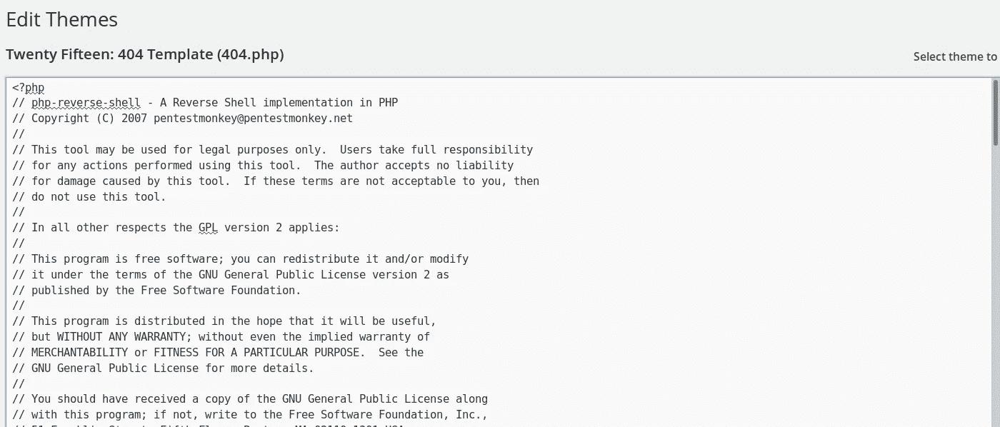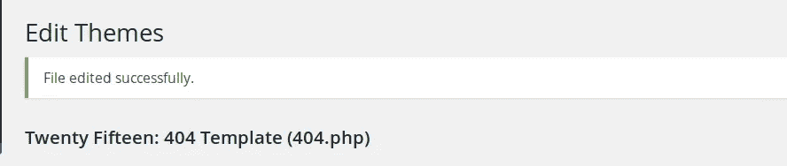

上传成功

使用 Netcat 监听脚本前面指定的端口

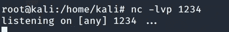

我将在 web 浏览器上导航到 404.php 路径。当我导航到路径时，脚本就开始运行了！！！我们有一个目标 Web 服务器的 shell

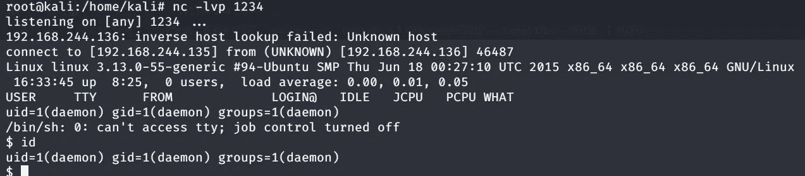

目标机器外壳

我们的第二个标志出现在这台机器上，但是注意到我不能输出标志内容。还有一个名为 password.raw-md5 的文件。访问它时，我们会获得另一个用户的密码，这可能是我们访问 key-2-of-3.txt 内容的途径。请注意，当我尝试访问该用户时，它会说该命令必须从终端运行。

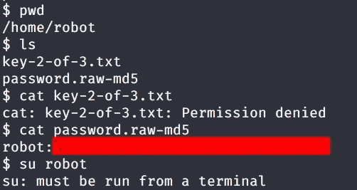

要获得 TTY 终端，我们必须从中派生出一个 shell。我们可以使用 python 来做这件事，如下所示

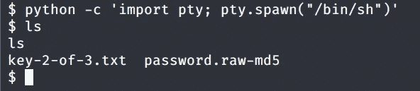

现在我们有了 TTY 终端，让我们访问 password.raw-md5 的内容。该文件包含用户机器人的 md5 哈希。我们在网上破解吧

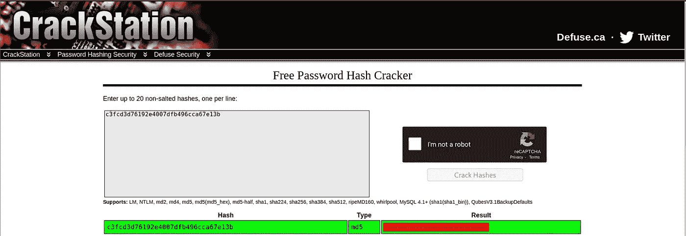

破解 Md5 哈希

让我们使用用户的凭证登录，并获取我们的标志 2 的内容

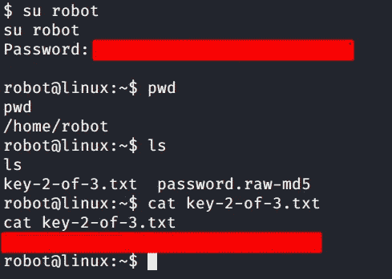

标志 2

## 提升权限

既然我们已经抓住了两个旗子，是时候找到最后一个了。我们当前登录的用户不是 root 用户，我们需要找到一种方法来提升我们的权限。让我们通过检查如下所示的 setuids 来检查用户是否允许使用当前权限运行某些服务或工具

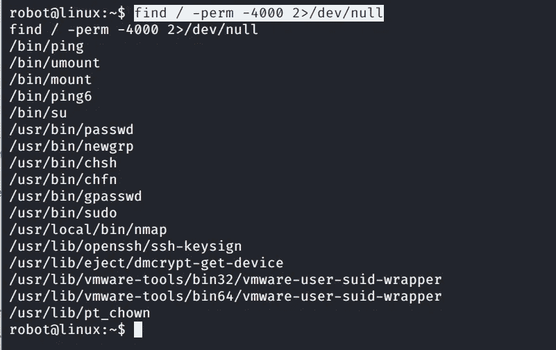

当前用户似乎已经设置了运行 Nmap 的权限。看来 **Nmap** 支持**交互模式**，该模式易受攻击，可被利用。因此，我们运行 bash 命令，是的，我们现在是 root 用户，如下所示

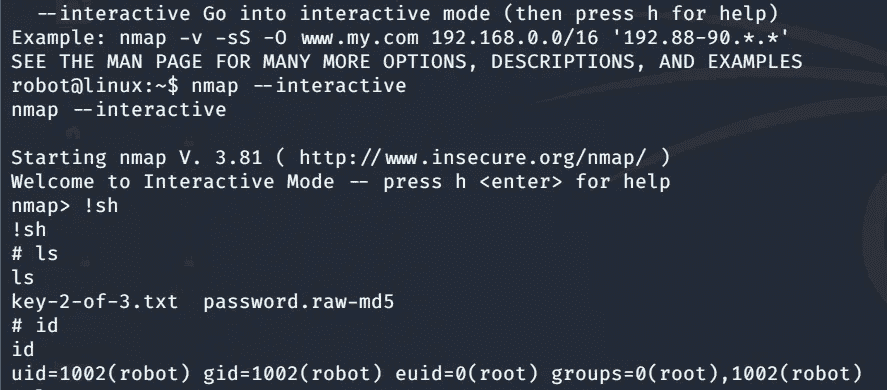

获取 Root 访问权限

导航到根文件夹，我们可以找到我们的最后一个标志。所以我们的最后一面旗帜是通过升级特权找到的

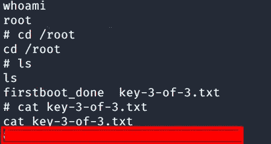

标志 3

## 结论

我们从这个 CTF 身上学到了很多。我们不仅学习了不同的工具并与之互动，还了解了使用不同的工具和技术攻击易受攻击的机器的流程。

**我希望你在阅读这篇文章时感到有趣。更多的报道很快就会出现。**

## 关于我

我是一名网络安全爱好者，正在攻读信息安全硕士学位，并试图进入全职网络安全职业生涯。你可以点击阅读更多文章和演练