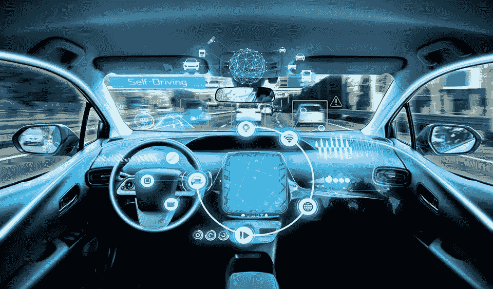
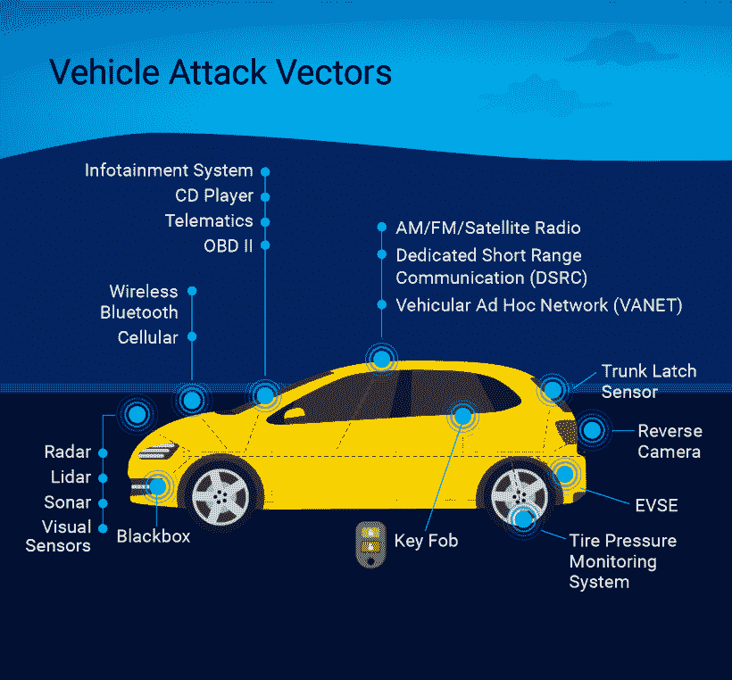

# 汽车黑客:汽车行业的网络安全

> 原文：<https://infosecwriteups.com/car-hacking-cyber-security-in-automotive-industry-e9a7a4ffd6bb?source=collection_archive---------2----------------------->

这个世界需要更多的黑客，当然也需要更多的车辆黑客。新一代汽车正朝着更复杂、更互联的方向发展。总的来说，这些变化将需要更加重视汽车安全，并需要更多的合格人员来实现这一目标。

在当今世界，汽车可能是黑客最喜欢攻击的目标。大多数汽车都配有 CPU、连接器和操作系统。它们比以往任何时候都更加电子化。根据咨询公司**麦肯锡的一项研究，今天一辆普通汽车包括大约 **150 个电子控制单元**和大约 **1 亿行代码**。**硬件和软件都是整合所有这些下一代服务的关键，例如电气化、交通辅助和网络服务。这才刚刚开始。据估计，到 2030 年，一辆商用汽车将拥有 3 亿行软件。只是**仅供参考**目前在一架商用飞机上有**1500 万行代码**。汽车安全研究人员将在汽车工业的革命中发挥重要作用，他们有能力使汽车更加安全。

# 什么是可能的攻击面？

如今，汽车具有无线电、蓝牙、Wifi、GPS 系统、USB 端口、触摸和运动传感器、无钥匙系统等功能，这增加了利用汽车的攻击面。根据**克雷格·史密斯的汽车黑客手册，**我们可以将攻击面分为不同的级别。

**0 级的高级威胁是攻击者可能**

远程接管车辆
关闭车辆
监视车辆乘客
解锁车辆
偷车
跟踪车辆
阻挠安全系统
在车辆上安装恶意软件

攻击面，在**级别 1** 可以进行**蜂窝**、 **wifi** 、**钥匙扣** (KES)、**胎压监测传感器** (TPMS)、**信息娱乐控制台**、 **USB** 、**蓝牙**和 C **控制器局域网** (CAN)总线连接。

在**级别 2，**威胁可以分为五组: **Bluez** (蓝牙守护程序)**wpa _ supplicant**(Wi-Fi 守护程序) **HSI** (高速同步接口蜂窝内核模块) **udev** (内核设备管理器) **Kvaser 驱动程序** (CAN 收发器驱动程序)。

# 挑战

鉴于联网汽车越来越依赖于数据驱动技术，它们代表了网络安全的一个新领域。网络犯罪分子正在使用多种技术侵入这些系统并窃取信息，例如侵入汽车的信息娱乐系统或访问车载诊断端口。

一些汽车安全挑战包括:

> ***多个相互联系的系统。
> 联网汽车在设计时通常不会考虑安全性。
> 汽车网络安全标准无标准。
> 操纵安全关键系统。
> 车载信息娱乐系统(IVI)漏洞***

未来几年，汽车行业对网络安全人员的需求将会激增，行业将会需要越来越多的汽车安全顾问。随着系统变得更加技术先进，威胁形势变得更加强大和复杂，汽车行业正面临着对网络安全的迫切需求。为了应对这些网络安全挑战、威胁和漏洞，需要制定一项全球安全战略。

**本博客到此为止。感谢阅读，继续学习。**

> ***关注我这里:
> LinkedIn:-***[***https://www.linkedin.com/in/vinayak-agrawal-2aa5a61ab/***](https://www.linkedin.com/in/vinayak-agrawal-2aa5a61ab/) ***Twitter:-***[***https://twitter.com/Dr_Anonymous95***](https://twitter.com/Dr_Anonymous95) ***Youtube:-******http://www.youtube.com/c/AnonymousWorld95***

# 参考

1.  汽车黑客手册-克雷格·史密斯
2.  [https://medium . com/@ hacker sera/the-need-for-cyber-security-in-connected-cars-trucks-and-infra structure-515 eb0a 55934](https://medium.com/@hackersera/the-need-for-cyber-security-in-connected-cars-trucks-and-infrastructure-515eb0a55934)
3.  [https://www . tarlogic . com/blog/hacking-cars-problem-of-this-era/](https://www.tarlogic.com/blog/hacking-cars-problem-of-this-era/)

来自 Infosec 的报道:Infosec 上每天都会出现很多难以跟上的内容。 [***加入我们的每周简讯***](https://weekly.infosecwriteups.com/) *以 5 篇文章、4 个线程、3 个视频、2 个 Github Repos 和工具以及 1 个工作提醒的形式免费获取所有最新的 Infosec 趋势！*