# 大屠杀—使用 Wireshark 进行网络流量分析

> 原文：<https://infosecwriteups.com/carnage-network-traffic-analysis-with-wireshark-5fe97e530499?source=collection_archive---------0----------------------->


leTamique 的大屠杀粉丝艺术。

最近，我做了一些关于网络流量分析的研究。为了获得更多的实践，我决定尝试由 *heavenraiza* 和 *RussianPanda 创建的名为“***的免费 TryHackMe 房间。*本文介绍了我使用 Wireshark 解决这个房间的方法，我还在最后提供了一个 TryHackMe 的链接，供有兴趣尝试这个房间的人使用。***

# ***放弃***

***我喜欢在一篇文章之前添加一个简短的免责声明，以鼓励人们在阅读本文之前尝试一下这个房间，因为在这篇文章中显然会有**剧透****。我相信，如果你先自己尝试，然后在遇到困难或需要提示时再来写这篇文章，你会更喜欢 CTF。因此，没有任何进一步的拖延，让我们开始吧！*****

# *****挑战描述*****

> *****Bartell Ltd 采购部的 Eric Fischer 收到了一封来自已知联系人的电子邮件，其中附有一份 Word 文档附件。打开文档时，他不小心点击了“启用内容”SOC 部门立即收到来自端点代理的警报，称 Eric 的工作站正在进行可疑的出站连接。pcap 已从网络传感器中检索出来，并交给您进行分析。*****
> 
> *******任务:**调查数据包捕获并揭露恶意活动。*****

# *****交通分析*****

> *****1.第一次 HTTP 连接到恶意 IP 的日期和时间是什么？(**回答格式** : yyyy-mm-dd hh:mm:ss)*****

*****我首先在 Wireshark 中导航到“*统计数据>端点> IPV4 选项卡】*。然后我按数据包的数量排列了显示的地址:*****

*****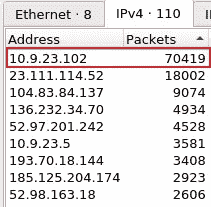*****

*****按数据包数量排序的端点。*****

*****我可以看到分配了 IP 地址 *10.9.23.102* 的端点发送/接收了大量流量。我决定关注这个端点，并使用 Wireshark 过滤器来显示该端点的所有 HTTP 流量:*****

```
*****ip.addr==10.9.23.102 && http*****
```

*****此端点有相当多的 HTTP 流量，但时间列没有提供所需的答案格式:*****

*****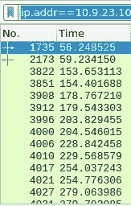*****

*****时间显示格式:从捕获开始的秒数。*****

*****我可以导航到“*查看>时间显示格式*，并将格式更改为答案所需的格式。这为我们提供了与恶意 IP 的第一次 HTTP 连接的时间和日期:*****

*****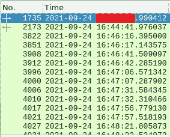*****

*****时间显示格式:日期和时间。*****

> *****2.下载的 zip 文件的名称是什么？*****

*****如果我们查看带有恶意 IP 的第一个 HTTP 数据包，并跟踪 HTTP 流，我们可以看到发出了一个 GET 请求来下载一个 ZIP 文件:*****

*****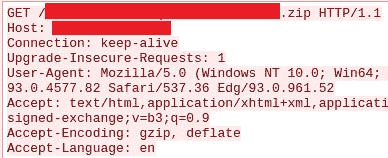*****

*****HTTP 流获取请求 ZIP 文件。*****

> *****3.托管恶意 zip 文件的域是什么？*****

*****如果我们查看带有恶意 IP 的第一个 HTTP 数据包中的**主机**请求头值，我们还可以看到恶意文件所在的域(见上图)。*****

> *****4.不下载文件，zip 文件中的文件名是什么？*****

*****如果我们进一步查看第一个 HTTP 数据包，查看恶意 IP 对来自端点的 GET 请求的响应，我们可以看到 ZIP 文件的开头(由 PK 头表示)和 ZIP 文件中的文件名:*****

*****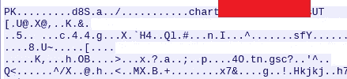*****

*****下载的 zip 文件中的文件名。*****

> *****5.下载 zip 文件的恶意 IP 的 web 服务器的名称是什么？*****

*****同样，如果我们进一步查看第一个 HTTP 数据包，查看恶意 IP 对来自端点的 GET 请求的响应，我们可以看到下载 zip 文件的恶意 IP 的 web 服务器的名称:*****

*****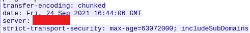*****

*****恶意 IP 使用的 web 服务器的名称。*****

> *****6.上一个问题中的 web 服务器版本是什么？*****

*****我们可以看到 web 服务器的版本正在查看由 **x-powered-by** 响应头:*****

*****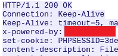*****

*****X-Powered-By 响应标头。*****

> *****7.恶意文件从多个域下载到受害者主机。这项活动涉及的三个领域是什么？*****

*****我的第一反应是查看我可以导出哪些 HTTP 对象，但是我没有看到任何与答案格式匹配的域。查看 Wireshark 中的网络对话窗口("*Statistics>Conversations>TCP "*)并根据数据包数量进行过滤，我可以看到第二个顶级对话使用的是 HTTPS(即端口 443):*****

*****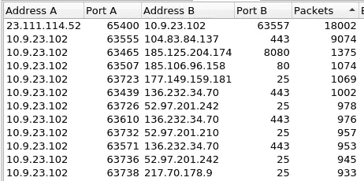*****

*****Wireshark 对话。*****

*****这表明这些文件可能是使用 HTTPS 下载的。我使用 Wireshark 过滤器查看了与受害主机 IP 10.9.23.102 相关的端口 443 上的所有流量:*****

```
*****ip.addr==10.9.23.102 && tcp.port==443*****
```

*****接下来，我启用了“*视图>名称解析>解析网络地址*”菜单中的**解析网络地址**，因为默认情况下此选项是禁用的。这使得更容易找到域名。然后，我开始向下滚动 HTTPS 的流量，直到我找到所有三个符合答案格式的域名。*****

> *****8.前一个问题中哪个证书颁发机构向第一个域颁发了 SSL 证书？*****

*****我执行了 DNS 查找，它提供了颁发 SSL 证书的证书颁发机构的名称:*****

*****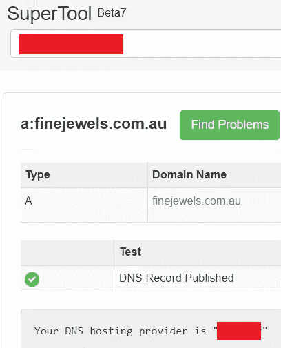*****

*****DNS 查找。*****

> *****9.钴击服务器的两个 IP 地址是什么？使用 VirusTotal(社区选项卡)确认 IP 是否被识别为 Cobalt Strike C2 服务器。(答案格式:按顺序输入 IP 地址)*****

*****根据米特 ATT 和 CK，钴罢工使用 HTTP，HTTPS 和 DNS 进行通信:*****

*****[](https://attack.mitre.org/software/S0154/) [## 钴罢工

### Cobalt Strike 是一个商业的、全功能的远程访问工具，自称是“对手模拟软件…

attack.mitre.org](https://attack.mitre.org/software/S0154/) 

使用这些信息，我们可以转到"*统计数据>对话> TCP"* 并开始查找符合此描述的 IP 地址，然后将它们提交给 VirusTotal 进行确认:

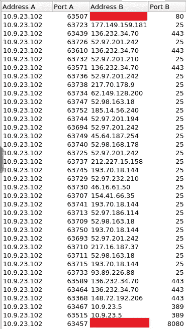

钴击服务器 IP 地址。

> 10.前一个问题中第一个 Cobalt Strike IP 地址的主机报头是什么？

我使用以下 Wireshark 过滤器来查找与第一个 Cobalt Strike IP 地址相关的 HTTP 流量:

```
ip.addr==<IP_ADDRESS> && http
```

跟随第一个数据包的 HTTP 流，我可以看到主机头值:

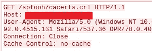

第一个 Cobalt Strike IP 地址的主机标头。

> 11.Cobalt Strike 服务器第一个 IP 地址的域名是什么？您可以使用 VirusTotal 来确认它是否是 Cobalt Strike 服务器(查看“社区”选项卡)。

仍然查看上一个问题的第一个数据包，我们可以在 source 列中看到用于 Cobalt Strike 服务器的第一个 IP 地址的域:

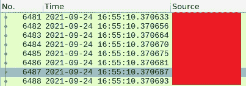

Cobalt Strike 服务器第一个 IP 地址的域名。

> 12.第二部钴击服务器 IP 的域名是什么？您可以使用 VirusTotal 来确认它是否是 Cobalt Strike 服务器(查看“社区”选项卡)。

我们可以应用前面看到的相同过程，使用下面的查询，然后引用 source 列:

```
ip.addr==<IP_ADDRESS> && http
```

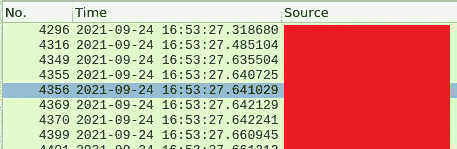

Cobalt Strike 服务器第二个 IP 地址的域名。

> 13.感染后流量的域名是什么？

在查看之前可以导出的 HTTP 对象时，我看到了与特定主机名相关的奇怪的 base64 编码流量:

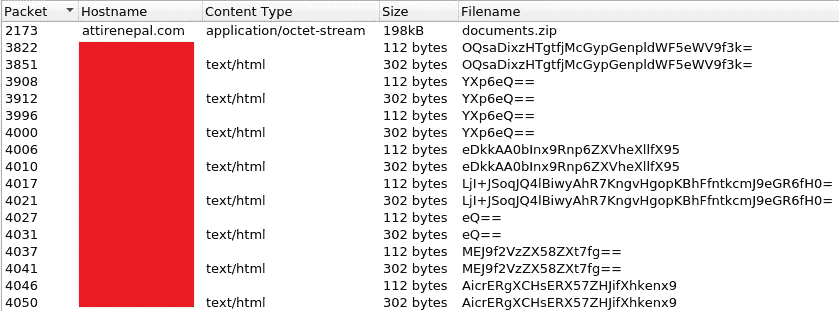

HTTP 对象。

当攻击者使用 HTTP 从受损的主机中泄漏数据时，通常可以观察到网络上的 POST 请求发送到 web 服务器，而主机以前没有与之通信过。我们还可以使用下面的 Wireshark 过滤器来过滤 POST 请求，并查找感染后流量的域名:

```
ip.addr==10.9.23.102 && http.request.method=="POST"
```

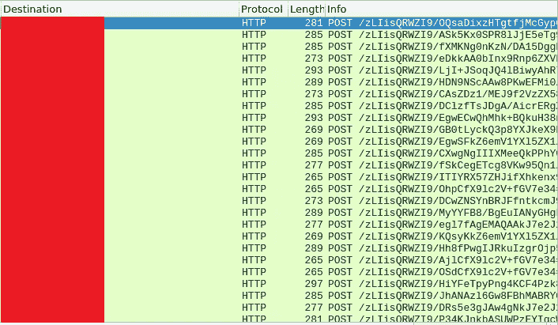

感染后流量的域名。

> 14.受害主机向感染后流量中涉及的恶意域发送的前 11 个字符是什么？

我们可以通过查看上图并计算受害主机向恶意域发出的 POST 请求中的前 11 个字符来回答这个问题。

> 15.发送到 C2 服务器的第一个数据包的长度是多少？

同样，我们可以通过查看上图并确定第一个数据包的长度来回答这个问题。

> 16.前一个问题中恶意域的服务器头是什么？

我们可以跟踪前面看到的感染后流量中第一个数据包的 HTTP 流，并查看**服务器**响应头:

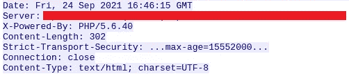

服务器响应标头。

> 17.恶意软件使用 API 来检查受害者机器的 IP 地址。对 IP 检查域进行DNS 查询的日期和时间是什么时候？(**回答格式** : yyyy-mm-dd hh:mm:ss UTC)

我们可以从过滤受害者的 IP 地址和 DNS 流量开始。然后，我们可以通过检查是否有任何帧包含关键字“ **api** ”来进一步细化我们的搜索:

```
ip.addr==10.9.23.102 && dns && frame contains "api"
```

该 Wireshark 过滤器提供以下输出:

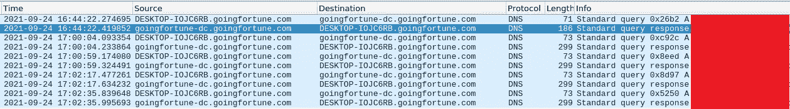

用于检查受害者机器的 IP 地址的 API。

> 18.前一个问题中的 DNS 查询中的域是什么？

我们可以使用与上一个问题相同的查询和输出来回答这个问题。

> 19.似乎有一些恶意垃圾邮件(malspam)活动正在进行。在流量中观察到的第一个邮件发件人地址是什么？

在处理数据包捕获时，我注意到使用端口 25(即简单邮件传输协议)的流量。我们可以过滤与受害主机相关的 SMTP 流量:

```
ip.addr==10.9.23.102 && smtp
```

往下看包裹，我们可以看到第一封邮件的发件地址:

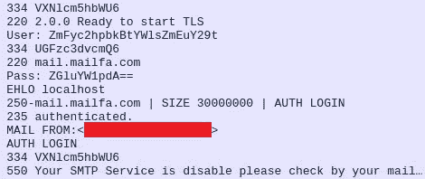

发件人地址。

> 20.SMTP 流量观察到多少数据包？

使用前一个问题中看到的相同 Wireshark 过滤器，我们可以简单地查看 Wireshark 状态行**,它将**指示显示的数据包数量:


Wireshark 状态线。***** 

# *****结束语*****

*****我真的很喜欢在这个房间工作，并有机会了解更多关于网络流量分析和 Wireshark 功能的信息。谢谢你一直读到最后，继续黑下去😄！*****

*****[](https://tryhackme.com/) [## 网络安全培训

### TryHackMe 是一个免费的学习网络安全的在线平台，使用动手练习和实验室，通过您的…

tryhackme.com](https://tryhackme.com/)*****