# 屠杀——TryHackme 报道(600 分)| Karthikeyan nagaraj

> 原文：<https://infosecwriteups.com/carnage-tryhackme-write-up-600-points-cyberw1ng-6e4468c010a8?source=collection_archive---------1----------------------->

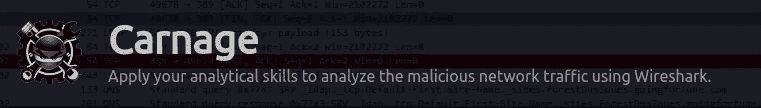

## 运用您的分析技能，使用 Wireshark 分析恶意网络流量。

# 任务 2

1.  第一次 HTTP 连接到恶意 IP 的日期和时间是什么？(**回答格式** : yyyy-mm-dd hh:mm:ss)\

```
Hint: With Http Filter we can find the Date and Time in **Frame**
```

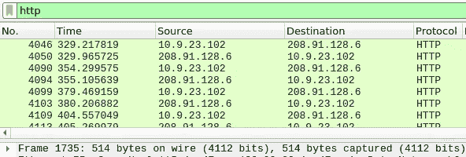

2.下载的 zip 文件的名称是什么？

```
Hint: Using Search Option we can Search for **Zip** string in Packets
---Make Sure to Remove http Filter Before Search
```

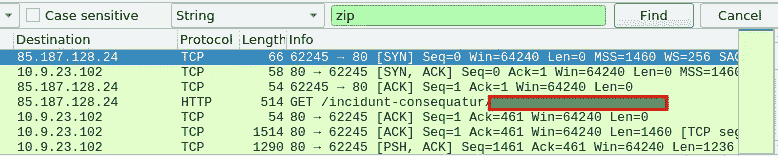

3.托管恶意 zip 文件的域是什么？

```
Hint: Follow the Stream that we Find in 2nd Question
```

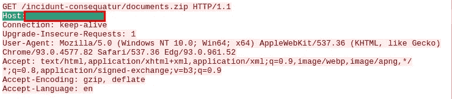

4.不下载文件，zip 文件中的文件名是什么？

```
Hint: View the Contents of the Response in Same Packet
```

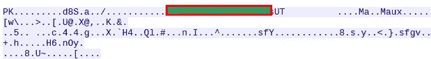

5.下载 zip 文件的恶意 IP 的 web 服务器的名称是什么？

```
Hint: View the Response in Same Packet for Server
```

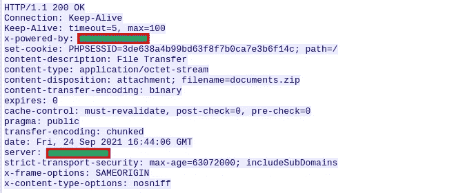

6.上一个问题中的 web 服务器版本是什么？

`Hint:` 查看同一数据包中的响应

7.恶意文件从多个域下载到受害者主机。此活动涉及的三个域是什么？

```
Hint: Check HTTPS traffic. Narrow down the timeframe from 16:45:11 to 16:45:30.1\. Apply the Below Filter,(frame.time > "Sep 24, 2021 16:45:11") && (frame.time > "Sep 24, 2021 16:45:30") && tcp.port == 4432\. Follow the Stream
3\. The First Website You Find On Each Packet is the Domaintcp.stream eq 90, tcp.stream eq 97 and tcp.stream eq 98
```

8.前一个问题中哪个证书颁发机构向第一个域颁发了 SSL 证书？

```
Hint: Search for Authority in the Packet of First Domain
```

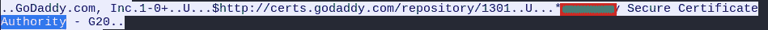

9.钴击服务器的两个 IP 地址是什么？使用 VirusTotal(社区选项卡)确认 IP 是否被识别为 Cobalt Strike C2 服务器。(答案格式:按顺序输入 IP 地址)

```
Hint: Go to Statistics > Conversations > TCP in Wireshark 
and Check for the IP Using Port 80 and 8080
```

10.前一个问题中第一个 Cobalt Strike IP 地址的主机报头是什么？

```
Hint: Scan the First IP and Check the Community Tab in Virustotal 
```

11.Cobalt Strike 服务器第一个 IP 地址的域名是什么？您可以使用 VirusTotal 来确认它是否是 Cobalt Strike 服务器(查看“社区”选项卡)。

```
Hint: Check the Relations Tab in Virustotal for Host Header
```

12.第二部钴击服务器 IP 的域名是什么？您可以使用 VirusTotal 来确认它是否是 Cobalt Strike 服务器(查看“社区”选项卡)。

```
Hint: Scan the Second IP and Check the Relations Tab for Domain Name
```

13.感染后流量的域名是什么？

```
Hint: Apply the Filter http.request.method == “POST”and Follow the HTTP Stream in Appropriate Packet
```

14.受害主机向感染后流量中涉及的恶意域发送的前 11 个字符是什么？

```
Hint: Check the Post Parameters 
```

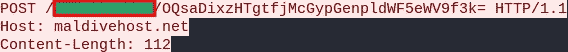

15.发送到 C2 服务器的第一个数据包的长度是多少？

```
Hint: Watch the Length of the Packet we Find Above
```

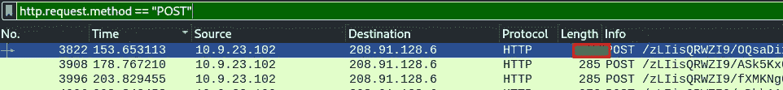

16.前一个问题中恶意域的服务器头是什么？

```
Hint: Follow the Packet in HTTP Stream
```

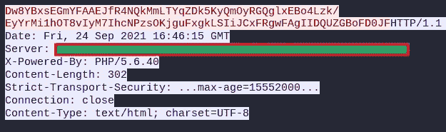

17.恶意软件使用 API 来检查受害者机器的 IP 地址。IP 检查域的DNS 查询发生的日期和时间？(**回答格式** : yyyy-mm-dd hh:mm:ss UTC)

```
Hint: Apply the Filter 
ip.addr==10.9.23.102 && dns && frame contains "api"Note: Subtract 5:30 From the Time, Because the Given Time is IST
EX: 21:30:00 ISC = 16:30:00 UTC
```

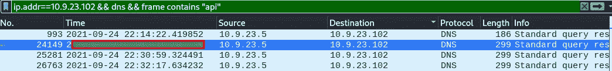

18.前一个问题中的 DNS 查询中的域是什么？

```
Hint: Follow the Packet in UDP Stream
```

19.似乎有一些恶意垃圾邮件(malspam)活动正在进行。在流量中观察到的第一个邮件发件人地址是什么？

```
Hint: Apply the Filter - SMTP and Search for FROM Address
```

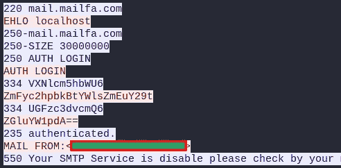

第 28343 号包裹

20.对于 SMTP 流量，观察到多少个数据包？

```
Hint: Apply the Filter SMTP and Notice the Displayed Packets in Bottom Right Side
```

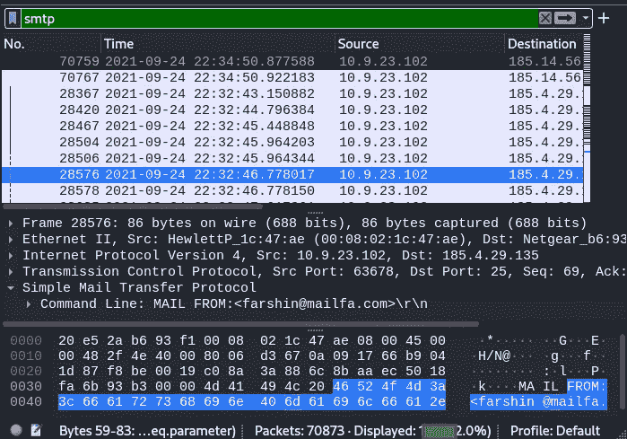

感谢您的阅读！！！

黑客快乐！！！

```
Author: karthikeyan nagaraj ~ Cyberw1ng
```

## 来自 Infosec 的报道:Infosec 每天都有很多内容，很难跟上。[加入我们的每周简讯](https://weekly.infosecwriteups.com/)以 5 篇文章、4 条线索、3 个视频、2 个 GitHub Repos 和工具以及 1 个工作提醒的形式免费获取所有最新的 Infosec 趋势！