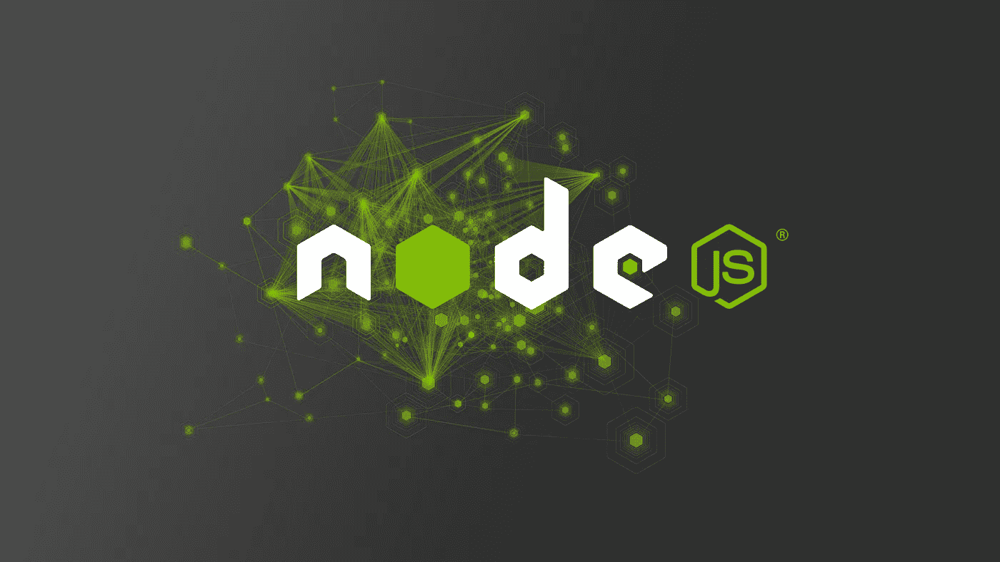
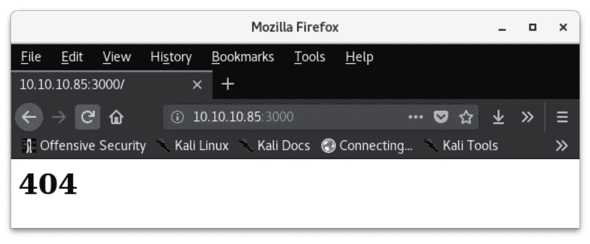
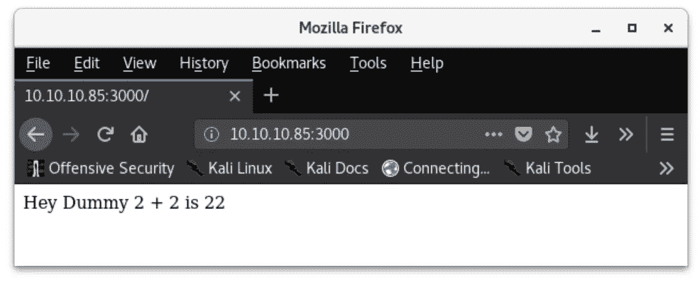
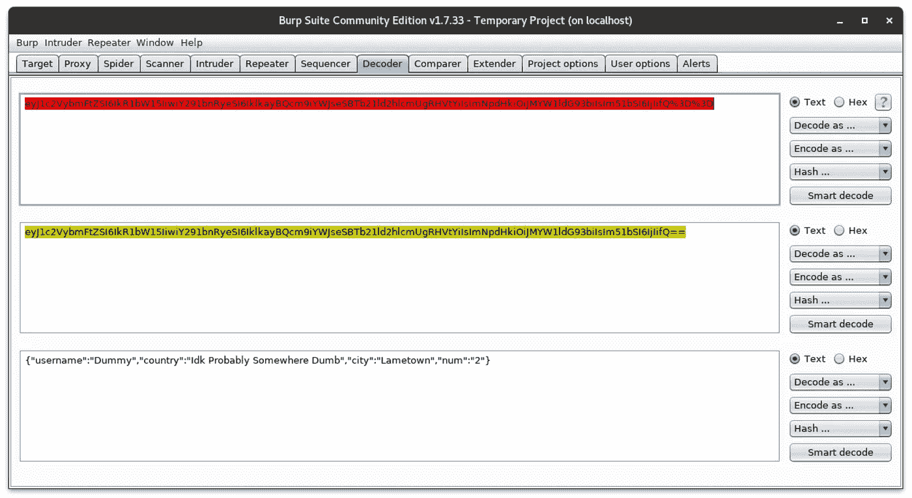
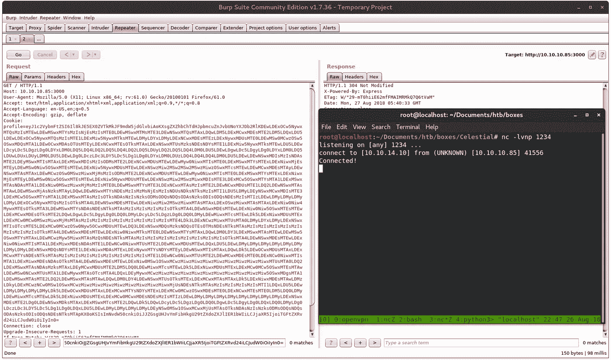

# 天体——node . js 反序列化 HackTheBox 演练

> 原文：<https://infosecwriteups.com/celestial-a-node-js-deserialization-hackthebox-walk-through-c71a4da14eaa?source=collection_archive---------0----------------------->



节点. js

这是一个快速而有趣的盒子，是我完成的第一批 HackTheBox 机器之一。现在它已经在周末退役了，我想我应该分享一下我是如何扎根这台机器的！

# 摘要

仙界是一台 linux 机器，托管 Node.js Express web 服务，该服务不安全地评估客户机提供的 cookie 参数。该漏洞被利用来获得系统上的反向外壳。由`root`通过 cronjob 执行的可写文件被用于权限提升。

# 侦察

我像往常一样用一个`nmap -sV -sC`扫描来枚举服务版本并运行默认脚本:

天体 nmap -sV -sC

随后，我进行了第二次全端口扫描，查看是否有其他端口打开。但是，只返回了端口 3000。此时，由于没有其他服务可以访问，我启动了一个浏览器来查看 web 服务器存储了什么。



嗯…

第一个请求返回了 404 Not Found 错误…所以我刷新了页面，看看是否会发生什么。果然！



这是一件了不起的事

我想知道为什么会发生这种情况，所以我将我的请求代理到这个服务器上，发现有一个 cookie 被传递到名为`profile`的服务器上，这个 cookie 似乎是经过编码的。因为我已经在 Burp Suite 中，所以我将 cookie 发送到 Decoder，并将 cookie 转换成明文:



URL 解码> base64 解码>明文

现在我能够读取 cookie 值了:

```
{“username”:”Dummy”,”country”:”Idk Probably Somewhere Dumb”,”city”:”Lametown”,”num”:”2"}
```

这解释了网络上的反应“嘿，笨蛋 2+2 = 22”。如果我更改了 cookie 中的`username`或`num`值，网页会打印出名字并将数字连接两次。

# 剥削

在这一点上，我知道这是我最初的立足点。我开始研究在 Node.js web 服务上利用这个 cookie 的方法。我找到了[这篇博文](https://opsecx.com/index.php/2017/02/08/exploiting-node-js-deserialization-bug-for-remote-code-execution/)解释了如何利用传递给节点序列化模块中的`unserialize()`函数的不可信数据，通过传递带有立即调用的函数表达式的序列化 JavaScript 对象来实现任意代码执行。

反序列化漏洞并非 Node.js 独有，在很多其他语言中都存在。其他语言中常见的反序列化向量包括

*   [PHP 对象注入](https://securitycafe.ro/2015/01/05/understanding-php-object-injection/)
*   [Java 反序列化](https://github.com/GrrrDog/Java-Deserialization-Cheat-Sheet)
*   [Rails RCE 漏洞(XML & YAML)](http://blog.codeclimate.com/blog/2013/01/10/rails-remote-code-execution-vulnerability-explained/)
*   [Python Pickle 反序列化](https://www.cs.uic.edu/~s/musings/pickle/)

由于 GitHub 上的 [nodeshell.py](https://github.com/ajinabraham/Node.Js-Security-Course/blob/master/nodejsshell.py) ,利用 Node.js 中的这个反序列化漏洞获得反向 shell 非常容易。通过使用攻击者的 IP 和要连接回的本地端口运行脚本，可以非常容易地生成有效负载:

nodeshell.py

`String.fromCharCode()`中编码的有效载荷可以很容易地反向返回实际的指令(或者你可以直接读取 GitHub 上的代码！):

简单解码循环

这将返回:

解码反向外壳有效负载

由于这段代码运行在`eval()`内部，它将在服务器上执行，并产生一个`/bin/sh`的进程，并将它发送到攻击者的监听端口。

为了将这个`eval()`函数作为 cookie 发送回服务器，必须将它打包到一个变量中，并使用如下的`{"name":value}`语法:

```
{“rce”:”_$$ND_FUNC$$_function (){ eval(String.fromCharCode(…))}()"}
```

一旦这个 cookie 被 base64 编码，它就可以被发送回服务器以获得一个反向 shell！攻击者唯一要做的就是启动一个 netcat 监听器:

```
nc -lvnp 1337
```

> `-l`—listen
> `-v`—verbose
> `-n`—只有数字的 IP 地址，没有 DNS
> `-p` —端口(本例中为 1337)

在继续之前，值得注意的是，服务器允许接收和执行这个恶意 cookie，即使 cookie 中没有任何原始参数！

但是，有效负载也可以放在 cookie 的其他值中。例如在`username`中:

```
{“username”:”_$$ND_FUNC$$_function (){ eval(String.fromCharCode(…))}()”,”country”:”Idk Probably Somewhere Dumb”,”city”:”Lametown”,”num”:”2"}
```

无论哪种方式，base64 编码的字符串都会进入到对服务器的 GET 请求的`profile`值中，侦听器将捕获一个反向 shell。



这是一块大饼干

# 权限提升

在服务器上，我能够运行一些快速枚举，并发现我的用户在`adm`组中，这意味着用户可以从服务器上读取日志。在我的用户的主目录中有两个文件引起了我的注意:`~/output.txt`和`~/Documents/script.py`。

`script.py`的内容只是一个打印声明，说“脚本正在运行…”而`output.txt`包含完全相同的内容。我的用户拥有具有读写权限的`script.py`——没有执行权限。然而，`output.txt`归`root`所有。这给了我一个提示，可能有某种 cronjob 正在为`root`运行，以定期执行`script.py`，并可能将其写入`output.txt`。

我的用户没有权限运行`crontab -u root`来查看`root`下安排的 cronjobs。*然而*，该用户是`adm`组的成员，因此他们可以查看`/var/log/`目录中的日志。我们可以看到，每隔 5 分钟，`root`执行`script.py`并将输出写入`output.txt`。

```
tail -10 /var/log/syslog | grep root
```

输出以下内容:

Root Cronjob

从这里简单地将`script.py`改写为 [Pentestmonkey 的反向 shell 备忘单](http://pentestmonkey.net/cheat-sheet/shells/reverse-shell-cheat-sheet)中的 python 反向 shell，设置 IP 和端口，并等待 5 分钟用另一个`netcat`监听器捕获我的根 Shell！