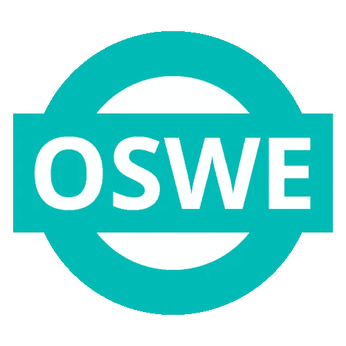
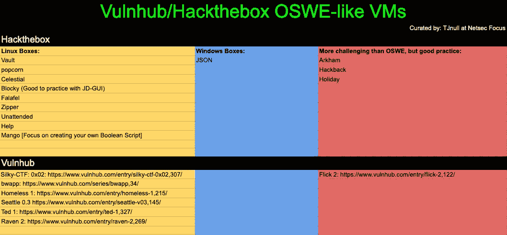

# [认证] OSWE 考试回顾和提示(英尺。没有开发者背景的候选人)

> 原文：<https://infosecwriteups.com/cert-oswe-exam-review-and-tips-ft-no-developer-background-candidate-1dad7f545155?source=collection_archive---------0----------------------->



# 介绍

大约在今年年初，我想开始我的进攻性安全的 [OSWE (WEB-300)](https://www.offensive-security.com/awae-oswe/) 之旅，以提高我的 AppSec 技能。我报名参加了 2020 年更新的 OSWE 课程。参加课程和考试的整个过程都很棒。这是我迄今为止做过的最有价值的攻击性安全训练。我向任何想要提高 web 应用程序开发和源代码审查技能的人强烈推荐这一点。

因为已经有太多关于 OSWE 的评论，关于它是如何构建的，你将会学到什么，等等。因此，我将重点关注您在参加本课程+考试和一些提示之前需要准备的内容。基本上，我为了通过考试所做的事情。

此外，我有大约 4 年以上的攻击性安全经验，没有任何开发人员背景。我为自动化编写了一些脚本并编写了一些简单的工具，但我也不是一个专业的程序员。最后，在参加 OSWE 之前，我从未真正做过任何专业的源代码审查，所以考试中的源代码审查部分对我来说相当残酷。


# 在上课的时候

我在 OSWE 之前完成了进攻安全的 OSCP 和 OSCE。他们的考试很有趣，但很难说他们的教材是一流的。这主要是因为一些内容已经过时，与当前的测试 TTPs 并不真正相关。但是攻击性安全吸取了教训。正如我之前所说，他们在 2020 年漂亮地“改造”了他们的 OSWE 球场。我真的很喜欢培训材料中的所有内容，它们都是最新的。当您复习课程时，请记住以下几点:

## **1)边看材料边做好笔记**

我只看了一遍课程材料(PDF 和视频)。您的笔记不必过于详细，但至少要写下每个 web 漏洞利用的过程以及您使用了哪些命令/有效载荷。

## **2)确保完成额外里程**

即使额外的里程不是免费的通行证或给你考试的提示，但它们将是赢得 OSWE 考试的关键。起初，我没有做额外的工作就浏览了所有的材料。一旦我完成了，我就回去完成每一章的所有额外里程，重复两次。做额外工作的一个好处是，它将迫使您对目标应用程序做一些源代码审查。(可惜 PDF/Video 就不详细讲了，不过考试是 ***都是关于源代码审查的。***

## **3)如果您曾经创建过漏洞利用脚本，请保留它们以备考试时使用**

除非你是编码高手，否则考前做一些模块化的函数。这样可以节省你考试的时间。例如，您可以使用 python 创建一些“登录”功能，如下所示:

```
**# Login Function**def login(target, username, password):
    url = "http://%s/login" % target

    data = {
        "username" : username,
        "password" : password,
    } proxies = {
        'http':'127.0.0.1:8080'
    } s = requests.Session()
    r = s.post(url, data=data, proxies=proxies)if "***<Login Failed Error Message>***" in r.text:
    print("[ERROR] Login Failed!")
    sys.exit(1)
else:
    print("[INFO] Login Successful!")
```


# 参加完课程后

在 OSWE 实验室，您可以多练习几个额外的虚拟机。就我个人而言，我没有做那些盒子仅仅是因为我没有时间做它们，而且实验室已经过期了。我想说，如果你有时间，看一遍它们可能是个好主意，但如果没有时间，跳过它们也没关系。以下是我为 OSWE 做的额外学习:

## **1)**



我没有做所有的方框，但是做了下面的(基本上，我做了所有的黄色和蓝色部分的方框，除了红色部分。如果您有时间，请全部完成，但如果没有时间，请确保至少阅读盒子的演练。):

*   [【HTB】跳马——记大过(OSWE 预备)](https://bigb0ss.medium.com/htb-vault-writeup-oswe-prep-fc2e75993594)
*   [【HTB】爆米花——报道(OSWE 预科)](https://bigb0ss.medium.com/htb-popcorn-writeup-oswe-prep-1c1183968c6)
*   [【HTB】天界——记(OSWE 预备)](https://bigb0ss.medium.com/htb-celestial-writeup-oswe-prep-503a2e83eb5f)
*   [【HTB】布洛克——写文章(OSWE 预备)](https://bigb0ss.medium.com/htb-blocky-writeup-oswe-prep-db6307f85c2e)
*   [【HTB】沙拉三明治——报道(OSWE 预科)](https://bigb0ss.medium.com/htb-falafel-writeup-oswe-prep-3b8b56b64076)
*   [【HTB】拉链——写文章(OSWE 预备)](https://bigb0ss.medium.com/htb-zipper-writeup-oswe-prep-97098335aac6)
*   [【HTB】芒果—报道(OSWE 预备)](https://bigb0ss.medium.com/htb-mango-write-up-oswe-prep-c482637ac7b8)
*   [【HTB】无人看管——记起(OSWE-预备)](https://bigb0ss.medium.com/htb-unattended-writeup-oswe-prep-c66fa6f15c57)
*   [【HTB】JSON—书面报告(OSWE-预备)](https://bigb0ss.medium.com/htb-json-write-up-oswe-prep-b36ebbd1bce9)
*   [【HTB】帮助——记起(OSWE-预备)](https://bigb0ss.medium.com/htb-help-writeup-oswe-prep-ac0c0127cf18)

## 了解如何使用 MVC 模式构建 Web 应用程序

如果你没有开发背景，这一点非常重要。本课程将简要介绍 MVC(模型-视图-控制器)模型。所以这还不够。多学习 MVC 模式+流行的 web 框架。了解它们是 T2 在考试中获胜的关键。这是因为考试的时候会给你千行代码，看完所有的行会很紧。因此，了解一些流行的 web 框架，并思考开发人员可能如何/在哪里犯错误。例如，1)当从数据库中提取数据时，SQL 查询是否经过适当的清理，或者是否将用户输入连接到 SQL 查询？web 如何验证用户会话？等等。流行的 web 框架有:

*   【https://laravel.com/】PHP—Laravel([PHP](https://laravel.com/)
*   **Node.js** —快递([http://expressjs.com/](http://expressjs.com/))
*   **爪哇** —春天([http://projects.spring.io/spring-framework/](http://projects.spring.io/spring-framework/))

为了学习这些框架，我主要使用免费资源，如 YouTube 视频。对于 Spring 框架，我强烈推荐使用 [AmigoCode](https://amigoscode.com/) 。他有一些关于框架的免费课程，视频质量非常好。


# 考试的时候

## 1)目标上的枚举

当连接到测试实验室时，请从枚举开始。不是代码，而是 web 应用程序本身。启动您的 burp 代理，并在进行黑盒测试时了解目标应用程序。例如，如果有一个登录表单，查看需要什么输入值以及如何处理它。记下你观察到的每个功能。

## 2)启用调试模式或日志记录

并不是所有的漏洞都会在用户端吐槽错误。一些弱点将是盲目的。使用从课程材料中学到的关于如何启用调试或日志记录的知识，并在开始列举目标框时应用它们。

## 3)不要试图去发现错误，而是去理解功能

如果您只是在寻找类似“我的 SQLi 在哪里？我的 XSS 在哪里？”，你会失败的。确保理解这些功能的用途。并尝试寻找开发人员在编写安全代码方面可能做得不好的地方。例如，如果 web 应该以“A”的方式验证某个东西，但它实际上是以“B”的方式验证。这是为什么呢？我能为此引入任何旁路吗？

此外，您还将接受测试，找出多个漏洞，并将它们连接在一起，以实现一个目标或目的。这就是为什么看到森林而不是树木是重要的。

## 4)拍摄好的截图+编写简短的攻击场景作为利用

考试是 48 小时+ 24 小时的汇报。在那 48 小时里，不要期待太多的空闲时间。大部分时间，您将阅读代码和编写漏洞利用脚本(您需要编写一个脚本来自动化所有的漏洞利用过程)。

在做测试的时候，我拍了很多截图，但是没有写下我是如何识别和利用这些漏洞的。这是我犯的错误。因此，报道对我来说是残酷的。

在报告中，您需要解释在哪里可以找到漏洞，为什么它们易受攻击，以及您如何利用它们。当你解释每一步时，它必须非常全面和有逻辑性。我的报告有 118 页。在写的时候，我真的很后悔没有一边收集证据，一边把自己的过程写下来。在截图时，请务必写下几个句子，说明你是如何完成每一步的。这将减轻你的大部分报告工作。

# 结论

我不想撒谎。OSWE 考试很难。请聪明地使用整个 48 小时。尽可能多地休息。不要放弃。请记住，他们只是根据他们在课程材料中复习的内容来评估你。希望我的评论和建议减轻了你在准备 OSWE 时的压力。尽管如此，这个课程还是很棒，把 OSWE 放在你的名字旁边是非常值得的。一旦你拿到证书，学到很多东西，你会很开心的。祝你好运，如果你有任何其他问题，请随时联系我。感谢阅读！:)