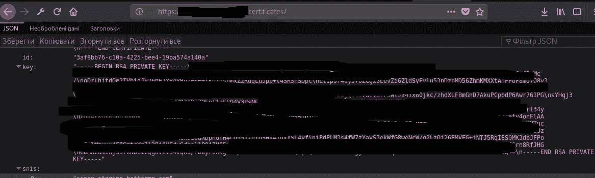

# 证书披露:轻松取胜！

> 原文：<https://infosecwriteups.com/certificates-disclosure-easy-win-ee3f0f4699ce?source=collection_archive---------0----------------------->

大家好。今天，我想和你分享一个非常有趣的故事。

八月中旬，我被邀请参加一个黑客私人项目。范围内有什么？某公司的全部资产。

我们走吧！经过侦查，我只发现了一个领域:privatsite.com。好了，一个域名和 64 个漏洞已经修复。不好…

当我寻找 HTTP 端口时，我更喜欢对 Nmap 使用 HTTP-TITLE NSE。HTTP-TITLE 说在 bugs.privatsite.com 被重定向到 bugs.privatst.com。太好了，两个域名比一个好。经过侦察过程(子域发现+扫描开放端口)，我发现了 kong.privatst.com。

第二步:内容发现。我在[https://kong.privatst.com/FUZZ](https://kong.privatst.com/FUZZ)运行 Wfuzz

什么都没有…好吧，让我们找找 https://kong.privatst.com/FUZZ/的

Wfuzz 说 kong.privatst.com 有两个端点:https://kong.privatst.com/endpoints/和 https://kong.privatst.com/certificates/的[。让我们看看…](https://kong.privatst.com/FUZZ/)

当我打开 https://kong .privatst.com 时，我看到下一条:

WTF？SSL 证书的私钥？是的。我将它提交给公司，他们说 privat 密钥是有效的。

但是为什么没有人没发现呢？我去 https://bugs.privatsite.com 找到了答案。当你在浏览器中进入[https://bugs.privatsite.com/](https://bugs.privatsite.com/)时，你会被重定向到谷歌 OAuth 页面，但是如果你在 Burp 中查找，你会看到[https://bugs.privatsite.com/](https://bugs.privatsite.com/)将我们重定向到[https://bugs.privatst.com/](https://bugs.privatsite.com/)然后重定向到谷歌 OAuth 页面，大多数 bug 猎人都忽略了这一点。所以，黑客们，多注意！