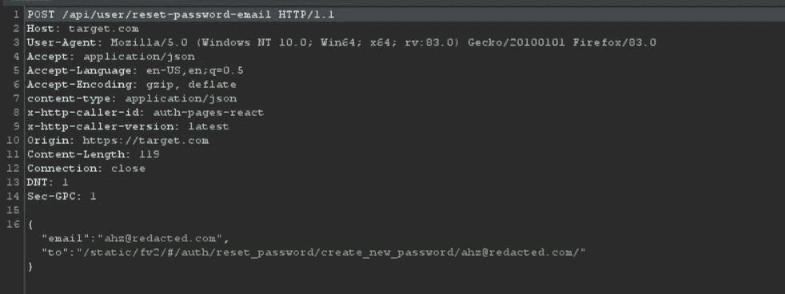
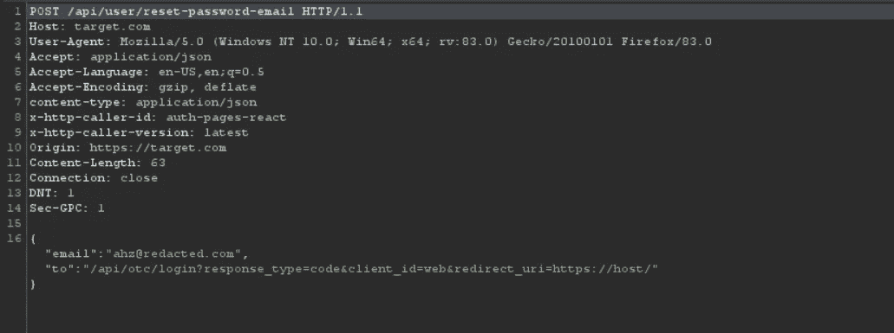
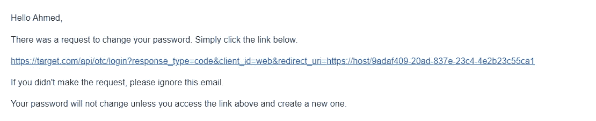
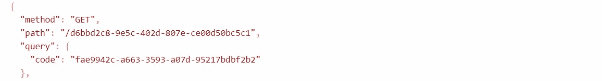

# 链接漏洞导致帐户被接管

> 原文：<https://infosecwriteups.com/chaining-vulnerabilities-lead-to-account-takeover-b583f0c10591?source=collection_archive---------1----------------------->

在这篇文章中，我将解释我是如何将导致一次点击账户接管的五个漏洞串联起来的。


> 我在一个私人程序中发现了这些漏洞，我将它命名为:***【target.com】***，在我们继续解释之前，我们应该考虑这些漏洞是由于通过 API 和其他内部函数错误地应用重置密码方法而发生的。

W 当我在这个目标中进行侦察时，我意识到这个应用程序使用不同的 API 来管理功能和方法，所以我选择测试登录和重置密码方法等主要方法，我无法识别登录方法中的奇怪实现，所以我直接尝试通过重置密码方法重置我的帐户密码。

重置我的帐户密码后，我意识到在 reset-password 方法请求中有一个奇怪的“to”JSON 参数。



重置密码请求

在检查我的重置密码电子邮件后，我能够验证这个参数是否反映在重置密码链接中。


重置密码电子邮件

我进一步请求确保该参数在重置密码链接中得到反映，我是对的。


重置密码电子邮件

我考虑将此升级为 open-redirect，这将导致重置密码秘密代码的泄漏，因此我尝试通过 Host header、Referer header、Origin header 注入 Host header，并在“to”JSON 参数值中注入 Host，我无法注入我自己的主机，这意味着我应该在同一目标主机中找到内部 open-redirect，这将导致重置密码秘密代码的泄漏。

在测试了一些不同的方法和功能之后，我能够在这些端点中识别出两个内部开放重定向:

```
https://target.com/api/otc/login?response_type=code&client_id=web&redirect_uri=https://host/https://target.com/api/oidc/preauthorized?response_type=code&client_id=web&redirect_uri=https://host/
```

这些开放重定向泄露了另一个秘密代码，这本身就是一个漏洞，但我选择将其升级为一个链接点击账户接管。

在通过“to”JSON 参数值将一个 open-redirection 注入 reset-password 链接之后。



重置密码请求

我可以通过点击重置密码邮件中的一个重置密码链接，将重置密码密码和其他密码重定向到我自己的主机。



重置密码电子邮件

而我们在这里，路径中的代码是 reset-password 秘密代码，查询中的代码是其他秘密代码，都泄露到了我的主机中。



我的主办活动

但是等等，当我测试重置密码的方法时，我发现了另外两个漏洞，这些漏洞很明显，我可以强迫用户点击中毒链接，从而导致用户完全接管帐户。

第一个漏洞是重置密码方法中缺乏速率限制，我能够发送 2000 多个请求，这将 DDOS 用户电子邮件，并迫使他们点击中毒的重置密码链接，从而导致重置密码秘密代码的泄露。

另一个漏洞是无法使重置密码秘密代码无效，因此我可以随心所欲地使用重置密码秘密代码，并且该秘密代码不会无效，即使用户请求另一个重置密码秘密代码并重置了他们的密码，泄露给我的主机的重置密码秘密代码也将有效并可用。

# 摘要

> 我能够链接五个漏洞:两个内部打开重定向，重置密码链接中的资源注入，重置密码方法中缺乏速率限制，以及无法使重置密码密码无效，我能够将它们升级为一个链接单击帐户接管。

# 时间表

报告(11 月 23 日)。第一次回应(11 月 24 日)。

别忘了在 [Twitter](https://twitter.com/ahzsec) 上关注我，这样你就不会错过我的新评论和文章。感谢您阅读我的文章，不胜感激。