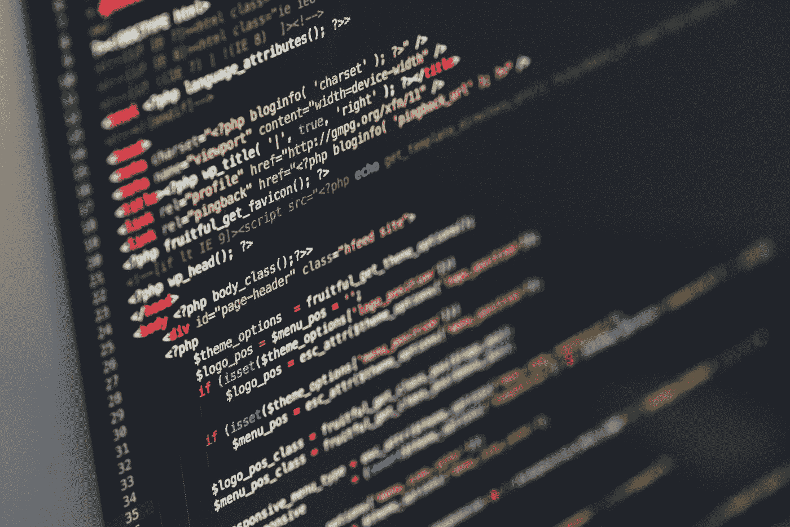

# 查看 IWCON 2022 的完整扬声器阵容

> 原文：<https://infosecwriteups.com/check-out-the-full-speaker-line-up-of-iwcon-2022-6989ab7976f5?source=collection_archive---------0----------------------->

## 预订 2022 年最酷、最有价值的网络安全活动的座位！

伊利亚·巴甫洛夫在 [Unsplash](https://unsplash.com?utm_source=medium&utm_medium=referral) 上的照片

你好！

我们 Infosec Writeups 非常高兴分享[**IWCON 2022**](https://iwcon.live/)——Infosec Writeups 的虚拟国际网络安全会议和网络活动的超值演讲者阵容。

包括 16 场精彩的超值讲座，比如-

1.  [**Majd Aldeen ATI yat**](https://twitter.com/Th3G3nt3lman)**(**Bug 赏金猎人兼全职安全顾问)在 Bug 赏金&的旅途中的独特发现。
2.  [**Gabrielle Hempel**](https://twitter.com/gabsmashh)**(**安全工程师@ Netwitness)关于云环境下的威胁追踪。
3.  [**Florian hanse Mann**](https://twitter.com/CyberWarship)**(**hanse secure 创始人)讲述 4 小时内黑掉公司的最常见方法。
4.  [**Phillip Wylie**](https://twitter.com/PhillipWylie)**(cycogno 的常驻黑客)通过外部攻击面管理实现 API 安全。**
5.  [**布雷克·麦克德莫特**](https://twitter.com/bmcder02) **(** DFIR 在微软镖)论 IIS 模块的好、坏、丑。
6.  [**Dhiyaneshwaran DK**](https://twitter.com/DhiyaneshDK)**(**project discovery 的 AppSec 研究员)关于黑客云:为了乐趣和利益。
7.  [**Inti De Ceukelaire**](https://twitter.com/securinti)**(Intigriti 的黑客之首)关于阅读 RFC 的黑客。**
8.  **[**阿赫桑汗**](https://twitter.com/hunter0x7) (管理员 Pwner)介绍他访问管理面板的方法。**
9.  **[**Orwa at yat**](https://twitter.com/GodfatherOrwa)(bug crowd 上的 10 大 p 1 战士)关于侦查&技能，提示。**
10.  **[**卢克·斯蒂芬斯**](https://twitter.com/hakluke)(hak sec 的创始人)讲述他如何利用侦查技术来识别一个多产的骗子。**

**每场会议之后都将有现场问答和网络会议。您可以向我们尊敬的演讲者提问，并在网络活动期间与一些超级酷的安全人员取得联系，从而建立强大的联系，并为未来的合作和伙伴关系奠定基础。**

**[***查看我们的会议日程并预订您今天的座位***](https://iwcon.live/)**

**(2022 年 12 月 17 日至 18 日**现场直播，IST 时间下午 6:30**起)**

# **有什么问题吗？我们是来解决这些问题的。**

**如果您有任何问题、疑虑或阻碍您参加 IWCON 2022 的障碍，我们很乐意回答。**

**请回复此邮件(或在下方留下评论)，我们将尽快回复您。**

**期待在 IWCON 2022 上与您见面。**

**[***今天就预定座位*** 。](https://razorpay.com/payment-button/pl_K8cxPtmUyBH2PC/view)**

**最佳，
编辑团队
Infosec 报道。**