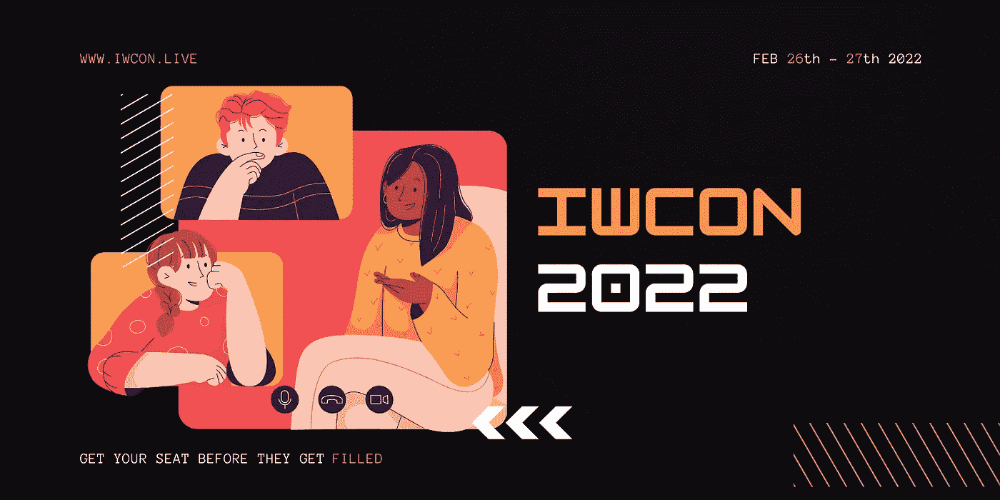

# 查看 IWCON 2022 的完整扬声器阵容

> 原文：<https://infosecwriteups.com/check-out-the-full-speaker-line-up-of-iwcon-2022-6f62aa747420?source=collection_archive---------3----------------------->

## 预订 2022 年最酷、最有价值的网络安全活动的座位！

你好！

我们 Infosec Writeups 非常高兴分享 [**IWCON 2022**](https://iwcon.live/) 的超值演讲阵容——Infosec Writeups 的虚拟国际网络安全会议和网络活动。

包括 16 场精彩的超值讲座，比如-

1.  [**Tanya Janca**](https://www.linkedin.com/in/ACoAABTPRCoBV4cgidsSUBuDfBiIsOvb8G5t7V0)**(**安全培训师，创始人@ We Hack Purple)打造安全冠军
2.  [**Louis Nyffenegger**](https://www.linkedin.com/in/ACoAAABYFZQBuNHaf2wyM4wT_JXqJlwU4Htmy4U)**(**CEO[PentesterLab](https://medium.com/u/b2ccb3a79cf8?source=post_page-----6f62aa747420--------------------------------))关于如何更好地进行黑客攻击
3.  [**Sean zseano**](https://www.linkedin.com/in/ACoAABG7TYABJ3BuPpwQKVSzQ7tHyHNZtV5gf-c)**(**bugbounthunter 的创造者)关于在 NFT 网站上寻找 bug 取乐&获利
4.  **Duncan Townsend(**immune fi 首席技术官和联合创始人，领先的 Web3 漏洞赏金平台)关于 web 3/智能合约黑客的概述
5.  [**Harsh Bothra**](https://www.linkedin.com/in/ACoAAA8TrykB-dfA4nKXqh2FCCW8i4gUGBAYvFs)**(**钴芯团队领导& Pentester)通过 [#Learn365](https://www.linkedin.com/feed/hashtag/?keywords=learn365&highlightedUpdateUrns=urn%3Ali%3Aactivity%3A6897578058585624576) 挑战进行为期一年的持续学习旅程
6.  [**凡达娜·维尔马**](https://www.linkedin.com/in/ACoAAAMen3oB8vlsb5jtibyVFGMg8owj_7YT220) **(** 董事长，OWASP)关于新的漏洞以及如何解决它们
7.  [**Jun koka tsu**](https://www.linkedin.com/in/ACoAABOc5SIBUf2FOlx2xamJCwfz7NVFWAGpl4M)**(**微软安全软件工程师)关于 Bug Hunter 到微软安全工程师
8.  [**侯赛因·达赫尔**](https://www.linkedin.com/in/ACoAABgkOE0B69Hdvr2ljitPl1XwXFs2majlfvg) (激情黑客破解密码 10 余年)7 年 Bug 赏金后的心态
9.  [**Aseem Shrey**](https://www.linkedin.com/in/ACoAAAVZirsB3RGBleW7MLdfr8aClaJ_Lkr40iI)(Gojek 高级信息安全工程师)关于从 Android 静态分析入手
10.  Jessica Haworth (《每日电讯报》的网络安全记者)在《超越 Twitterverse:如何通过与媒体合作来增加你的研究的可见性
11.  [**Roshan Piyush**](https://www.linkedin.com/in/ACoAAAiuDIUBlj2X6uEMco2bbZzSDSMtz-u4WQo)**(**Traceable AI 的安全研究工程师，拥有 8 年以上的研究经验)讲解剖析技术，向您易受攻击的服务射出 API 之箭
12.  ****(**咨询信息安全官。之前参与了 DomainTools、NXLog 和 Vindler GmbH。)远程自由职业者和信息安全**
13.  **[**迈赫迪**](https://www.linkedin.com/in/ACoAAC1qjhMBKwO_z-ZUFK31l03W0YmgK-fGSvw) **(** Bug 赏金猎人。品牌大使 [HackerOne](https://medium.com/u/6f816e37be2c?source=post_page-----6f62aa747420--------------------------------) )踏上 Bug Bounty 入门之旅**
14.  **[**Anugrah SR**](https://www.linkedin.com/in/ACoAAB11A_0BUqpZggil7q34EXhgBCaOEfBpzN8)**(网络安全顾问@ The SecOps Group) 我的信息安全之旅:生物学家到安全顾问****
15.  ******Dhiyaneshwaran B. (** 安全自动化，(重新)定义—通过使用 nucleus 的智能自动化实现安全)关于安全自动化，(重新)定义—通过使用 nucleus 的智能自动化实现安全****
16.  ******Nithin R (** 网络安全研究员。同时入侵机器和生命。)关于你的第一份网络安全实习:该做什么和不该做什么。****

****每场会议之后都将有现场问答和网络会议。您可以向我们尊敬的演讲者提问，并在网络活动期间与一些超级酷的安全人员取得联系，从而建立强大的联系，并为未来的合作和伙伴关系奠定基础。****

****[***查看我们的会议日程并预订您今天的座位***](https://iwcon.live/)****

****(直播时间为 2 月 26 日至 27 日**，IST 时间**晚 7 点)****

# ****有什么问题吗？我们是来解决这些问题的。****

****如果您有任何问题、疑虑或阻碍您参加 IWCON 2022 的障碍，我们很乐意回答。****

****请回复此邮件(或在下方留下评论)，我们将尽快回复您。****

****如果你有一个关于你如何在 Infosec 中崭露头角的故事，并且你想在 IWCON 2022 上发言，请在此填写我们的发言人表格[。如果 Infosec 的报道能成为你个人品牌之旅的垫脚石，我们会很高兴。](https://docs.google.com/forms/d/e/1FAIpQLScotnPH8VWYGUW9UPFyA0CNIYh0asVrkeSeNXka736psVT9tg/viewform?usp=sf_link)****

****期待在 IWCON 2022 上与您见面。****

****[***今天预定座位***](https://razorpay.com/payment-button/pl_IkurresccCErYp/view) 。****

****最佳，
编辑团队
Infosec 报道。****