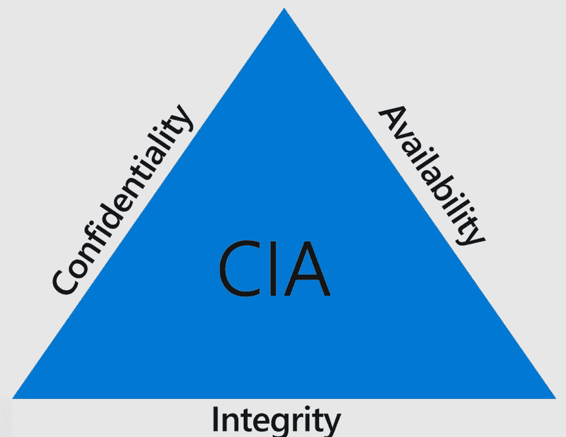
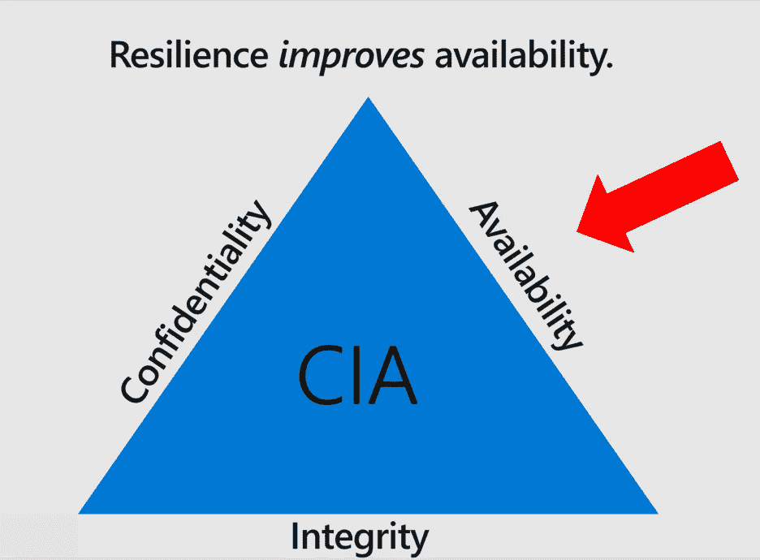
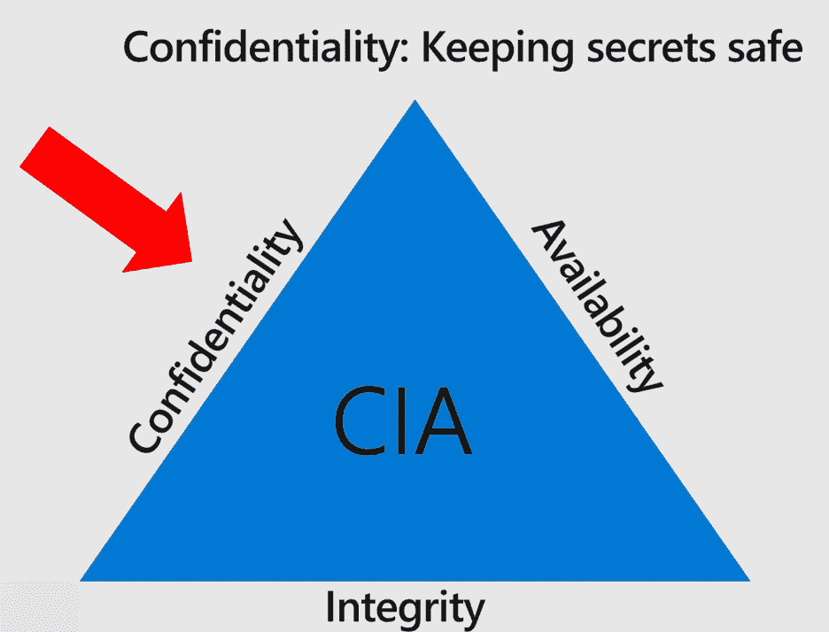
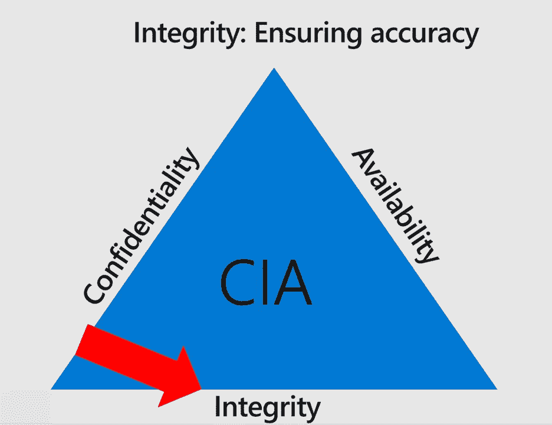

# 中情局:保密性，完整性和可用性

> 原文：<https://infosecwriteups.com/cia-confidentiality-integrity-and-availability-d2f567a0f123?source=collection_archive---------1----------------------->

**本文面向安全初学者或其他 IT 人士，而非专家。:-D

每个 IT 安全团队的任务和目的都是保护他们为之工作的公司、政府或组织的系统和数据的机密性、完整性和可用性。这就是为什么安全团队会让你在工作机器上拥有管理员权限，不让你将未知设备接入网络，以及所有其他感觉不方便的事情；他们想确保这三件事。我们简称它为“中情局三人组”。

中情局三合会是 IT 安全团队存在的原因。

让我们用我们的朋友爱丽丝和鲍勃的例子来检验这一点。爱丽丝患有 1 型糖尿病，每天几次使用植入她手臂的微型设备检查她的胰岛素，而鲍勃有一个“智能”起搏器，可以调节他的心脏，他通过手机上的移动应用程序访问。

**可用性**

如果 Alice 的胰岛素测量设备因故障、篡改或电池耗尽而不可用，她可能会感到不便。由于 Alice 通常一天检查几次她的胰岛素水平，但是如果她需要的话，她能够对她的胰岛素进行手动测试，所以这项服务对她来说有点重要。

另一方面，鲍勃时不时地心跳不规则，而且永远不知道他的心律不齐什么时候会发作。如果 Bob 的心脏起搏器在他的心脏表现不稳定时不可用，如果经过足够长的时间，这可能是生死攸关的情况。非常重要的是，他的起搏器是可用的，并且在紧急情况发生时能够实时做出反应。鲍勃作为一名职员为联邦政府工作，管理秘密和绝密文件，已经工作了许多年。他是一位自豪的祖父，自从安装了心脏起搏器后，他一直努力过着健康的生活。

许多客户转向“云”的唯一原因是，与更传统的内部数据中心服务级别相比，它极其可靠。

**保密**

Alice 是一家大型财富 500 强公司的首席执行官，尽管她并不以自己是 1 型糖尿病患者为耻，但她不希望这些信息公开。她经常接受媒体采访，并发表公开演讲，成为许多商界女性的榜样。爱丽丝努力保持她的私人生活，这包括她的健康状况。她认为，她所在机构中的一些人在觊觎她的职位，他们会不择手段地试图将她描绘成一个“软弱”的人，以削弱她的权威。如果她的设备意外泄露了她的信息，出现在公共网络上，或者她的帐户信息成为漏洞的一部分，这对她来说将是非常尴尬的，并有可能损害她的职业生涯。保持私生活的私密性对爱丽丝来说非常重要。

在我们的个人生活中，保密性常常被低估。许多人告诉我，他们“没什么好隐瞒的”。然后我问“你家窗户上有窗帘吗？为什么？我还以为你没什么好隐瞒的呢？”—我很擅长参加派对。

另一方面，鲍勃对自己的心脏状况非常开放，并乐于告诉任何人他有心脏起搏器。他在联邦政府有一个很好的保险计划，他非常感激当他退休时，他可以继续他的计划，尽管他之前就有疾病。在这方面，保密不是 Bob 的优先考虑事项。

**完整性**

数据的完整性意味着数据是正确和准确的。计算机系统的完整性意味着它给你的结果是精确和真实的。对鲍勃和爱丽丝来说，这可能是中情局最重要的因素:如果他们的任何一个系统给他们不正确的治疗，都可能导致死亡。对于一个人(相对于一个公司或民族国家)来说，没有比生命终结更严重的后果了。他们的卫生系统的完整性对于确保他们保持良好的健康状况至关重要。

完整意味着准确。

下次，当您的 IT 安全团队在您的项目中执行新政策或提出安全要求时，我要求您尝试找出他们可能试图通过自己的行动来保护 CIA 的哪一个。有时它是二和弦或三和弦的组合。更重要的是，我要求你在工作时问问自己，你是否确保这三个安全因素都受到你的行动的保护，因为 IT 安全团队无法独自取得成功。

# **像这样的内容还有更多，可以看看我的书，** [**爱丽丝和鲍勃学习应用安全**](https://aliceandboblearn.com/) **和我的在线培训学院，** [**我们黑紫色**](https://academy.wehackpurple.com/) **！**

## 我有一个邮件列表，请订阅，这是免费的！