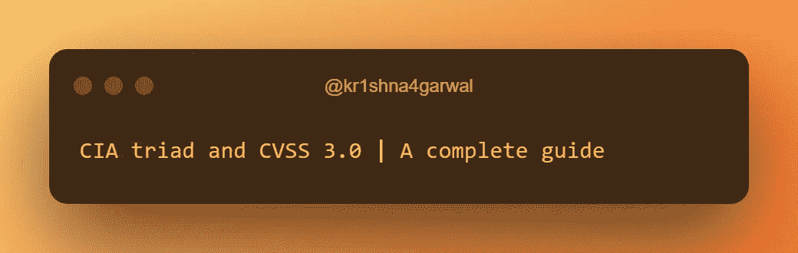
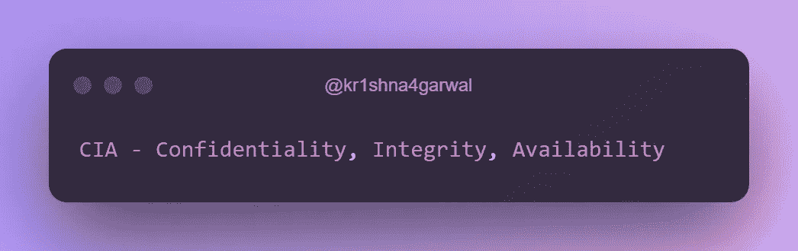
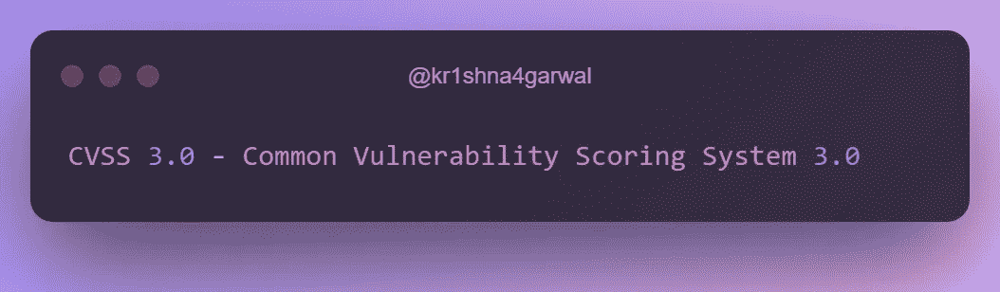
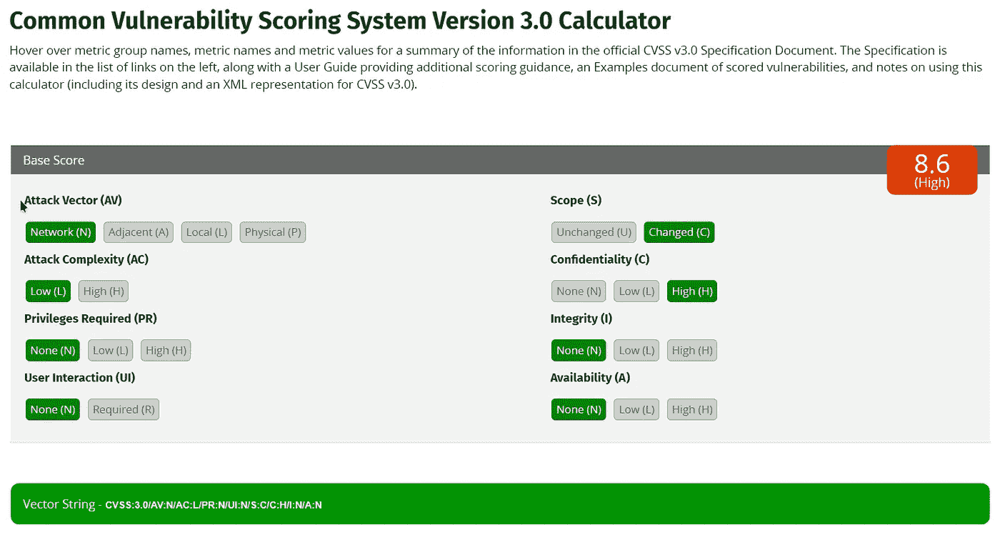
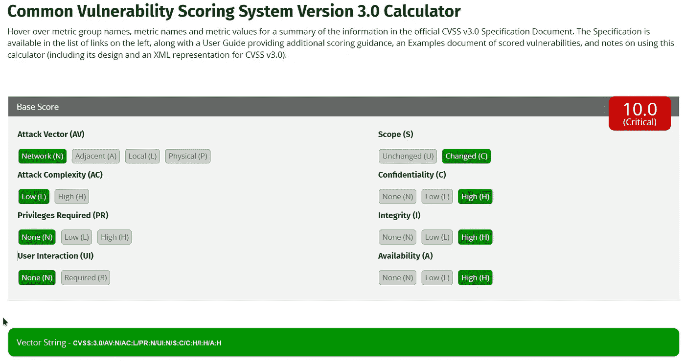

# 中情局三合会和 CVSS 3.0 |完全指南

> 原文：<https://infosecwriteups.com/cia-triad-and-cvss-3-0-a-complete-guide-91d6d63d44b0?source=collection_archive---------1----------------------->

大家好，我是来自印度🇮🇳.的克里希纳·阿加瓦尔一个有抱负的渗透测试者和所谓的安全研究员:)

所以今天我要讨论一下中情局三合会和 CVSS 3.0。

我不知道这篇文章对谁有用，也许对 bug 猎人、开发人员或安全专家有用。

不要担心，如果你对 CVSS 和中情局一无所知，你会在阅读和计算你的漏洞分数后熟悉它。

你怎么能想象一篇没有横幅 xD 的报道

首先让我们从中央情报局的三重奏开始:

## 什么是中情局三合会？

CIA triad 是理解和评估计算机系统安全性的模型。它由三部分组成:**机密性**、**完整性**和**可用性**。

*   **保密性**意味着只有授权方才能访问数据。
*   **完整性**是指数据不能被擅自修改。
*   **可用性**意味着授权方可以在需要时访问数据。

机密性示例:

使用加密来保护数据。例如，当您通过互联网发送敏感信息(如信用卡号)时，通常会使用安全协议(如 HTTPS)进行加密。这种加密确保只有预定的接收者，如网站或在线服务，才能读取数据。即使有人截获了正在传输的数据，他们也无法读取，因为数据是加密的。这有助于确保数据的机密性，并防止未经授权的访问。机密性的另一个例子是使用访问控制来限制谁可以访问某些数据或系统。例如，一家公司可能有一台安全的服务器，只允许某些员工访问。这可以通过使用要求员工输入用户名和密码才能访问服务器的登录系统来实现。这确保了只有授权方才能访问服务器上的数据，从而保护其机密性。

完整性示例:

检验文件完整性的校验和。校验和是从较大的数据块(如文件)中派生出来的一小段数据。它用于检测对原始数据的更改或修改。当文件通过网络传输时，发送方可以计算文件的校验和，并将其包含在传输中。然后，接收方可以为收到的文件计算自己的校验和，并将其与原始校验和进行比较，以验证文件在传输过程中未被修改。如果两个校验和匹配，则表明文件没有被修改，并且保持了其完整性。这有助于确保文件的准确性和完整性，并防止未授权方篡改文件。

可用性示例:

授权用户在需要时访问信息和系统的能力。这是网络安全的一个重要方面，因为它确保用户能够访问他们工作和维护网络安全所需的信息和系统。

## 中央情报局昆虫赏金猎人三人组

在漏洞奖励的上下文中，CIA 三元组可用于确定漏洞的潜在影响。此外，我们可以使用 CVSS 3.0 评分系统，以获得更准确的影响。**如果您的漏洞对 CIA triad 没有影响，那么这可能不是安全漏洞**。一些程序可能会接受这个建议。示例:缺少安全标头，在未经身份验证的端点上单击劫持。

bug 赏金猎人可以更好地评估漏洞的严重性以及它可能有资格获得的潜在奖励。

第一个示例场景:您找到了一个可以下载一些公共文件的端点，但是需要注册或登录才能下载这些公共文件。你只需关闭弹出窗口，下载你的文件。

上述场景对中情局三合会有什么影响？

保密性不受影响，因为我们只是下载供公众使用的文件。

完整性不受影响，因为我们只是下载文件，而不是修改任何东西。

可用性不受影响，因为我们阻止任何用户访问该下载页面。

第二个例子场景:你发现一个[目录横切](https://portswigger.net/web-security/file-path-traversal)。您可以访问系统的内部文件。在这种情况下，保密性受到影响，因为我们能够以未经授权的方式访问内部系统的文件。如果我们将这个目录横向升级到[远程代码执行](https://www.imperva.com/learn/application-security/remote-code-execution)。那么中情局三部曲的所有三个组成部分都会受到影响。因为我们可以访问任何文件，可以删除或修改任何文件。

## 什么是 CVSS 3.0？

CVSS 代表**通用漏洞评分系统**。这是一种评估系统漏洞严重性的标准化方法。CVSS 的目标是提供一种一致、客观的方法来衡量给定漏洞带来的风险，以便组织可以确定解决该漏洞的工作优先级。

CVSS 3.0 根据影响漏洞严重性的诸多因素，为每个漏洞提供了一个介于 0 到 10 之间的数值分数。这些因素包括漏洞的类型、对机密性、完整性和可用性的影响，以及漏洞被利用的难易程度。

它包括的因素有:

*   攻击媒介
*   攻击复杂性
*   所需权限(PR)
*   用户交互(UI)
*   范围
*   保密性影响(C)
*   诚信影响(一)
*   可用性影响(A)

**攻击媒介(AV)** :攻击者利用计算机系统漏洞的方法。

**攻击载体**主要有三种:

(还有一个叫做相邻(A)的，我在这篇文章中没有提到)

> 网络:这种类型的攻击媒介是指可以通过网络(如互联网)利用的漏洞。这可能包括可以远程访问的 web 应用程序或网络协议中的漏洞。
> 
> 本地:这种类型的攻击媒介指的是只能被对系统具有本地访问权限的攻击者利用的漏洞，例如某个物理上在计算机旁的人。这可能包括操作系统或软件中的漏洞，只有对系统有物理访问权限的人才能利用这些漏洞。
> 
> 物理:这种类型的攻击媒介是指可以通过物理手段利用的漏洞，例如篡改硬件或使用专门的设备。这可能包括硬件或固件中的漏洞，可以通过对系统的物理访问来利用这些漏洞。

**攻击复杂性(AC)** :利用计算机系统中的漏洞所涉及的复杂程度。

攻击的复杂性主要有两个层次:

> 低:这种级别的攻击复杂性是指容易被攻击者利用的漏洞。这可能包括只需要很少的知识或技能就可以利用的漏洞，或者可以被常用工具自动利用的漏洞。
> 
> 高:这种级别的攻击复杂性是指需要更高级别的知识或技能来利用的漏洞。这可能包括需要专门知识或工具来利用的漏洞，或者需要攻击者对系统具有高级访问权限的漏洞。

**所需特权(PR)** :攻击者利用计算机系统中的漏洞所需的访问级别。

需要两种主要级别的权限:

> 低:这种级别的必需权限指的是攻击者以最低限度的系统访问权限就可以利用的漏洞。这可能包括可被低访问级别用户(如访客用户)利用的漏洞，或者根本不需要任何身份验证的漏洞。
> 
> 高:这种级别的所需权限是指只有对系统具有高级别访问权限的攻击者才能利用的漏洞。这可能包括只能被管理员或其他高级用户利用的漏洞，或者需要攻击者拥有有效身份验证令牌或其他访问证明的漏洞。

**用户交互(UI)** :计算机系统中的漏洞是否需要用户交互才能被利用

用户交互有两个主要级别:

> 必需:这种级别的用户交互是指需要用户交互才能被利用的漏洞。这可能包括需要用户单击链接或打开文件才能触发攻击的漏洞。
> 
> 不需要:这种级别的用户交互是指不需要用户交互就可以被利用的漏洞。这可能包括无需用户采取任何行动就能被自动利用的漏洞。

**范围:**是指计算机系统中的漏洞是否会影响系统的机密性、完整性或可用性。

范围有两个主要级别:

> 已更改:这一级别的范围是指影响系统的机密性、完整性或可用性的漏洞。这可能包括允许攻击者访问敏感信息、修改或删除数据或破坏系统可用性的漏洞。
> 
> 未改变:这个级别的范围是指不影响系统的机密性、完整性或可用性的漏洞。这可能包括影响有限的漏洞，如外观问题或给用户带来的微小不便。

**机密性(C)** :计算机系统中的漏洞对系统机密性的影响程度。接下来的因素和中情局的三联一样。

**保密**有三个主要级别:

> 无:这种级别的机密性影响是指不允许攻击者访问任何敏感信息的漏洞。这可能包括根本不影响系统保密性的漏洞，或者只允许攻击者访问公开信息的漏洞。
> 
> 低:这种级别的机密性影响是指允许攻击者访问一些敏感信息的漏洞。这可能包括允许攻击者访问他们通常无法访问但不一定敏感或机密的信息的漏洞。
> 
> 高:这种级别的机密性影响是指允许攻击者访问所有敏感信息的漏洞。这可能包括允许攻击者访问系统上所有信息的漏洞，或者允许攻击者冒充其他用户并访问他们的信息的漏洞。

**完整性(I)** :是计算机系统中的漏洞对系统完整性的影响程度。

**诚信**主要有三个层次:

> 无:这种级别的完整性影响是指不允许攻击者读取、写入或修改系统中的信息的漏洞。这可能包括对系统完整性没有影响的漏洞。
> 
> 低:这种级别的完整性影响是指不允许攻击者修改或删除信息，但允许攻击者读取或写入数据的漏洞。这可能包括允许攻击者读取敏感信息或以受限方式创建或修改数据的漏洞。
> 
> 高:这种级别的完整性影响是指允许攻击者修改或删除系统中的信息的漏洞。这可能包括允许攻击者更改数据、损坏文件或删除记录的漏洞。

**可用性(A)** :计算机系统中的漏洞对系统可用性的影响程度。

可用性**有三个主要级别**:

> 无:这种级别的可用性影响是指不影响系统可用性的漏洞。
> 
> 低:这种级别的可用性影响是指在有限程度上影响系统可用性的漏洞。这可能包括导致系统变慢或无响应的漏洞，或者导致系统可用性间歇性中断的漏洞。
> 
> 高:这种级别的可用性影响是指完全破坏系统可用性的漏洞。这可能包括导致系统崩溃或对用户完全不可用的漏洞。

所以你通读了 CVSS 3.0 的所有因素和层次

现在，问题是

## 我们如何使用 CVSS 3.0 计算影响？

为了计算 CVSS 分数，你可以使用任何 CVSS 3.0 计算器。

我用[https://www.first.org/cvss/calculator/3.0](https://www.first.org/cvss/calculator/3.0)

现在，根据您的场景检查所有字段。

下面是目录横向的 CVSS 3.0 的例子。我无法远程执行代码。但是我可以读取系统上所有的非根文件。

高(8.6)

如您所见，影响是**高**，**的基础分数是 8.6。**

下面是 CVE-2021–44228(Log4J)的 CVSS 3.0 分数的另一个例子。按照 nvd.nist.gov 上[的规定。](https://nvd.nist.gov/vuln/detail/CVE-2021-44228)

关键(10.0)

向量字符串的格式为 CVSS:3.0/AV:N/AC:L/PR:N/UI:R/S:U/C:L/I:L/A:L

在该向量字符串中，我们可以看到攻击向量(AV)为 N(网络)，攻击复杂性(AC)为 L(低)，所需权限(PR)为 N(无)，需要用户交互(UI)(R)，范围(S)不变(U)，CIA 为低(L)。

报道到此为止。

我希望你能够理解 CVSS 3.0 和中央情报局三重奏。

如果有任何困惑，请参考下面给出的资源或发表评论。

**有用资源:**

*   https://www.first.org/cvss/calculator/3.0[CVSS 3.0 计算器](https://www.first.org/cvss/calculator/3.0#)
*   https://www.first.org/cvss/v3.0/user-guide CVSS 3.0 用户指南:
*   关于 https://www.youtube.com/watch?v=ui4l0lBBSlw CVSS 3.0 的视频:
*   关于中情局三合会的视频:[https://www.youtube.com/watch?v=gx0vlRpdFnc](https://www.youtube.com/watch?v=gx0vlRpdFnc)
*   CIA triad:[https://www . techtarget . com/what is/definition/confidential-integrity-and-avail ability-CIA](https://www.techtarget.com/whatis/definition/Confidentiality-integrity-and-availability-CIA)

如果我在这篇文章中遗漏了什么，请给我发邮件或发表评论。

> ***为任何语法错误道歉🙏。***

DM 始终欢迎问题、帮助、协作和建议:)

做我的朋友:

*   网址—https://kr 1 shna 4 garwal . github . io
*   insta gram—[https://www.instagram.com/krishnaAgarwal_in](https://www.instagram.com/krishnaagarwal_in)
*   领英—[https://www.linkedin.com/in/kr1shna4garwal](https://www.linkedin.com/in/kr1shna4garwal/)
*   GitHub:[https://github.com/kr1shna4garwal](https://github.com/kr1shna4garwal/)
*   推特—[https://twitter.com/kr1shna4garwal](https://twitter.com/kr1shna4garwal)

感谢你浪费宝贵的时间阅读我的文章。我希望你能从这篇文章中获得一些有用的知识:)

如果你发现这很有价值，并且已经浪费了 10 分钟来阅读这篇文章，并且学到了一些新的东西，那么请鼓掌👏发表评论，点击“关注”按钮，以便将来发表评论，并与您的 infosec 朋友和社区分享。

继续黑，继续学！

*结束通话！*

## 来自 Infosec 的报道:Infosec 每天都有很多内容，很难跟上。[加入我们的每周时事通讯](https://weekly.infosecwriteups.com/)以 5 篇文章、4 个线程、3 个视频、2 个 GitHub Repos 和工具以及 1 个工作提醒的形式免费获取所有最新的 Infosec 趋势！