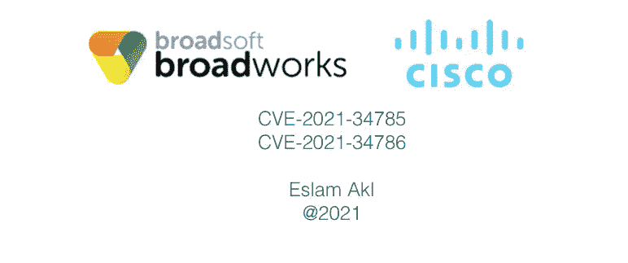
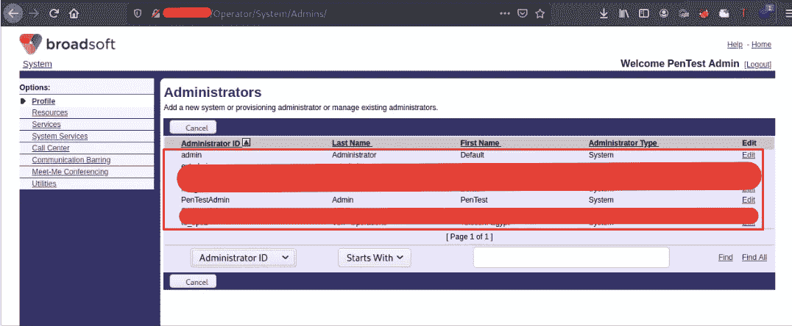
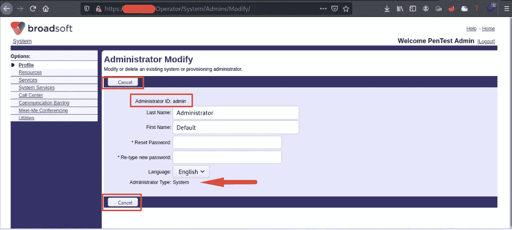
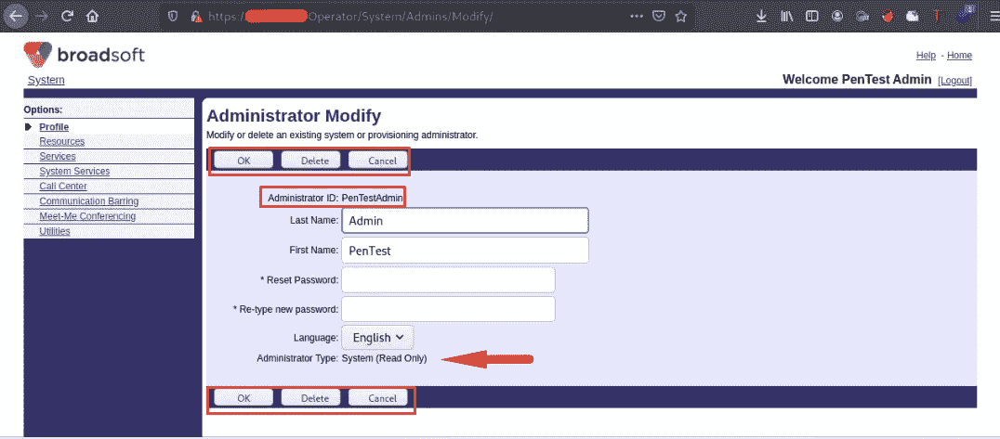
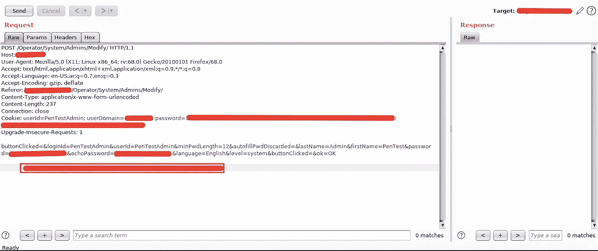
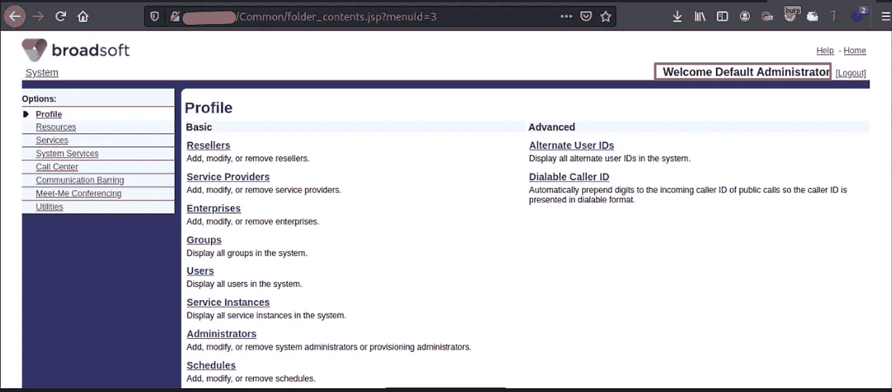
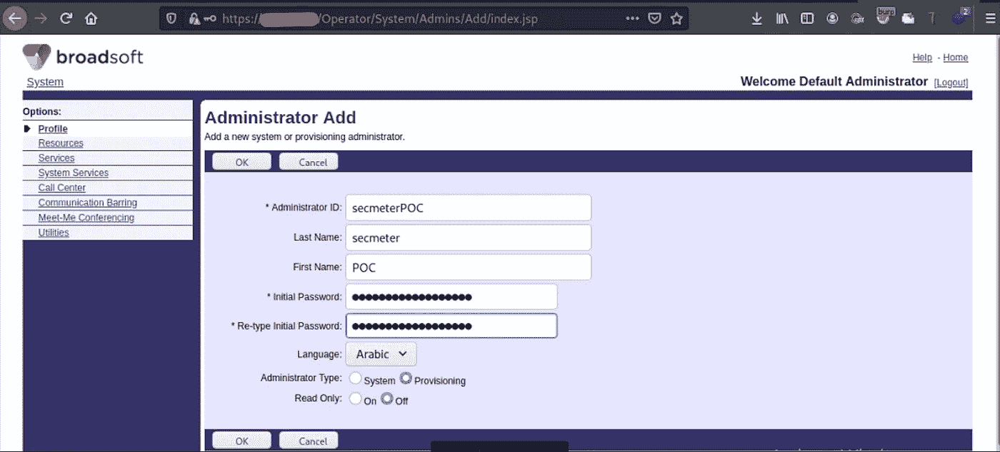
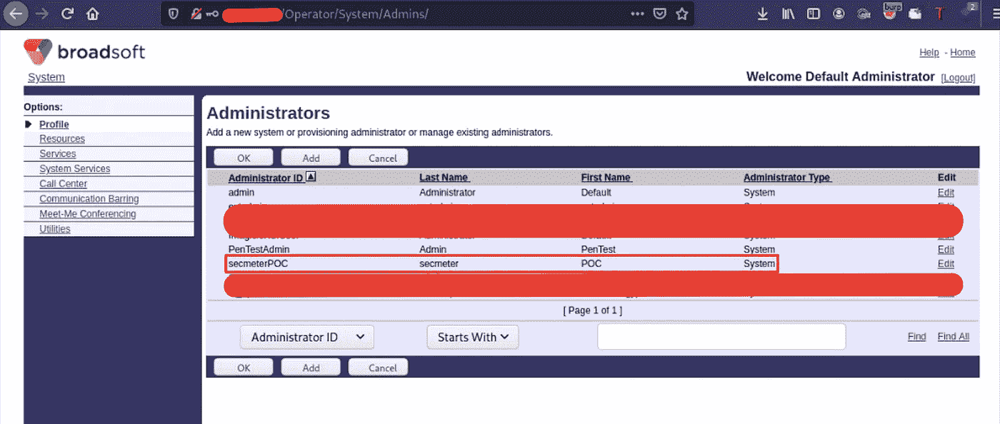
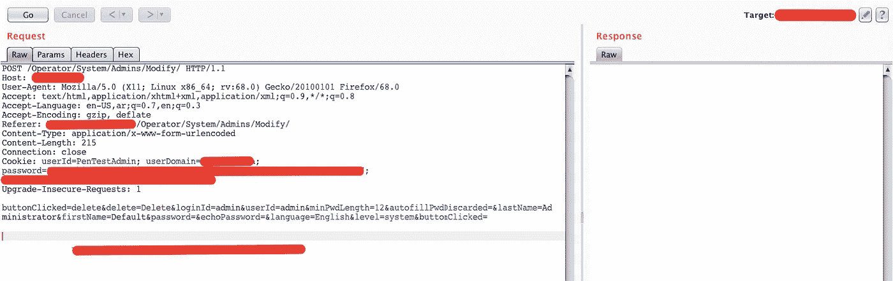
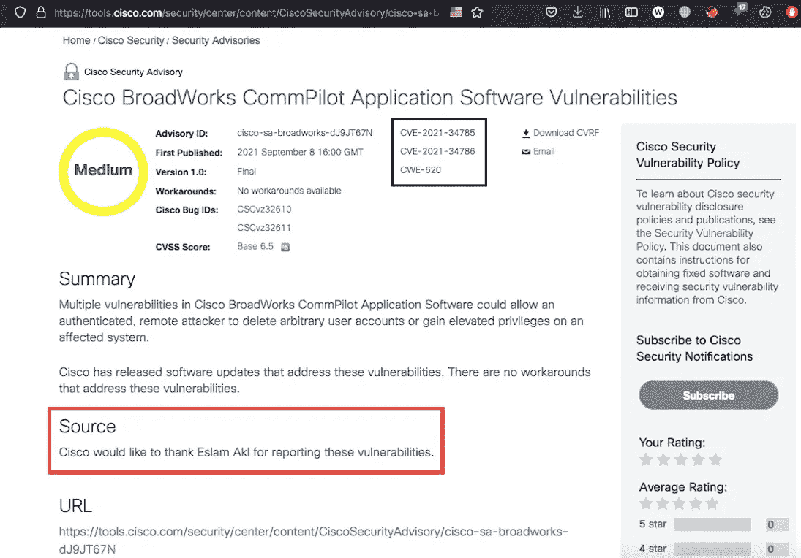

# 思科 BroadWorks 漏洞 CVE-2021–34785 和 CVE-2021–34786

> 原文：<https://infosecwriteups.com/cisco-broadworks-vulnerabilities-cve-2021-34785-cve-2021-34786-91ee2be5a200?source=collection_archive---------2----------------------->

H 我！今天我将谈谈我在思科产品 **BroadSoft BroadWorks** 的最新发现，这是思科产品之一。我发现了两个简历，分配为

1.  **CVE-2021–34785**:IDOR 导致权限升级“管理帐户接管”
2.  **CVE-2021-34786** : IDOR 导致删除任意管理员用户账户

我不会谈论完整的故事或类似的东西，因为我讨厌这些无用的话😅所以让我们直接从利用和条件开始。

## 内容

1.  宽幅结构
2.  CVE-2021–34785
3.  CVE-2021–34786
4.  弱点

## 1.宽幅结构

在 BroadWorks，我们有一个管理员组，其中的管理员拥有写和读权限，其他管理员拥有只读权限。

1.  读写:他可以修改自己和其他管理员的数据。此外，他还可以添加用户、更改系统首选项、删除用户以及完全控制系统
2.  只读:他可以修改他的数据和删除他的帐户。“在我的情况下”他没有任何其他特权

我获得了第二个角色(只读)，我的任务是尝试提升我的权限，使其具有读写操作。

## 2.CVE-2021–34785

如果您尝试查看系统用户，我们有两个用户:`Admin`和`PentestAdmin`。我的用户是`PentestAdmin`，权限很低，只能读取他的数据。用户管理员拥有系统的完全控制权

我试图列举管理帐户，以了解什么是允许的功能，但不幸的是！在管理员配置文件中没有允许使用的功能，我只能查看数据，但无论如何，我知道`firstname`、`lastname`和`adminID`

之后，我试图列举我的帐户，发现我有 2 个允许的功能删除帐户和更改密码，而没有问你的旧密码，奇怪吧？！

我输入了一个新的密码，并拦截了请求，以了解请求参数是什么。我发现我们有`firstname, lastname`和`loginid`必需的参数，因为我试图删除`loginid`，但不幸的是！请求失败

这根本不是问题，因为我有权限读取所有用户的数据，所以我从管理员配置文件中知道这些数据。

最后一步是用管理数据替换您的数据并发送请求。它返回 200 OK，为了检查，我试着用新密码登录，然后 Bingoooo！你接管了管理员帐户，改变他的密码❤

成功后我和我的朋友❤

为了进行 POC，我创建了一个具有读写权限的新用户`SecmeterPOC`。

查看管理板后

## 3.CVE-2021–34786

用同样的方法，我试图删除我的帐户并拦截请求。

我们有相同的所需参数`firstname/lastname/loginid`和相同的利用，只需用管理员帐户数据替换它们并发送请求。

结果如何？管理员帐户已被删除😈

## 4.弱点

1.  在更改密码功能中，它必须要求我输入旧密码，如果我忘记了，它应该要求我联系系统管理员。
2.  用户会话中没有附加 CSRF 令牌来保护系统免受使用 CSRF 的相同攻击[我已经尝试并成功了]
3.  在删除帐户时，它必须要求用户输入密码或任何安全问题

## 保持联系

[LinkedIn](https://www.linkedin.com/in/eslam-akl-6b998614a/)|[GitHub](https://github.com/eslam3kl)|[Twitter](https://twitter.com/eslam3kll)