# 经典密码试用版

> 原文：<https://infosecwriteups.com/classic-passwd-tryhackme-writeup-344926745f21?source=collection_archive---------2----------------------->

**作者 Shamsher khan 这是 Tryhackme room“经典密码”的一篇文章**


https://tryhackme.com/room/classicpasswd

**房间链接:**[https://tryhackme.com/room/classicpasswd](https://tryhackme.com/room/classicpasswd)
**注:此房免费**

# 方法 1 (ltrace)

我们来做动态分析。动态分析必须在沙盒环境中进行。Linux 中预装了一些工具，可以用来显示更详细的信息。

首先，下载可执行文件。使用以下命令检查文件信息

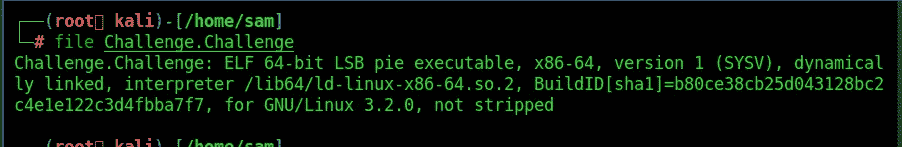

我们可以看到该文件是一个 ELF 64 位 LSB pie 可执行文件。让我们在提供所需的权限后执行该文件。

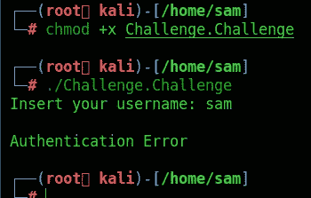

执行之后，我们可以发现二进制文件要求输入“用户名”。尝试使用随机用户名执行，其结果是身份验证错误，这意味着我们需要提供正确的用户名才能获得标志。

现在让我们使用 **ltrace，**进行动态分析。 **ltrace** 是一个简单运行指定的**命令**直到退出的程序。它拦截并记录被执行的进程调用的动态库调用和被该进程接收的信号。它还可以拦截和打印程序执行的系统调用。

我们可以用下面的命令执行二进制文件。

不出所料，二进制文件再次要求输入“用户名”。提供一个随机用户名。

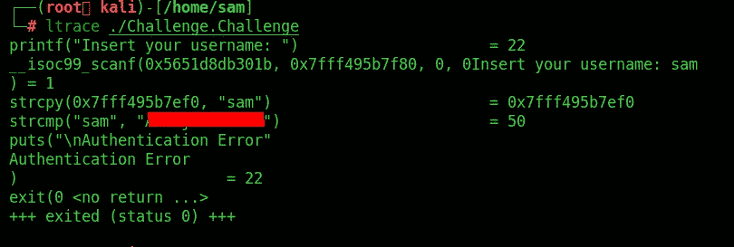

ltrace 记录程序调用和接收的库函数。它用正确的“用户名”调用了“strcmp”函数。现在让我们使用这个“用户名”来打印旗帜。

当提示输入用户名时，提供我们使用 ltrace 获得的用户名。

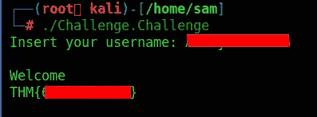

我们有我们的旗帜。

# 方法 2 (Ghidra)

让我们用 Ghidra 来分析二进制文件并找到标志。

使用 ghidra 反编译主函数

运行 Ghidra 并创建新项目

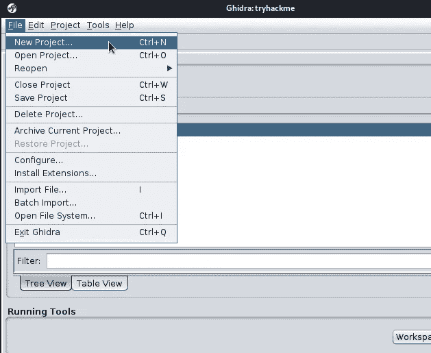

选择非共享项目

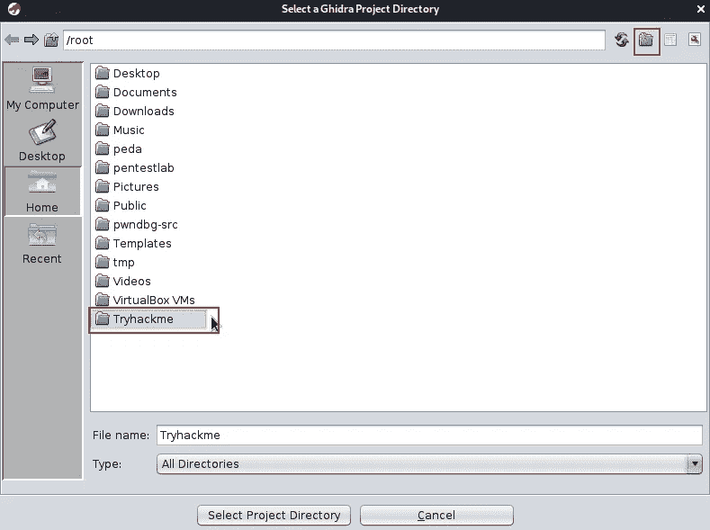

创建文件夹并定义项目名称

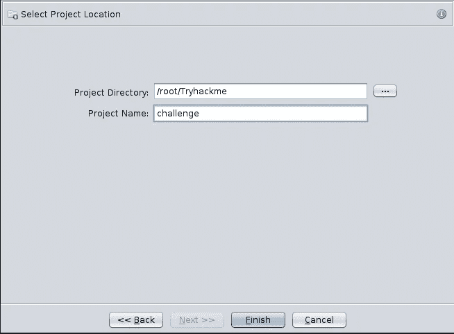

点击绿龙

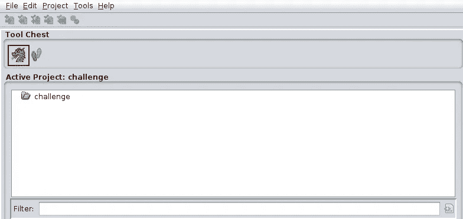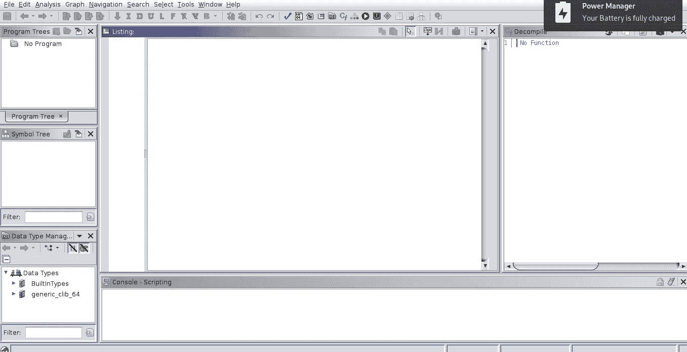

导入您的文件

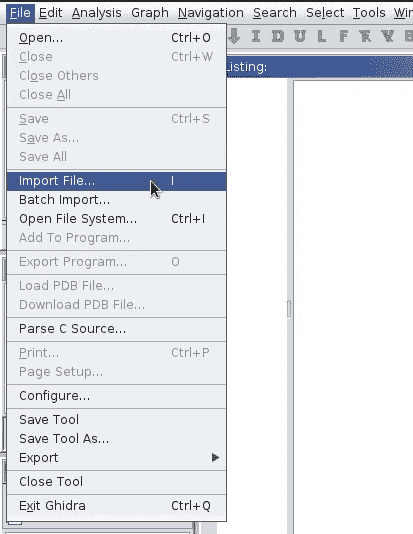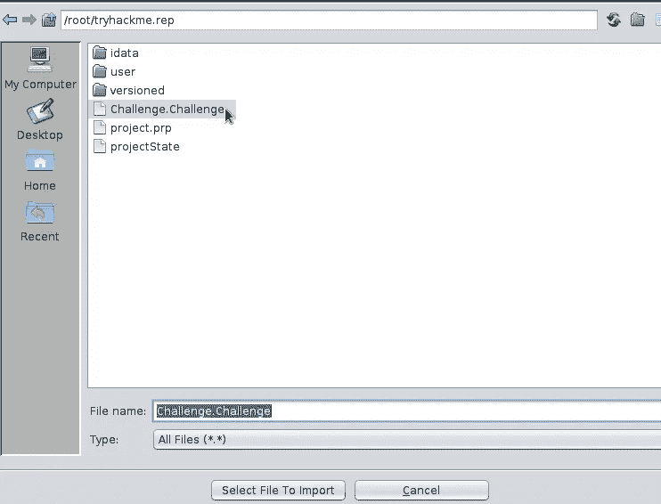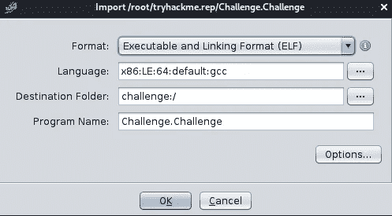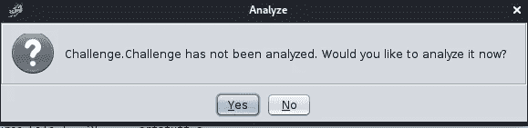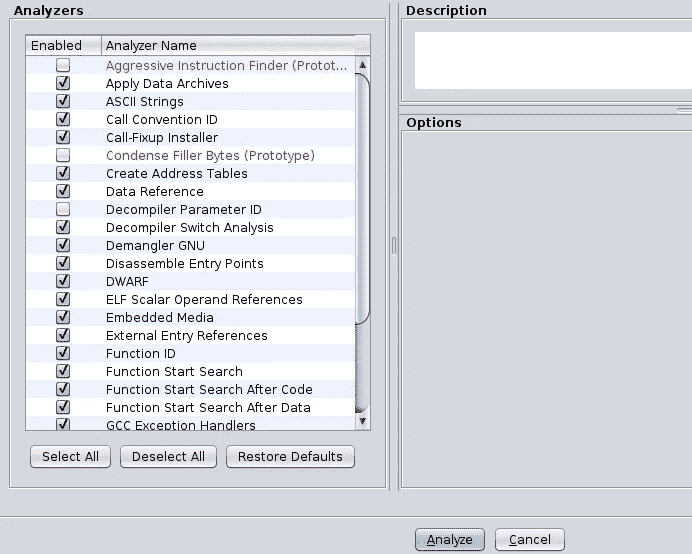

现在转到窗口选项卡并选择功能选项

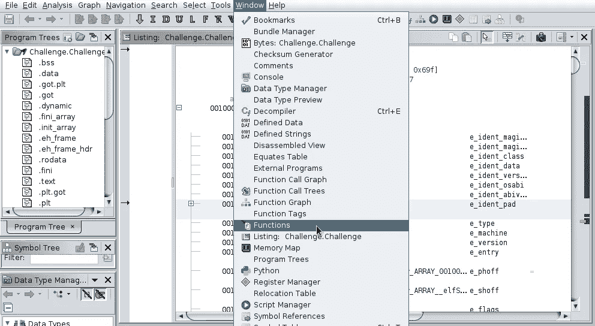

现在寻找主函数

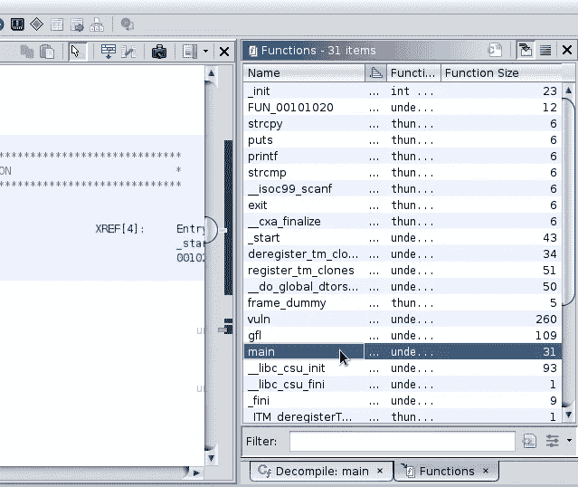

反编译主函数

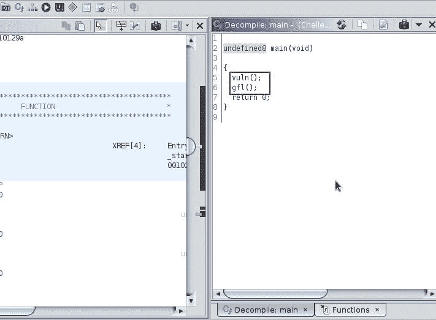

我们可以看到 main 函数调用了两个函数；

1.  损伤
2.  gfl

让我们反编译并检查这两个函数

反编译函数“vuln”后，它没有给出任何有趣的东西。所以我继续分析函数“gfl”

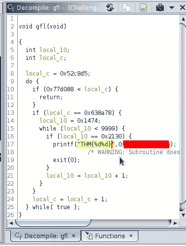

0x6*****，2***

看起来我们的旗帜是十六进制的。让我们把它们转换成整数。

我们可以使用在线工具，如 [rapidtables](https://www.rapidtables.com/convert/number/hex-to-decimal.html) 将十六进制转换成相应的整数值，或者我们可以使用我们的终端，使用以下命令将十六进制转换成整数

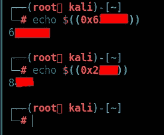

最后，这是您的**标志**在合并两个值之后

THM{6******8***}

# 方法 3(雷达 2 或 r2)

对于这个挑战，我使用了[**radar 2**](https://github.com/radareorg/radare2)对二进制文件进行逆向工程。

我们从加载 radare2 开始，并在调试模式下运行挑战文件

```
r2 -d Challenge.Challenge
```

之后，我们通过运行`**aaa**`自动分析二进制文件以发现字符串和函数

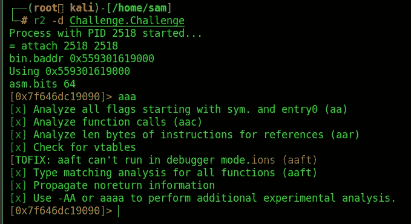

现在我们已经分析了二进制文件，我们运行`afl`来查看函数，这将列出许多函数。然而，我们可以从主要功能开始

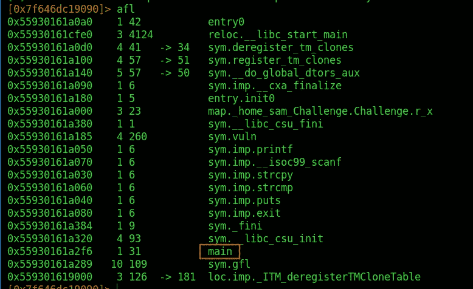

通过运行`s main`，我们可以导航到主功能，然后通过运行`pdf`打印反汇编

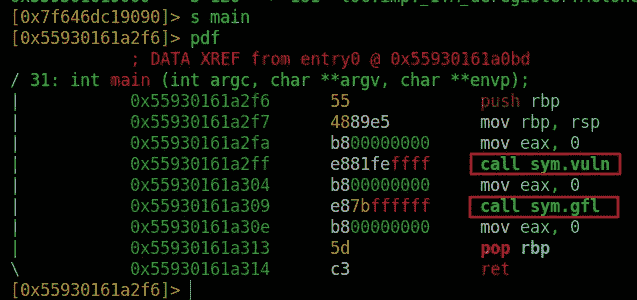

从主函数中我们看到它调用了两个函数`vuln`和`gfl`

*注意:你的内存地址不会相同*
我们可以看到两个有趣的函数。`sym.vuln`和`sym.gfl`。我们可以用同样的方法分析它们`pdf @sym.vuln`和`pdf @sym.gfl`。我们去吧！

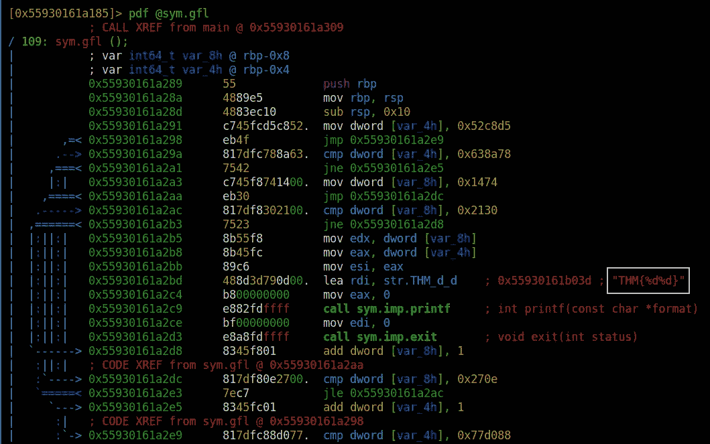

不错！我们都能看到旗子，对吧？好了，不要太兴奋，回头看看`sym.main`代码执行必须到达那里，我们不能只是让指令指针跳到这里。哦，还有那些箭头，别担心，这是 for 循环。

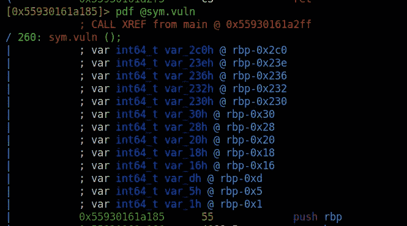

这些是局部变量。我们可以通过使用`px @rbp-ADDRESS`来查看它们的内存状态(仅在运行时),因此要查看 var_2c0h，我们需要使用`px @rbp-0x2c0`。

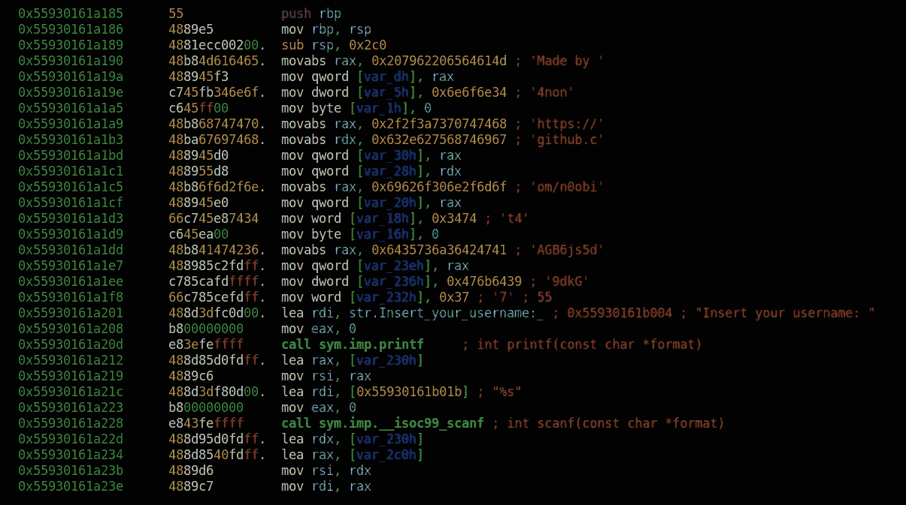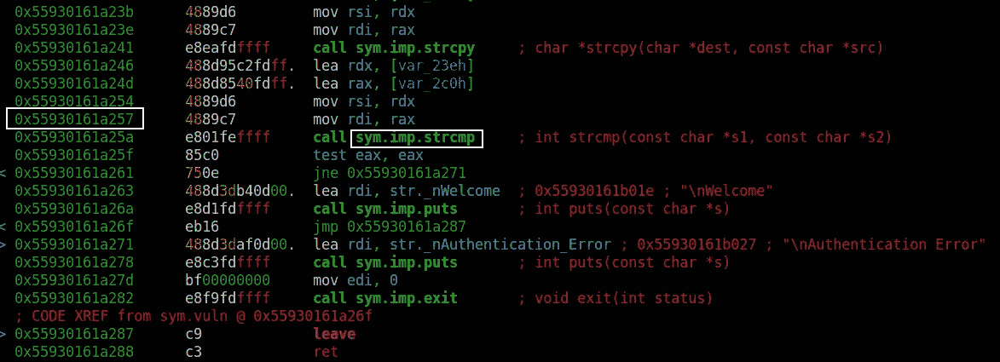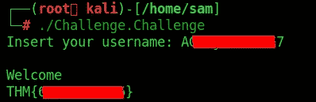

你可以在:
**LinkedIn:-**[https://www.linkedin.com/in/shamsher-khan-651a35162/](https://www.linkedin.com/in/shamsher-khan-651a35162/)
**Twitter:-**[https://twitter.com/shamsherkhannn](https://twitter.com/shamsherkhannn)
**Tryhackme:-**[https://tryhackme.com/p/Shamsher](https://tryhackme.com/p/Shamsher)


如需更多演练，请在出发前继续关注…

访问我的其他演练:-

感谢您花时间阅读我的演练。
如果你觉得有用，请点击👏按钮👏(最高 40 倍)并分享给有类似兴趣的人帮助！+随时欢迎反馈！