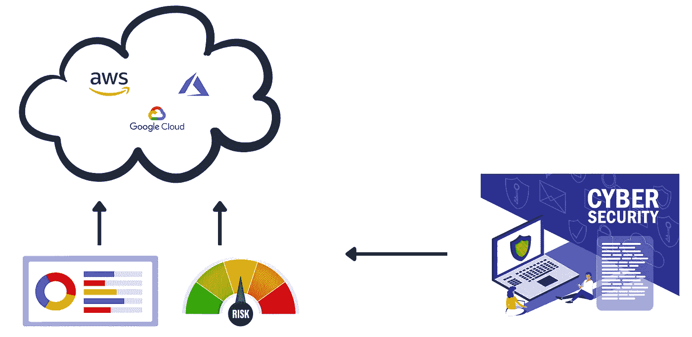
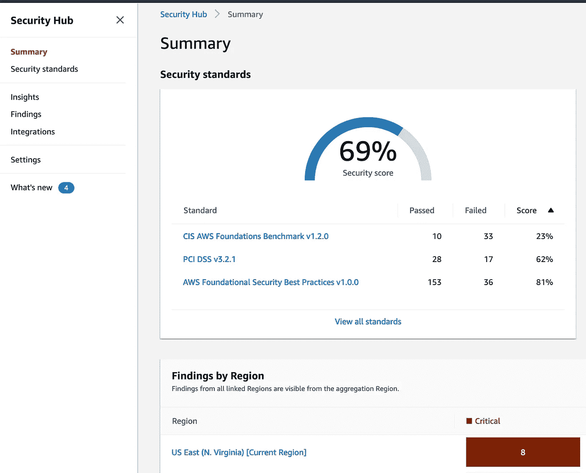
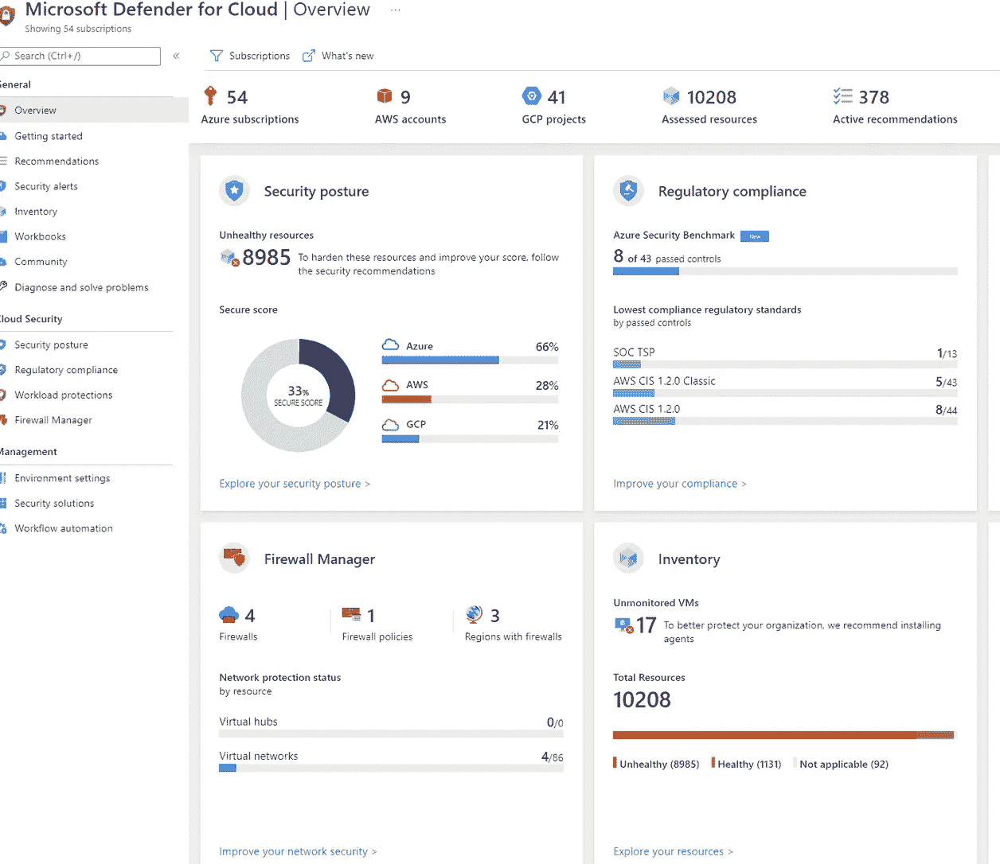
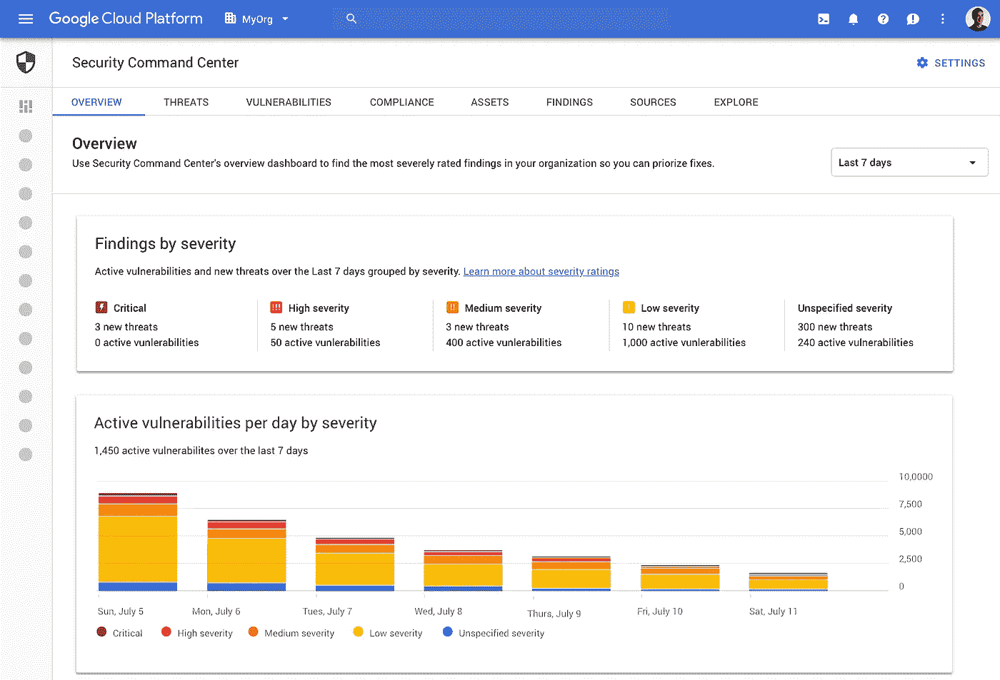

# 云安全工具系列——CSPM 到底是什么？

> 原文：<https://infosecwriteups.com/cloud-security-tooling-series-what-the-heck-is-a-cspm-8f37f6b1db19?source=collection_archive---------2----------------------->

## 了解云安全态势管理的概念(CSPM)

云安全可能是一个很难理解的领域，每个月都会推出新的解决方案和服务，要成为这方面的专家。为了帮助这个领域的新来者，我制作了这个关于关键云安全工具的系列，涵盖了 CSPM、CASB、CWPP 等地区。

在本文中，我们将重点关注云安全态势管理(CSPM)以及如何正确使用它们

# 你为什么需要 CSPM？

问任何在云领域工作了几年的人他们面临的最大威胁，答案通常是**错误配置**。

> ***错误配置是对云环境最大的风险*******。事实上，***[***65%到 70%***](https://www.trendmicro.com/en_us/research/21/a/the-top-worry-in-cloud-security-for-2021.html) ***云中的所有安全挑战都源于误配置****

*云中的意外(或有意)变化可能导致云数据库暴露在互联网上，让网络攻击者欣喜不已。另一个问题是可见性，每分钟都有成千上万的事件发生，导致网络安全团队根本不知道优先考虑什么和在哪里。*

*CISO 无法获得显示其云环境中主要风险的控制面板，而这在多云环境中会成倍增加。*

*CISOs 希望回答的一些关键问题是:*

*❓ ***我们是否遵循了最佳实践？****

*❓ ***我们目前的安全态势如何？****

*❓ ***我会知道有人在云中做了未经授权的活动吗？****

*❓ ***我如何知道我们是否会通过云的审核？****

*❓ ***我如何获得多云环境的快照？****

*正如我以前多次提到的那样，但我将再次重复*

*   ***您的本地控件不会被复制粘贴到云端***
*   ***云中没有要实施的边界***
*   ***手动流程不会因为云的运行速度而扩展。如果没有自动化，你可能几天甚至几周都没有发现安全问题***

*这就是 CSPM 概念的由来。*

# *CSPM 来了*

*云安全态势管理(CSPM)是一种插入到云环境中的工具，可识别整个云基础架构中的风险。CSPM 的工作是向您准确显示您的风险水平，以及您在最佳实践合规性方面所处的位置。*

*CSPM 的一些主要特征是:*

*   ***检测并修复云配置，如开放端口、不安全资产、暴露的云资产等。***
*   ***检测和识别云资产***
*   ***显示带有评分的云风险仪表盘***
*   ***将您的云环境与 PCI、NIST、CIS 等安全基准进行对比。***
*   ***监控您的环境，检测与您定义的策略的偏差。***

**

*CSPM 的工作原理(用 Canva 制作)*

*CSPMs 通常有两种风格。由云提供商原生提供的或由第三方供应商提供的。*

***下面举几个 CSPM 本土的例子***

## *AWS 安全中心*

**

## *微软云卫士*

**

## *谷歌安全指挥中心*

**

*此外，还有许多第三方 CSPMs，它们可能更适合多云环境。**它们都有各自的优缺点，我不会推荐任何特定的供应商***

# *CSPM 成功的关键点*

*基于我自己实施许多本地和第三方 CSPMs 的经验；以下是我会避免的错误和我会推荐的事情:*

## *要避免的错误*

*   ***让 CSPM 成为“银弹”**意思是认为实施 CSPM 解决方案就能解决您所有的云问题。CSPM 就像任何其他解决方案一样，有一个学习曲线，必须成熟才能在任何环境下有效工作*

> *请记住，实施 CSPM 并不是目标。目标是降低您的云环境中的风险*

*   ***未优化警报**表示未分析最初生成的警报并对其进行微调。CSPM 还会给安全团队带来警报疲劳，除非他们进行了微调，并考虑将自动补救作为一个选项。*

## *需要记住的要点*

*   *不要被最初出现的警报数量吓到。处理这些警报，首先确定关键警报和高警报的优先级。*
*   *请记住，你永远不会得到 100%的遵从，所以即使把它作为一个目标也是在为失败做准备*
*   *不要在第 1 天打开自动修复！除非您喜欢破坏您的云应用程序，否则不要打开 CSPMs 的自动修复功能，除非您已经测试并确认了将要发生的操作*
*   *让您的云/技术团队参与实施和补救，以便他们了解将开始生成警报的工具*
*   *链接您的票务系统，不要依赖电子邮件进行提醒！数以千计的电子邮件将意味着一个关键的警报将被错过。*
*   *一切都在船上。开发云帐户或订阅可以为攻击者提供攻击您的生产云帐户所需的所有信息。不要试图通过忽略一些账户来省钱。*

*祝你 CSPM 之旅好运！*

**

> **Taimur Ijlal 是一位* ***多次获奖的信息安全领导者*** *，在金融科技行业的网络安全和 IT 风险管理方面拥有 20 多年的国际经验。可以在*[*LinkedIn*](https://www.linkedin.com/in/taimurijlal/)*上或者在他的* [*博客*](https://cloudsec-guy.com/) *上连接 Taimur。他还有一个 YouTube 频道“* [*”云安全专家*](https://www.youtube.com/c/CloudSecurityGuy) *”，他定期在上面发布关于云安全、人工智能和一般网络安全职业建议的帖子。**
> 
> ****如果你喜欢读这篇文章，那么请考虑支持我，使用这个*** [***链接***](https://taimurcloud123.medium.com/membership)*

## *来自 Infosec 的报道:Infosec 每天都有很多内容，很难跟上。[加入我们的每周简讯](https://weekly.infosecwriteups.com/)以 5 篇文章、4 个线程、3 个视频、2 个 GitHub Repos 和工具以及 1 个工作提醒的形式免费获取所有最新的 Infosec 趋势！*