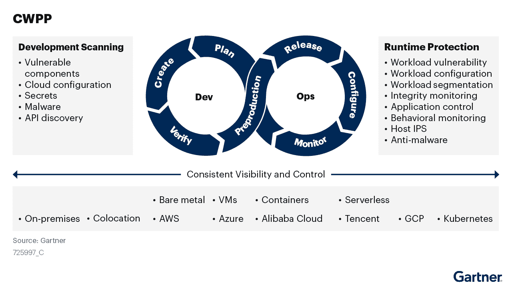
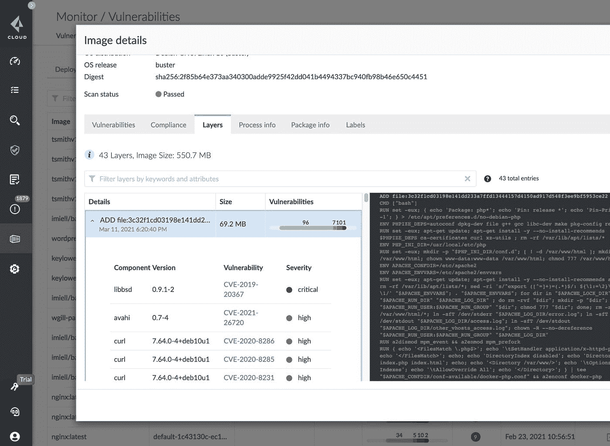

# 云安全工具系列:CWPP 到底是什么？

> 原文：<https://infosecwriteups.com/cloud-security-tooling-series-what-the-heck-is-a-cwpp-aa9758f9a339?source=collection_archive---------1----------------------->

## 了解 CWPPs 在云安全难题中的位置

卢卡·布拉沃在 [Unsplash](https://unsplash.com?utm_source=medium&utm_medium=referral) 上的照片

在我们的第三版云安全工具中，我们从 [**CSPM**](/cloud-security-tooling-series-what-the-heck-is-a-cspm-8f37f6b1db19) 和 [**CASB**](https://taimurcloud123.medium.com/cloud-security-tooling-series-to-casb-or-not-to-casb-8878b038855a) 转移到另一个云安全解决方案，该解决方案被称为 **CWPP** 或**云工作负载保护平台**

# CWPP 吗？

就像它的名字所说的那样；CWPP 关注云中工作负载的安全性。

> CSPM 告诉你云环境有多安全，CASB 告诉你用户是否遵守了你的云使用政策；CWPP 告诉您云工作负载有多安全。

这里的“工作负载”是指:

*   **基于云的虚拟机**
*   **容器化应用**
*   **无服务器功能**
*   **微服务**
*   **一个 API**

因此，与 CSPM 相比，CWPPs 在安全链中处于较低的位置，如下所示:

来源:Gartner

然而，这种较低级别的访问权限也使他们对存在的风险有了更多的了解和洞察力，从而有了更好的事件响应能力。

CWPP 通常基于代理，这很好，因为它允许工作负载在具有相同安全级别的环境之间移动。

它们提供了丰富的功能套件，例如:

*   **强化/配置检查**
*   **在任何代码投入生产之前扫描问题**
*   **混合和多云支持**
*   **集装箱安全**
*   **无服务器安全**
*   **应用程序白名单**
*   **恶意软件扫描**

# **对 CWPP 的需要**

CWPP 填补了各种安全漏洞，下面列出了其中一些:

*   正如前面提到的，多云已经成为现实，网络安全团队需要一种方法来让他们能够了解工作负载，而不管他们运行的是哪种云环境
*   除了可见性之外，他们还在混合/云计算环境中提供了标准化，因为团队可以在所有工作负载中实施一致的标准
*   CWPP 是在考虑 CI / CD 情况下构建的，因此可以是开发人员的朋友，允许他们在更早的时候发现问题。
*   可悲的现实是，大多数网络安全团队不确定如何保护微服务和容器，而 CWPP 拥有保护这些服务的原生功能

来源:Gartner

# CWPP 如何保护工作负载？

CWPPs 保护云工作负载的一些方式如下

*   **运行时保护**通过恶意软件保护、白名单、行为监控和基于主机的入侵防御。
*   **漏洞扫描**和补救。CWPP 可以在工作负载投入生产之前对常见问题发出警报，并在运行时提供修复建议。通过完整性保护等功能，团队可以执行一个严格的允许列表
*   **集装箱扫描保护**。团队可以定义哪些图像是可信的，并监控容器注册中心的问题。
*   **收集实时威胁情报**并在团队环境中发现安全问题时使用它来提醒团队。
*   **通过从多个来源收集法医详细信息，并在适当的时间表视图中将其呈现给安全团队，帮助事件响应**

普里斯马·克劳德·CWPP

# **CWPP 实施提示**

就像 CSPM 和 CASB 一样；CWPP 必须正确实施，而不是“即插即用”。需要记住的一些事情是

*   确保您在 CWPP 平台中涵盖了所有的工作负载
*   在提交之前，请咨询供应商，确保 CWPP 与您的所有云平台兼容。
*   将 CWPP 集成到您的开发运维周期中，以获得安全问题的早期通知
*   提升您团队的技能，了解无服务器和微服务架构世界中的安全问题。由于团队害怕“破坏”应用程序，所以对于 CWPP 强调的问题往往不采取任何行动

# 祝你 CWPP 之旅好运！

> *Taimur Ijlal 是一位* ***多次获奖的信息安全领导者*** *，在金融科技行业的网络安全和 IT 风险管理方面拥有 20 多年的国际经验。太姥可以在*[*LinkedIn*](https://www.linkedin.com/in/taimurijlal/)*或者在他的* [*博客*](https://cloudsec-guy.com/) *上连接。他还有一个 YouTube 频道“* [*云安全专家*](https://www.youtube.com/c/CloudSecurityGuy) *”，他定期在上面发布关于云安全、人工智能和一般网络安全职业建议的帖子。*
> 
> ***如果你喜欢读这篇文章，那么考虑支持我成为一个中等会员，使用这个*** [***链接***](https://taimurcloud123.medium.com/membership)

## 来自 Infosec 的报道:Infosec 每天都有很多内容，很难跟上。[加入我们的每周简讯](https://weekly.infosecwriteups.com/)以 5 篇文章、4 个线程、3 个视频、2 个 GitHub Repos 和工具以及 1 个工作提醒的形式免费获取所有最新的 Infosec 趋势！