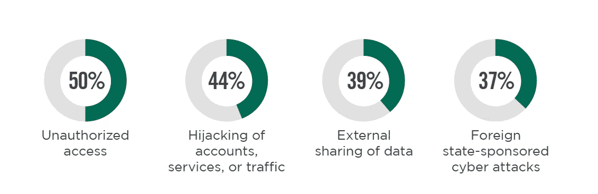
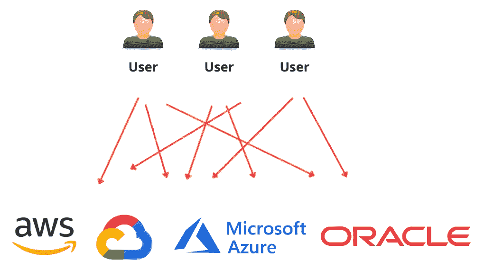

# 云安全工具——CIEM 具体做什么？？

> 原文：<https://infosecwriteups.com/cloud-security-tooling-what-does-a-ciem-do-exactly-aca98f988784?source=collection_archive---------2----------------------->

## 还有一个云的缩写要理解

马库斯·斯皮斯克在 [Unsplash](https://unsplash.com?utm_source=medium&utm_medium=referral) 上的照片

**第一部:** [**CSPM**](/cloud-security-tooling-series-what-the-heck-is-a-cspm-8f37f6b1db19)

**第二部分:** [**CASB**](https://taimurcloud123.medium.com/cloud-security-tooling-series-to-casb-or-not-to-casb-8878b038855a)

**第三部:** [**CWPP**](https://taimurcloud123.medium.com/cloud-security-tooling-series-what-the-heck-is-a-cwpp-aa9758f9a339)

如果你一直在关注这个系列，那么我确信你已经厌倦了这些缩写(我知道我是！)但是我们还有几个要走。

今天的主题是 **CIEM(云基础架构授权管理)**，不要与 SIEM 混淆，后者是安全信息和事件管理，是一种完全不同的技术..虽然它们听起来确实一样！

云是一个动态的环境，安全性围绕着身份。正如我之前提到的，在云环境中，成为您保护重点的是**身份**，而不是安全边界。因此，管理云中谁拥有什么访问权限至关重要

CIEM 这个词是 Gartner 创造的(还有谁？)并定义为:

> “云基础设施授权管理(CIEM)产品是专门的以身份为中心的 SaaS 解决方案，专注于通过管理时控制来管理云访问风险，以管理混合和多云 IaaS 中的授权。他们通常使用分析、机器学习(ML)和其他方法来检测帐户权利中的异常，如特权累积、休眠和不必要的权利。理想情况下，CIEM 提供最低特权方法的补救和实施。”

如果阅读这本书让你头疼(对我来说是！)那么这基本上意味着 CIEM 是一个云安全工具，用于管理云中的访问并执行最小特权原则。

鉴于身份创建的速度和每个云服务都需要许可才能运行的事实，这一直是云中的一个问题，使得跟踪身份成为一个真正的挑战。

在最近由 ISC2 赞助的云安全报告中；50%的网络安全专业人员将未经授权的访问列为他们最担心的云安全威胁

来源:[云安全报告 2022](https://cloud.connect.isc2.org/cloud-security-report)

# 为什么您需要 CIEM 解决方案

有理由认为单个云环境不需要 CIEM，原生云工具应该可以工作，我倾向于同意这种观点。然而，考虑到每个云的许可数量，在多云环境中控制访问可能是一个真正的挑战，这也是 CIEM 可以展示其价值的地方

云环境还暴露出数以千计的 API 和权限需要管理，它们中的每一个都可能成为被利用的攻击面。

不幸的是，这只是**碎玻璃账户、根密码、给予合作伙伴跨账户访问权的强大角色、机器身份等的冰山一角**。这只是混合/云计算环境中需要管理的一些其他问题

欢迎来到多云地狱

# CIEM 特色

多云环境中的 CIEM 为用户带来了以下优势:

1.  **对访问的控制:**多云是一个很难控制的野兽，但有了 CIEM；公司可以了解世卫组织在哪里做什么。基于此，他们可以跨不同的云实施集中访问策略
2.  **对用户行为的可见性**:从一个云环境到另一个云环境跟踪用户权限对于安全团队和审计人员来说是一场噩梦。
3.  **简化用户配置** : CIEM 通过接入云提供商的 API 实现自动化。这使他们能够自动化访问资源调配，并在不同的环境中实施额外的控制，如 MFA。

# 如何正确实施 CIEM

在人们兴奋地冲出去购买市场上最新的 CIEM 解决方案之前，请记住以下几点

*   **云兼容性**:确保 CIEM 支持您当前和未来的云足迹。没有什么比联系供应商并被告知已经在路线图上更令人沮丧的了！
*   **跨多云的权限可见性**:游戏的名称是多云中的可见性，CISOs 需要一个单一的仪表板来显示云中的每个身份以及我可以做什么
*   **基于机器学习的智能关联**:除了谁能做什么..理想的 CIEM 产品还应该告诉您如何优化权限，并为过度配置的访问设置标记，并给出如何优化的提示。
*   智能地为用户分配风险分数(CISOs 喜欢这样！)
*   **跨云标准化权限**。没有自动化，你的工作就注定要失败。CIEM 应该能够跨环境标准化您的访问策略，并对任何违规行为实施补救。
*   最重要的是，它应该能够与您现有的身份和访问管理解决方案(IDAM)集成，因为没有什么比管理两个身份解决方案更令人沮丧的了

# 还有云缩写吗？

我们的云安全工具系列即将结束，在最后一个系列中，我们将集中讨论 CNAPP 以及它如何集成前面提到的所有功能(并带来新功能)

云是一个旅程，而不是目的地，所以祝您旅途顺利！

> *Taimur Ijlal 是一位* ***多次获奖的信息安全领导者*** *，在金融科技行业的网络安全和 IT 风险管理方面拥有 20 多年的国际经验。可以在*[*LinkedIn*](https://www.linkedin.com/in/taimurijlal/)*上或者在他的* [*博客*](https://cloudsec-guy.com/) *上连接 Taimur。他还有一个 YouTube 频道“* [*”云安全专家*](https://www.youtube.com/c/CloudSecurityGuy) *”，他定期在上面发布关于云安全、人工智能和一般网络安全职业建议的帖子。*
> 
> ***如果你喜欢读这篇文章，那么请考虑支持我，使用这个*** [***链接***](https://taimurcloud123.medium.com/membership)

## 来自 Infosec 的报道:Infosec 每天都有很多内容，很难跟上。[加入我们的每周简讯](https://weekly.infosecwriteups.com/)以 5 篇文章、4 个线程、3 个视频、2 个 GitHub Repos 和工具以及 1 个工作提醒的形式免费获取所有最新的 Infosec 趋势！