# 云塞克 CTF 漫游(EWYL)

> 原文：<https://infosecwriteups.com/cloudsek-ctf-walkthrough-ewyl-e42e768b9895?source=collection_archive---------2----------------------->

> 我很高兴能和大家(读者)分享 CTF 是多么具有挑战性，同时又是多么有趣。在某种程度上，我在想我做错了什么，但正如他们所说的那样，“没有细节是太小的”这是我在 CTF 对 CloudSEK 的 CTF EWYL 项目的详细介绍。

**CTF 难度等级:**

中等

**渗透测试方法:**

基于 Web 和隐写术的渗透测试

**侦察:**

视图-源(Ctrl+U)

**剥削:**

LFI 臭虫

**工具:**

解码器([https://malwaredecoder.com](https://malwaredecoder.com))

MD5 哈希解码器([https://www.md5online.org/md5-decrypt.html](https://www.md5online.org/md5-decrypt.html))

Base64 编码器/解码器([https://www.base64decode.org/](https://www.base64decode.org/))

JWT.io/邮递员([https://jwt.io/](https://jwt.io/))

图像元数据查看器([http://exif.regex.info/exif.cgi](http://exif.regex.info/exif.cgi))

隐藏信息

**结果:**

夺旗

访问提交 URL

**预排**

1.  view-source:http://54 . 244 . 19 . 42/查看*用户名*和*密码*的网站源代码，绕过认证。

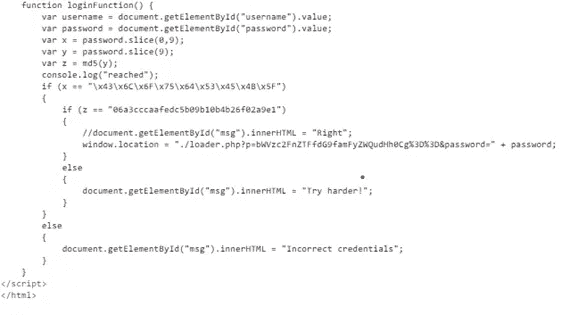

源代码

2.在这里，我们可以很容易地推断出用户名被编码为一个隐藏的脚本，为了揭示它的真正功能，我们必须解码它。

3.密码在源代码中被编码为 md5，我们也已经解码了。

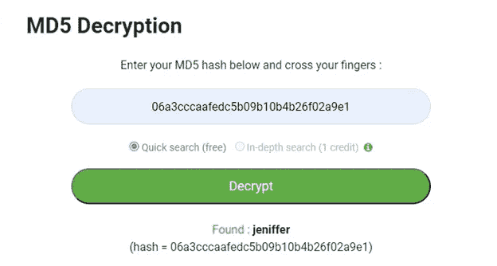

4.所以，现在我们有了用户名和密码，但是等等，这里有一个问题。用户名和密码不能单独使用。它们必须连接在一起，我们得到的用户名和密码是= *CloudSEK_jeniffer* 。这很棘手，但正如我之前所说的“没有细节是太小的”。

窗口位置 URL 是串联部分的最终提示。

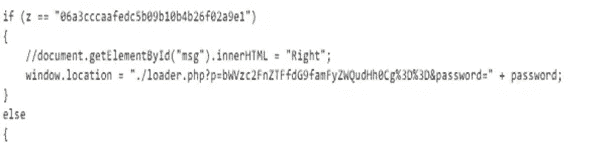

5.现在登录窗口看起来像这样，嘿，我们绕过了认证。

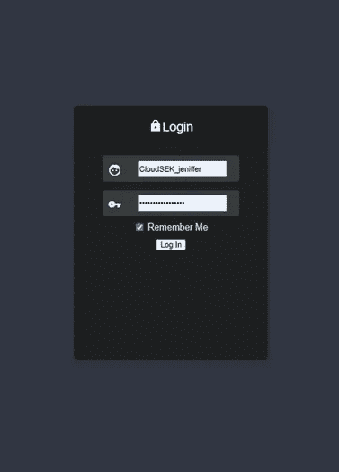

6.现在到了棘手的部分，我们必须从用户的/home 目录中检索一个文件，即 *secret.txt* ，并访问开发者登录令牌。但是说实话，你必须看得足够近才能访问 secret.txt 文件。否则，一个人可能会在这个阶段花几个小时拉头发。

相信我，“快乐编码”只是一种干扰。

[http://54.244.19.42/loader.php?网址 p = bwvzc 2 fnztfdg 9 famfyzwqudhh0cg % 3D % 3D&password = cloud SEK _ jeniffer](http://54.244.19.42/loader.php?p=bWVzc2FnZTFfdG9famFyZWQudHh0Cg%3D%3D&password=CloudSEK_jeniffer)

7.通过仔细查看网址，我知道就是它了。我有我的路。

哦，不要对把这个路径(【http://54.244.19.42/home/jared/secret.txt】T2)放在 URL 中感到困惑，这并不容易，也不会起作用。

通过查看 URL，您会看到(*p = bwvzc 2 fnztffdg 9 famfyzwqudhh 0 c*)，这实际上是 secret.txt 的路径

让我展示给你看。

8.通过查看路径，很明显它是 Base64 编码的，我们必须对其进行解码，我们得到的消息为= *message1_to_jared.txt.*

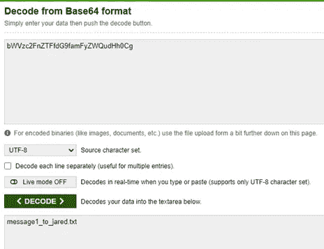

9.现在，我们对访问令牌所在的实际路径进行编码。所以我们对 */home/jared/secret.txt* 进行编码，我们就有了自己的实际路径。我们只需要复制并粘贴到 URL 中。

*注意:*不要抄等号' = '号。

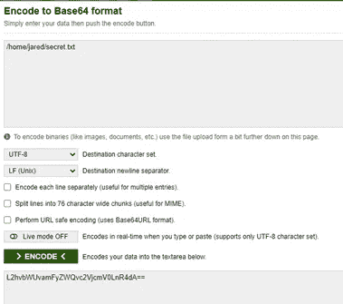

10.我们手里拿着 *access_token* 进入下一个目标页面。万岁！

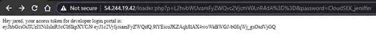

11.现在，我们如何传递 access_token？

为此，我们将在一个名为 POSTMAN 的工具的帮助下使用 Post 数据方法和 JWT，这将使我们的工作减少一半。

12.要使用 *POSTMAN* ，我们首先必须下载本地客户端，这样我们就可以将 POST 请求传递到不安全的(HTTP)网站。

13.在 POSTMAN Launchpad 中，我们将把 *access_token* 和 *TOKEN* 分别作为主体部分中的*键*和*值*进行传递，如下图所示，然后点击 SEND 按钮，就这样，我们将下一个 URL 作为响应。

附:只有具备 Web 应用测试知识，这部分才容易。你也可以使用*卷毛*或*卷曲*来传递代币。

14.如果你问我那会有用吗？我的答案会是嗯……不！

15.首先，我们必须将令牌转换为“admin”令牌，即“jared”令牌。为此，我们将使用 JWT.io，我们将有这样的新令牌，后跟一个邮递员 POST 请求。

new(*admin*)access _ token =*eyjhbgcioijiuzi 1 NII SINR 5 CCI 6 ikpxvcj 9 . eyj 1c 2 vyiijoiywrtaw 4 ifq . xltlduxxsgb 7 eqp 49 a 8 xqziqpjvkej 9 o 2 nix 4 xlf 5m*

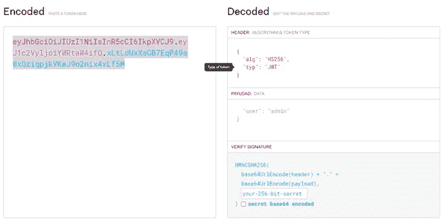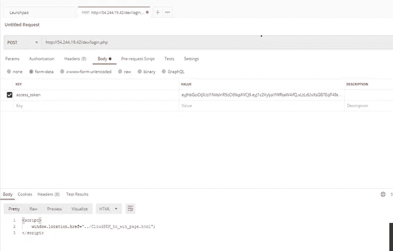

16.我们有了新的网址[http://54.244.19.42//CloudSEK_to_win_page.html](http://54.244.19.42/CloudSEK_to_win_page.html)

这是我们的奖品！

但是你以为你看到旗子就抓到旗子了？

哦，不，不，等等，这个 CTF 的创造者比你想象的要聪明。

17.在这里，我们必须使用隐写术来获取关于图像的所有可能信息，正如图像所说，“如果你在黑暗中寻找，你会发现你的价值”，因此我们已经知道只有元数据存在于黑暗中，所以我们必须照亮它，看看我们是否能找到什么。

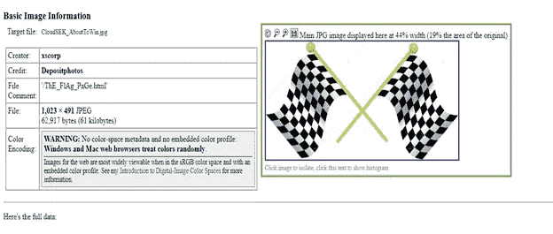

是的，我和你想的一样，'这是不是太容易了，因为我们有我们的下一个 URL 作为图像元数据中的评论？'是的，的确如此。

18.现在，我们必须前往我们的最终网址，以捕捉我们心爱的旗帜，这里是你可以看到下面。http://54.244.19.42/ThE_FlAg_PaGe.html

19.但是等等，真正的拉头发压力是现在。我很难找到提交的网址，它在哪里？现身吧！

老实说，一个复选框就毁了我的信心，你想知道那是什么吗？

但是让我们看看我从*斯蒂吉那里得到了什么问题。*

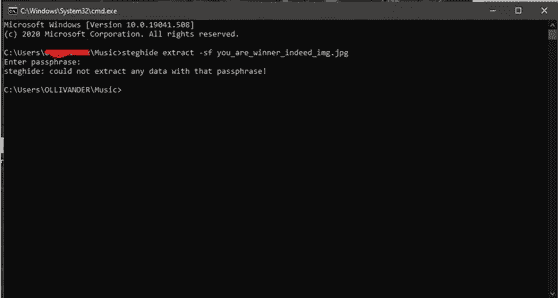

打扰一下。为什么？一切都是正确的，我甚至知道密码短语是正确的，那么什么是错误的呢？

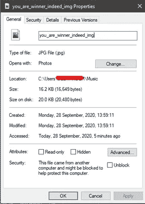

因此，在做了一些挖掘后，在属性中的“解锁”复选框应该在执行提取之前被勾选，否则它将是一个错误密码的无限循环。

20.在仔细检查了所有的东西之后，这里是我们的最终信息和我们提交的链接。

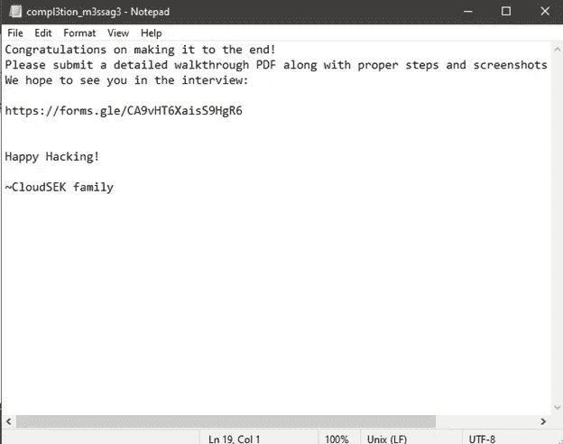

演练到此结束。

谢谢大家！

> 想谈谈科技和太空吗？
> 
> **在 LinkedIn 跟我连线:**[**https://www.linkedin.com/in/amitnandi04/**](https://www.linkedin.com/in/amitnandi04/)