# CloudSek EWYL 2022 CTF

> 原文：<https://infosecwriteups.com/cloudsek-ewyl-2022-ctf-eae4229b561c?source=collection_archive---------2----------------------->

## 解决哈利波特主题的 CTF

这是一个“哈利·波特”主题的 CTF，包含来自多个 Web 安全领域的挑战，如模板注入和代码审查。这项挑战由 CloudSEK 主办，是 EWYL-2022 计划的一部分。

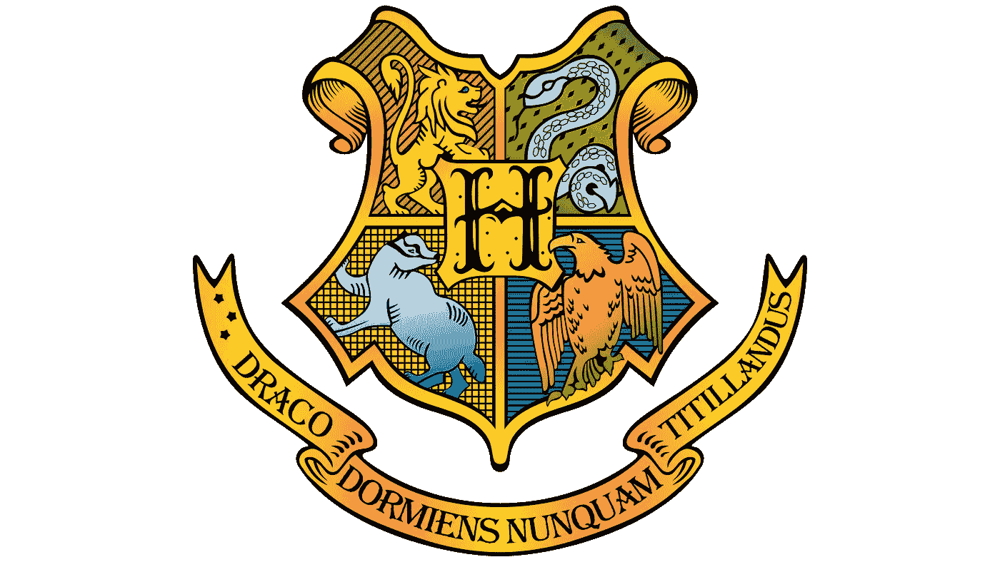

在这份报告中，我已经详细解释了我是如何解决 CTF 的。

# 初步侦察

我通过扫描目标 IP 开始挑战，目标 IP 是[**【http://13.235.95.179】**](http://13.235.95.179)**。**

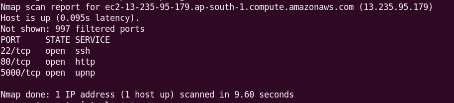

扫描显示有三个开放的港口，但是根据 CTF 的规定，我们不允许攻击 CTF 的基础设施。所以端口 22 没有被触及。我们将只关注端口 **80** 和 **5000。**

在 NMAP 扫描之后，我执行了一次目录蛮力来寻找感兴趣的目录和文件，但是那次扫描没有返回任何特别的东西，甚至没有一个 *"robots.txt"* 文件。

# 解码和去模糊

在**端口 80** 上访问主网页显示了挑战的主题以及" */gateway.php"* 端点上的登录页面

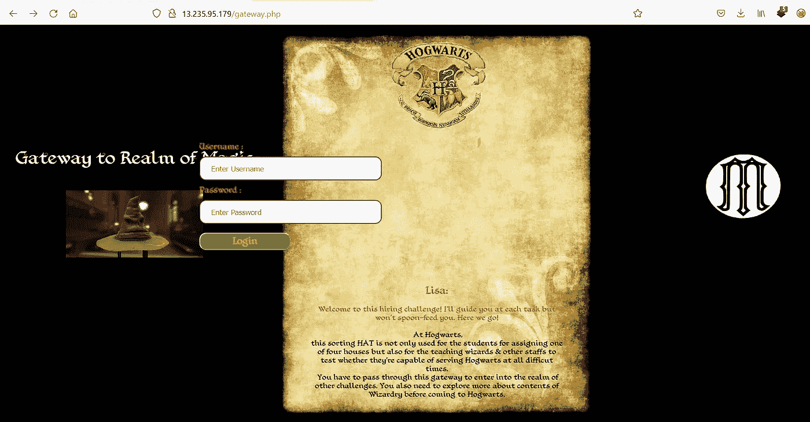

这是一个没有太多功能的基本登录页面。这一页有一句很有意思的台词*“你还需要在来霍格沃茨之前多探索一下魔法的内容”。*这可能表明我们在初始扫描中找不到丢失的“robots.txt”。

经过一轮反复试验后，在" */wizardry.txt"* 找到了一个页面，里面有一段混乱的文字，还有一条来自小精灵多比的信息。

这里显示的文本首先用 Base64 进行了双重编码，然后用 JSFuck 语言进行了编码。

乱码文本-> Base64 -> JSFuck 解码-> alert(" id 3 nt 1 ty _ card . PHP ")；

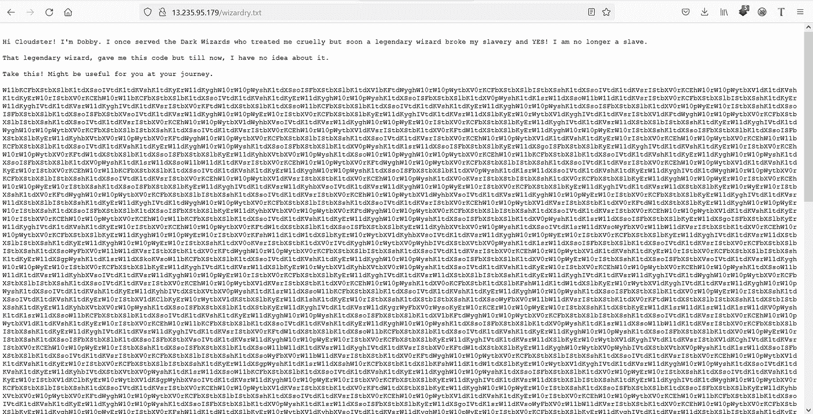

在对 *"/wizardry.txt"* 的文本进行解码后，我们得到了一个新的页面 **id3nt1ty_card.php**

# 检查身份证

*漏洞:隐藏参数发现*

访问 **id3nt1ty_card.php** 上的页面，给了我们一张身份证的图片，上面有一些随机数。在端点上执行 GET parameter 蛮力得到参数"**？id”。**

使用*？页面上的 id=1* 向我们展示了下面的图像

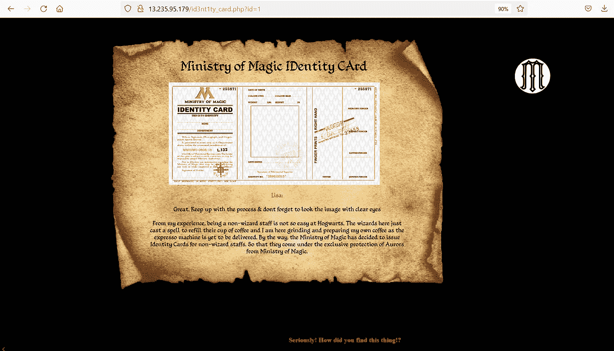

这表明我们在正确的轨道上，我们再次使用蛮力来获得 id 参数的有效值。

蛮力给我们的参数是接受的值"？id=212。

从服务器收到以下响应。

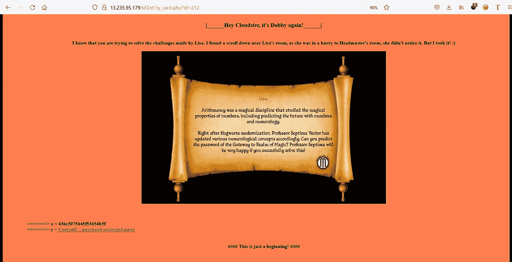

这个页面给了我们非常有用的信息，可以帮助我们登录到网关

它有两个变量，这些变量的组合将为我们提供登录密码。

**= = = = = = =>x = 436 c 3075445 f 53654 b 5f**

**= = = = = = = =>y = ControlC—密码保护页面**

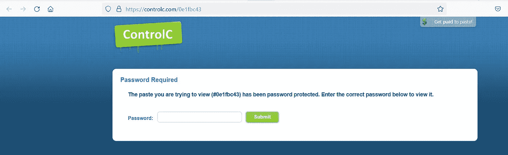

我们需要破解" **ControlC"** 页面的密码，以获得密码的第二部分。

在同一页上，我们找到了其他几幅图像，但它们都是兔子洞。

但是页面的源代码中出现了一个特殊的图像

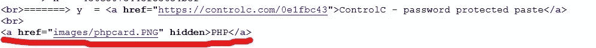

在这里，我们找到了一个 PHP 代码，用于组合可在“ControlC”网站上使用的不同密码。

# 玩弄 PHP

*漏洞:PHP 类型杂耍攻击*

我们在上一步中收到的这段代码将允许我们从 ControlC 获得密码的第二部分。

现在我们来分析一下代码。

***->if(array _ key _ exists(" passphrase "，$ REQUEST))* :** 该行检查参数" pass phrase "是否在" REQUEST "正文中定义，请求可以是任何类型(GET 或 POST)。

**->*if(strstr(＄REQUEST[" pass phrase "]，" carbonblack"):*** 该行使用 **strstr** 函数检查给定的字符串是否存在于原始字符串中。如果字符串存在，则返回 True。

***- > ($_REQUEST["通行短语"] > 22) & & ($ REQUEST["通行短语"] > 55)***

这是我们可以利用 PHP 类型杂耍漏洞的行，这一行在字符串和整数之间进行松散的比较，所以只检查第一个整数字符。

所以，几种可能的密码是:从 23 炭黑到 54 炭黑。

试了试这些密码，正确的密码是:**33 炭黑。**

这给了我们密码的第二部分:

**alert("密码第二部分:W0rK _ iS _ FuN ")；**

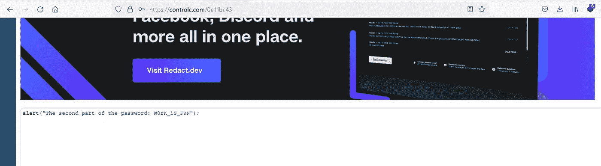

# 解锁网关

*隐写术挑战*

我们现在有了变量 x 和 y 的值来解锁网关

***= = = = =>x = 436 c 3075445 f 53654 b 5f***

***= = = = =>y = W0rK _ iS _ FuN***

***x*** 的值好像不太对，经进一步检查发现是十六进制编码

*436c3075445f53654b5f - >十六进制解码- > Cl0uD_SeK_*

我列出了挑战中几个可能的用户名，并找到了正确的凭证

***- >用户名:Cloudster***

***- >密码:Cl0uD _ SeK _ W0rK _ iS _ FuN*-**

利用这个我们现在可以进入网关。登录后，我们会在 **/we1c0mE_start.php** 上看到巧克力蛙收藏卡页面

这里我们找到一张 **cfcard** 图片。我使用 Exiftool 提取图像中任何可能隐藏的元数据。图像中有一个有趣的注释。

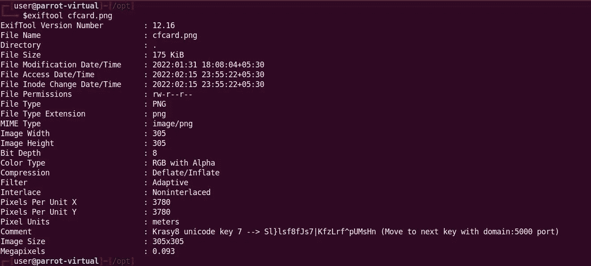

> *Krasy8 unicode 密钥 7 → Sl}lsf8fJs7|KfzLrf^pUMsHn(移动到下一个具有域:5000 端口的密钥)*

我不知道什么是**克拉斯。**在谷歌上搜索给出了一个 GitHub Repo，一个使用密钥进行编码和解码的工具。

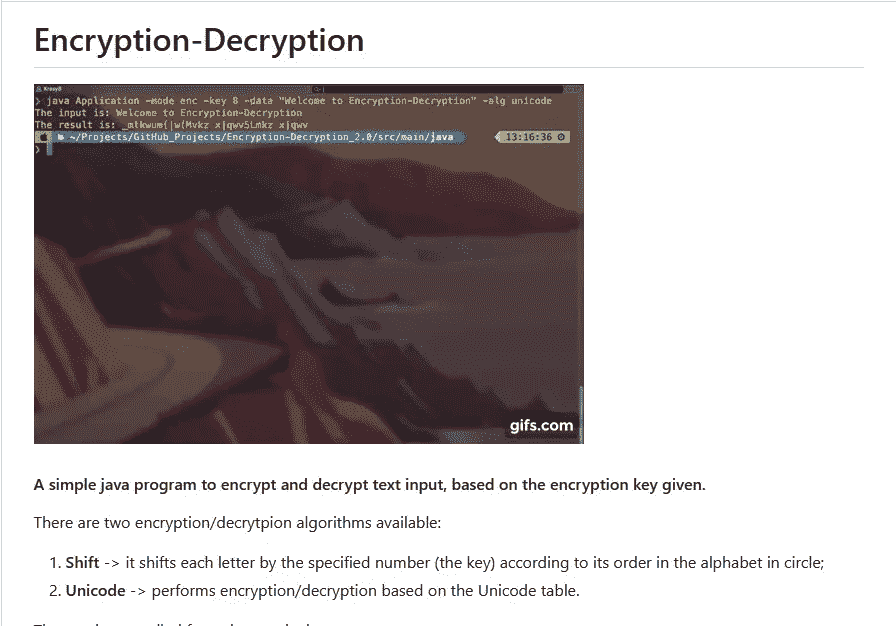

对注释中的文本进行解码后，我们得到了级别 1 的最终标志

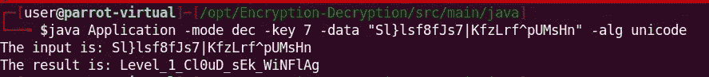

> **一级标志:Level_1_Cl0uD_sEk_WiNFlAg**

# 注射模板

*漏洞:服务器端模板注入{SSTI}*

我们现在转移到另一个端口(5000)来解决下一个问题。

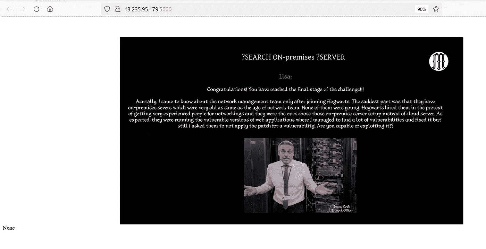

图像是不言自明的(对于“？搜索”参数)。不管怎样，我们做了一个启发式测试，发现页面接受一个参数**？搜索。**

模糊搜索参数给了我们一个有趣的结果。

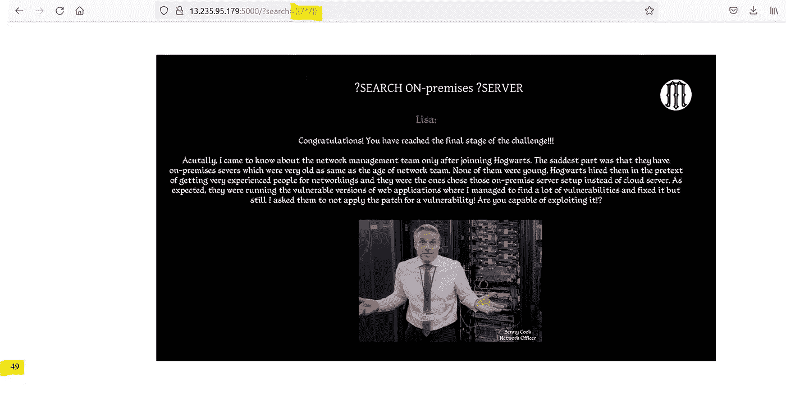

结果证实服务器易受 SSTI 攻击，后端使用的是 **Jinja2** 模板。我试图使用 **OS** 模块运行系统命令，但是失败了 ***【因为他们不希望我们在服务器上运行命令】***

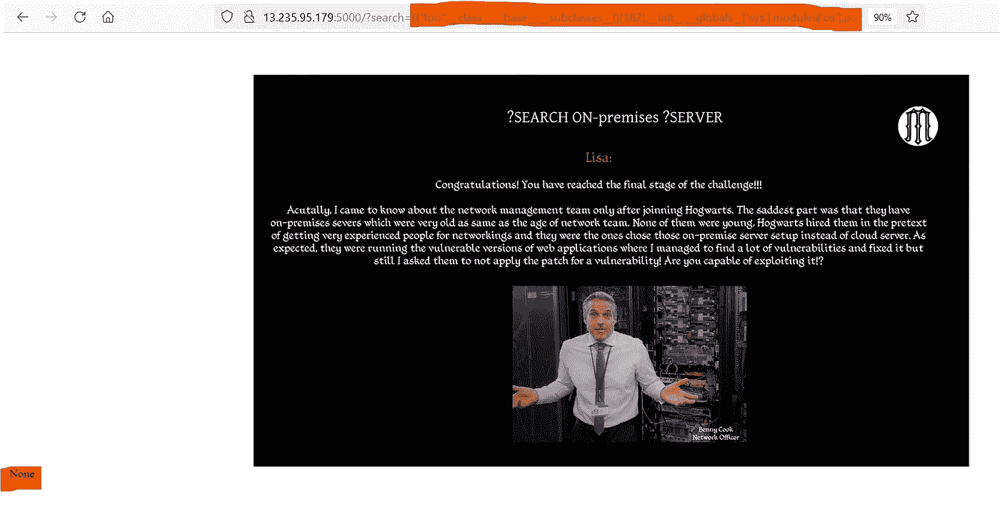

所以现在这里剩下的唯一路径是检查应用程序中的一些预定义对象，如**“Config”。我使用了 **{{Config }}** 对象，瞧！！！我收到了回复…**

**-什么是配置对象？**

config 对象是一个 Flask 模板全局，表示“当前配置对象(flask.config)”

它是一个类似字典的对象，包含应用程序的所有配置值。

在大多数情况下，这包括敏感值，如数据库连接字符串、第三方服务的凭证、SECRET_KEY 等。查看这些配置项就像注入有效负载 **{{ config.items() }}或{{config}}** 一样简单

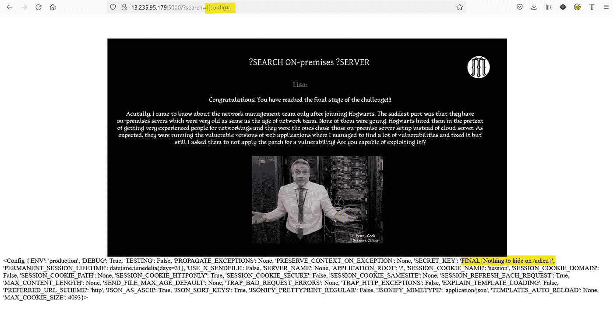

回复中有一段有趣的文字**{没什么好隐瞒的/再见}** 。

那么作为一名黑客，当有人告诉我们不要访问某个东西时，我们该怎么办呢？完全正确，我们参观它！！

# “再见”

移动到下一页，我们得到一个简单的页面

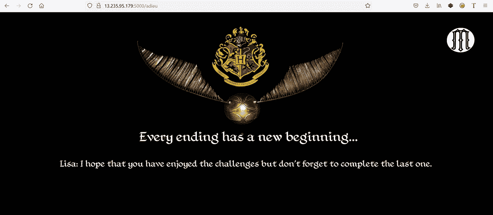

查看这个页面的源代码会给我们带来一些有趣的东西。

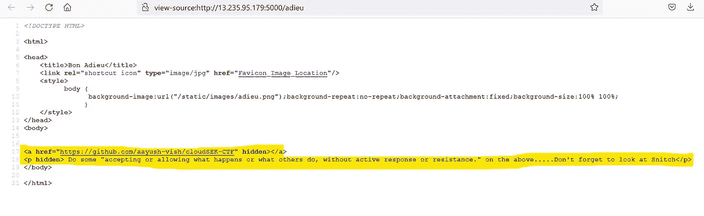

从这里我们得到一个 GitHub 回购的链接:[**https://github.com/aayush-vish/cloudSEK-CTF**](https://github.com/aayush-vish/cloudSEK-CTF)

手动访问回购给我们一个 404 错误，这意味着这个回购是私人的。我们需要做更多的工作来完成这个私人回购。

# GitHub Quest

通过更多的被动侦察，我们发现了私人回购所有者的一些索引提交。

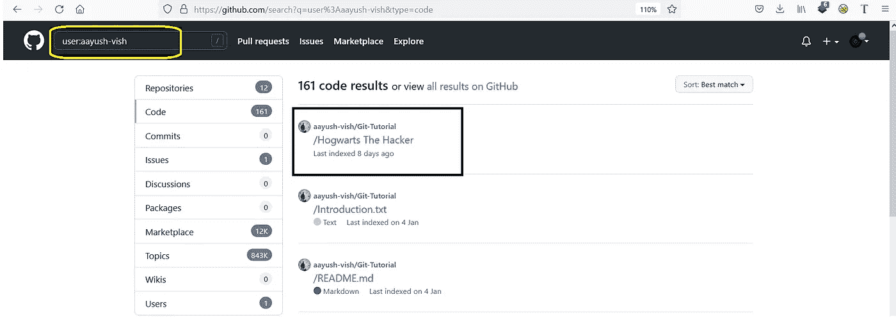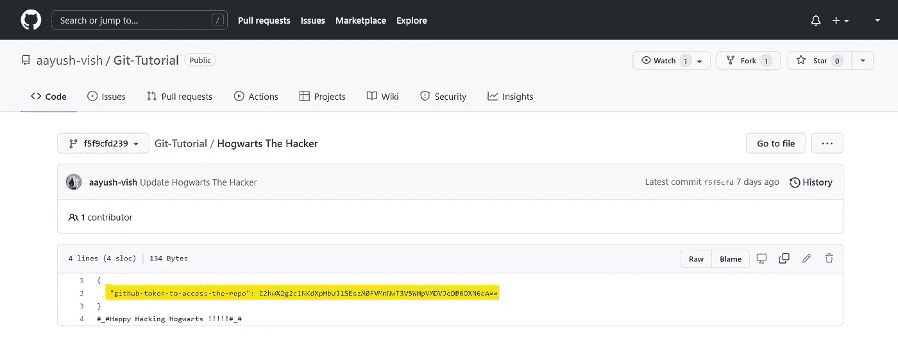

在这个文件中，我们找到了克隆回购的令牌

令牌是 Base64 编码的:**z 2 hwx 2g 1c 1 nkdxpbuj 1 seszm 0 fvmnnwt 3 V5 wpvmdvjedb 6 oxn 6 ca = =**

解码它给我们:**GHP _ h6 ssjuzgmbuhk 33 au 2 spouyxzu 05 ix0z 9 szp**

# 跟踪提交

克隆回购并没有给我们带来任何有趣的东西，所以是时候查看提交历史了。

初始搜索给了我们这个，虽然很有趣但是我们不需要这个。

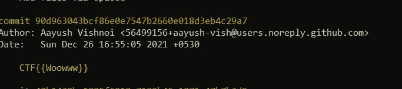

撤销提交后，我们发现一些非常有趣的事情，它是**标志**

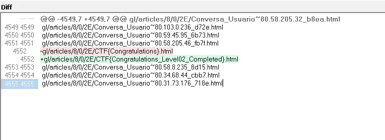

最后，我们找到了 2 级标志

> 二级标志:CTF {恭喜您 _Level02_Completed}。超文本标记语言

# 结束狩猎

这个 CTF 抛出了一些惊人的挑战，一些来自现实世界，另一些来自想象世界，就像哈利波特一样。

非常感谢你的阅读。喜欢就分享😇😇

关注我这里的 [***中的***](https://mayank-01.medium.com/follow) 和 [***订阅邮件列表***](https://mayank-01.medium.com/subscribe) **💌如果你想在我发表文章时得到它们。✨✨**

可以在推特上找我:[**mayank _ pandey 01**](https://twitter.com/mayank_pandey01)**👻**