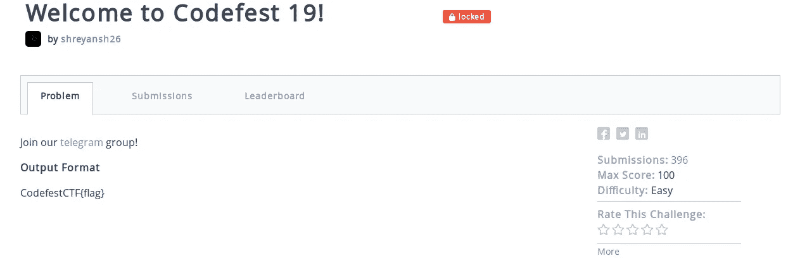
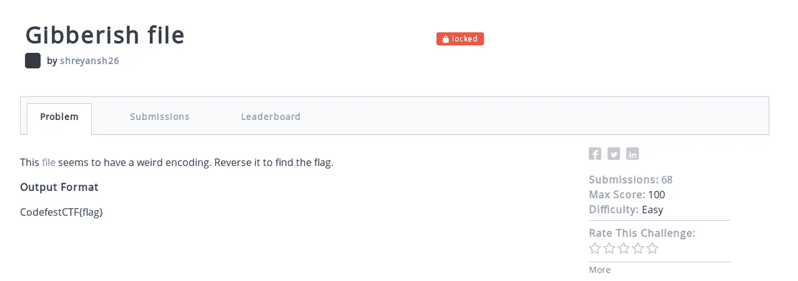
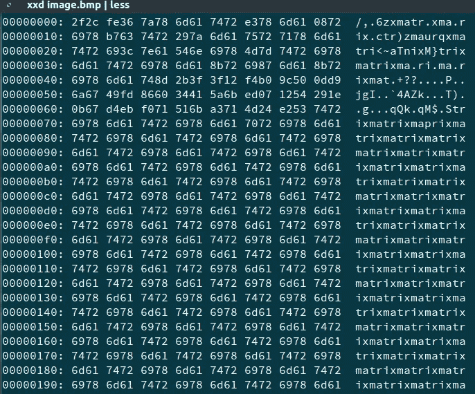
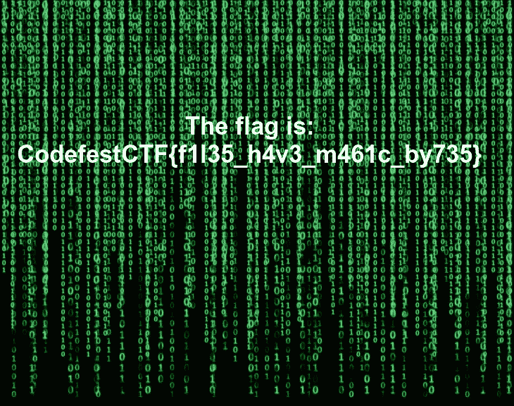
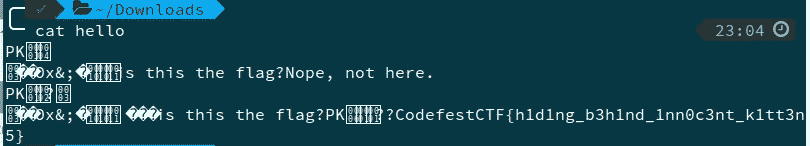
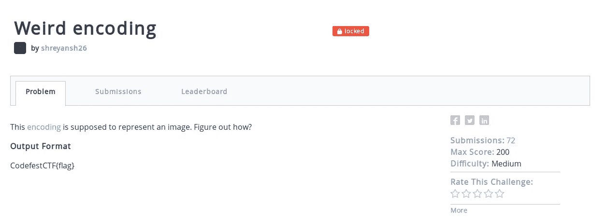
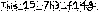
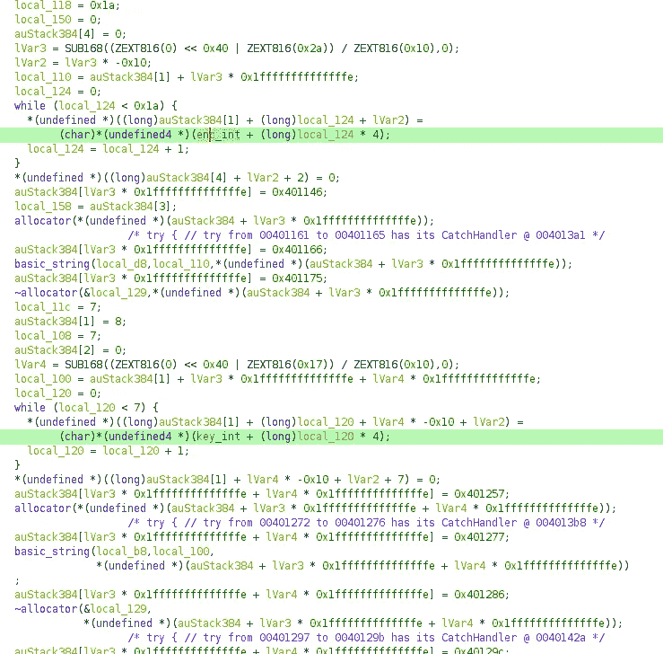
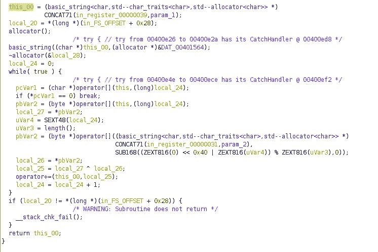
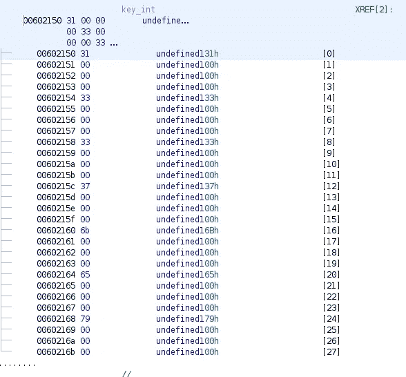

# code fest’19 CTF 评论

> 原文：<https://infosecwriteups.com/codefest19-ctf-writeups-a8f4e9b45d1?source=collection_archive---------0----------------------->

2019 年 8 月 23 日晚上 8 点至 2019 年 8 月 24 日中午 12 点在 Hackerrank 举办了 [Codefest'19](http://codefest.tech) 的夺旗活动。

比赛链接可以在这里找到[。总共有 **1532** 人注册和 **518** 人成功解决了至少一个挑战。](https://www.hackerrank.com/codefest19-ctf)

好了，继续写文章。

# 欢迎来到 Codefest 19！(入门挑战—100 分)

这是入门挑战。我试图让它比普通的入门挑战更难一些，但是我觉得这对初学者来说有点困难。

挑战

在这里，首先你必须加入与问题有关的电报组。在那里你得到了旗帜的前半部分—**CodefestCTF { G3t _ R3 ady _**。对于另一半，这个组上有一个固定的消息。

> 另一半旗是昨天不小心上传到比赛页面的。现已被移除。你能找到它吗？

为此，你必须使用[archive.org，](http://archive.org)这是 2019 年 8 月 23 日创建的竞赛页面的快照。查看[快照](https://web.archive.org/web/20190823133528/https://www.hackerrank.com/codefest19-ctf)得到了标志的后半部分—**f0r _ c 0 def 3 stctf-8 FB 34 FJ R4 bs 43 ur 8 }**。

所以，最后的标志是—**CodefestCTF { G3t _ R3 ady _ f0r _ c 0 def 3s tctf-8 FB 34 fjr 4 bs 43 ur 8 }**

# 这是什么语言？(杂项—100 分)

这基本上是一个深奥的语言问题。给定的文本是—

> iiisdsiiiiiiiiiiiiiiiiiiiiiiiiiiiiiiiiiiiiiiiiiiiiiiiiiiiiiiiiiiiiiiiiiiiiiiodddddddddddddddddddddddddddddoiiiiiiiiiiiiiiiiiiiiiiiiiiiiiiiiiiiiiiiiiiiiiiiiiiiiiiiiiiiiiiiiiiiiiiiiiiiiiiiiiiiiiiiiiiiiiiiiiiiiiiiiiiiiiiiiiiiiiiiiiiiiddddddddddddddddddddddddd

这种语言就是死鱼。你可以为那种语言使用一个在线解码器，类似于[这个](https://www.dcode.fr/deadfish-language)。

最后的旗帜是—**CodefestCTF { welco me _ t0 _ c0defest 19 }**

# 乱码文件(杂项—100 分)

挑战

提示在问题陈述中。你必须把文件倒过来才能找到旗子。一个简单的单行脚本就可以做到这一点

结果有一些文本，如

> 𝝩𝗵𝙚 𝗳𝒍𝙖𝗴 𝒊𝙨 𝐋𝒊𝐓𝚬𝐫𝚨𝐋﹏𝕽𝜠𝓥Ｅℜ𝕊𝐢𝙣𝓖ꓸ 𝝩𝗵𝙚 𝗳𝒍𝙖𝗴 𝒊𝙨 𝐋𝒊𝐓𝚬𝐫𝚨𝐋﹏𝕽𝜠𝓥Ｅℜ𝕊𝐢𝙣𝓖ꓸ 𝝩𝗵𝙚 𝗳𝒍𝙖𝗴 𝒊𝙨 𝐋𝒊𝐓𝚬𝐫𝚨𝐋﹏𝕽𝜠𝓥Ｅℜ𝕊𝐢𝙣𝓖ꓸ 𝝩𝗵𝙚 𝗳𝒍𝙖𝗴 𝒊𝙨 𝐋𝒊𝐓𝚬𝐫𝚨𝐋﹏𝕽𝜠𝓥Ｅℜ𝕊𝐢𝙣𝓖ꓸ 𝝩𝗵𝙚 𝗳𝒍𝙖𝗴 𝒊𝙨 𝐋𝒊𝐓𝚬𝐫𝚨𝐋﹏𝕽𝜠𝓥Ｅℜ𝕊𝐢𝙣𝓖ꓸ 𝝩𝗵𝙚 𝗳𝒍𝙖𝗴 𝒊𝙨 𝐋𝒊𝐓𝚬𝐫𝚨𝐋﹏𝕽𝜠𝓥Ｅℜ𝕊𝐢𝙣𝓖ꓸ 𝝩𝗵𝙚 𝗳𝒍𝙖𝗴 𝒊𝙨 𝐋𝒊𝐓𝚬𝐫𝚨𝐋﹏𝕽𝜠𝓥Ｅℜ𝕊𝐢𝙣𝓖ꓸ 𝝩𝗵𝙚 𝗳𝒍𝙖𝗴 𝒊𝙨 𝐋𝒊𝐓𝚬𝐫𝚨𝐋﹏𝕽𝜠𝓥Ｅℜ𝕊𝐢𝙣𝓖ꓸ 𝝩𝗵𝙚 𝗳𝒍𝙖𝗴 𝒊𝙨 𝐋𝒊𝐓𝚬𝐫𝚨𝐋﹏𝕽𝜠𝓥Ｅℜ𝕊𝐢𝙣𝓖ꓸ 𝝩𝗵𝙚 𝗳𝒍𝙖𝗴 𝒊𝙨 𝐋𝒊𝐓𝚬𝐫𝚨𝐋﹏𝕽𝜠𝓥Ｅℜ𝕊𝐢𝙣𝓖ꓸ 𝝩𝗵𝙚 𝗳𝒍𝙖𝗴 𝒊𝙨 𝐋𝒊𝐓𝚬𝐫𝚨𝐋﹏𝕽𝜠𝓥Ｅℜ𝕊𝐢𝙣𝓖ꓸ 𝝩𝗵𝙚 𝗳𝒍𝙖𝗴 𝒊𝙨 𝐋𝒊𝐓𝚬𝐫𝚨𝐋﹏𝕽𝜠𝓥Ｅℜ𝕊𝐢𝙣𝓖ꓸ 𝝩𝗵𝙚 𝗳𝒍𝙖𝗴 𝒊𝙨 𝐋𝒊𝐓𝚬𝐫𝚨𝐋﹏𝕽𝜠𝓥Ｅℜ𝕊𝐢𝙣𝓖ꓸ 𝝩𝗵𝙚 𝗳𝒍𝙖𝗴 𝒊𝙨 𝐋𝒊𝐓𝚬𝐫𝚨𝐋﹏𝕽𝜠𝓥Ｅℜ𝕊𝐢𝙣𝓖ꓸ 𝝩𝗵𝙚 𝗳𝒍𝙖𝗴 𝒊𝙨 𝐋𝒊𝐓𝚬𝐫𝚨𝐋﹏𝕽𝜠𝓥Ｅℜ𝕊𝐢𝙣𝓖ꓸ

该标志是每个 unicode 字符的 ASCII 模拟。

标志是—**CodefestCTF { LiTErAL _ REVERSinG }**

# 图像损坏(取证—100 分)

在挑战中，你得到了一个损坏的*的链接。bmp* 文件[文件](https://drive.google.com/file/d/1t5d_lKkdoG1aicBJYhM8wqh7Ispk0G4U/view)。在十六进制编辑器中查看文件，并检查神奇的字节——

图像的十六进制视图

我们知道与“矩阵”有关。也是为了一个正常的*。bmp* 文件初始幻字节是 424d 8a44 1300。将它与给定文件的前六个字节进行异或运算也可以得到“矩阵”。因此，为了解决这个问题，我们用“矩阵”对整个图像进行异或运算。

 [## [Python]image _ corruption . py-Pastebin.com

pastebin.com](https://pastebin.com/Bm8yj9bu) 

运行脚本，您将获得正确的文件。

正确的文件

标志为—**CodefestCTF { f1l 35 _ h4v 3 _ m461c _ by 735 }**

# 邮件捕获(隐写术—100 分)

您将看到一个“电子邮件友好文本”。这是由一个叫做 **uuencode** 的工具编码成 unicode 的。可以使用 **uudecode** 对其进行解码，这是一种针对此类格式的解码器。用这个文件运行 **uudecode** 会给出一个名为“flag_encoded”的输出文件。内容为标志—**CodefestCTF { 7 h15 _ 15 _ 4 _ c001 _ 3 NC 0 D1 n 9 }**

# 猫是无辜的吧？(隐写术—500 分)

该挑战基于 LSB 隐写术。我曾经使用过一个叫做 [**的工具来隐藏**](https://github.com/DimitarPetrov/stegify) 。

挑战图像-

挑战图像

在运行命令时-

> steg ify-op decode-carrier cute _ kittens . jpg-result hello

我们得到一个 *hello.zip* 文件，它嵌入在图像的 LSB 中。zip 文件中有一个文件，但是没有用。该标志被附加在 zip 文件的末尾。

该标志附加在 zip 文件的末尾

标志为—**CodefestCTF { h1 D1 ng _ B3 h1 nd _ 1 n0 C3 nt _ k1 TT 3n 5 }**

# 奇怪的编码(杂项—200 分)

挑战

我们被赋予以下“编码”

 [## 0x 85+1x1+0x 14 0x 7+1x1+0x 7+1x1+0x 9+1 x2+0x 3+1 x4+0x 3+1x1+0x 6+1 X5+0x 1+1x1+0x 2+1x1+0-Pastebin.com

### 还不是 Pastebin 的成员？注册吧，它解锁了许多很酷的功能…

pastebin.com](https://pastebin.com/dDUwXnZJ) 

这里需要进行一点观察，以弄清楚“x”符号表示一个字符的串联数，比如 0x5 表示 00000。“+”意味着两个不同类型字符串的连接。此外，还必须决定 0 代表 255 255 255，即颜色*白色*，1 代表 0 0 0，即颜色*黑色*。你可以尝试两种组合，但最终你会得到正确的映射。

以下脚本可以帮助生成图像。

 [## [Python]image _ encoding . py-Pastebin.com

### 创建新粘贴/交易新！/语法语言/存档/常见问题/工具/夜间模式/api/抓取 API 隐私声明…

pastebin.com](https://pastebin.com/yG6kTKtp) 

得到的图像是这样的

你可能想放大一点。

标志是—**CodefestCTF { This _ 15 _ 7 H3 _ f14g }**。

# Linux RE 1(反转—300 分)

由于实现了一些反调试技术，使用调试器解决这个挑战有点困难。此外，最初 ELF 是使用 UPX 打包的，当您运行 **strings** 命令时，它显示为一个字符串。所以，第一次使用

> upx -d

用小精灵给它解压。

对于下一部分，您可以使用反汇编程序或反编译器来获取源代码，并最终反转二进制文件。可执行文件是从 C++文件生成的，因此在反编译程序中查看会有点混乱。

主函数(有趣的部分)的反编译视图(使用 Ghidra)如下

反编译主函数

*key_int* 和 *enc_int* 是全局变量。ELF 的主要逻辑在 **rahasya** 函数中。

反编译的 rahasya 函数

这基本上接受两个字符串，并对它们进行 xor 运算，然后返回 XORd 字符串。它作为输入的两个字符串是用户输入和 *key_int* 字符串。XORd 数据与 *enc_int* 数据匹配。

因此，基本上要反转二进制，你必须对 *key_int* 和 *enc_int* 数据进行异或运算。

enc_int 数据

key_int 数据

基本上，

> *int*enc _ int[]**=**{ 80，93，3，67，3，86，11，110，64，2，90，27，84，28，110，75，3，69，52，6，11，5，80，88，90，88 }；
> 
> *int*key _ int[]**=**{ 49，51，51，55，107，101，121 }；

将两者异或，得到*an 0 th 3 r _ s1mp 1 e _ x0r _ Cr 4c km 3*

所以，标志是**CodefestCTF { an 0 th 3 r _ s1mp 1 e _ x0r _ Cr 4c km 3 }**

# Linux RE 2(反转—500 分)

我们再次在 IDA 或任何反汇编程序和/或反编译器中打开文件，我们看到输入应该满足输入字母的一组条件。

这些条件可以翻译为

 [## [c++]chall _ conditions . CPP-Pastebin.com

### 还不是 Pastebin 的成员？注册吧，它解锁了很多很酷的功能！我们将 cookies 用于各种目的，包括…

pastebin.com](https://pastebin.com/UHyGa22P) 

我们可以使用类似 z3 的某种 SMT 求解器来找到密码。

 [## [Python]z3 _ solver . py-Pastebin.com

### 创建新粘贴/交易新！/语法语言/存档/常见问题/工具/夜间模式/api/抓取 API 隐私声明…

pastebin.com](https://pastebin.com/4LHcp1k7) 

获得的密码是—*should ve _ used _ some _ tool*

因此，该标志为**CodefestCTF { should ve _ used _ some _ tool }**

# 车窗 RE(倒车—500 分)

在这个问题中，提供的 Windows exe 文件(实际上是一个. NET 文件)被打包了[的 ConfuserEx](https://yck1509.github.io/ConfuserEx/) 。我们可以使用 [NoFuserEx，](https://github.com/CodeShark-Dev/NoFuserEx)这是这种封隔器的免费去泡沫器。

然后，在任何。NET 反编译器，如 dnSpy，并检查**表单**函数以获得密码和标志。

> 密码—这是 1337 密码

flag—**CodefestCTF { 51mp 13 _ 1 npu 7 _ v411d 4710n _ 8u 7 _ w17h _ 4 _ 7w 157 }**

# 没有肥胖问题(网页-600 分)

我会在这里作弊一点。你可以看看我的朋友 Yashit 关于挑战的精彩评论。

标志为—**CodefestCTF { 1 amtehhax 00 RR 4 uj 8 RFI 4 e $ % y5yhrf }**

*希望你在解决挑战的过程中度过了愉快的时光，这对初学者来说也是一次很好的学习经历。*

在 [Twitter](https://twitter.com/shreyansh_26) 、 [Github](https://github.com/shreyansh26) 上关注我，或者在 [LinkedIn](https://www.linkedin.com/in/shreyansh26/) 上联系我。

*关注* [*Infosec 报道*](https://medium.com/bugbountywriteup) *获取更多此类精彩报道。*

 [## 信息安全报道

### 收集了世界上最好的黑客的文章，主题从 bug 奖金和 CTF 到 vulnhub…

medium.com](https://medium.com/bugbountywriteup)