# ColddBox 简易试用版

> 原文：<https://infosecwriteups.com/colddbox-easy-tryhackme-writeup-c2924bc634ce?source=collection_archive---------5----------------------->

**作者 Shamsher khan 这是一篇关于 try hackme room“cold box Easy”的文章**

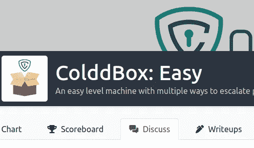

【https://tryhackme.com/room/colddboxeasy 号

**难度**:简单
**瞄准**:黑掉这台机器，获得*用户*和*根*标志。

**THM:**https://www.tryhackme.com/room/colddboxeasy

**VulnHub:**https://www.vulnhub.com/entry/colddbox-easy,586/

具有多种升级权限方式的简易关卡机。

# 情报收集

**目标:**我的情况是 10.10.196.79

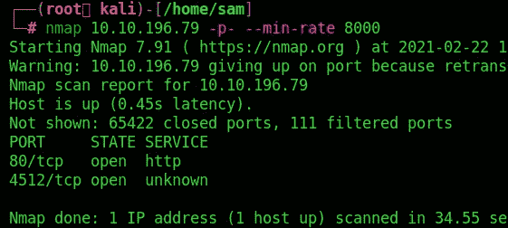

然后进一步扫描，在发现的端口上运行默认脚本和版本检测:

```
nmap -sC -sV -vvv -p 80,4512 10.10.196.79
```

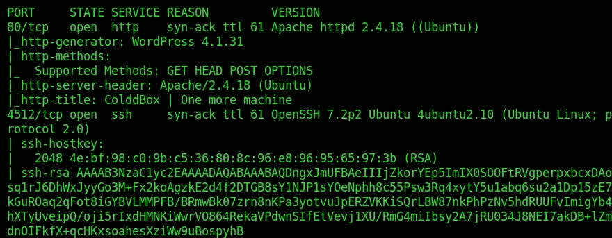

由此我们可以看到以下端口和服务:

*   端口 80/TCP—HTTP—(Apache httpd 2 . 4 . 18—运行 WordPress 博客)
*   端口 4512/tcp — SSH — (OpenSSH 7.2p2)

# 列举

在浏览器中查看网页可以确认 WordPress 正在使用中。

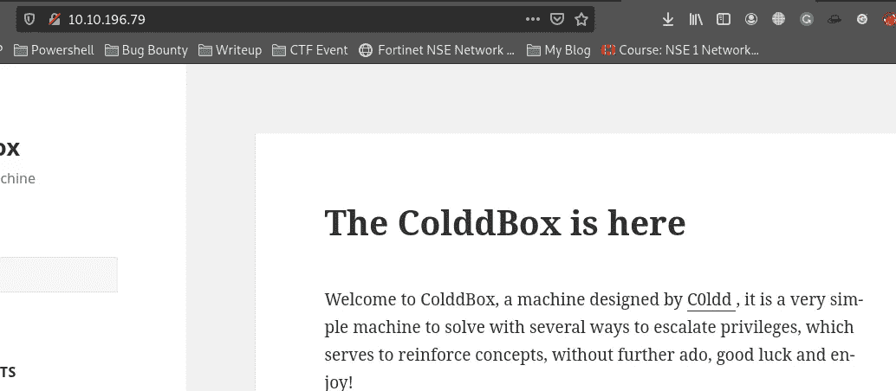

wpscan 可用于为用户、插件、主题等列举 WordPress:

```
wpscan --url http://10.10.196.79 -e
```

正在使用的主题是 ***第二十五个*** :

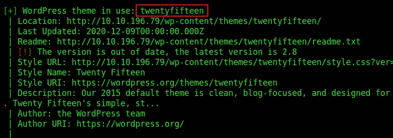

确定了 3 个有效用户:

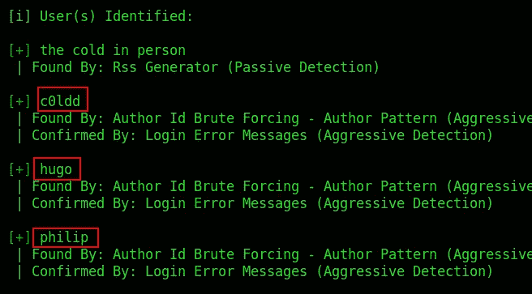

我们可以尝试使用 *rockyou.txt* 单词表来破解这些用户的密码:

```
wpscan --url [http://](http://10.10.196.79)10.10.196.79[/](http://10.10.196.79) -U philip,c0ldd,hugo -P /usr/share/wordlists/rockyou.txt
```

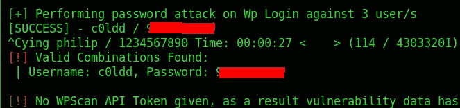

成功！我们已经找到了 ***c0ldd* 的密码。**

# 获得访问权限

我们现在可以用上面的凭证登录 WordPress。

```
[http://10.10.196.79/wp-login.php](http://10.10.196.79/wp-login.php)
```

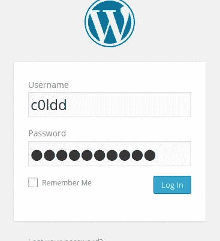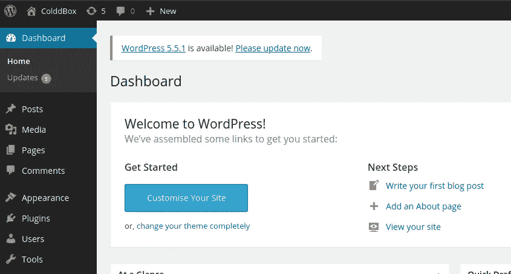

为反向外壳创建一个插件

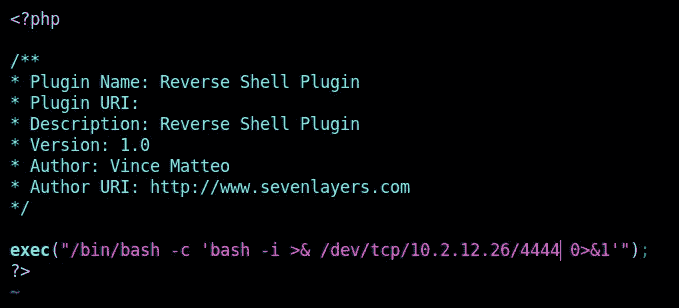

压缩成 zip 文件

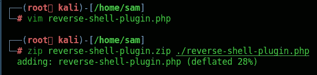

一旦我们把它压缩好，我们就转移到 WordPress 用户界面。在插件下，我们选择添加新插件:

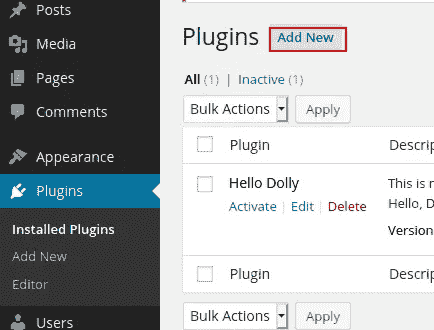

选择上传插件:

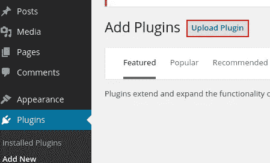

我们浏览新创建的插件:

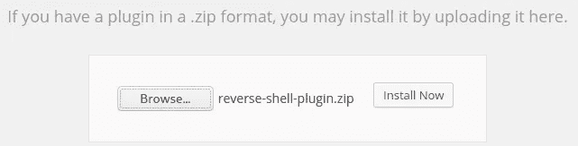

现在启动 netcat shell

```
nc -lvp 4444
```

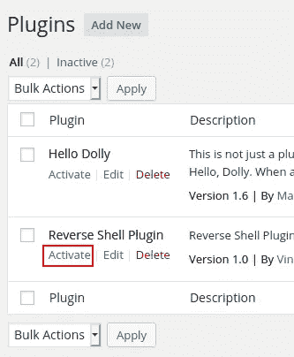

点击激活获取外壳

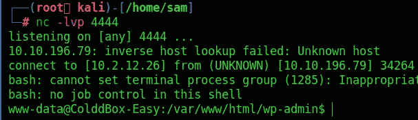

嘣！我们有贝壳

然后可以从*config.php*文件中获得数据库用户和密码:

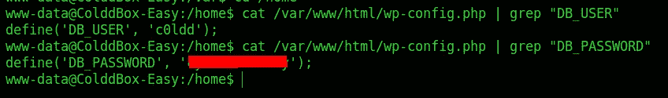

我们可以通过运行以下命令将其升级为完全交互式的 shell:

```
python3 -c 'import pty; pty.spawn("/bin/bash")'
export TERM=xterm
Ctrl + Zstty raw -echo; fg   (from local terminal)
<enter>
```

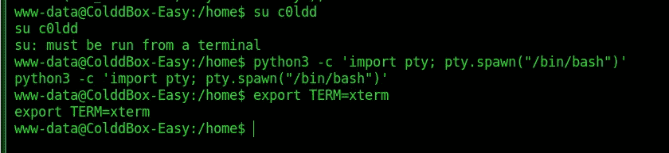

使用凭据登录

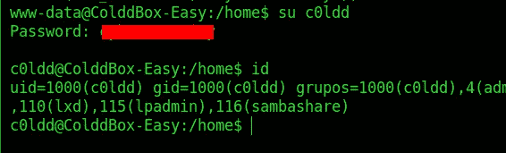

可以在主目录中找到 *user.txt* 标志:

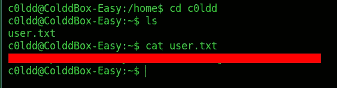

该标志以 Base64 格式编码，但在提交给 THM 时不需要解码。

接下来，我们可以检查用户 *c0ldd* 是否拥有任何 *sudo* 权限:

# 权限提升

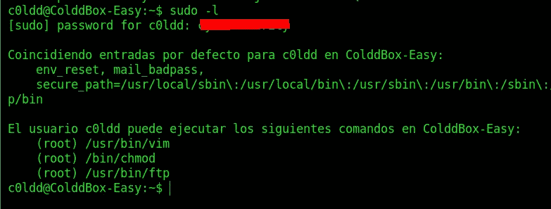

*c0ldd* 拥有 **vim、chmod** 和 **ftp 的 sudo 权限。**

这里有多种选择…

**通过/usr/bin/vim 进行权限提升:**

[https://gtfobins.github.io/gtfobins/vim/#sudo](https://gtfobins.github.io/gtfobins/vim/#sudo)

```
sudo vim -c ':!/bin/sh'
<enter>
```

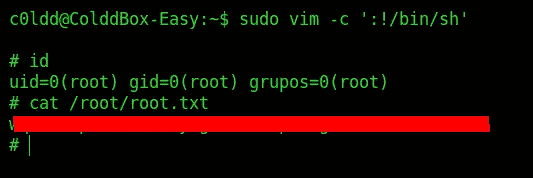

**通过/usr/bin/chmod 进行权限提升:**

【https://gtfobins.github.io/gtfobins/chmod/#sudo 

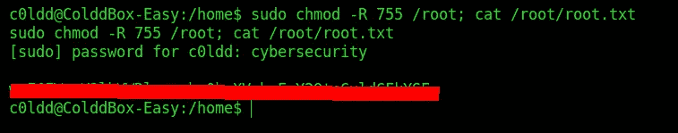

# 文件传送协议

 [## ftp | GTFOBins

### 它可以通过生成交互式系统外壳来突破受限环境。它可以渗出…

gtfobins.github.io](https://gtfobins.github.io/gtfobins/ftp/#sudo) 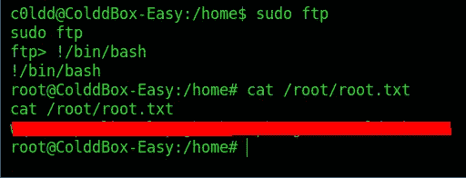

你可以在:
**LinkedIn:-**[https://www.linkedin.com/in/shamsher-khan-651a35162/](https://www.linkedin.com/in/shamsher-khan-651a35162/)
**Twitter:-**[https://twitter.com/shamsherkhannn](https://twitter.com/shamsherkhannn)
**Tryhackme:-**[https://tryhackme.com/p/Shamsher](https://tryhackme.com/p/Shamsher)


更多演练敬请关注……
出发前…

访问我的其他演练:-

感谢您花时间阅读我的演练。如果您觉得它有帮助，请点击👏按钮👏(高达 40 倍)并分享
它来帮助其他有类似兴趣的人！+随时欢迎反馈！