# cold box:EASY[Vulnhub]演练

> 原文：<https://infosecwriteups.com/colddbox-easy-vulnhub-walkthrough-cac3680e03c2?source=collection_archive---------1----------------------->

大家好，我是迪尼杜·贾亚辛格，今天我与你们分享我的第三篇文章。本文是 cold box:EASY Vunhub box 的演练。这个盒子也是一个引导到根的初级挑战。但是有两面旗子来接我们。你可以从[这里](https://www.vulnhub.com/entry/colddbox-easy,586/)找到这个 Vulnhub 盒子。

# 方法学

*   网络扫描
*   查点/侦察
*   上传反向外壳
*   权限提升

# 网络扫描

首先，我必须找到目标机器的 IP 地址。所以我用 **netdiscover** 命令找到了它。

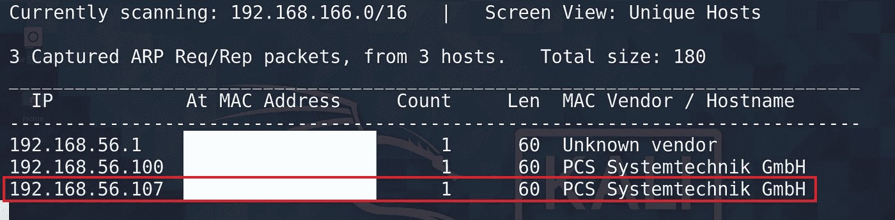

但是有两个 IP 地址具有相同的主机名。然后我执行 **whatweb** 命令来识别目标 IP。

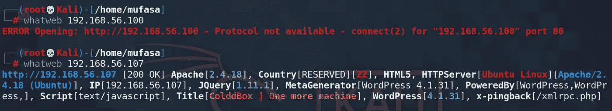

在此之后，我确定了我的目标机器的 IP。现在我开始列举这一部分。

# 查点/侦察

我对目标 IP 执行了一个 **nmap** 扫描，找出开放的端口和在这些端口上运行的版本。

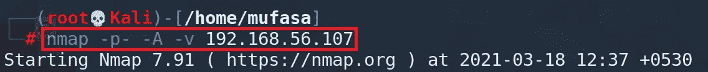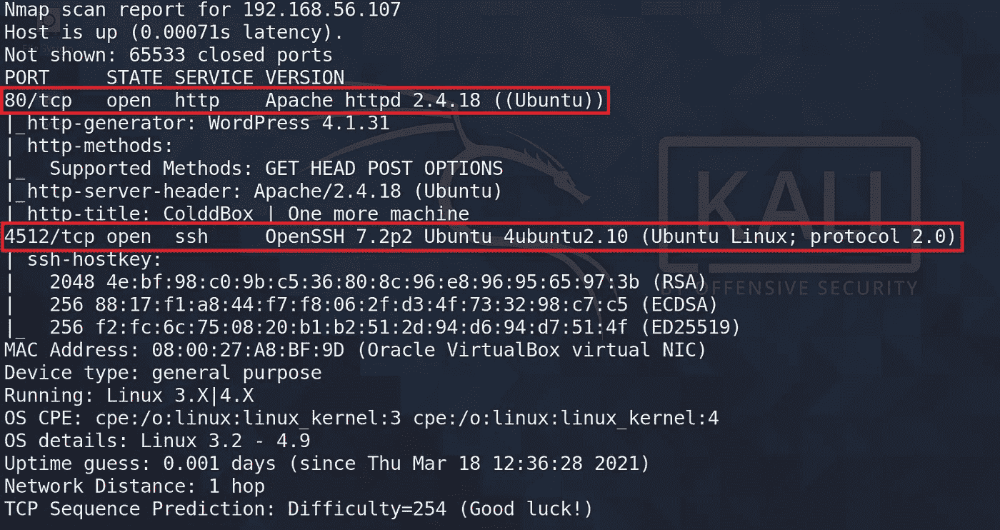

从这个 **nmap** 扫描，我发现有两个开放的端口。

👉端口: **80** /tcp |服务:http |版本:Apache httpd 2.4.18

👉端口 **4512** /tcp |服务:ssh |版本:OpenSSH 7.2p2

从这一点，我确定端口 80 是开放的，然后它与浏览器的工作。我把目标 IP 地址输入浏览器。

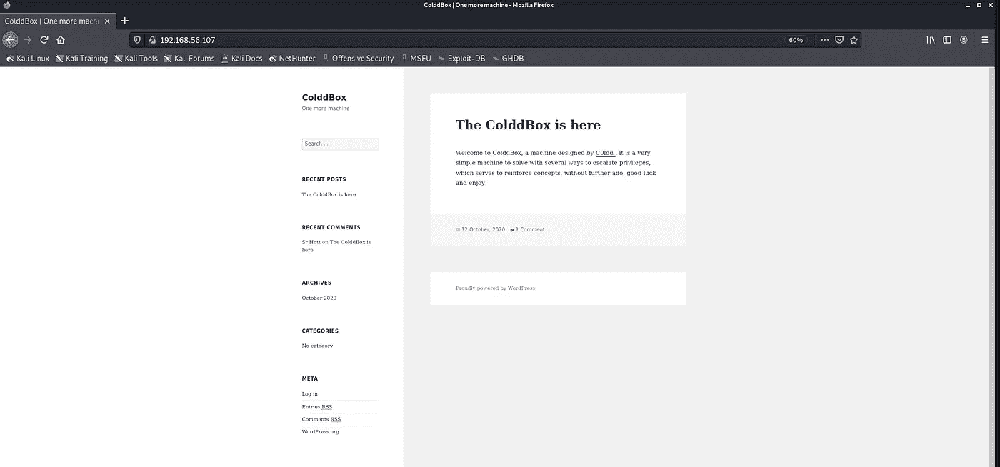

底部有一个登录链接。

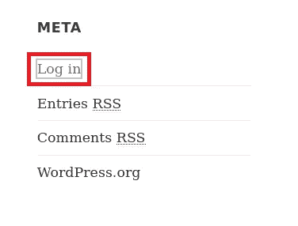

现在，我单击该链接并浏览到该链接。然后我可以根据 WordPress 来识别这个。但是我以前从 **whatweb** 命令中发现了这一点。

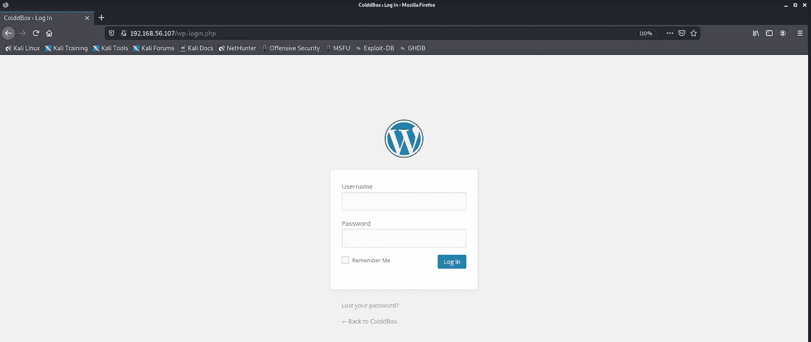

所以现在我用 **wpscan** 工具找出他们的用户名和密码。首先，我列举用户名。

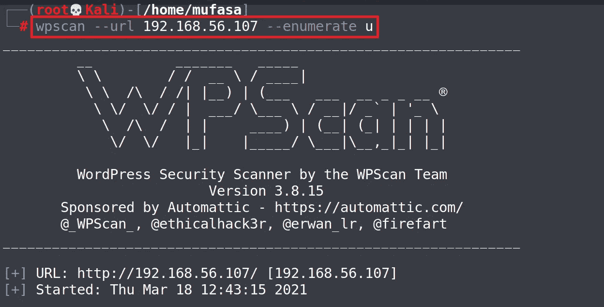

由此，我发现有几个用户名与此有关。

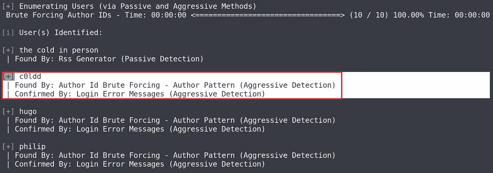

我选择了 **c0ldd** 用户名，并使用 **wpscan** 执行一个命令来查找它的密码。

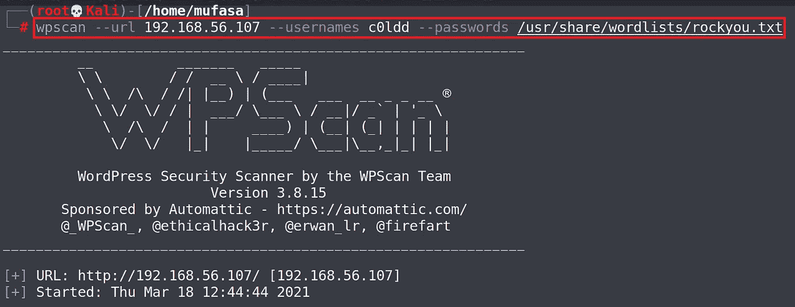

从这里，我找到了密码👉 **9876543210**

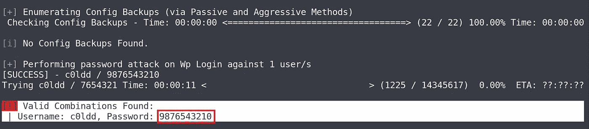

现在，我用这个用户名和密码登录到 WordPress 管理仪表板。

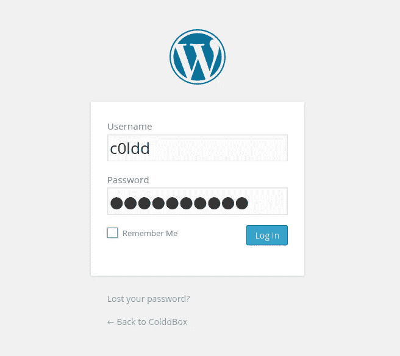

酷，现在我在管理仪表板。

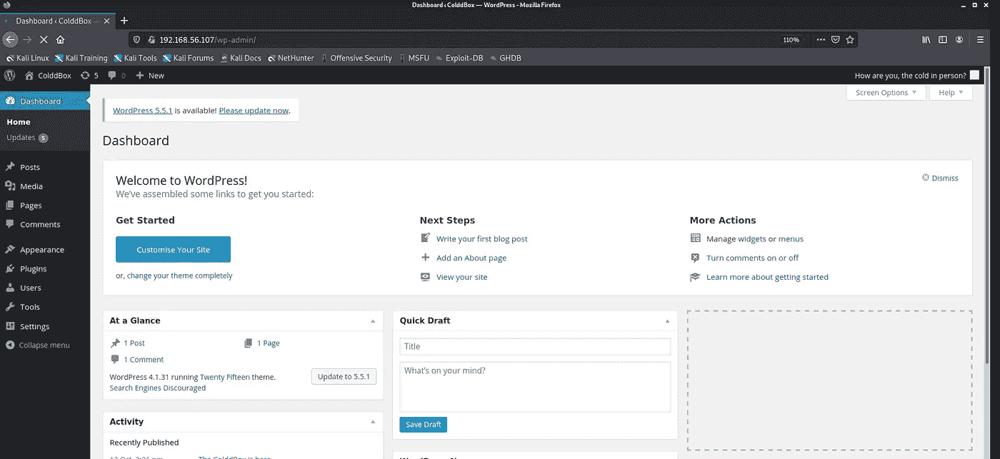

# 上传反向外壳

接下来就是弄个**反壳**。为此，我们可以通过修改**header.php**来增加一个**反向刀架** l。为此，您可以遵循以下步骤。

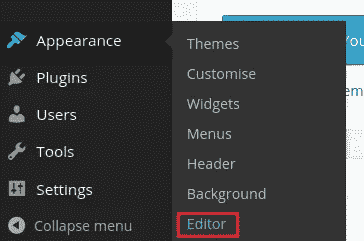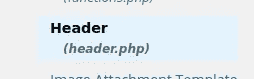

我将通过 **pentestmonkey** 使用[**PHP-reverse-shell**](https://github.com/pentestmonkey/php-reverse-shell)。这是 GitHub 的回购协议。

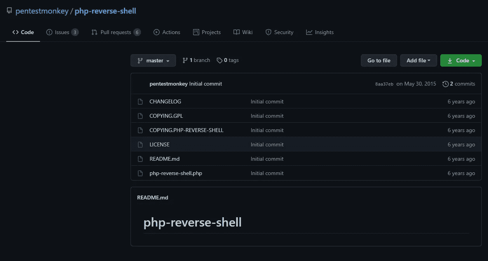

拿到这个**反向外壳**后，我把它复制到 WordPress 仪表盘中的**header.php**文件中。

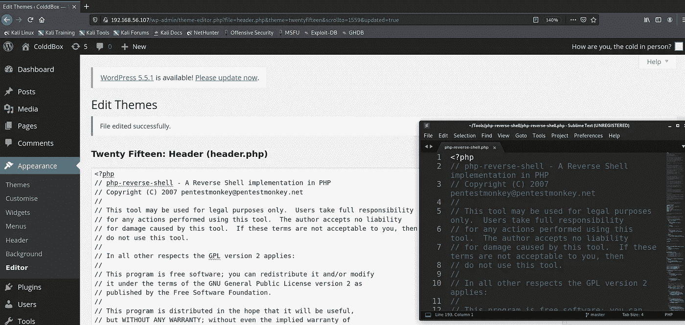

在这个**反壳**中，我们必须改变我们的 IP 和端口。为此，我执行 **ipconfig** 命令来查找我的 IP 地址。

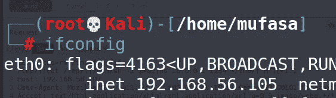

之后，我改变了 header.php 的文件，它保存在背面。

👉 **IP = '192.68.56.105'**

👉 **PORT =4545**

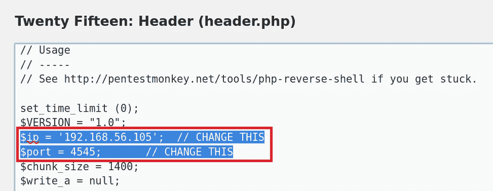

更改后，我打开我的 kali 终端并使用 **Netcat 工具**监听端口 **4545**

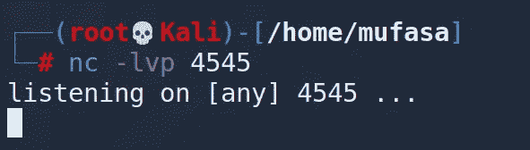

在列出该端口时，我们必须在浏览器上重新浏览目标 IP 地址。然后，我们可以在 Kali 终端上看到一个低特权外壳。

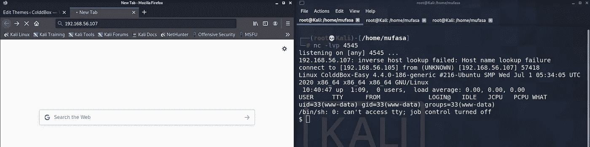

现在我打开了**python 产生的 shell。**你可以用这个命令来调一下。

👉**python 3-c ' import pty；pty.spawn("/bin/bash")'**

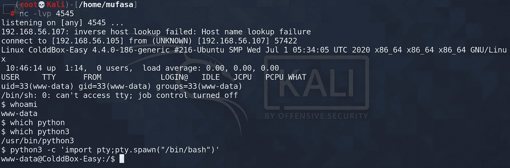

现在我们可以看到 php 文件。最重要的是 wp-config.php 文件，因为它包含数据库的用户名和密码。

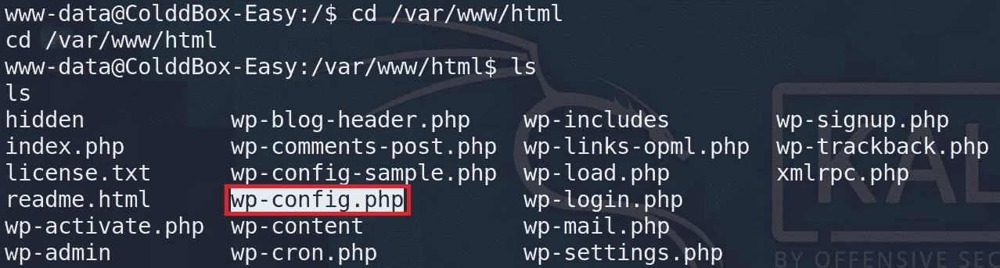

所以我用**更多的**命令来查看那个文件，找到用户名和密码。

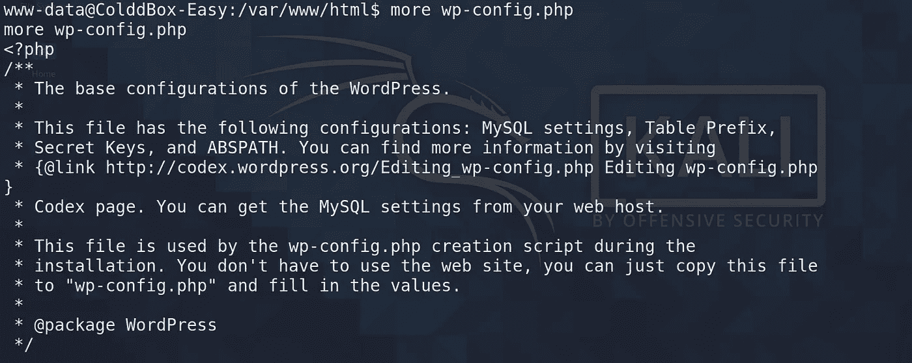

由此，我可以获得凭证。

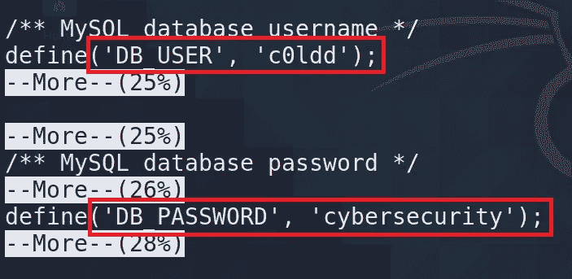

现在，我使用这些凭证登录到该帐户。

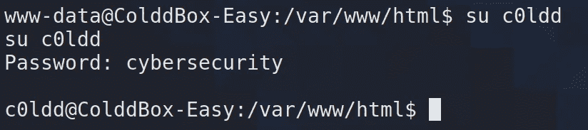

太棒了，现在我在 c0ldd 账户里。但是我没有获得 root 权限。现在我执行 **ls** 命令来知道那里有什么文件。

然后我找到一个名为 **user.txt.** 的文件，然后我使用 **cat** 命令来查看文件的内容。由此，我在文件中发现了一些加密文本。它看起来像是经过 base64 编码的文本。所以我用我的卡利盒破译了那条短信。

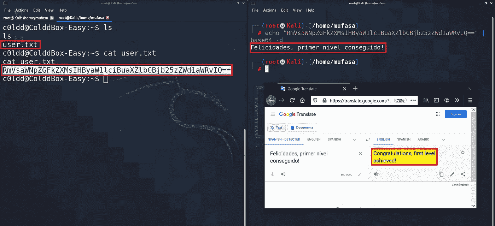

太棒了，我找到了文件中的第一面旗帜。正是👉**祝贺你，第一关成功！**

# 权限提升

在获得根权限的第一步，我执行 **sudo -l** 命令来列出提供根权限的二进制文件。

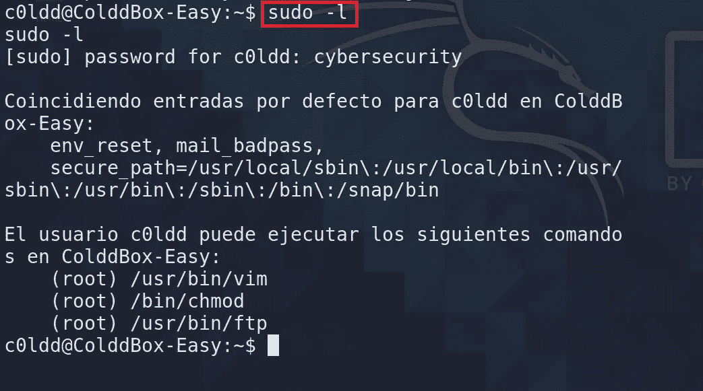

现在使用 **GTFOBins** 来利用上面的二进制文件。我选择了 **ftp** 来利用。这是对那个的命令。你可以从[这里](https://gtfobins.github.io/)拿。

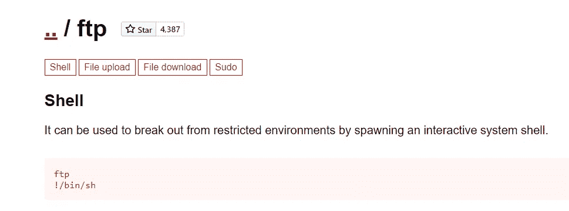

现在我要利用它。

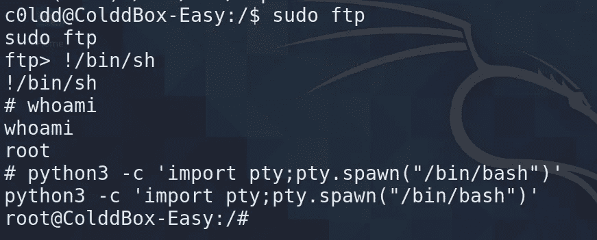

很酷，**现在我在根上**。然后我要找到这个盒子的下一面旗帜。

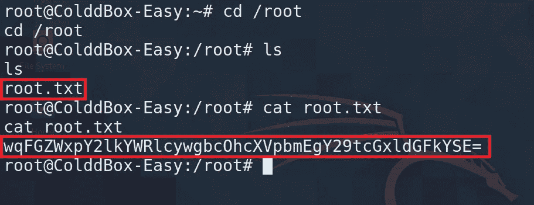

哇，我是从 **ls** 命令中找到这个 **root.txt** 的。然后我用 **cat** 命令查看文件的内容。就像之前的文件( **user.txt** )。它有 base64 编码的文本。然后我用我的卡利盒破译了那条信息。

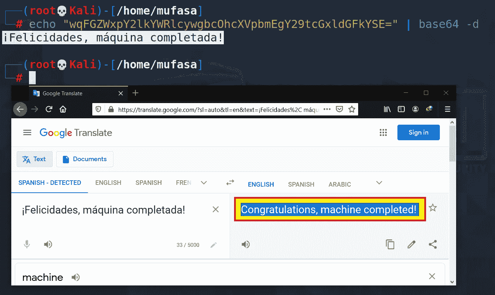

太棒了，没错👉**恭喜，机器完成**。所以我想你大概知道我在这个盒子里用的是什么机制，以及我们能从中做些什么。

我认为这篇文章对你提高知识是有用的。如果你想了解社会工程和缓解机制之间的区别，这里有一篇我写的文章。如果你有兴趣阅读，那么点击 [**这里**](https://dinidhujayasinghe.medium.com/comparing-different-types-of-social-engineering-techniques-477336207f70) 。

## 让我们来看看另一篇文章。下次见，再见🙌祝你黑客生涯愉快😈😈。