# 结合 Hadoop 和 MCollective 实现全面网络妥协

> 原文：<https://infosecwriteups.com/combining-hadoop-and-mcollective-for-total-network-compromise-cda00429af27?source=collection_archive---------2----------------------->

这是一个仅用两个不安全的配置就能让我们搞垮整个云托管公司的故事。对于一个相对较大的客户来说，这是一个灰箱测试，我们的任务是评估大约 5 个开发端点的安全性，只能使用客户端证书访问。设置好环境后，我们开始扫描端点，Nessus 很快返回了一个可利用的漏洞:

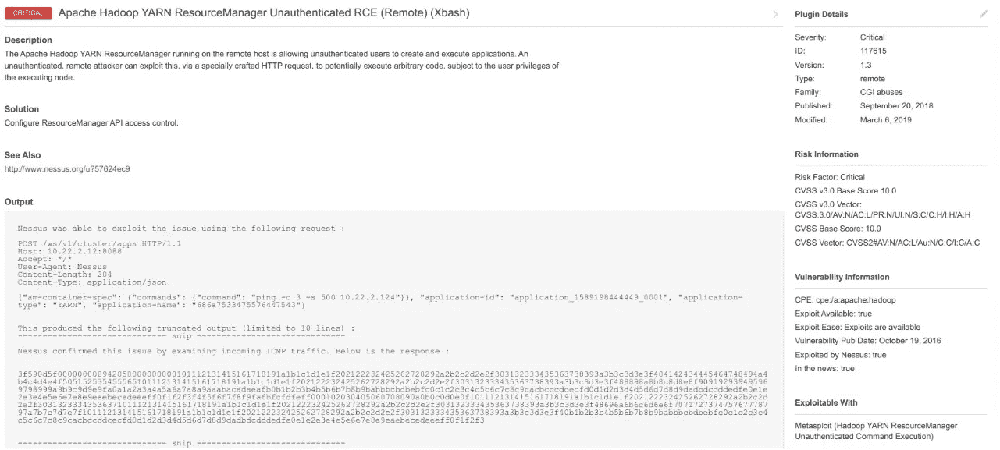

Hadoop 公开了这个 API 来管理它的资源。应该进行身份验证，以防止匿名命令的执行。快速搜索 ploit 搜索返回了一个可用的 RCE 漏洞。

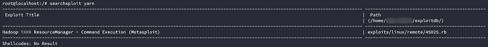

描述大概是这样的:

> 该模块通过 ResourceManager REST API 利用了 Apache Hadoop 中未经验证的命令执行漏洞。

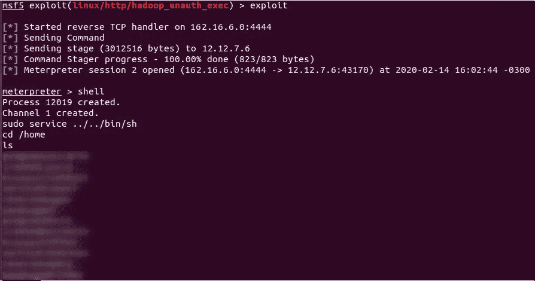

是的，那些被审查的名字都是系统管理员。

无论您何时在 Hadoop 环境中工作，都可以从以下两个优秀的资源开始(均来自 wavestone):

*   [https://www.slideshare.net/phdays/hadoop-76515903](https://www.slideshare.net/phdays/hadoop-76515903)
*   【https://github.com/wavestone-cdt/hadoop-attack-library 号

在这种情况下，我们已经通过 YARN ResourceManager API 控制了整个集群。引用 Hadoop 攻击库中的一段话:

> 由于 MapReduce 作业的**分布式本质，不可能指定您想要在哪个节点上执行您的有效负载。没有机制**来确保您将在**上启动的有效负载两个连续的作业**将在**同一个集群成员**上执行。

基本上，您发送给 API 的每个命令都将被映射到一个随机节点。
这实际上对我们是有益的，因为每次我们运行漏洞利用时，我们都会到达一个(可能)带有新信息的不同实例。当然，手动尝试每一种可能性并不是一个聪明的方法，所以让我们在一个随机的 datanode 上做一些枚举。

使用 hdfs 二进制文件可以从集群中获得大量信息。有用的报告可以通过以下方式查询

```
hdfs dfsadmin -report
```

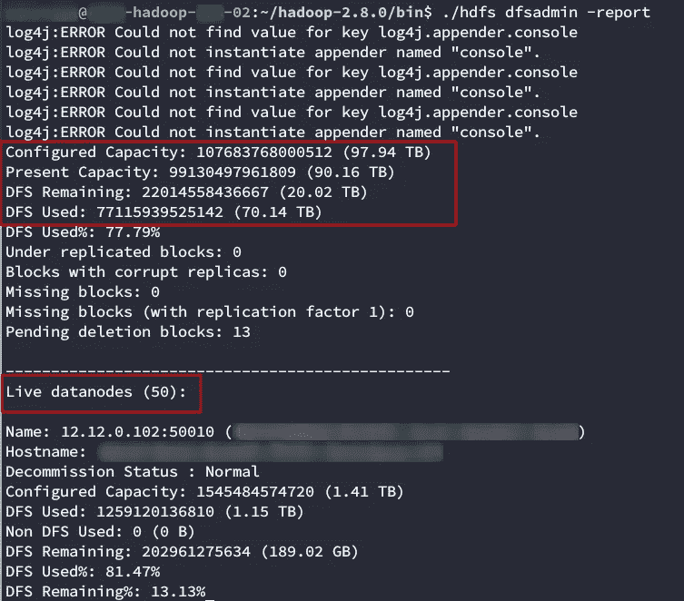

好在我们没有尝试手动获取所有实例。他们有 50 个人！我们还从报告中看到，该群集有大量信息(大约 70TB 使用了 90TB)。

# 提升权限

在调用一个反向 shell 后，我们被一个运行 YARN ResourceManager 服务的低特权用户卡住了。我们试图寻找提升特权的方法

```
sudo -l
```

揭示了我们在项目中经常发现的一种配置方法:

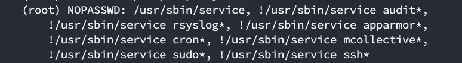

这个 sudoers 条目基本上采用了黑名单方法，除了那些被明确拒绝的参数之外，允许服务命令使用它的所有参数。通常最好将你需要的加入白名单。快速浏览一下 [gtfobins](https://gtfobins.github.io/gtfobins/service/) 将会告诉你，你可以使用类似

```
sudo service ../../bin/sh
```

如果您注意几段前的 metasploit 图像，您会看到我们在列出目录之前使用它来提升权限。

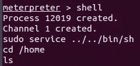

你不能打电话的原因

```
service /bin/bash
```

服务二进制文件有一个查找服务配置文件的路径，类似于运行 shell 命令时的 path 变量。服务的手册页显示:

> 描述
> 服务在尽可能可预测的环境中运行 System V init 脚本或 systemd 单元，删除大多数环境变量和当前工作目录设置为/的
> 。

和

> 文件
> /etc/init.d
> 包含 System V init 脚本的目录。
> 
> /{lib、run 等}/systemd/system
> 包含 systemd 单元的目录。

它在/etc/init.d 上查找 System V init 脚本。使用我们的有效负载，我们将得到如下结果:

```
service /etc/init.d/../../bin/bash
```

这相当于

```
service /bin/bash
```

# 绕轴旋转

我们现在拥有对整个 Hadoop 集群的 root 访问权限。我们研究了改变访问权限的方法，但找不到任何方法。Ssh 登录是通过公钥认证完成的，因此我们无法仿冒任何凭据来重复利用。网络扫描显示，集群已正确分段，除了一些管理服务器外，可见性有限。没有易受攻击的服务暴露在其他机器上，也没有脆弱的配置。

当然，我们在群集上有 70 TB 的信息，但这是与业务相关的数据，不太可能包含对我们的目的有用的配置信息。此外，要浏览数据湖，你必须:

*   [Hadoops WebHDFS API](https://github.com/wavestone-cdt/hadoop-attack-library/tree/master/Tools%20Techniques%20and%20Procedures/Browsing%20the%20HDFS%20datalake#webhdfs)
*   [Hadoop CLI](https://github.com/wavestone-cdt/hadoop-attack-library/tree/master/Tools%20Techniques%20and%20Procedures/Browsing%20the%20HDFS%20datalake#hadoop-cli)

而且都很难自动化。如果你读过[我的另一篇文章，](https://medium.com/bugbountywriteup/chaining-multiple-vulnerabilities-to-exfiltrate-over-250gb-of-pia-2d624f030ed1)你就会知道分析大数据有多难。如果 250GB 的信息很难，那么 70 TB 就更不可能了。

我们正要放弃并展示这些发现时，想起了 sudo -l 下的一个禁止命令:

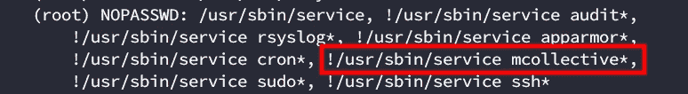

> 牵线木偶集合，也称为 **MCollective** ，是一个用于构建服务器编排或并行作业执行系统的框架。

Puppet 使用 [MCollective](https://puppet.com/docs/mcollective/current/index.html) 来运行并行作业(同时在每个托管实例上运行作业)。它使用一个队列来发布作业，每个节点上的服务提取作业并同时运行它。这对于在大量实例上并发运行作业非常有用，在这些实例中, [Ansible](https://www.ansible.com/) 通过 SSH 使用的“迭代/顺序”方法会花费很长时间。

了解这一点后，我们开始研究 Mcollective 的配置:

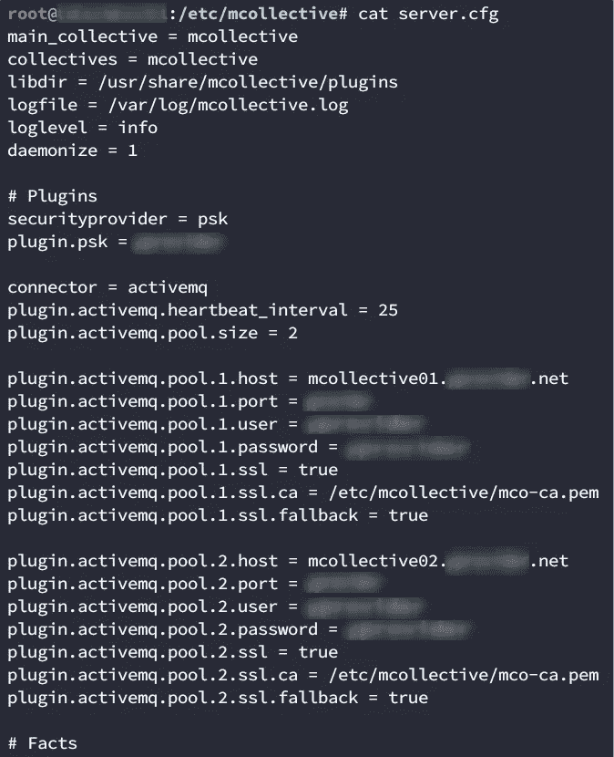

我们看到有两台 MCollective 服务器具有相同的凭据。MCollective 需要一个队列消息服务器，这个特定的客户端使用了 [ActiveMQ](http://activemq.apache.org/) ，这是 Apache 的 Java 消息服务器。与大多数消息服务器一样，它基于队列工作。作为客户端，您订阅特定的队列，并接收发送到该队列的消息。

我们以前使用过这样的消息服务器(看看你的 Kafka 和 RabbitMQ ),但从未专门与 Puppet 结合，所以我们搜索了配置教程。我们没找到多少，但我们遇到的第一个是来自[奥赖利](https://www.oreilly.com/library/view/managing-infrastructure-with/9781449309671/ch04.html)的。在本文中，它为两个不同的用户配置权限:

*   管理
*   mcollective

顾名思义，admin 用户将用于发布消息，mcollective 用户将用于读取队列。理想情况下，admin 用户应该有完全访问权限，而 mcollective 应该只有读取权限，对吗？嗯不…

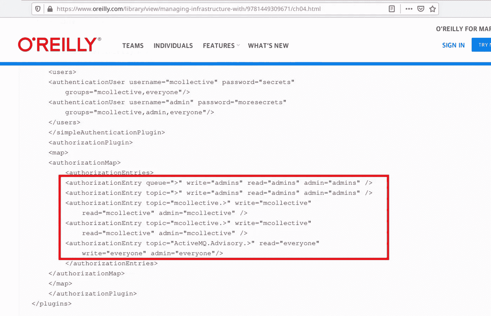

**用户 mcollective 拥有对 mcollective 队列**的写权限！也许我们可以利用这一点？

我们安装了 MCollective，复制了 server.cfg，开始了我们的测试。首先，我们尝试使用 [mco find](https://puppet.com/docs/mcollective/current/reference/basic/basic_cli_usage.html) 列出由 MCollective 管理的实例。

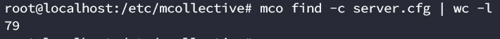

只有 79 例..让我们尝试用另一个命令来验证。我们还可以使用 [mco ping](https://puppet.com/docs/mcollective/current/reference/basic/basic_cli_usage.html) 来发现实例。

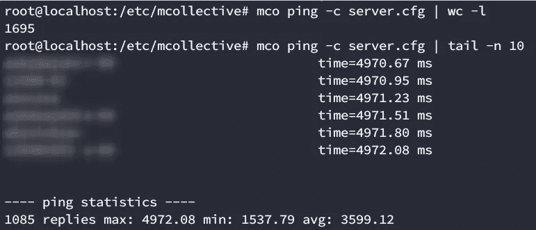

根据这些结果，我们可以假设可能存在涉及超时的网络问题。ping 命令返回了 1695 个实例，远远多于前 79 个，再次运行后，我们只返回了 1085 个。如果我们看看超时，它接近 5000 毫秒。这可能是默认超时，其他实例需要更长时间来重放。让我们大幅增加超时时间，看看我们会得到什么:

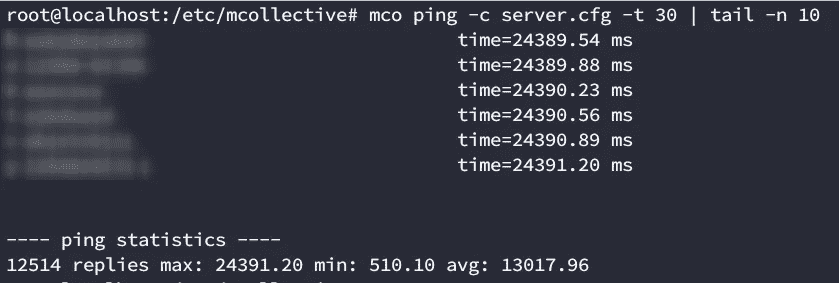

太好了！这看起来是个更好的结果。12514 个实例，其中一些需要长达 24 秒的时间来回复。

> 有趣的事实:在 pentest 之后，我们能够与一位系统管理员交谈，他建议我们将-t(命令运行的超时时间)改为- dt(发现超时时间，或者代理等待订阅者获取消息的时间)。我们试了一下，效果也不错(并修复了查找输出)

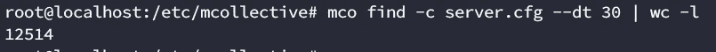

现在我们可以看到实例了，让我们试着执行一个命令。为了做到这一点，我们需要 shellcmd 插件。这不是唯一的选择，但这是我们的客户正在使用的一个。为了验证我们的访问权限，我们使用以下语法在单个实例中运行了一个命令:

```
mco shellcmd -I hostname 'ifconfig' -c server.cfg
```

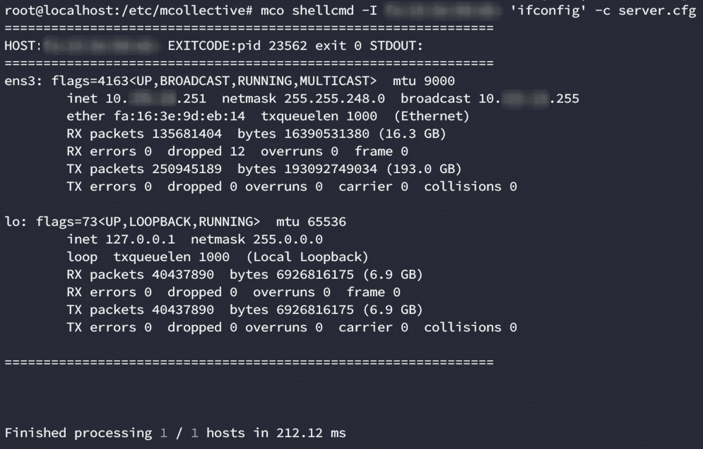

我们有命令执行！我们基本上控制了所有的 12000 个实例。

# 修理

解决此问题的理想方法是限制 ActiveMQ 权限，为 mcollective 用户指定只读访问权限，但是在阅读 OReilly 的网站时，我们发现了以下消息:

> ***警告*** 这些配置文件包含可用于向 MCollective 通道发布命令的秘密。MCollective 服务器必须以 root 用户身份运行，并以完全权限执行。小心控制对秘密和 Stomp 服务器的访问是非常重要的。

此外，MCollective 在 Puppet 5.5.4 中已被弃用。我们客户的基础设施注定要更新，他们选择了 [Choria，这是更新的 MCollective 的分支](https://choria.io/docs/about/)。

有了 Choria，你可以使用一个[动作策略插件](https://github.com/choria-plugins/action-policy)，它允许你为每个插件定义自定义规则。引用其文档:

> 策略在类似`<configdir>/policies/<agent>.policy`的文件中定义

所以你必须定义这样的东西

```
/etc/puppetlabs/mcollective/policies/shellcmd.policy
```

包含以下内容:

```
policy default deny# site wide policies
allow choria=admin.mcollective choria=mco.mcollective * * *
```

第一行建立了关于这个插件的默认策略。另一行使用以下语法:

允许/拒绝+来电显示+操作+事实+类别

基本上，我们的线授予 mco 用户和 admin 用户在所有服务器上运行所有命令的权限。任何其他用户都会收到这样的消息:

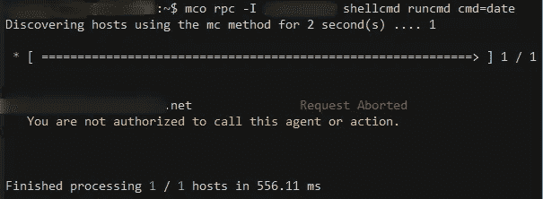

拒绝行动

# 包扎

无论何时，当你试图在一个网络中(或者提升权限)时，试着像一个系统管理员一样思考！如果您熟悉编排技术，您也许能够利用这些工具。即使你不是(就像我们使用 MCollective 一样)，也要从你的狂热中休息一下，去读一下这个工具的文档。总是确保找到至少 2 或 3 个不同的教程。这些可能会给你一些如何“创造性地”使用工具的新想法。

我找不到埃利奥特眨眼睛的 GIF，但足够接近了。

另外，请花时间查看位于/etc；中的服务配置文件。它们通常包含有用的信息，可以让你更好地了解自己的位置，以及这台机器的用途。这应该是本地枚举过程中的一个标准步骤。