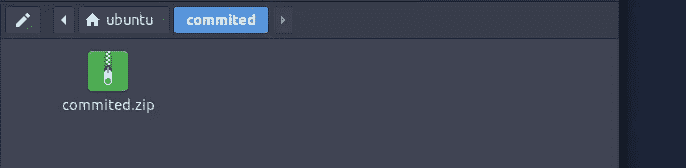
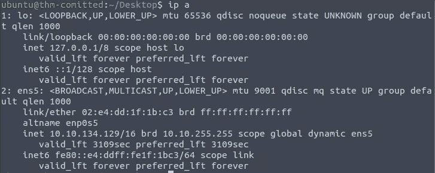
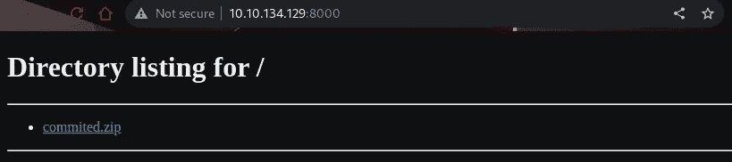
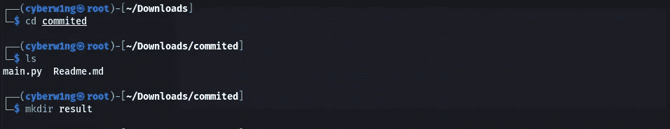
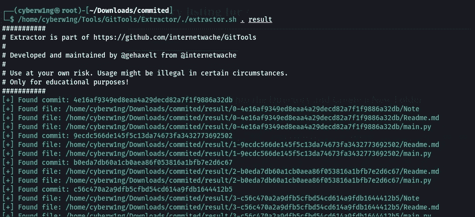
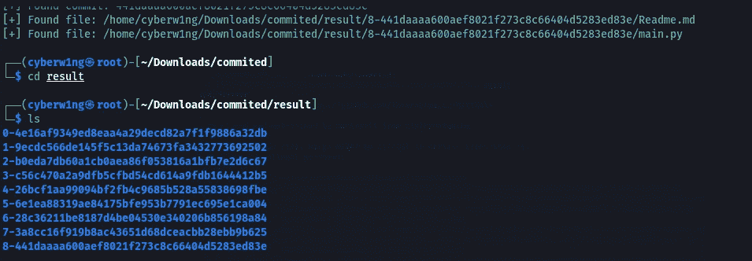
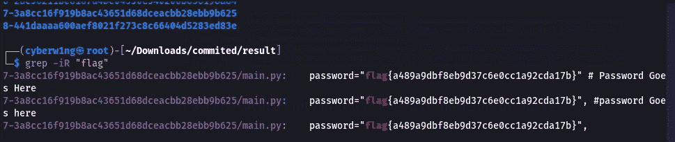

# 已提交— TryHackMe 书面报告

> 原文：<https://infosecwriteups.com/committed-tryhackme-b1def8f545e2?source=collection_archive---------5----------------------->

## TryHackMe 已提交房间的书面报告


启动机器并检查提交的文件



我们可以通过使用 **Python 的 Http 服务器**将这个文件发送到我们的本地机器进行检查

```
**python3 -m http.server**
```


让我们找到攻击机器的 IP 地址



现在让我们在浏览器上使用

```
<machineip>:8000
```



下载、解压缩并导航到该目录，然后创建一个新文件夹



让我们试着用一个叫做[提取器](https://github.com/internetwache/GitTools.git)的工具提取信息

`./extractor.sh . result`



现在让我们导航到结果文件夹并检查任何信息



现在让我们使用 Grep 搜索 Flag

```
grep -iR “flag”
```



我们终于拿到了旗子！！！

## 来自 Infosec 的报道:Infosec 每天都有很多内容，很难跟上。[加入我们的每周简讯](https://weekly.infosecwriteups.com/)以 5 篇文章、4 个线程、3 个视频、2 个 GitHub Repos 和工具以及 1 个工作提醒的形式免费获取所有最新的 Infosec 趋势！