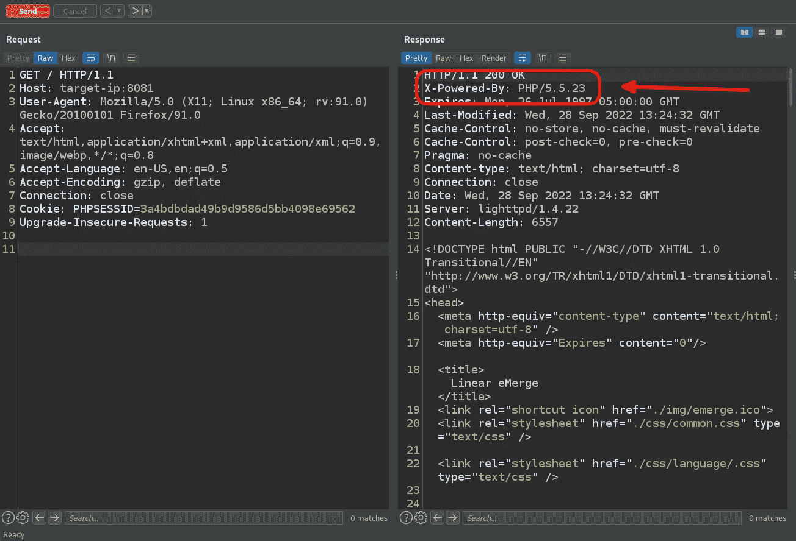
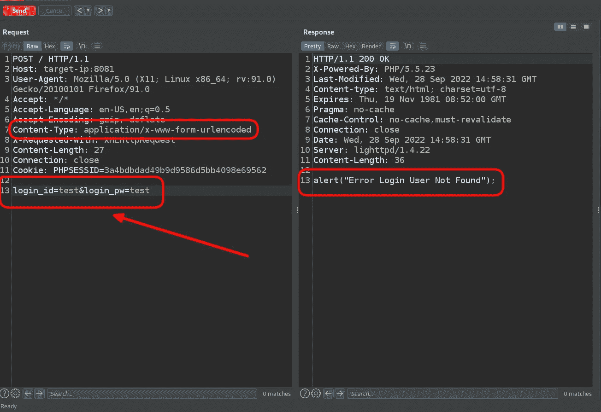
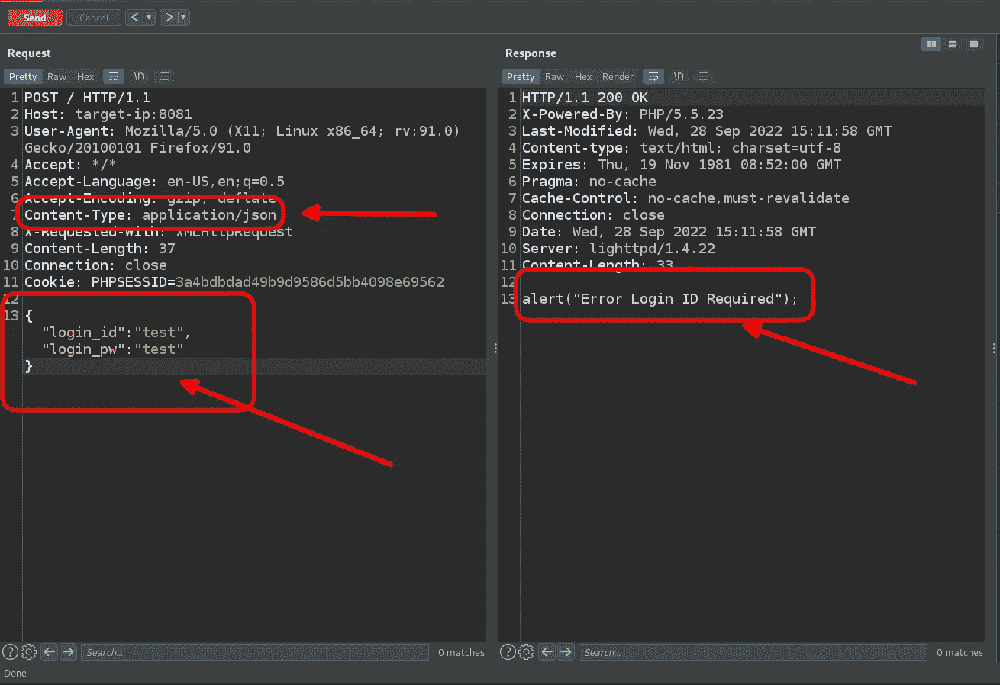
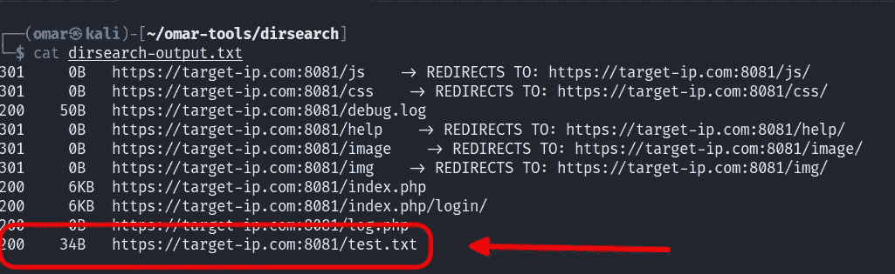
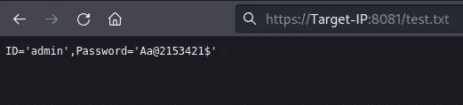
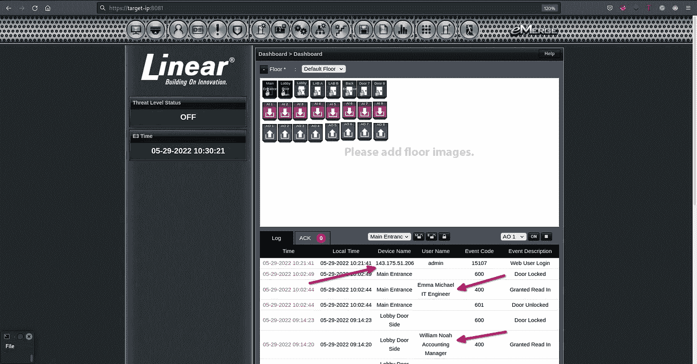
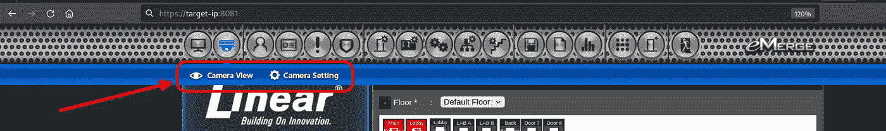
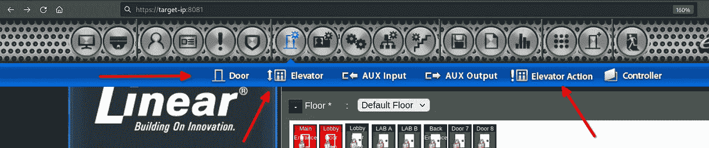
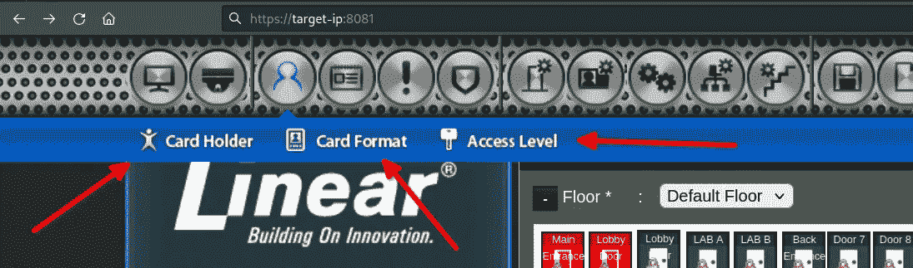

# 全面接管公司大楼

> 原文：<https://infosecwriteups.com/company-building-takeover-10a422385390?source=collection_archive---------0----------------------->

大家好，大多数时候你会读到账户接管或基础设施接管，但你以前听说过公司大楼接管吗？今天我将与大家分享一个有趣的漏洞，这是我在 Hackerone 上搜索一个程序时发现的，所以让我们把我们的目标称为 Target-IP.com

所以我从看一眼 shodan 开始

> ssl:<company ssl="" name=""></company>

我在其他 IP 上花了一些时间后，在结果中发现了一些包含一些登录面板的 IP，但我没有发现任何值得报告的内容，直到我找到我们想要的 IP，我们的故事开始了

进入 IP 后，我发现出现登录面板

在收集了一些信息后，我发现这是一个公司之间常用来管理公司建设的产品

我开始查看是否有任何公开利用

所以让我们先来看看 searchsploit

> **┌──(omar㉿kali)-[~】
> └─$ searchsploit“浮现”**

很好，这里有些有趣的发现

但不幸的是，它们都不起作用

所以我在其他网站上完成了对谷歌、packetstorm、GitHub 等任何公开攻击的搜索…

发现了一些其他漏洞，但该产品似乎已打了补丁

在分析标题时，我发现了那个标题

PHP 版本是 PHP/5，我们有登录面板，所以你认为这个版本最好的攻击场景是什么？

这是 PHP 类型的杂耍

让我们转到登录请求

参数以字符串形式在 POST 请求中发送，为了能够测试 PHP 类型杂耍，我们需要用保存参数数据类型的内容类型来测试它，如果它是字符串或整数，例如 JSON

所以我更改了内容类型和参数，用 JSON 发送请求

但是后端似乎不接受 JSON，因为它不能识别 login_id 参数，这意味着我们的类型杂耍攻击在开始之前就失败了

之后，我开始测试它的一些攻击，如登录面板上的 SQLI，但它并不脆弱

尝试访问注册端点，也许我可以注册一个新用户作为管理员或特权较少的用户(如注册，注册，注册，创建新用户)

> **┌──(omar㉿kali)-[~】
> └─$**ffuf-w 公共-注册-端点-u https:// <目标-IP>/模糊

但是我一无所获

所以我开始做一些繁重的起毛工作

> **┌──(omar㉿kali)-[~】
> └─$**python 3 dirsearch . py-w my-word list-u https://<target-IP>/-o dirsearch-output . txt

在背景上工作的左侧目录搜索

然后开始对 JS 文件进行分析，希望找到一些允许任何类型的破坏访问控制漏洞、强制浏览、暴露令牌或硬编码凭证的端点，我试图通过找到一些源来获得基于 DOM 的 XSS，跟踪它们到接收器或找到任何类型的隐藏参数，在做所有这些工作的同时，我发现 dirsearch 已经完成了她的工作

乍一看，我以为“test.txt”文件除了一些开发人员响应的流行消息之外，什么也不包含，比如“Hello World！”，“嗨”等等…但是让我们检查一下

尝试在登录面板上输入凭据

注:上图中的数据是根据数据的敏感性编辑的

我在仪表板上发现的第一件事是包含管理员 IP 地址和员工进入大楼时间的日志

好了，现在我认为没有必要再完成我的 JS 分析了😁

以管理员身份访问登录面板后，让我们看看我们能做些什么

我发现我可以观看公司大楼的现场摄像机

我发现我可以控制大楼的电梯，门

我可以收集员工数据，添加新员工并授权他们进入公司大楼

# 最终影响:

控制整个建筑

希望你们喜欢这篇报道

别忘了在 Twitter 上关注

推特: [@OmarHashem666](https://twitter.com/OmarHashem666)

## 保持联络

[**Linkedin**](https://www.linkedin.com/in/omar-1-hashem/)**|**[**Youtube**](https://www.youtube.com/channel/UCJ1yNtgZP5LRO7ebZXSnAZQ)**|**[**Twitter**](https://twitter.com/OmarHashem666)

## 来自 Infosec 的报道:Infosec 每天都有很多内容，很难跟上。[加入我们的每周简讯](https://weekly.infosecwriteups.com/)以 5 篇文章、4 个线程、3 个视频、2 个 GitHub Repos 和工具以及 1 个工作提醒的形式免费获取所有最新的 Infosec 趋势！