# 比较不同类型的社会工程技术

> 原文：<https://infosecwriteups.com/comparing-different-types-of-social-engineering-techniques-477336207f70?source=collection_archive---------2----------------------->

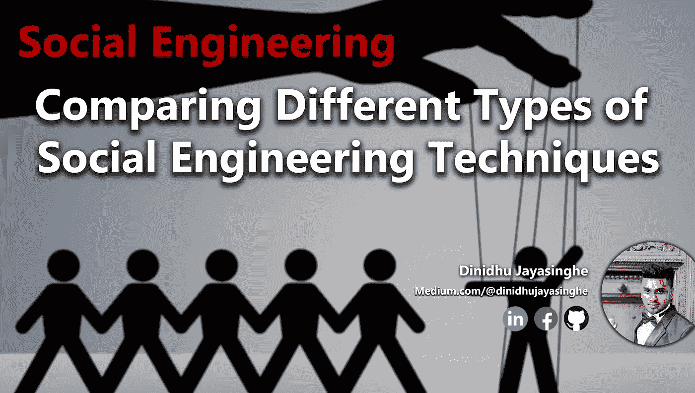

大家好，我是迪尼杜·贾亚辛格。这是我的第二个博客，这是关于不同的社会工程技术。在这篇博客中，我将谈论这些社会工程机制和缓解机制的不同技术和类型。

## **首先，我们来看看什么是社会工程？**

*   社会工程师是这样一种人，他擅长问一些看似不具侵犯性或不重要的问题，以随着时间的推移收集信息。
    -获得信任
    -降低特定目标的防御
*   可以与许多收集敏感信息的技术结合使用。

# 网络钓鱼

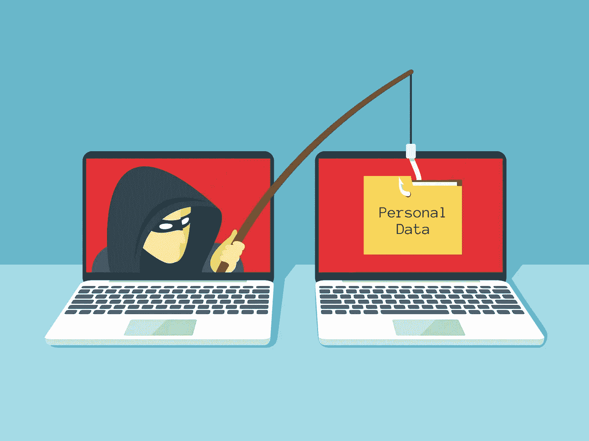

*   获取敏感信息(用户名、密码、信用卡信息)
*   诱骗用户将信息输入虚假网站
    -电子邮件欺骗
    - SMS(短信)
    -即时消息
*   尝试伪装成社交媒体网站、拍卖网站或大学朋友的通信(称之为鱼叉式网络钓鱼)。

## 网络钓鱼的类型

1.  **鱼叉式网络钓鱼**
    【实际上，某人可以是联系人列表，就像您所在组织的老板一样】
2.  **捕鲸**
    【比如发给公司 CEO 的钓鱼邮件】
3.  **短信钓鱼**
    通过短信进行的钓鱼攻击。
    【如发送短信您的信用卡被封，请拨打支持号码。然后你打那个号码，给那个号码你的信息]

# 视觉

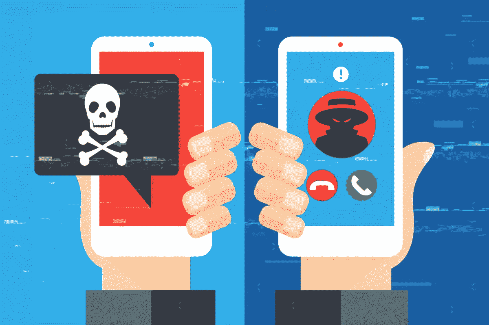

*   视觉是语音钓鱼。因此，这是一种社会工程技术，旨在让受害者泄露个人或敏感信息。
*   攻击者伪装成合法公司、维修人员、安全人员或信任的人。他们在语音对话或语音邮件中这样做。
    -公司内部或外部。(不总是只有外部的不良因素会导致内部线索的错误)
    -但是视觉通常来自公司外部。

# 垃圾邮件

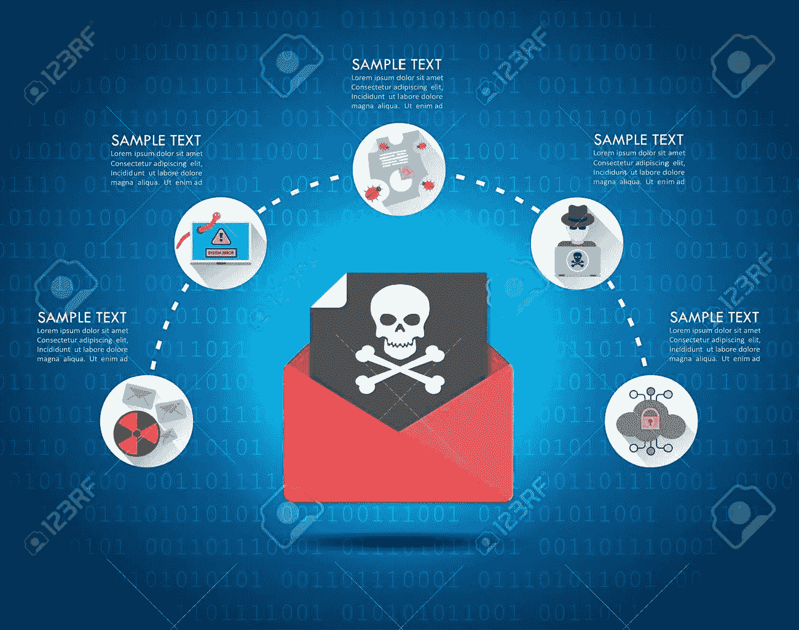

*   发送大量未经请求的电子邮件。
    ——通常用于商业广告。
    -也可以通过社交、文本/即时消息和 VoIP 使用。
*   通过即时消息发送垃圾邮件(SPIM)
    -由于交互可以实时发生，因此更加有效。

有多糟糕？

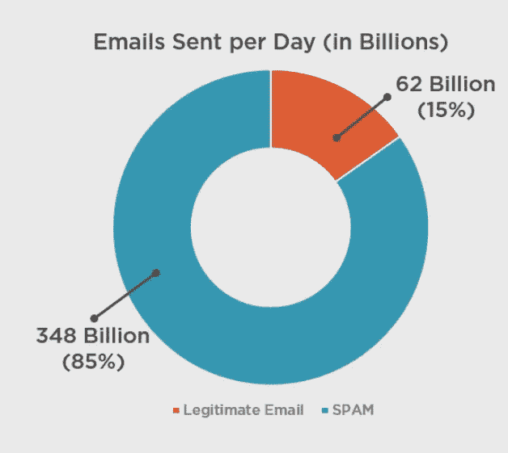

*   云电子邮件服务在捕捉垃圾邮件方面不断进步。
*   这是一种“散弹枪”方式，主要是一种数字游戏。
*   不断教育用户不要点击这些链接上的**和**使用常识是非常重要的。****
*   有些垃圾邮件是通过关键字、内容、原始域或 IP 地址范围捕获的。

# 翻垃圾箱

*   从垃圾箱中清理可能泄露敏感信息的垃圾
    -用户名和密码
    -个人身份信息(PII)
    -公司文件、简历等。
*   一些公司会有上锁的垃圾箱或垃圾桶，你可以把东西放进去，它们会通过某种类型的第三方服务处理掉。

**垃圾箱翻查调查方法**

*   在处理之前粉碎文件。(将文件切成小块，然后放入垃圾桶)
*   锁好的西罐将被运离现场进行粉碎/处理。

# 肩部冲浪

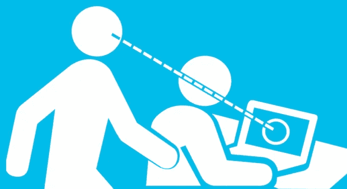

*   让某人在网站应用程序中输入凭据的社会工程技巧。
    -开始谈论他们孩子的运动，然后要求看一些他们最喜欢的汽车的照片或他们宠物的名字，以及他们有什么类型的狗。所有这些东西通常都被用作人们的密码。
    ——应该在社交媒体网站输入用户名/密码时上网。

**肩部冲浪运动方法**

*   隐私屏。
*   屏蔽密码
    -多次 Astrix (*)击键进一步混淆了密码的长度。
*   技术控制
    -监控门、敏感区域、门卡出入等的摄像头。

# 域名欺诈

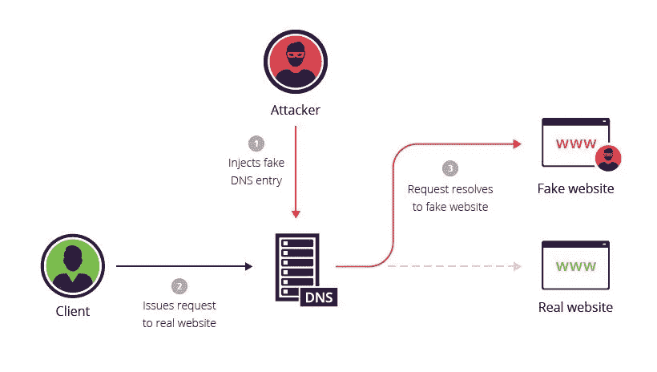

*   将用户的网站流量重定向到虚假的恶意网站。

    **-宿主文件注入:**所以在用户的电脑上，有一个文本文件被称为**宿主文件。主机文件可以包括映射到网站网址 IP 地址，反之亦然。当我们去一个像 medium.com*这样的合法网站时，如果我们的电脑被入侵，而不是去实际的 ***中型*** 网站，它可能会被重定向到一个恶意网站。***
*   *用户访问一个虚假的网站，并输入凭据用户名密码。*

*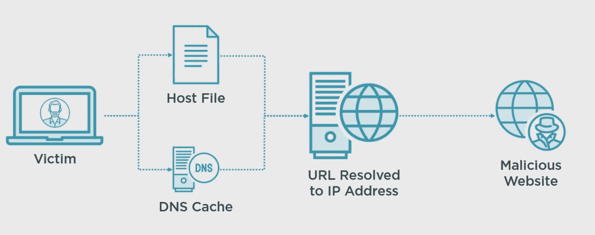*

*   *所有这些类型的攻击都是为了从用户那里获取信息。*

# *1.开车紧跟*

*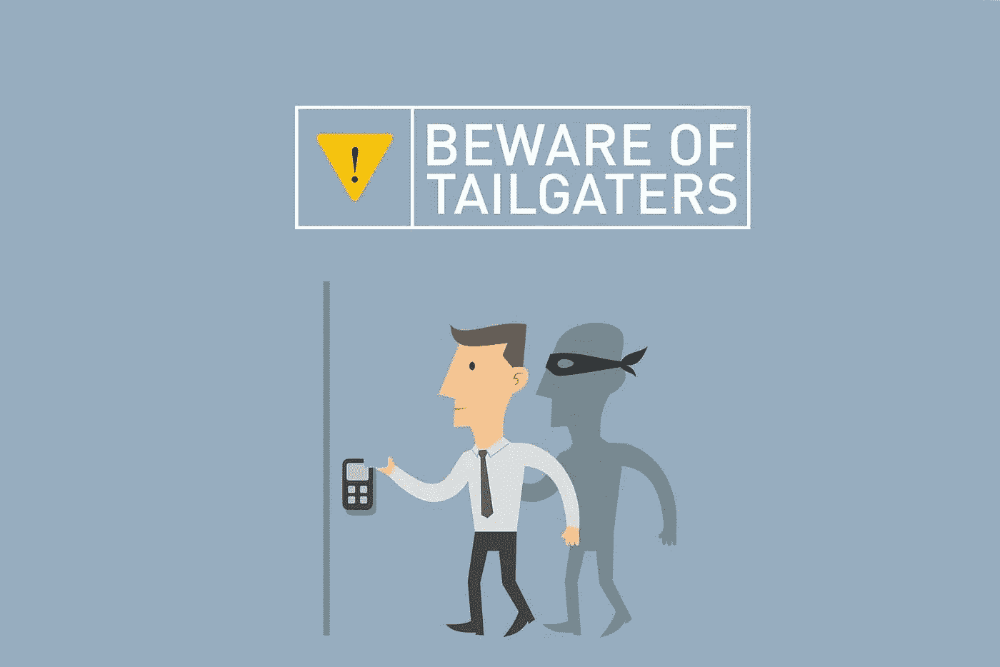*

*   *下面有人通过有门区域或有标志的进入区域进入大楼。人们想要乐于助人。那么坏演员知道人们会为那些看起来属于他们的人开门，就像提着许多袋子的物品。*
*   *培训和对公司政策的理解是关键。每个人都需要明白每个人都需要通行证才能进入大楼。*

# *恶作剧*

**

*   *使用电话或语音邮件诱骗目标提供敏感信息的社会工程技术。
    -黑客表现得像远程技术人员或员工。
    -表现得像一个寻找工作的有兴趣的人。
    -表现得像一个愤怒的顾客在抱怨。*
*   *目标网络钓鱼和鱼叉式网络钓鱼技术针对的是**【大鱼】**如公司高管(例如:捕鲸)
    ——网络钓鱼、伪装和各种社会工程技巧(技术)用于收集信息。
    -电子邮件是有针对性的，非常具体，而且似乎是合法的。(可以是电子邮件、电话、语音邮件)*

***恶作剧缓解方法***

*   *安全意识培训
    -确保员工知道永远不要点击他们不知道的来源的链接。
    -不要打开来源不明的附件。*
*   *技术控制
    -垃圾邮件过滤
    -启发式(允许我们查看文件的模式和特定签名)
    -防火墙/深度数据包检测*

# *前置*

**

*   *在推文或特殊媒体帖子中添加提及 **(@username)** ，使其看起来更加个性化。
    -更高的参与度。
    -可以自动化，变得几乎与手动鱼叉式网络钓鱼活动一样高效。
    ——这显然让它更合法了。*

# *扮演*

**

*   *可以通过几种方法实现模拟。
    -社会工程
    -窃取凭证/凭证收集(这允许我们在网络上冒充其他人)
    -渗透网络并捕获和替换网络上的数据包。(中间人攻击)*
*   *如此重要的张力可以有几种形式。
    -从我的网络角度来看，我们可以做一些事情，如数据包排序，确保数据包以一定的顺序到达，给它们打上时间戳，进行偏移以确保它们不会延迟，然后将它们重新注入网络。*

# *身份欺诈*

*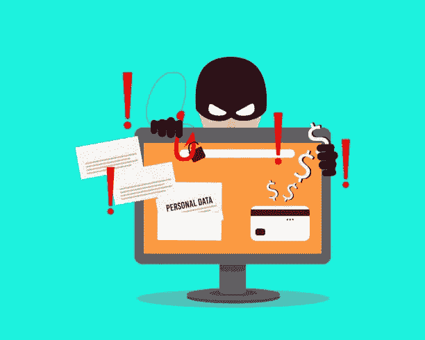*

*   *身份盗窃和身份欺诈是可以互换的术语。恶意软件、社会工程和老派方法(翻垃圾箱)都可以用来收集信息。
    ——受害者的身份被用来获取信用卡详细信息，窃取金钱/资产。*

# *发票诈骗*

*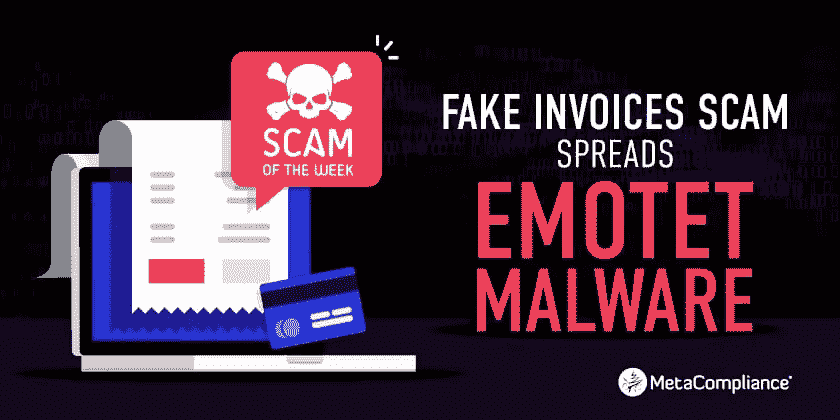*

*   ***“捕鲸”**坏演员欺骗高管电子邮件账户的技术。*
*   *合同财务或应付账款，并要求他们支付虚假发票。(就像老板发给会计部门关于支付这张发票的电子邮件)
    -电汇(通过世界各地的银行转账机构网络转账)
    -公司信用卡
    -加密货币*

# *凭据收集*

**

*有几种不同的方法可以做到这一点。*

1.  ***网络钓鱼活动**
    网络钓鱼、垃圾邮件、垃圾邮件/ SPIM 可用于大规模收集用户凭证。*
2.  ***恶意软件**
    可用于攻击单个受害者或整个网站和网络。凭据通常被收集并在网上出售或粘贴。*
3.  ***Pastebin 和其他粘贴网站**
    粘贴网站允许黑客和不良分子张贴大量被破坏的帐户和信息，以及访问其他违规信息。现在 **Pastebin** 最初是为开发者开发的。所以他们可以发布代码，人们可以来回查看彼此的代码，大量的代码。*

# *水坑攻击*

*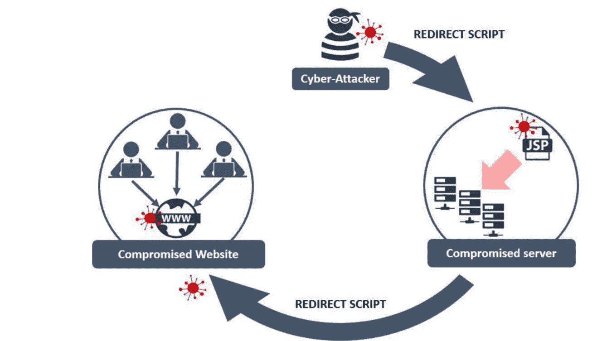*

*   *这种复杂的攻击识别出人们喜欢访问的特定公司或组织中不太安全的网站。攻击者在网站最常访问的用户身上植入恶意软件，然后感染他们。
    -目标用户=一旦他们访问了受感染的网站。
    -恶意代码扫描用户电脑的漏洞、零日攻击等。(可能下载额外的代码来发起攻击，虹吸数据等)*

# *错别字抢注/网址劫持*

*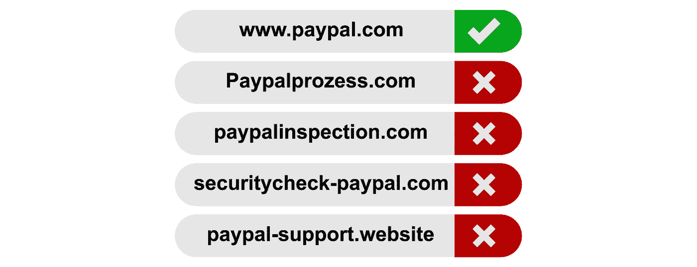*

*   *设置域名是为了利用用户输入错误的事实。(基本上是打错了)
    -**fcaebook.com**而不是**facebook.com**
    -**风镜、古格尔、古格尔**等。
    -当用户登录到这种错误的网站时，黑客就可以捕获用户的用户名和密码。*
*   *欺诈网站的设置与真实网站相似。
    -捕获用户凭证*
*   *广告门户网站充满了可能吸引用户访问该网站的广告。希望通过提供免费广告来创造广告收入。*

## *谢谢，我想你会从这篇文章中学到一些东西。下次再见。*