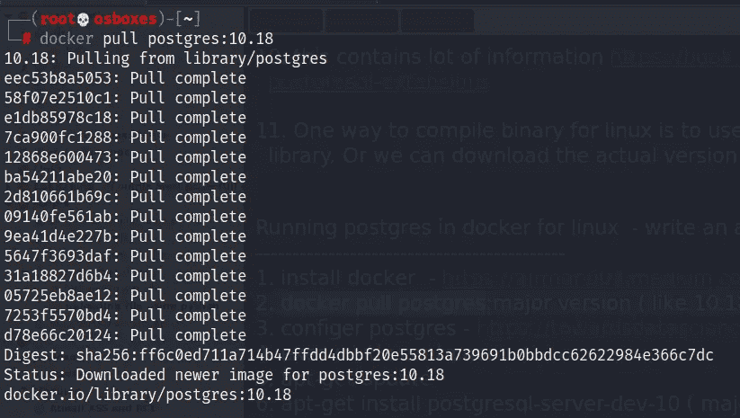
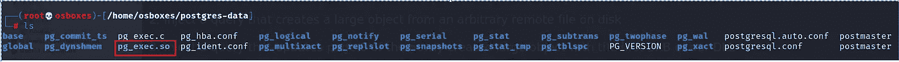

# 为开发 UDF 到 RCE 而编写 Postgres 图书馆

> 原文：<https://infosecwriteups.com/compiling-postgres-library-for-exploiting-udf-to-rce-d8cfd197bdf9?source=collection_archive---------0----------------------->

我最近参加了 WEB-300 课程并通过了 OSWE 考试。WEB-300 课程模块包括 UDF 反向外壳。我发现困难的一件事是如何为 postgres 的特定版本编译库以用于 UDF。所以我决定分享我所学到的。

[](https://www.offensive-security.com/awae-oswe/) [## 高级网络攻击和利用(AWAE) |攻击性安全

### 了解高级 web 攻击和利用中的白盒 Web 应用程序安全测试(WEB-300)。完成课程并…

www.offensive-security.com](https://www.offensive-security.com/awae-oswe/) 

## 我为什么写这个？

这有两个原因:

1.  开发过程中所需的库依赖于平台。你不能运行在 linux 操作系统上编译的库来利用运行在 windows 上的 postgres，反之亦然
2.  同时，图书馆依赖于 postgres 的主要版本

**注意:如果 postgres 版本高于 9.3 并且复制功能在需要的权限下可用，可以使用**[**payload all things command injection**](https://github.com/swisskyrepo/PayloadsAllTheThings/blob/master/SQL%20Injection/PostgreSQL%20Injection.md#postgresql-command-execution)**获得一个反向 shell，而不必为 UDF 而烦恼:)**

## 在 Linux 上编译库

为此，我们将在 kali 上使用 docker，以避免搞乱主机配置和文件( ***)我首先尝试在主机上这样做，导致我的机器崩溃。谢天谢地，我有重要东西的备份。*** )

1.  如果你还没有安装 docker，这个链接会为你解释清楚[https://airman 604 . medium . com/installing-docker-in-kali-Linux-2017-1-FBA a4 d 1447 Fe](https://airman604.medium.com/installing-docker-in-kali-linux-2017-1-fbaa4d1447fe)
2.  让我们用 *docker pull postgres:10.18 来拉一下 postgres 主要版本的 docker 镜像。如果你已经开发了 sql 注入，你可以很容易地找到 postgres 版本*



3.在主机上创建一个 postgres-data 目录，并将其挂载为容器的数据卷，以存储所有数据库文件

```
root💀osboxes)-[/home/osboxes]
└─# **mkdir postgres-data**
```

4.使用命令运行 docker 容器，将数据卷映射到容器 ***udf-postgres*** ，将密码设置为 ***noob@123*** ，并将端口映射到 5432

```
──(root💀osboxes)-[/home/osboxes]
└─# d**ocker run -d --name udf-postgres -e POSTGRES_PASSWORD=noob@123 -v /home/osboxes/postgres-data/:/var/lib/postgresql/data -p 5432:5432 postgres:10.18**    
92212e425db4ce74108a95d9a891ca1233979c470d2bb2fa58092618ef7f73f1

┌──(root💀osboxes)-[/home/osboxes]
└─# **docker ps**                                                                                                                                           
CONTAINER ID   IMAGE            COMMAND                  CREATED          STATUS          PORTS                                       NAMES
92212e425db4   postgres:10.18   "docker-entrypoint.s…"   14 seconds ago   Up 12 seconds   0.0.0.0:5432->5432/tcp, :::5432->5432/tcp   udf-postgres
```

5.Exec 进入正在运行的容器

```
┌──(root💀osboxes)-[/home/osboxes]
└─# **docker exec -it udf-postgres bash**                                                                                                                               
root@92212e425db4:/#
```

6.运行 ***apt-get 更新*** 和 ***apt-get 安装 PostgreSQL-server-dev-10****(使用 dev-10 考虑到 postgres 的主要版本)。我们需要安装 postgresql-server-dev cause，它包含编译 UDF 所需的库*

```
root@92212e425db4:/# **apt-get update**

Fetched 8,448 kB in 5s (1,491 kB/s)                                   
Reading package lists... Doneroot@92212e425db4:/# **apt-get install postgresql-server-dev-10**
```

7.将 gcc 安装在容器内

```
root@92212e425db4:/# **apt install gcc**
```

8.从这个 github 库[https://github.com/Dionach/pgexec/blob/master/pg_exec.c](https://github.com/Dionach/pgexec/blob/master/pg_exec.c)下载 pg_exec.c，并移动到映射到容器卷的 **postgres-data** 目录

```
┌──(root💀osboxes)-[/home/osboxes/postgres-data]
└─# **ls -la *.c**
-rw-r--r-- 1 root root 255 Nov 20 04:58 pg_exec.c
```

9.找到 **postgres.h** 库，因为它是编译所需要的

```
root@92212e425db4:/# **find / -iname postgres.h 2>/dev/null**
/usr/include/postgresql/10/server/postgres.h
```

10.cd 到容器内的映射目录，即 **/var/lib/postgresql/data** 。这就是我们的 **pg_exec.c** 文件所在的位置


11.现在将 **pg_exec.c** 编译成一个。所以使用下面的命令归档

```
root@92212e425db4:/var/lib/postgresql/data# **gcc -I /usr/include/postgresql/10/server/ -shared -fPIC -o pg_exec.so pg_exec.c**
```

12.您可以在主机服务器的 postgres-data 目录中找到编译后的二进制文件 **pg_exec.so**



现在剩下的就是使用发现的 sql 注入将生成的 **pg_exec.so** 传输到目标系统，并将它们存储在 postgres 大型对象中。稍后，将相同的二进制文件复制到目标上的本地文件系统中，以供 UDF 调用。一旦你有了正确的二进制文件，这里有一些资源可以帮助你获得反向 shell

[](https://blog.pentesteracademy.com/postgresql-udf-command-execution-372f0c68cfed) [## PostgreSQL UDF 命令执行

### Metasploit 框架是最流行和最强大的网络渗透测试工具，广泛应用于…

blog.pentesteracademy.com](https://blog.pentesteracademy.com/postgresql-udf-command-execution-372f0c68cfed)  [## PostgreSQL 9.x 远程命令执行- Dionach

### 在最近的一次渗透测试中，我能够访问 PostgreSQL 9.0 服务。而执行的过程…

www.dionach.com](https://www.dionach.com/blog/postgresql-9-x-remote-command-execution/) 

感谢阅读。让我知道，如果你发现任何困难复制上述步骤，将很乐意清除您的疑问。另外，如果你需要一步一步的指导来创建一个用于 UDF -> RCE 漏洞的窗口 DLL，请在评论中留言。

在 LinkedIn[https://www.linkedin.com/in/niraj-kumar-choubey-7351b892/](https://www.linkedin.com/in/niraj-kumar-choubey-7351b892/)上与我联系，打招呼或讨论任何网络安全问题。