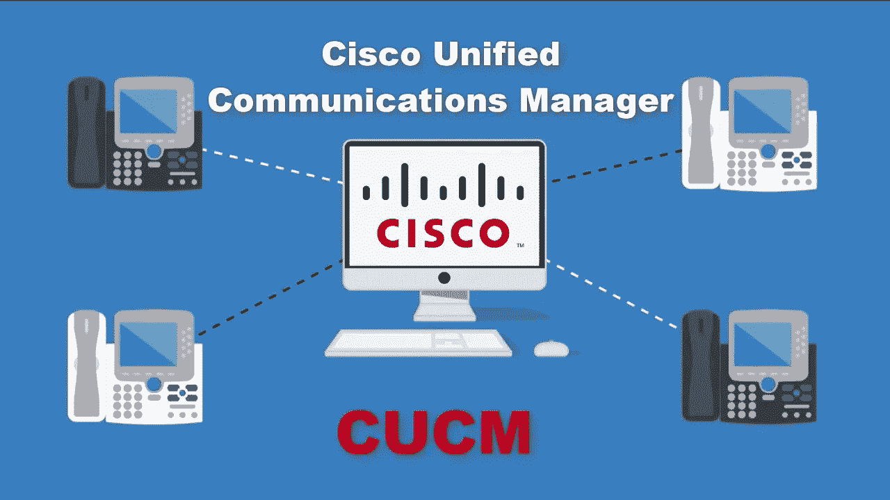
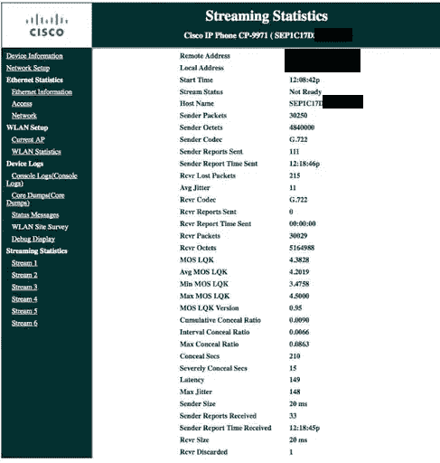
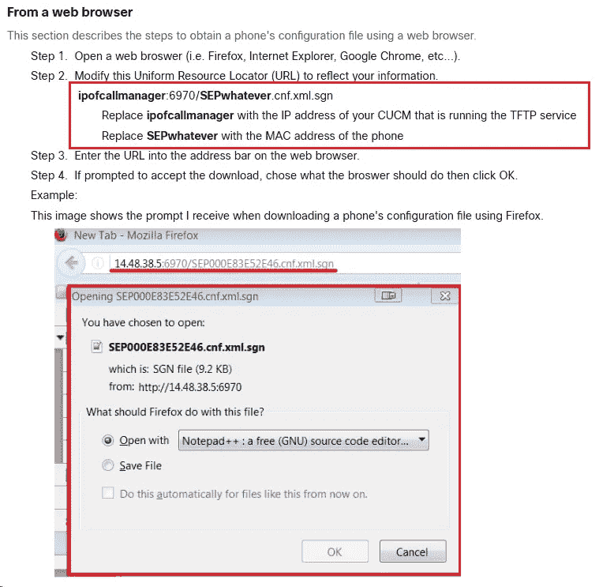
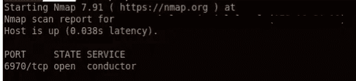
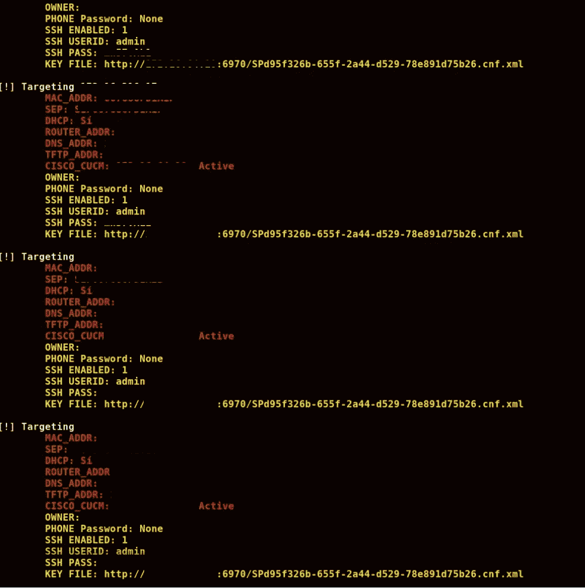
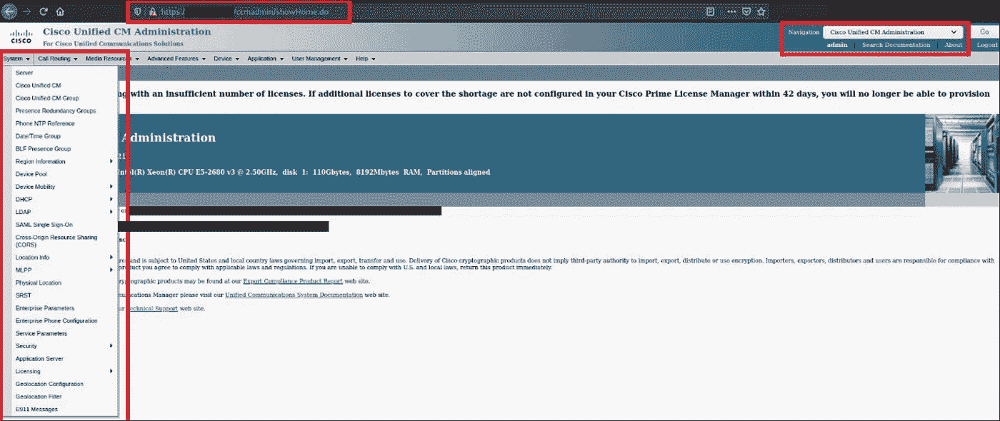
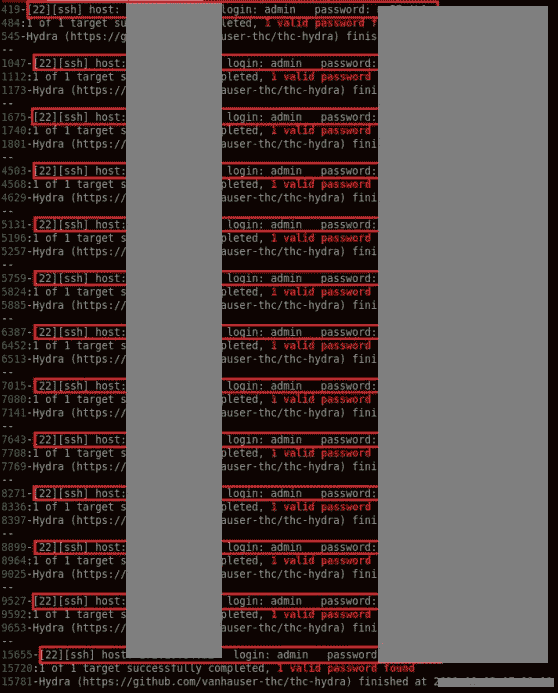
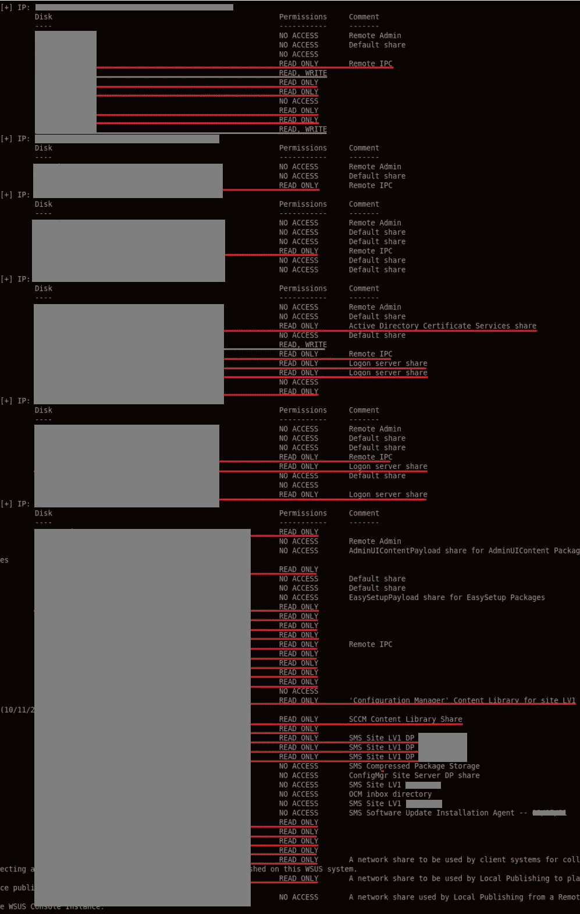

# 由于连续的错误配置，思科统一通信管理器被完全接管

> 原文：<https://infosecwriteups.com/complete-take-over-of-cisco-unified-communications-manager-due-consecutively-misconfigurations-2a1b5ce8bd9a?source=collection_archive---------1----------------------->

在那里，这个路线图被开发来显示利用设备中的错误配置，个人可以完全接管管理控制系统。在本文中，我们将介绍思科 VOIP 电话和统一 CM。

> [产品概述](https://www.cisco.com/c/en/us/products/unified-communications/unified-communications-manager-callmanager/index.html):思科统一通信管理器(CallManager)

在内部网络上识别的范围内的内部侦察阶段，在激活所有主机后，在端口 80 和 443 上查找 webapps 是一个良好的开端，我能够通过抓取 [http-title nmap nse 脚本](https://nmap.org/nsedoc/scripts/http-title.html)的结果来识别暴露于内部网络的所有 VOIP 电话设备。

Cisco VOIP 电话的公开 web 界面如下所示:

一些型号容易出现[公开披露的已知漏洞](https://sec-consult.com/vulnerability-lab/advisory/vulnerabilities-in-cisco-voip-phones-cve-2018-0461/)，但所有型号都打了补丁。

在花了大量时间阅读我能接触到的所有设备的文档后，我发现如果 VOIP 电话配置没有采用默认值，并且没有加强安全性，它可能会泄漏一些有趣的信息。

例如，只要进入门户网站，我就可以阅读电话日志，在日志中，我可以找到带有调试信息的电话呼叫，这使我可以通过解析日志在列表中添加更多目标。我还可以从设备上下载完整的电话配置文件和思科 UCM 的未加密配置文件。

当我们执行安全审计时，专注于阅读大量文档(我鼓励您也这样做，因为这样会让生活更轻松)，我找到了制造商的以下文章:

> 从 CUCM 获取手机配置文件的两种方法。

现在的问题是，我们从哪里获得呼叫管理器的 IP？

在 VOIP 电话暴露的网络面板中，许多 IP 地址被披露，我只是从目标列表中的所有设备上收集了所有地址，并扫描了所有这些 IP 地址，以搜索文档中所说的开放端口 6970。

经过几次测试后，我确认我找到了将为我们提供配置文件的 API 端点地址。在这些文件中，我们可以获得 SSH 和 LDAP 凭证。

我只是构建了一个脚本，用上面描述的黄金数据得到一个漂亮的终端打印。

1.  蜘蛛所有网络 VOIP 电话门户网站。
2.  提取 MAC 地址。
3.  精心制作链接以获取配置文件。
4.  下载并解析配置文件。
5.  以漂亮的方式打印重要数据。

只需运行`python3 ciscophonecfg.py -iL voip-phone-addr.txt`

该脚本将读取目标 voip 电话文件(每条
线一个电话)，然后将在暴露的门户网站上做一点刮擦，然后
将基于上述详细信息建立链接。该脚本将从配置文件中提取关键数据。然后将显示每台设备的摘要。

我开发的代码输出将信息打印为手机所有者的全名、SSH 凭证和一个“密钥文件”。最后一个参数非常有趣，因为它在所有设备中都是相同的链接。这是配置管理器文件。

该密钥文件包含思科 UCM 的 LDAP 证书和其他非常有趣的信息。根据官方文件，这个文件可以从思科 UCM 配置加密，但由于配置错误，这个选项没有启用，并允许我们以明文读取文件。获取配置文件语法是:

[http://IP _ call manager:6970/@ service profile file _ value](http://ip_callmanager:6970/@serviceProfileFile_value)

其中@serviceProfileFile_Value 是类似于**SPD 95 f 326 b-655 f-2a 44-d529–78e 891d 75 b 26 . cn f . XML**的文件名

至此，我们已经有了 Cisco 电话和管理系统使用的 SSH 和 LDAP 凭证。为了以防万一，我尝试使用在 Cisco Unified communication s Manager 门户中收集的信息登录，幸运的是，由于重复使用了凭据，我能够以管理员身份登录:

这种错误配置还导致了其他一些行为，比如使用在旅途中开发的自定义脚本转储所有电话号码簿:

在其他主机中重复使用 SSH 信用凭证:

以及使用从未加密密钥文件中提取的思科 UCM 的 LDAP 凭证对 Samba 共享进行读写访问:

# 参考

 [## 思科 IP 电话 8800 系列 11.3(1)版和更高版本的多平台电话管理指南…

### 如果启用了该参数，则电话 GUI 会在以下情况下接受相关参数的用户访问属性

www.cisco.com](https://www.cisco.com/c/en/us/td/docs/voice_ip_comm/cuipph/MPP/8800/english/AG/p881_b_8800-mpp-ag_new/p881_b_8800-mpp-ag_chapter_01.html)  [## 从 CUCM 获取手机配置文件的两种方法

### 本文档描述了两种获取手机配置文件的方法。要求手机的…

www.cisco.com](https://www.cisco.com/c/en/us/support/docs/unified-communications/unified-communications-manager-callmanager/200769-Two-Ways-to-Obtain-a-Phone-s-Configurati.html)  [## 思科统一通信管理器安全指南，版本 11.5(1) -电话安全配置文件…

### Unified Communications Manager 管理将电话类型和协议的安全相关设置分组到…

www.cisco.com](https://www.cisco.com/c/en/us/td/docs/voice_ip_comm/cucm/security/11_5_1/secugd/CUCM_BK_SEE2CFE1_00_cucm-security-guide-1151/CUCM_BK_SEE2CFE1_00_cucm-security-guide-1151_chapter_0111.html)  [## 重置或更改 CUCM 操作系统管理员和安全密码

### 本文档介绍了如何重置或更改操作系统管理员密码和安全密码。思科建议您拥有…

www.cisco.com](https://www.cisco.com/c/en/us/support/docs/unified-communications/unified-communications-manager-callmanager/213527-changing-cucm-os-admin-and-security-pass.html)  [## 在 CUCM 上启用加密配置功能

### 本文描述了在 Cisco 统一通信管理器上使用加密的配置电话文件…

www.cisco.com](https://www.cisco.com/c/en/us/support/docs/unified-communications/unified-communications-manager-callmanager/118929-technote-cucm-00.html) 

## 来自 Infosec 的报道:Infosec 每天都有很多内容，很难跟上。[加入我们的每周简讯](https://weekly.infosecwriteups.com/)以 5 篇文章、4 条线索、3 个视频、2 个 GitHub Repos 和工具以及 1 个工作提醒的形式免费获取所有最新的 Infosec 趋势！