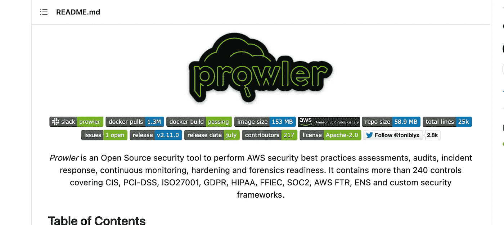
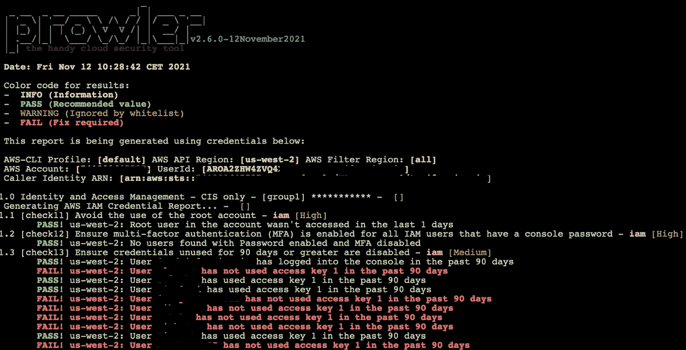

# 使用 Prowler 进行免费的 AWS 安全评估

> 原文：<https://infosecwriteups.com/conducting-a-free-aws-security-assessment-with-prowler-f54a65de1020?source=collection_archive---------0----------------------->

## 使用这个免费工具获得完整的 AWS 安全报告


克里斯托夫·高尔在 [Unsplash](https://unsplash.com?utm_source=medium&utm_medium=referral) 上拍摄的照片

如果你是一名[云安全](https://cloudsec-guy.com/category/cloud-security/)专家，那么像我一样，你一定害怕听到“安全审计”这个词。

由于云安全是一个如此新的职业，很多时候向审计人员解释云安全控制以及如何保护您的环境是非常困难的。

事实上，Azure、AWS、GCP 等商业云安全审查工具会大大消耗你的预算！

假设您有一个需要定期审查的 AWS 帐户。一个积极主动的好方法是先发制人的安全审计，如 PCI DSS，ISO 27001，并积极主动地对您的 AWS 帐户进行定期安全审查。

您将需要生成报告，显示您的云安全状况表现如何以及差距在哪里。然而，在预算紧张的情况下，这可能会变得非常具有挑战性，非常快！

一个简单的解决方法是实施我之前讨论过的[**云安全状态管理**](/cloud-security-tooling-series-what-the-heck-is-a-cspm-8f37f6b1db19) 解决方案。

然而，这些工具无论如何都不便宜，所以下一步将是使用像 AWS security hub 这样的本地工具，虽然非常便宜，但不幸的是也不是免费的。

> 那么零预算怎么办呢？

# 进入 Prowler——一个免费的 AWS 安全审查工具

*Prowler* 是市场上最好的免费云安全工具之一，一直是我进行 AWS 安全审查的必经之路。

> Prowler 是一款开源安全工具，可根据 CIS Amazon benchmarks、PCI-DSS、GDPR ISO27001、HIPAA 等标准进行 AWS 安全最佳实践评估和审计。

您可以使用所需的权限从命令行运行它，并生成报告，这些报告可以让您深入了解您的 AWS 安全性以及您在最佳实践基准方面所处的位置

巡游者的+200 检查包括以下

*   **身份和访问管理**
*   **测井**
*   **监控**
*   **联网**
*   **CIS 一级**
*   **CIS 二级**
*   **GDPR**
*   **HIPAA**
*   **秘密**
*   **互联网曝光资源**
*   **还包括 PCI-DSS、ISO-27001、FFIEC、SOC2、ENS**

# 如何安装和运行 Prowler

安装 Prowler 非常简单，只要你按照说明操作并确保它的依赖项存在。Prowler [Github 页面](https://github.com/prowler-cloud/prowler)有其需求的所有细节，如 AWS CLI、jq、detect-secrets 等。(在执行以下操作之前，确保这些都存在)



来源:[https://github.com/prowler-cloud/prowler](https://github.com/prowler-cloud/prowler)

运行 git 命令来下载 prowler(是从我的 mac 而不是 windows 机器上下载的，但是这些命令并没有改变太多)

```
$ git clone [https://github.com/prowler-cloud/prowler](https://github.com/prowler-cloud/prowler)
 **
Cloning into 'prowler'...
remote: Enumerating objects: 50, done.
remote: Counting objects: 100% (50/50), done.
remote: Compressing objects: 100% (41/41), done.
remote: Total 2955 (delta 6), reused 43 (delta 5), pack-reused 2905
Receiving objects: 100% (2955/2955), 971.57 KiB | 915.00 KiB/s, done.
Resolving deltas: 100% (1934/1934), done.
```

下一步是确保您有适当的 IAM 权限来运行扫描。您将需要一个 IAM 访问密钥和秘密密钥，以便 prowler 可以进行身份验证(或者，如果您是高级用户，您可以承担一个角色)

用户或角色应至少拥有以下权限:

```
arn:aws:iam::aws:policy/SecurityAudit
arn:aws:iam::aws:policy/job-function/ViewOnlyAccess
```

创建用户后，在您的环境中运行 aws config 命令来设置凭据。

**配置完成后，您就可以运行 Prowler 了！**

以下是运行和保存 Prowler 报告的选项。我通常使用 CSV 或 HTML，但也有多种选择:

对于 CSV:

```
./prowler -M csv
```

对于 HTML:

```
./prowler -M html
```

或者你可以两者同时进行。如果你做的一切都正确，那么你应该会看到下面美丽的屏幕，表明徘徊者正在运行:



# 回顾小偷的报告

徘徊者扫描需要一点时间，这取决于你在你的帐户中启用的服务数量。一个完成它应该存储报告在您的 Prowler 文件夹中的子目录称为输出。彻底审查报告，并优先考虑高/关键的第一。

如果您要将它发送给其他团队进行审查，那么在发送之前先进行初步审查。永远不要假设报告是正确的，如果有一些你可以快速解决的问题，那就在传阅报告之前解决

我希望这对您有用，并且您会看到 Prowler 免费为您的 AWS 安全姿态带来的强大增值。在接下来的几天里，我会写更多关于 prowler 可用的高级选项的文章。

> 感谢你阅读这篇文章！如果你对云安全感兴趣，可以看看我的 Youtube 频道“[云安全专家](https://www.youtube.com/c/CloudSecurityGuy)”，我会定期在上面发布关于云安全、人工智能和一般网络安全职业建议的帖子。

*你可以通过下面的链接注册，每月只需 5 美元就可以获得所有的媒体报道:*

[](https://taimurcloud123.medium.com/membership) [## 通过我的推荐链接加入 Medium—tai mur Ijlal

### 阅读 Taimur Ijlal(以及媒体上成千上万的其他作家)的每一个故事。您的会员费直接支持…

taimurcloud123.medium.com](https://taimurcloud123.medium.com/membership) 

## 来自 Infosec 的报道:Infosec 每天都有很多内容，很难跟上。[加入我们的每周简讯](https://weekly.infosecwriteups.com/)以 5 篇文章、4 条线索、3 个视频、2 个 GitHub Repos 和工具以及 1 个工作提醒的形式免费获取所有最新的 Infosec 趋势！