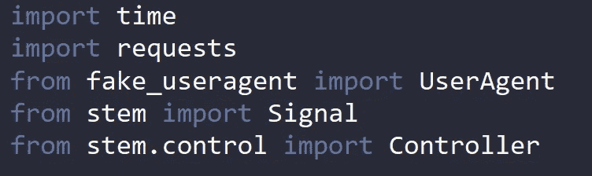
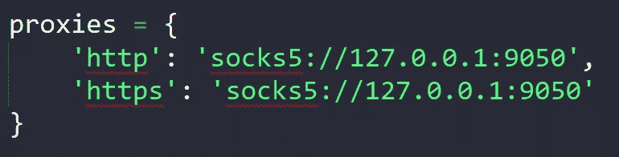
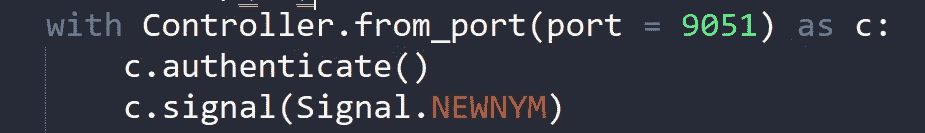
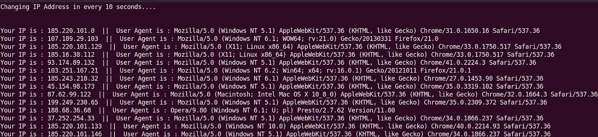

# 用 Python 配置 TOR

> 原文：<https://infosecwriteups.com/configuring-tor-with-python-1a90fc1c246f?source=collection_archive---------0----------------------->

## 使用 Python 脚本屏蔽您的 IP 地址

如果你曾经建立过一个 web scrapper，那么你一定面临过由于产生太多请求而被 web 服务器阻止的问题，或者你只是想隐藏你的真实 IP 地址并自动运行你的脚本。

在本文中，我将解释如何在您的 Linux 系统上配置 TOR，以及如何在 Python 脚本中实现 TOR 来屏蔽您的真实 IP 并绕过基于 IP 的限制。


照片由[RealToughCandy.com](https://www.pexels.com/photo/food-man-love-people-11035356/)拍摄

# TOR 是什么？

对于那些刚接触黑客和编程的人来说*“Tor，洋葱路由器的缩写，是一个支持匿名通信的免费开源软件”。* ***Tor 网络是一种安全的加密协议，可以确保网络上数据和通信的隐私*** *。*

Tor 服务/浏览器通过使用一种被称为洋葱路由的技术来工作。洋葱路由器是一个点对点(P2P)覆盖网络，使用户能够匿名浏览互联网。洋葱路由使用多层加密来隐藏通过网络发送的信息的来源和目的地。

通常使用 TOR 浏览器访问 TOR 网络，但是如果您想在 Python 脚本中使用它并通过 TOR 网络运行自动化脚本，该怎么办呢？这正是我们今天要做的！！

# Tor 安装

Tor 的安装取决于您的系统，官方[网站](https://www.torproject.org/download/)上有详细介绍。对于大多数基于 Debian 的系统来说，这是可行的。

```
sudo apt-get install tor
```

要启动 Tor，请运行:

```
sudo service tor start
```

要检查它是否工作，只需从终端运行以下命令:

```
curl --socks5 localhost:9050 --socks5-hostname localhost:9050 -s https://check.torproject.org/ | cat | grep -m 1 Congratulations | xargs
```

如果一切正常，您将得到这个输出。

```
Congratulations. This browser is configured to use Tor.
```

# 使用 Python 配置

Python 请求模块将用于通过 TOR 网络发送请求。

```
sudo pip3 install requests
sudo pip3 install requests[socks]
sudo pip3 install requests[security]
sudo pip3 install cryptography
```

我们现在可以使用 to 请求模块。

```
import requests
```

您可以使用以下命令在没有 Tor 的情况下检查您的 IP 地址:

```
requests.get('https://ident.me').text
```

输出将是您的原始 IP 地址。

要在 python 脚本中使用 TOR 网络，我们首先需要告诉 Python 使用代理。

```
proxies = {
    'http': 'socks5://127.0.0.1:9050',
    'https': 'socks5://127.0.0.1:9050'
}
```

现在，您应该有了一个新的 IP 地址:

```
requests.get('https://ident.me', proxies=proxies).text
```

# 获取新身份

我们需要在每次发出新请求时或以固定的时间间隔获取新的 IP 地址，为此，我们需要一个名为**“Stem”的 Python 模块。**

stem 是一个用于 [**Tor**](https://www.torproject.org/) 的 Python 控制器库。有了它，你就可以使用 Tor 的 [**控制协议**](https://gitweb.torproject.org/torspec.git/tree/control-spec.txt) 针对 Tor 进程编写脚本。

为了更加匿名，我们可以使用**“假用户代理”**模块为每个请求生成一个新的用户代理。这两个模块都可以使用 pip 安装。

```
sudo pip3 install stem
sudo pip3 install fake_useragent
```

Tor 控制器还必须配置为请求身份更新。

```
sudo nano /etc/tor/torrc
```

将下列行保存在`/etc/tor/torrc`文件中。

```
ControlPort 9051
CookieAuthentication 1
```

然后，我们重新启动 Tor 以考虑这些修改:

```
sudo service tor restart
```

# 将这一切打包在一个脚本中

我们现在已经准备好了一切，我们需要做的就是将这些东西打包到一个脚本中。

首先，我们需要导入需要的模块。



导入模块后，我们定义我们的代理。



现在我们将为我们的 Stem 控制器定义一个处理程序。使用这个处理程序，我们将验证我们的请求，并生成信号来获得一个新的 IP 地址。



*这里是完整的代码*

这段代码将每 10 秒生成一个新的 IP 地址，并在每个请求中使用一个新的用户代理。



## 此工具的使用案例

有很多场景可以使用它，它可以作为一个基础来创建许多惊人的工具来解决问题，如

*   刮除正常网页而不被阻塞
*   制作深色刮网板
*   屏蔽 IP 地址的工具
*   还有更多…..

非常感谢你的阅读。喜欢就分享😇😇

*跟我来这里上* [***中***](https://mayank-01.medium.com/follow) *和* [***订阅邮件列表***](https://mayank-01.medium.com/subscribe) ***💌如果你想在我发表文章时得到它们。✨✨***

*我的 GitHub:*[***mayankpandey 01***](https://github.com/MayankPandey01)***👨‍💻***

*你可以在推特上找到我:*[***mayank _ pandey 01***](https://twitter.com/intent/follow?screen_name=mayank_pandey01)***👻***

*来自 Infosec 的报道:Infosec 上每天都会出现很多难以跟上的内容。* [***加入我们的每周简讯***](https://weekly.infosecwriteups.com/) *以 5 篇文章、4 个线程、3 个视频、2 个 Github Repos 和工具以及 1 个工作提醒的形式免费获取所有最新的 Infosec 趋势！*