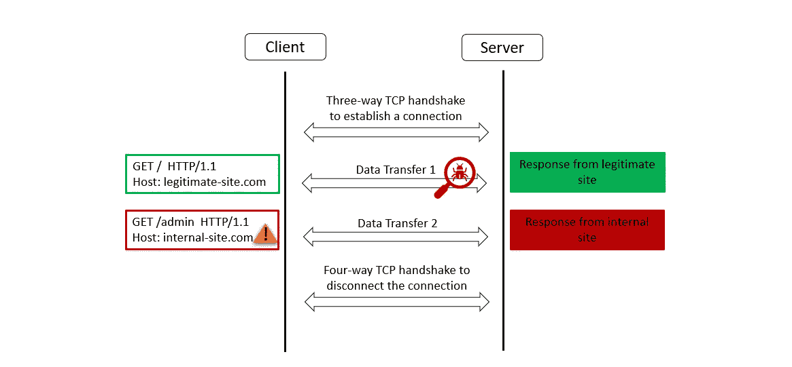
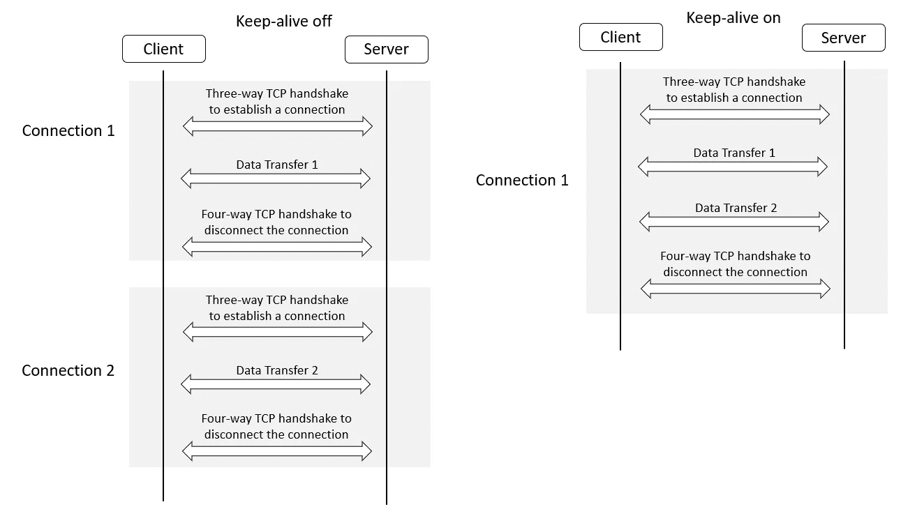
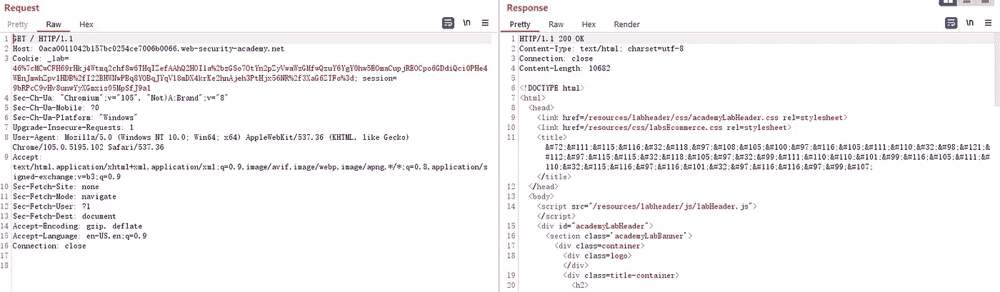
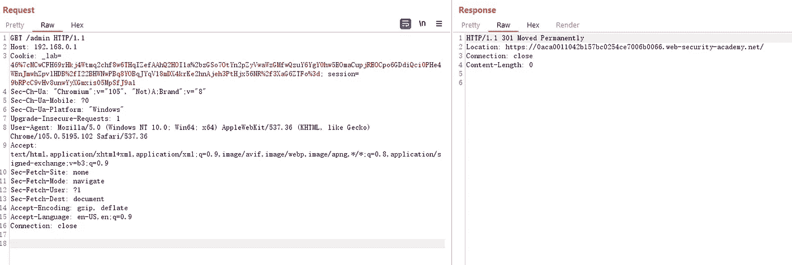
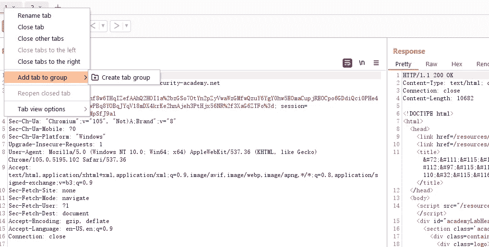
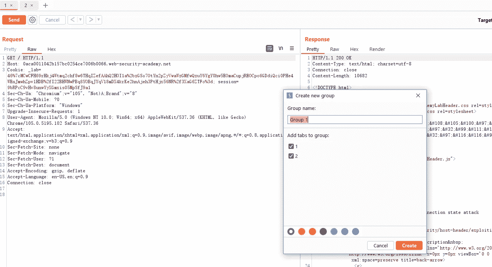
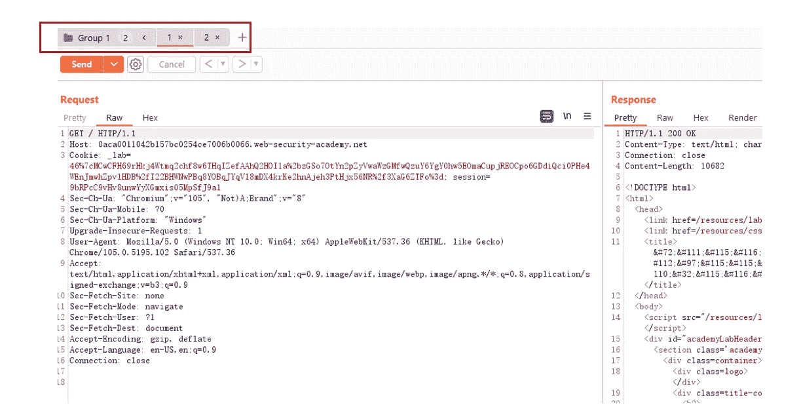
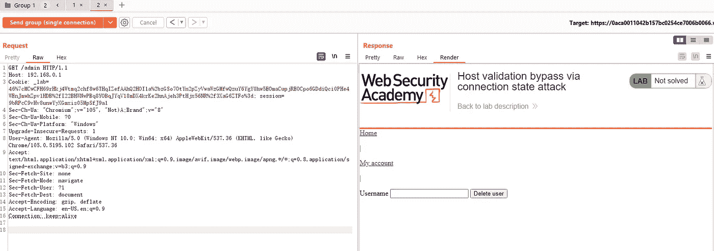

# 连接状态攻击—首次请求验证

> 原文：<https://infosecwriteups.com/connect-state-attack-first-request-validation-2bea8e42a647?source=collection_archive---------0----------------------->

HTTP 主机头的作用是帮助识别客户端想要与哪个后端服务进行通信，此外，许多应用程序依赖主机头来生成密码重置链接或重定向地址等。逻辑缺陷或错误配置可能导致不同类型的 HTTP 主机报头攻击。其中之一是 HTTP 连接请求走私，即仅在通过 HTTP 连接发送的第一个请求中验证主机头。



这篇博文将带您通过 PortSwigger 实验室了解 HTTP 连接请求走私攻击。

在开始 PortSwigger 实验之前，您需要熟悉一些概念。

# 1.必备知识

# 1.1 虚拟主机

在一个系统或 web 服务器上托管多个网站或应用程序，共享 CPU 和内存等资源是很常见的。以这种方式托管在一台服务器上的网站被称为“虚拟主机”。网站或应用程序的访问者通过以下虚拟主机方法被路由到正确的虚拟主机:

*   基于 IP 的

基于 IP 的虚拟主机要求每个虚拟主机有一个专用的 IP 地址。这是通过为单个 web 服务器创建多个 IP 地址来实现的。

*   基于端口的

基于端口的虚拟主机使用不同的端口，web 服务器被配置为通过端口将流量路由到虚拟主机。

*   基于名称的

基于名称的虚拟主机允许一个 IP 地址托管多个网站。流量在 HTTP 请求中按主机名路由。这种方法要求客户端必须支持 HTTP 1.1(或带有 1.1 扩展的 HTTP 1.0)。

# 1.2 通过中间设备路由流量

另一种常见的情况是，不同的网站托管在不同的后端服务器上，但它们都要通过中间设备才能到达目标后端服务器。通常，反向代理服务器和负载平衡器可以充当这样的中介，位于请求路径中。这种设计允许多个网站被解析到中间组件的单个 IP 地址，请求被相应地分发到中间组件后面的预期后端服务器。为了实现这一点，路由可以基于请求中的主机名。


# 1.3 主机标题

主机报头对于基于名称的虚拟主机和通过中间设备的基于主机的路由非常重要，以便知道请求到达后将流量转发到哪里。当用户访问网站时，URL 将解析为特定服务器或中间设备的 IP 地址。在请求中，主机头指定客户端想要访问的域名。

# 1.4 HTTP 主机报头攻击

由于主机头实际上是用户可控制的，这种做法会导致许多问题。HTTP 主机标头攻击利用易受攻击的网站，这些网站信任主机标头而不正确验证它。攻击者可以通过畸形或复制篡改主机头，操纵后端服务器的行为。公司有时会在同一服务器上托管可公开访问的网站和内部网站，攻击者可能能够通过主机标题操作来访问内部网站。

# 1.5 保持活动连接

TCP 连接是通过三次握手建立的，它要求服务器和客户端在传输数据之前交换 SYN 和 ACK 数据包。默认情况下，HTTP 连接在每次请求后关闭，下一次请求将建立新的连接。握手会导致连接开销，并降低整个连接过程的速度。为了提高性能，HTTP keep-alive 头保持 TCP 套接字/连接打开，并允许多个请求和响应重用一个已建立的 TCP 连接。

禁用和启用保活时的工作流(不包括 SSL 握手)如下所示:



您可以使用 cURL 命令来更好地理解重用同一个连接如何减少连接延迟。

要测量向服务器发出请求需要多长时间，可以在 cURL 命令中指定时间。

**time_connect** 是客户端角度的 TCP 三次握手。 **time_appconnect** 这里是 TLS 设置。 **time_starttransfer** 就在 cURL 从网络中读取第一个字节之前(它实际上还没有读取)。

发出如下类似的 cURL 命令:

```
# curl -v -s -w "TCP time: %{time_connect}, TLS setup time: %{time_appconnect}, Time to first byte: %{time_starttransfer}\n\n"   -o /dev/null [https://example.com/](https://example.com/) -o /dev/null [https://example.com/](https://example.com/)
*   Trying ***:443...
* Connected to example.com (***) port 443 (#0)
* schannel: disabled automatic use of client certificate
* ALPN: offers http/1.1
* ALPN: server did not agree on a protocol. Uses default.
> GET / HTTP/1.1
> Host: example.com
> User-Agent: curl/7.83.1
> Accept: */*
>
* Mark bundle as not supporting multiuse
< HTTP/1.1 200 OK
...
< Keep-Alive: timeout=10
< Content-Length: 0
<
* Connection #0 to host example.com left intact
TCP time: 0.571379, TLS setup time: 1.441327, Time to first byte: 1.867394
​
* Found bundle for host: 0x1bcf22be890 [serially]
* Re-using existing connection #0 with host example.com
* Connected to example.com (***) port 443 (#0)
> GET / HTTP/1.1
> Host: example.com
> User-Agent: curl/7.83.1
> Accept: */*
>
* Mark bundle as not supporting multiuse
< HTTP/1.1 200 OK
...
< Keep-Alive: timeout=10
< Content-Length: 0
<
* Connection #0 to host example.com left intact
TCP time: 0.005519, TLS setup time: 0.005520, Time to first byte: 0.428777
```

检查 curl 命令的结果，您可以看到连接# 0 是在第一个请求中创建的，并被第二个请求重用。同一连接中两个请求的连接时间概述如下:

```
...
TCP time: 0.571379, TLS setup time: 1.441327, Time to first byte: 1.867394
...
TCP time: 0.005519, TLS setup time: 0.005520, Time to first byte: 0.428777
```

第一个 TCP 连接时间是 0.571379 秒，第二个请求总共只需要 0.005519 秒。

但并不是所有的服务器都启用了 keepalive，因为禁用 keepalive 是一种减缓滥用客户端速度以减少一些攻击流量的解决方案。

# 2.连接状态攻击-首次请求验证

在连接状态攻击中，一些应用程序只对连接中的第一个请求执行主机头验证。这意味着攻击者可以通过向合法的主机名发出请求，然后通过相同的连接向内部网站发出请求，来获得对内部网站的访问权限。portswigger 站点中的连接状态攻击实验室易受基于路由的 SSRF 的攻击，您可以获得实验室的[条目](https://portswigger.net/web-security/host-header/exploiting#connection-state-attacks)。现在我们将一起浏览实验室。

当用户访问易受攻击的网站时，使用 burpsuite 捕获`GET /`请求，我们称之为请求#1:



将上面的请求复制为请求#2，并将请求的路径设置为/admin，将主机头设置为`192.168.0.1`，发送请求。

据观察，您只是被重定向到主页。



现在创建一个选项卡组，将请求#1 和请求#2 放在一起。



将选项卡组命名为 Group 1，并将请求#1 和请求#2 添加到该组中。



选择“按顺序发送组(单个连接)”，将这两个请求放在一个 HTTP 连接中。

将两个请求中的连接更改为 keep-alive，并单击“按顺序发送组(单个连接)”按钮。可以看到，第二个请求已经成功地访问了内部管理面板。



原因是请求#1 中的主机报头通过了验证，但是验证没有应用到与请求#1 相同的 HTTP 连接下的后续请求，因此当请求#2 中的主机报头被篡改时，请求#2 被成功路由到内部网站 192.168.0.1，管理面板暴露给最终用户。

您可以按照 portswigger 站点中的解决方案来完成实验。

# 最后的想法

如果您有任何问题或反馈，请随时发表评论。如果你认为这篇博文有帮助，请点击拍手👏按钮下面几下，以示支持！

## 来自 Infosec 的报道:Infosec 每天都有很多内容，很难跟上。[加入我们的每周简讯](https://weekly.infosecwriteups.com/)以 5 篇文章、4 个线程、3 个视频、2 个 GitHub Repos 和工具以及 1 个工作提醒的形式免费获取所有最新的 Infosec 趋势！