# 把这些点连接起来

> 原文：<https://infosecwriteups.com/connect-the-dots-98b876bd7891?source=collection_archive---------0----------------------->

欢迎来到“连点”演练，由令人敬畏的苏米特·维尔马制作的盒子，

领英:[https://www.linkedin.com/in/sumit-verma-125576129/](https://www.linkedin.com/in/sumit-verma-125576129/)

我们从 nmap 扫描开始:

**nmap–A–p-192 . 168 . 178 . 158**

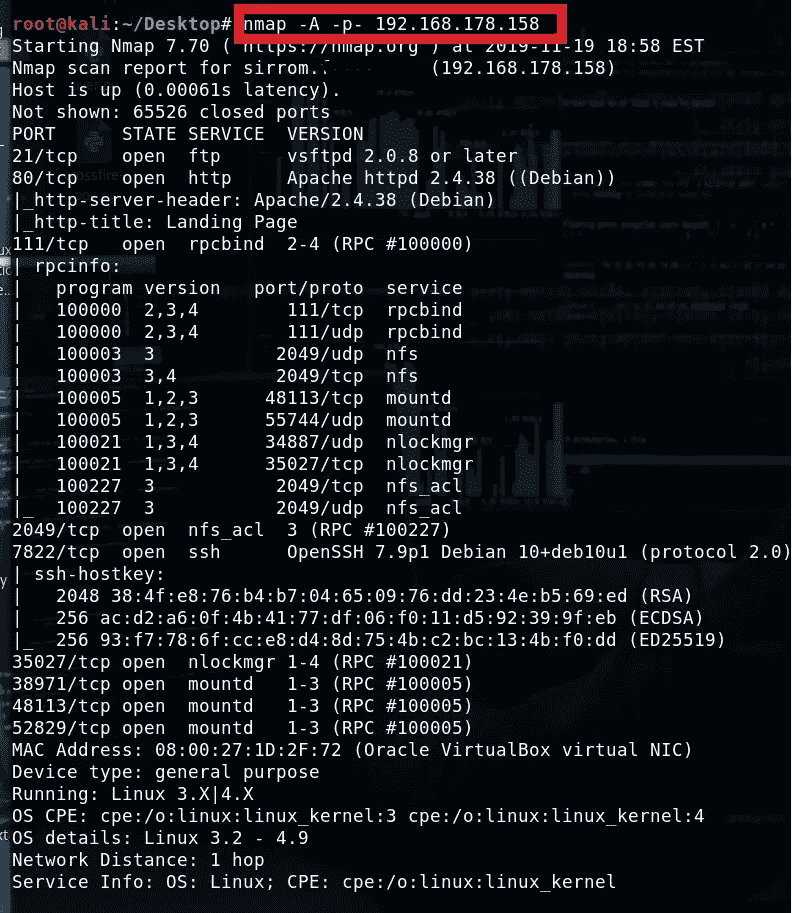

我先检查一下有什么可以装载，因为我们的 nmap 扫描上显示了 nfs。

**show mount–e 192 . 168 . 178 . 158**

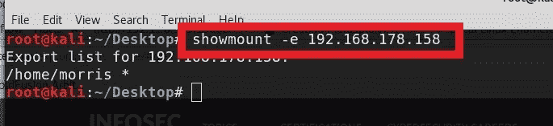

我们可以看到/home/morris 可供挂载。因此，我创建了一个名为“mnt”的新目录，并将其安装在那里。

**mkdir mnt
mount–t NFS 192 . 168 . 178 . 158:/home/Morris mnt**

进入“mnt”并列出内容。

**CD mnt
ls–la**

我们可以在这里看到一些有趣的东西，但在花了一些时间后，我确定这是一个兔子洞，但非常欢迎你亲自尝试。:-)

所以我们转到一个网站。

当我环顾四周的时候，我喜欢发动迪尔布和尼克托，让他们跑起来。

**dirb**T14**http://192 . 168 . 178 . 158**

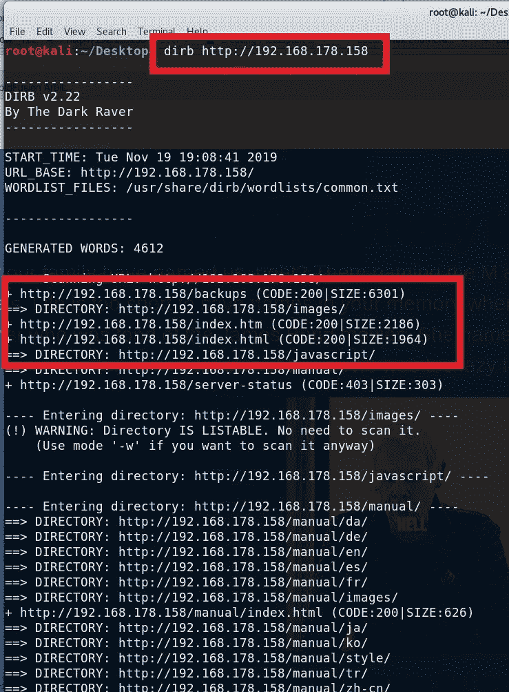

正如我们所看到的，我们有一些有趣的目录要查看，还有 index.htm 和 index.html。所以我们可以把他们两个都查出来。

尼克托呢

**nikto–h**[**http://192 . 168 . 178 . 158**](http://192.168.178.158)

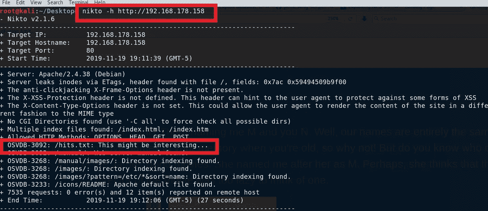

我们可以看到我们有 hits.txt。让我们检查一下。

**192 . 168 . 178 . 158/hits . txt**

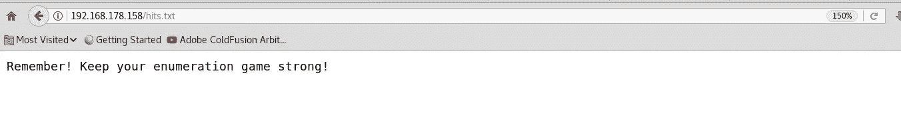

所以我们会记住这一点。:-)

检查 index.htm 的来源，我们可以看到一些笔记。

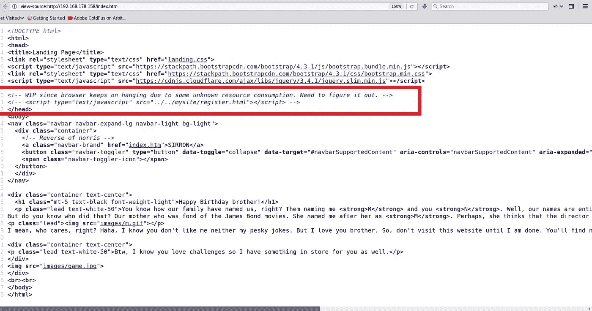

所以我们可以看到有/mysite 目录和/register.html，还有一些挂在 text/javascript 中。

所以让我们来看看。

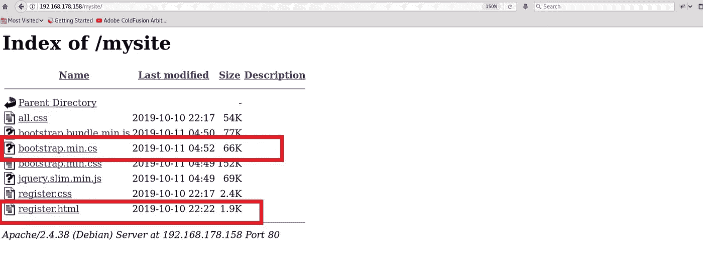

Register.html 给了我们一个登录页面。

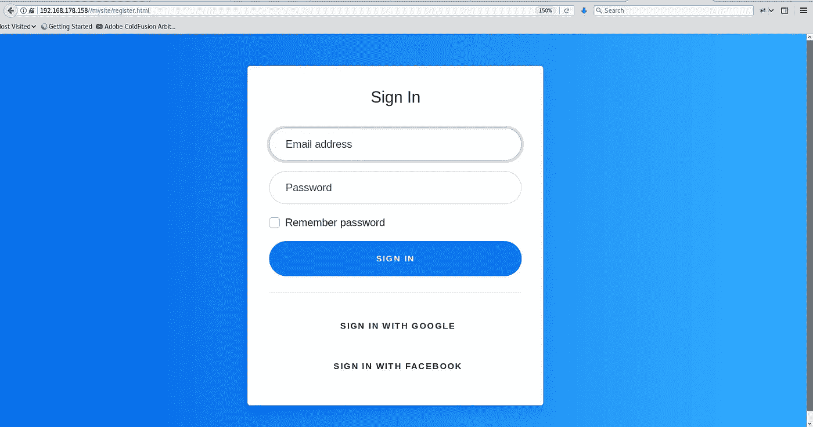

如果我们检查这个页面的源代码，我们可以看到唯一的文本/javascript 是 **bootstrap.min.cs** 所以让我们看看

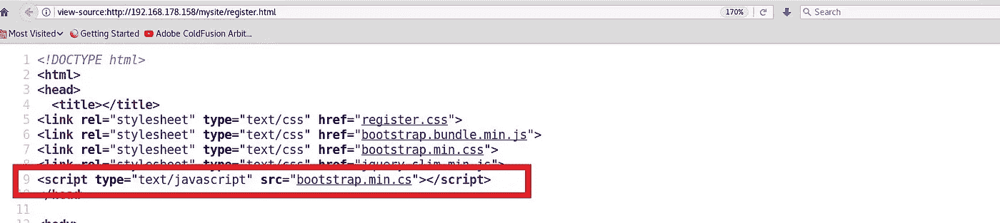

当我们打开 bootstrap.min.cs 时，我们看到有一些变量，但是，这些字符到底是什么，对吗？！至少这是我的第一个想法。:-)

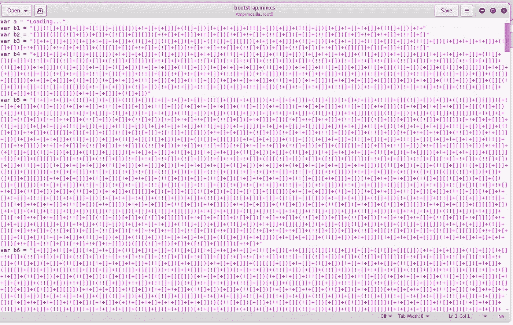

经过一番研究，我发现那是一种叫做 JSFuck 的编程语言。相当有趣。

我打了**“[]！谷歌上的 Javascript** ”。

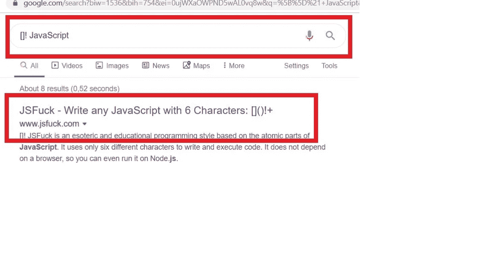

我去了
[www.jsfuck.com](http://www.jsfuck.com)

我花了很多时间试图弄明白，因为每个变量都返回未定义的字符串。但是如果我们将所有变量的内容复制并粘贴在一起，我们就会得到我们想要的东西！

于是我们有了 TryToGuessThisNorris @ 2k19。

我假设这些是登录页面的凭证，但是由于我尝试了所有可能的组合，我转到了其他内容，我发现这是用户 norris 的 ssh 密码。我们可以在 nmap 扫描中看到，ssh 在端口 7822 上是开放的。

所以我们以用户 norris 和密码 TryToGuessThisNorris @ 2k19 登录

**宋承宪** [**诺里斯@ 192 . 168 . 178 . 158**](mailto:norris@192.168.178.158)**–p 7822**

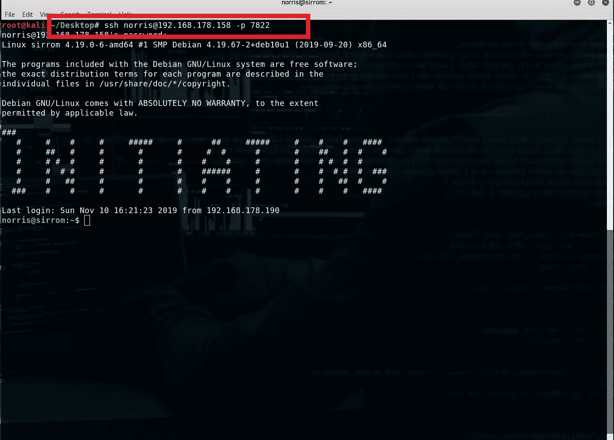

**ls–la**

**卡特彼勒 user.txt**

厉害！我们有我们的用户标志！

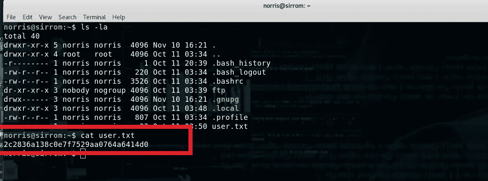

所以转到/var/www/html，我们可以看到 secretfile 和. secretfile.swp。

**cd /var/www/html**

**ls -la**

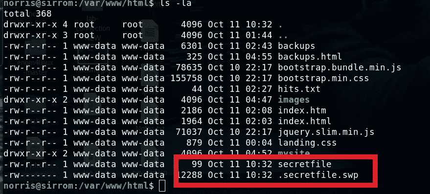

**猫的秘密文件**

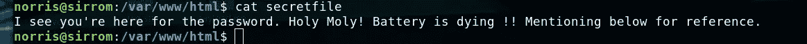

好的，我们不能下载 cat .secretfile.swp，但是我们可以下载它。因此，我们转到浏览器并导航到

**192 . 168 . 178 . 158/. secretfile . SWP**

下载并运行字符串

**strings .secretfile.swp**

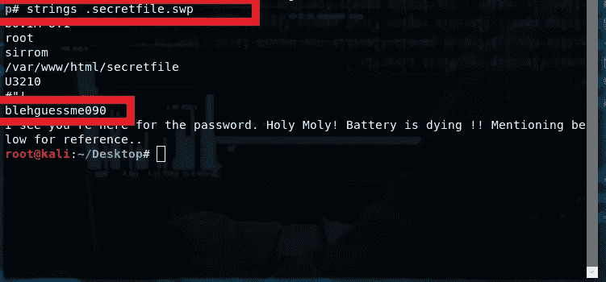

这里我们得到了一个密码，我希望它是 root 的，但是这太简单了

这是用户 morris 的密码。所以我们可以通过输入

**苏莫里斯**

以及密码 **blehguessme090**

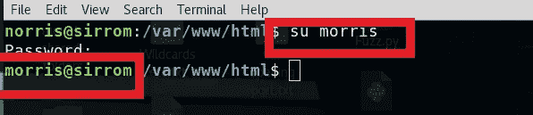

现在我们可以检查 SUID 的档案了。

**find/-perm-4000–F2 型> /dev/null**

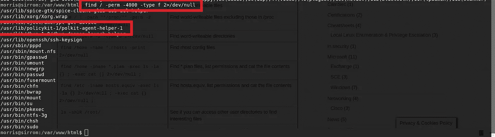

经过一些研究后，我唯一能想到的是尝试使用策略工具包进行权限提升**(请记住，这可能不是唯一的方法，您可以自行探索**)。

所以经过研究，我发现 policy kit 在评估 UID 方面有一个缺陷。(你可以自己研究)

**systemd–run–t bash**

我们输入用户 norris 的密码

**trytoguessthisnoris @ 2k 19**

我们现在是根了！！！

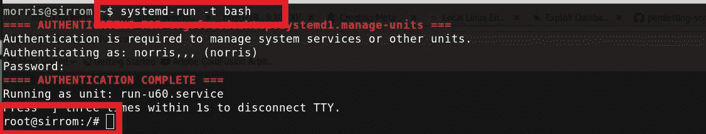

我们导航到根目录，列出它并读取标志。

**光盘根目录**

**ls–la**

**猫根. txt**

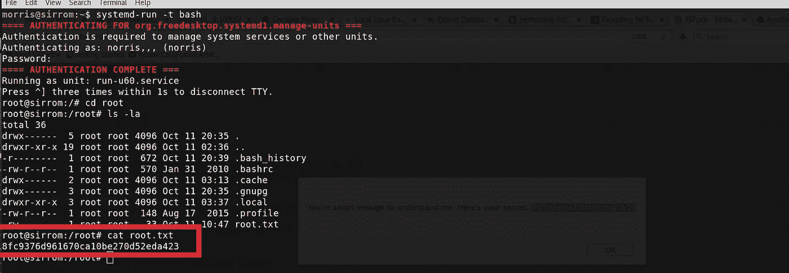

总之，这是一个非常有趣的盒子！我期待着更多来自维尔马苏米特的 vm！感谢您的阅读，并希望有人学到了一些东西。:-)

伊凡一世

*关注* [*Infosec 报道*](https://medium.com/bugbountywriteup) *获取更多此类精彩报道。*

 [## 信息安全报道

### 收集了世界上最好的黑客的文章，主题从 bug 奖金和 CTF 到 vulnhub…

medium.com](https://medium.com/bugbountywriteup)